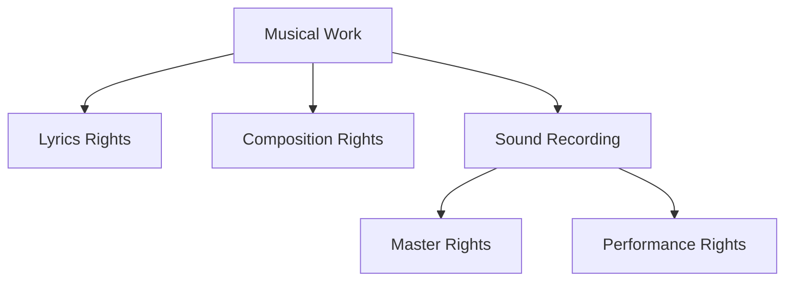
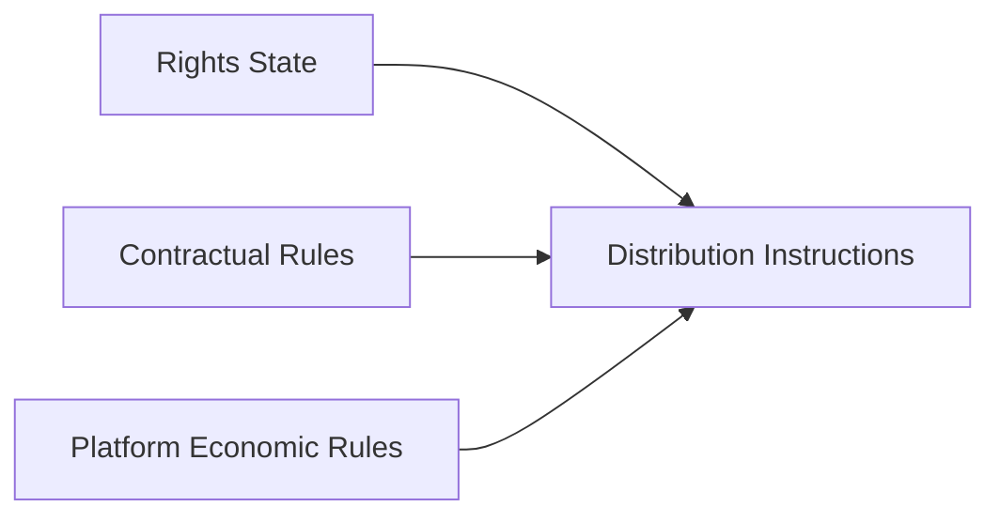
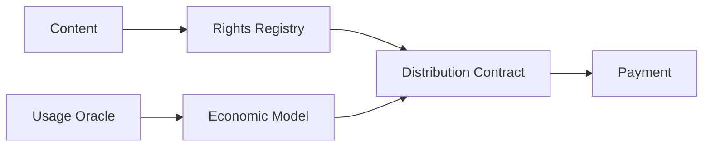

# ADR-0003: Rights Registry

**Status:** Proposed  
**Date:** 2026-07-29
**Last Updated:** 2026-08-20

## 1. Context

Creator First Platform は、音楽を中心とするコンテンツ配信において、Creator の権利と利益を優先し、利用実績に基づく透明で検証可能な分配を実現することを目標とする。

このためには、Platform が扱う各作品について、

- 何の作品であるか
- 誰がどの権利を持つか
- どの範囲で利用を許諾できるか
- 収益を誰にどの割合で分配するか
- 権利情報がいつ、誰によって登録・変更されたか
- 権利について紛争が発生していないか

を追跡可能にする必要がある。

しかし、音楽に関する権利は単純な「Creator = Owner」では表現できない。

一つの楽曲には、例えば、

- 作詞
- 作曲
- 編曲
- 原盤
- 実演
- 出版
- 配信許諾
- その他の契約上の権利

が関係し、それぞれ異なる権利者や管理主体が存在し得る。

したがって Creator First Platform には、作品、権利者、権利関係、許諾、分配条件を管理する **Rights Registry** が必要である。

Rights Registry は単なる作品データベースではなく、Platform における利用許諾、収益分配、監査、紛争処理の基礎となる。

---

## 2. Decision

Creator First Platform は、作品とその権利関係を管理するために **Rights Registry** を設ける。

Rights Registry は、

> **Content Identity → Rights Claims → Verification → Active Rights State → Usage → Distribution**

という流れの基礎となる。


Rights Registry は、少なくとも次の情報を論理的に管理する。

- Content Identifier
- Rights Holder Identifier
- Rights Type
- Rights Share
- Territory
- Validity Period
- Licensing Status
- Distribution Instructions
- Verification Status
- Dispute Status
- Version / History

---

## 3. Rights Registry Is Not a Copyright Authority

Rights Registry への登録そのものによって、著作権その他の権利が創設されるものとはしない。

Rights Registry は、

> **Platform が利用許諾・分配・監査のために採用している権利情報の記録**

である。

したがって、

```text
Registry Entry
≠
Legal Creation of Copyright
```

とする。

権利の成立、帰属、移転等は適用される法令および契約によって決定される。

Platform は Rights Registry を「法的権利そのもの」ではなく、権利関係を検証可能に管理するための技術・業務基盤として扱う。

---

## 4. Separation of Work and Recording

音楽では、楽曲そのものと録音物を区別する必要がある。

Rights Registry では少なくとも、

```text
Musical Work
```

と、

```text
Sound Recording
```

を別のEntityとして管理できなければならない。

概念的には、



とする。

同じMusical Workに複数のRecordingが存在する場合も、それぞれ独立して識別可能にする。

---

## 5. Rights Claims

Rights Holder は、自身が保有または管理すると主張する権利について Rights Claim を提出できる。

Rights Claim は少なくとも、

- claimant
- content identifier
- rights type
- claimed share
- territory
- validity period
- supporting evidence
- timestamp

を持つ。

Claimが提出されたことと、Platformによって権利がVerifiedされたことは区別する。

```text
Claimed
   ↓
Verification
   ↓
Verified / Rejected / Disputed
```

未検証Claimを自動的な収益分配の根拠として使用してはならない。

---

## 6. Verification

Creator First Platform は、Creator Registration と Rights Registration を分離する。

CreatorとしてPlatformへ登録済みであっても、そのCreatorが任意の作品の権利者であることを意味しない。

```text
Creator Registration
        ≠
Rights Verification
```

Rights Verification では、必要に応じて、

- 契約
- 権利管理情報
- ISRC / ISWC 等の識別情報
- 出版・原盤情報
- 権利管理事業者等から得られる情報
- Rights Holder による署名
- その他の検証可能な証拠

を利用する。

具体的な審査方法および外部権利管理主体との連携方法は別Specificationで定義する。

---

## 7. Rights Types

Rights Registry は、単一のOwnerフィールドではなく複数のRights Typeを表現できなければならない。

例えば、

```text
Composition
Lyrics
Arrangement
Master Recording
Performance
Publishing
Distribution License
```

などである。

Rights TypeはProtocol上でVersion管理し、将来的な権利種別の追加を可能にする。

ただし、Rights Typeの追加によって既存のRights Recordの意味を事後的に変更してはならない。

---

## 8. Fractional Rights

一つの権利を複数のRights Holderが共有する場合を扱う。

権利種別 $r$ に対する各Rights HolderのShareを $s_i$ とすると、原則として、

$$
0 \leq s_i \leq 1
$$

であり、確定済みの完全な権利構成では、

$$
\sum_{i=1}^{n} s_i = 1
$$

となる。

ただし、権利関係が未確定の場合には、Registryは不完全なRights Stateを表現できなければならない。

その場合、未確定部分を自動的に特定の権利者へ割り当ててはならない。

---

## 9. Distribution Instructions

Rights Registry は、Legal Rights と Distribution Instructions を区別する。

例えば、

```text
Copyright Share
```

と、

```text
Platform Revenue Distribution Share
```

は必ずしも同一ではない。

契約によって、

- Rights Holder
- Creator
- Publisher
- Label
- Distributor
- Collaborator

等への分配条件が設定される可能性がある。

したがって、



とする。

Rights Registry は権利情報を提供するが、最終的な分配計算は Economic Model および Distribution Specification に従う。

---

## 10. Versioning and History

Rights Information は変更可能である。

例えば、

- 権利譲渡
- 契約変更
- 出版契約
- 管理委託
- Rights Share変更
- 紛争解決

などが発生する。

Rights Registry は現在状態だけでなく、変更履歴を保持する。

概念的には、

```text
Rights State v1
      ↓
Rights Change
      ↓
Rights State v2
      ↓
Rights Change
      ↓
Rights State v3
```

とする。

過去の利用実績に対して、後からRights Stateが変更された場合でも、

> **その利用が発生した時点で適用されていたRights State**

を再現可能にする。

---

## 11. Effective Time

Rights ChangeにはEffective Timeを持たせる。

利用イベント $u$ が時刻 $t_u$ に発生した場合、その利用に適用されるRights Stateは、

$$
R(t_u)
$$

によって決定される。

現在のRights Stateを過去の利用へ無条件に遡及適用してはならない。

ただし、法的判断、紛争解決、訂正等によって遡及修正が必要となる場合は、修正理由と履歴を監査可能な形で記録する。

---

## 12. Disputes

同一の権利について競合するClaimsが存在する場合、RegistryはDisputed Stateを表現できなければならない。

```text
Claim A
   +
Claim B
   ↓
Conflict Detection
   ↓
Disputed
```

Disputed Rightsについては、原則として自動分配を停止または保留する。

```text
Verified Rights
      ↓
Automatic Distribution

Disputed Rights
      ↓
Escrow / Hold
      ↓
Resolution
      ↓
Distribution
```

Platform運営者が根拠なく一方のClaimを優先して支払うことを避ける。

具体的なDispute Resolution Procedureは法務・Governance・Rights Managementの別Specificationで定義する。

---

## 13. On-chain / Off-chain Separation

Rights Registry の全情報をBlockchain上へ保存しない。

特に、

- 契約書
- 本人確認情報
- 住所
- 電話番号
- 銀行情報
- 非公開の契約条件
- その他の個人情報・機密情報

をPublic Blockchainへ記録してはならない。

基本構造は、


とする。

On-chainには必要に応じて、

- Identifier
- Hash / Commitment
- Version
- Timestamp
- Status
- Verification Proof

等の検証用情報を記録する。

詳細な権利情報は適切なアクセス制御を持つOff-chain Systemで管理する。

---

## 14. Privacy

Rights Registry はTransparencyとPrivacyを両立させる。

公開情報と非公開情報を分離し、

```text
Public
├── Content Identifier
├── Rights Status
├── Registry Version
└── Verification Commitment

Restricted
├── Legal Identity
├── Contracts
├── Evidence
├── Payment Information
└── Personal Information
```

のような構造を採用する。

将来的にはZero-Knowledge Proof等を利用し、

> 必要な権利条件が満たされている

ことだけを、基礎となる個人情報や契約内容を公開せずに証明する方法を検討する。

---

## 15. External Rights Management

Creator First Platform は、Rights Registryだけで既存の著作権管理制度を置き換えることを目的としない。

必要に応じて、

- 著作権管理事業者
- 出版社
- レコード会社
- Distributor
- Rights Management Service
- 標準識別子Registry

等と連携する。

外部情報を取り込む場合は、

- Source
- Timestamp
- Verification Method
- Confidence / Status
- Version

を追跡可能にする。

外部情報とPlatform内のClaimが矛盾する場合は、自動的に上書きせずConflictとして扱う。

---

## 16. Auditability

Rights Registryの重要な操作は監査可能にする。

少なくとも、

```text
CREATE CLAIM
VERIFY CLAIM
REJECT CLAIM
UPDATE RIGHTS
TRANSFER RIGHTS
OPEN DISPUTE
RESOLVE DISPUTE
CHANGE DISTRIBUTION INSTRUCTION
```

について、

- actor
- timestamp
- previous state
- new state
- reason / reference
- verification data

を追跡可能にする。

履歴を削除して現在状態だけを残す設計は採用しない。

---

## 17. Governance

Rights RegistryのProtocol RulesはGovernance対象とする。

例えば、

- Rights Type
- Verification Rules
- Registry Schema
- Dispute Status
- Required Proof
- External Registry Integration

等の変更は、Protocol SpecificationおよびGovernance Processに従う。

ただしGovernanceは、

> 特定作品の著作権者を多数決で決定する

ための仕組みではない。

個別の法的権利関係と、Protocol RulesのGovernanceを区別する。

---

## 18. Smart Contract Relationship

Smart ContractはRights RegistryのVerified Stateを利用して分配等を実行できる。

概念的には、



ただし、Smart ContractがRights Registryの唯一のSource of Truthになるとは限らない。

法的情報、契約、個人情報等はOff-chainで管理し、Smart Contractには実行に必要なVerified StateまたはCommitmentのみを提供する。

---

## 19. Invariants

Rights Registryは少なくとも次の不変条件を満たす。

### Invariant 1

未検証Rights ClaimをVerified Rightsとして扱ってはならない。

### Invariant 2

Disputed Rightsを通常のVerified Rightsと同じ方法で自動分配してはならない。

### Invariant 3

Rights Stateの変更履歴を追跡可能にしなければならない。

### Invariant 4

過去の利用に適用されたRights Stateを再現可能にしなければならない。

### Invariant 5

Public Blockchainに不要な個人情報または機密契約情報を保存してはならない。

### Invariant 6

Creator RegistrationだけをRights Ownershipの証明として扱ってはならない。

### Invariant 7

Rights Registryへの登録そのものを、法的権利を創設する行為として扱ってはならない。

---

## 20. Alternatives Considered

### Creator = Owner Model

Creator登録者を自動的に全権利のOwnerとする方式。

音楽の複雑な権利構造を表現できないため採用しない。

### Fully On-chain Rights Registry

すべての権利情報と契約情報をBlockchainへ保存する方式。

Privacy、個人情報、契約機密性、訂正、法的運用の観点から採用しない。

### Centralized Mutable Database Only

Platform運営者だけが変更可能な通常のDatabaseのみをSource of Truthとする方式。

変更履歴や第三者検証性が弱いため、単独では採用しない。

### Immutable Rights State

一度登録したRights Stateを変更不能にする方式。

権利譲渡、契約変更、紛争解決等を扱えないため採用しない。

---

## 21. Consequences

### Positive

- Creatorの権利を明示的に扱える
- 複数権利者・複数Rights Typeを表現できる
- 利用実績から分配までを追跡しやすくなる
- Rights ClaimとVerified Rightsを区別できる
- 紛争中の誤分配を抑制できる
- 権利変更履歴を監査できる
- Smart Contractによる分配と法的権利管理を接続できる

### Negative

- Rights Data Modelが複雑になる
- Verification業務が必要になる
- 外部権利管理主体との連携が必要になる
- Rights Conflict処理が必要になる
- PrivacyとAuditabilityの両立が必要になる
- On-chain / Off-chain整合性管理が必要になる

---

## 22. Security Considerations

Rights Registryは少なくとも次のリスクを考慮する。

- False Rights Claim
- Identity Fraud
- Rights Share Manipulation
- Unauthorized Rights Update
- Registry History Tampering
- Oracle / External Data Manipulation
- Duplicate Content Registration
- Contract Evidence Leakage
- Personal Data Leakage
- Payment Address Substitution
- Dispute Resolution Abuse

具体的なThreat ModelはSecurity Specificationで定義する。

---

## 23. Relationship to Other ADRs

ADR-0001はGovernance Architectureを定義する。

ADR-0002はGovernance MemberのVerifiable Sortitionを定義する。

ADR-0003は、Creator First Platformが扱う作品と権利関係をどのように記録し、検証し、分配システムへ接続するかを定義する。

```text
ADR-0001 Governance Model
ADR-0002 Verifiable Sortition
ADR-0003 Rights Registry
            ↓
Protocol Specifications
            ↓
Implementation
```

---

## 24. Related Documents

- Whitepaper: Vision
- Whitepaper: Rights and Funds
- Whitepaper: Creator Registration
- Whitepaper: Economic Model
- Whitepaper: Governance
- Whitepaper: Technology
- Whitepaper: Security
- Whitepaper: Legal / STO / Tax

---

## 25. Follow-up Specifications

本ADRの採択後、少なくとも次のSpecificationを作成する。

- `protocol/rights-registry-spec.md`
- `protocol/rights-verification-spec.md`
- `protocol/rights-dispute-spec.md`
- `protocol/distribution-spec.md`

必要に応じて、外部Rights Management ServiceとのIntegration Specificationも作成する。
