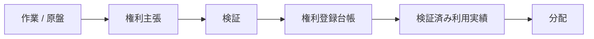
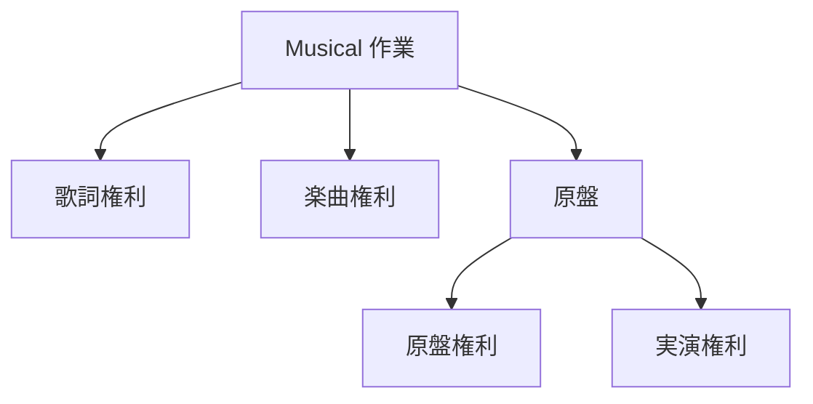
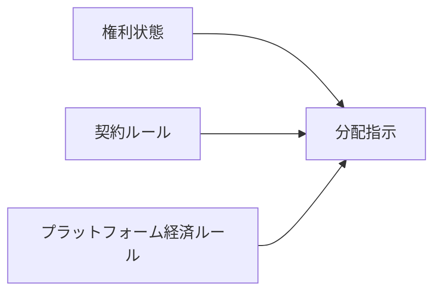
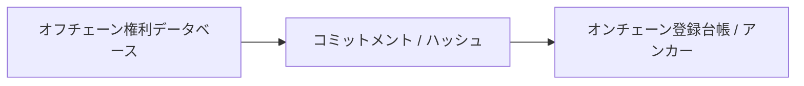
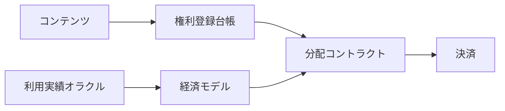

# ADR-0003: 権利登録台帳

**状態:** 提案
**日付:** 2026-07-29
**最終更新日:** 2026-09-02

## 1. 背景

Creator First Platform は、音楽を中心とするコンテンツ配信において、音楽クリエーターの権利と利益を優先し、利用実績に基づく透明で検証可能な分配を実現することを目標とする。

このためには、プラットフォームが扱う各作品について、

- 何の作品であるか
- 誰がどの権利を持つか
- どの範囲で利用を許諾できるか
- 収益を誰にどの割合で分配するか
- 権利情報がいつ、誰によって登録・変更されたか
- 権利について紛争が発生していないか

を追跡可能にする必要がある。

しかし、音楽に関する権利は単純な「音楽クリエーター = Owner」では表現できない。

一つの楽曲には、例えば、

- 作詞
- 作曲
- 編曲
- 原盤
- 実演
- 出版
- 配信許諾
- その他の契約上の権利

が関係し、それぞれ異なる権利者や管理主体が存在し得る。

したがって Creator First Platform には、作品、権利者、権利関係、許諾、分配条件を管理する **権利登録台帳** が必要である。

権利登録台帳は単なる作品データベースではなく、プラットフォームにおける利用許諾、収益分配、監査、紛争処理の基礎となる。

---

## 2. 決定

Creator First Platform は、作品とその権利関係を管理するために **権利登録台帳** を設ける。

権利登録台帳は、

> **コンテンツアイデンティティ → 権利主張 → 検証 → 有効権利状態 → 利用実績 → 分配**

という流れの基礎となる。



権利登録台帳は、少なくとも次の情報を論理的に管理する。

- コンテンツ Identifier
- 権利者 Identifier
- 権利 Type
- 権利比率
- 地域
- 有効性期間
- Licensing 状態
- 分配指示
- 検証状態
- 紛争状態
- 版 / 履歴

---

## 3. 権利登録台帳は著作権認定機関ではない

権利登録台帳への登録そのものによって、著作権その他の権利が創設されるものとはしない。

権利登録台帳は、

> **プラットフォームが利用許諾・分配・監査のために採用している権利情報の記録**

である。

したがって、

```text
登録台帳登録項目
≠
法務創作 of 著作権
```

とする。

権利の成立、帰属、移転等は適用される法令および契約によって決定される。

プラットフォームは権利登録台帳を「法的権利そのもの」ではなく、権利関係を検証可能に管理するための技術・業務基盤として扱う。

---

## 4. 著作物と原盤の分離

音楽では、楽曲そのものと録音物を区別する必要がある。

権利登録台帳では少なくとも、

```text
Musical 作業
```

と、

```text
原盤
```

を別の主体として管理できなければならない。

概念的には、



とする。

同じMusical 作業に複数の原盤が存在する場合も、それぞれ独立して識別可能にする。

---

## 5. 権利主張

権利者は、自身が保有または管理すると主張する権利について権利主張を提出できる。

権利主張は少なくとも、

- claimant
- content identifier
- rights type
- claimed share
- territory
- validity period
- supporting evidence
- timestamp

を持つ。

主張が提出されたことと、プラットフォームによって権利が検証済みされたことは区別する。

```text
Claimed
   ↓
検証
   ↓
検証済み / Rejected / 紛争中
```

未検証主張を自動的な収益分配の根拠として使用してはならない。

---

## 6. 検証

Creator First Platform は、音楽クリエーター登録と権利登録を分離する。

音楽クリエーターとしてプラットフォームへ登録済みであっても、その音楽クリエーターが任意の作品の権利者であることを意味しない。

```text
音楽クリエーター登録
        ≠
権利検証
```

権利検証では、必要に応じて、

- 契約
- 権利管理情報
- ISRC / ISWC 等の識別情報
- 出版・原盤情報
- 権利管理事業者等から得られる情報
- 権利者による署名
- その他の検証可能な証拠

を利用する。

具体的な審査方法および外部権利管理主体との連携方法は、[ADR-0022 JASRAC・NexTone権利処理連携](./ADR-0022-collective-rights-integration.md)および関連仕様で定義する。

### 6.1 音楽配信代行・著作権管理サービスとの境界

TuneCore等の外部サービスを利用している場合、事業者名またはアカウントの存在だけで権利状態を決定しない。同一事業者が音楽配信代行と著作権管理の双方を提供していても、次を別の記録として取り込む。

- 音源の配信・流通委託
- 楽曲の著作権管理・届出に関する委託または期間譲渡
- 原盤権・著作隣接権の帰属と配信許諾
- 販売収益、著作権収益および各分配指示
- 対象地域、利用形態、有効期間、更新・終了および権利競合

外部記録には取得元、取得日時、契約または権限の根拠、変換履歴および競合状態を付す。重複する許諾、徴収または分配の可能性が解消されない範囲は有効化せず、運営株式会社の権利担当者による審査へ送る。

外部サービスの利用は、アーティストが委託先と範囲を自ら決定する限り、アーティストダイレクト型音楽クリエーターの適格性と矛盾しない。ただし、音楽クリエーター登録や外部サービスの利用実績は、いずれも単独では権利保有または配信許諾の証明にならない。

---

## 7. 権利種別

権利登録台帳は、単一のOwnerフィールドではなく複数の権利 Typeを表現できなければならない。

例えば、

```text
楽曲
歌詞
Arrangement
原盤原盤
実演
Publishing
分配 License
```

などである。

権利 Typeはプロトコル上で版管理し、将来的な権利種別の追加を可能にする。

ただし、権利 Typeの追加によって既存の権利記録の意味を事後的に変更してはならない。

---

## 8. 権利持分

一つの権利を複数の権利者が共有する場合を扱う。

権利種別 $r$ に対する各権利者の比率を $s_i$ とすると、原則として、

$$
0 \leq s_i \leq 1
$$

であり、確定済みの完全な権利構成では、

$$
\sum_{i=1}^{n} s_i = 1
$$

となる。

ただし、権利関係が未確定の場合には、登録台帳は不完全な権利状態を表現できなければならない。

その場合、未確定部分を自動的に特定の権利者へ割り当ててはならない。

---

## 9. 分配指示

権利登録台帳は、法務権利と分配指示を区別する。

例えば、

```text
著作権比率
```

と、

```text
プラットフォーム収益分配比率
```

は必ずしも同一ではない。

契約によって、

- 権利者
- 音楽クリエーター
- 音楽出版社
- レーベル
- Distributor
- Collaborator

等への分配条件が設定される可能性がある。

したがって、



とする。

権利登録台帳は権利情報を提供するが、最終的な分配計算は経済モデルおよび分配仕様に従う。

---

## 10. バージョン管理と履歴

権利情報は変更可能である。

例えば、

- 権利譲渡
- 契約変更
- 出版契約
- 管理委託
- 権利比率変更
- 紛争解決

などが発生する。

権利登録台帳は現在状態だけでなく、変更履歴を保持する。

概念的には、

```text
権利状態 v1
      ↓
権利変更
      ↓
権利状態 v2
      ↓
権利変更
      ↓
権利状態 v3
```

とする。

過去の利用実績に対して、後から権利状態が変更された場合でも、

> **その利用が発生した時点で適用されていた権利状態**

を再現可能にする。

---

## 11. 効力発生時点

権利変更には効力発生時点を持たせる。

利用イベント $u$ が時刻 $t_u$ に発生した場合、その利用に適用される権利状態は、

$$
R(t_u)
$$

によって決定される。

現在の権利状態を過去の利用へ無条件に遡及適用してはならない。

ただし、法的判断、紛争解決、訂正等によって遡及修正が必要となる場合は、修正理由と履歴を監査可能な形で記録する。

---

## 12. 紛争

同一の権利について競合するClaimsが存在する場合、登録台帳は紛争中状態を表現できなければならない。

```text
主張 A
   +
主張 B
   ↓
Conflict 検知
   ↓
紛争中
```

紛争中権利については、原則として自動分配を停止または保留する。

```text
検証済み権利
      ↓
自動分配

紛争中権利
      ↓
Escrow / 保留
      ↓
解決
      ↓
分配
```

プラットフォーム運営者が根拠なく一方の主張を優先して支払うことを避ける。

具体的な紛争解決 Procedureは法務・ガバナンス・権利管理の別仕様で定義する。

---

## 13. オンチェーン・オフチェーンの分離

権利登録台帳の全情報をブロックチェーン上へ保存しない。

特に、

- 契約書
- 本人確認情報
- 住所
- 電話番号
- 銀行情報
- 非公開の契約条件
- その他の個人情報・機密情報

を公開ブロックチェーンへ記録してはならない。

基本構造は、



とする。

オンチェーンには必要に応じて、

- Identifier
- ハッシュ / コミットメント
- 版
- Timestamp
- 状態
- 検証証明

等の検証用情報を記録する。

詳細な権利情報は適切なアクセス制御を持つオフチェーンシステムで管理する。

---

## 14. プライバシー

権利登録台帳は透明性とプライバシーを両立させる。

公開情報と非公開情報を分離し、

```text
公開
├── コンテンツ Identifier
├── 権利状態
├── 登録台帳版
└── 検証コミットメント

Restricted
├── 法務アイデンティティ
├── 契約
├── 証跡
├── 決済情報
└── 個人情報
```

のような構造を採用する。

将来的にはゼロ知識証明等を利用し、

> 必要な権利条件が満たされている

ことだけを、基礎となる個人情報や契約内容を公開せずに証明する方法を検討する。

---

## 15. 外部権利管理

Creator First Platform は、権利登録台帳だけで既存の著作権管理制度を置き換えることを目的としない。

必要に応じて、

- 著作権管理事業者
- 出版社
- レコード会社
- Distributor
- 権利管理サービス
- 標準識別子登録台帳

等と連携する。

外部情報を取り込む場合は、

- ソース
- Timestamp
- 検証 Method
- Confidence / 状態
- 版

を追跡可能にする。

外部情報とプラットフォーム内の主張が矛盾する場合は、自動的に上書きせずConflictとして扱う。

---

## 16. 監査可能性

権利登録台帳の重要な操作は監査可能にする。

少なくとも、

```text
CREATE CLAIM
VERIFY CLAIM
REJECT CLAIM
UPDATE RIGHTS
TRANSFER RIGHTS
OPEN DISPUTE
RESOLVE DISPUTE
CHANGE DISTRIBUTION INSTRUCTION
```

について、

- actor
- timestamp
- previous state
- new state
- reason / reference
- verification data

を追跡可能にする。

履歴を削除して現在状態だけを残す設計は採用しない。

---

## 17. ガバナンス

権利登録台帳のプロトコルルールはガバナンス対象とする。

例えば、

- 権利 Type
- 検証ルール
- 登録台帳 Schema
- 紛争状態
- 必要証明
- 外部登録台帳連携

等の変更は、プロトコル仕様およびガバナンス手続に従う。

ただしガバナンスは、

> 特定作品の著作権者を多数決で決定する

ための仕組みではない。

個別の法的権利関係と、プロトコルルールのガバナンスを区別する。

---

## 18. スマートコントラクト関係

スマートコントラクトは権利登録台帳の検証済み状態を利用して分配等を実行できる。

概念的には、



ただし、スマートコントラクトが権利登録台帳の唯一の正本になるとは限らない。

法的情報、契約、個人情報等はオフチェーンで管理し、スマートコントラクトには実行に必要な検証済み状態またはコミットメントのみを提供する。

---

## 19. 不変条件

権利登録台帳は少なくとも次の不変条件を満たす。

### 不変条件 1

未検証権利主張を検証済み権利として扱ってはならない。

### 不変条件 2

紛争中権利を通常の検証済み権利と同じ方法で自動分配してはならない。

### 不変条件 3

権利状態の変更履歴を追跡可能にしなければならない。

### 不変条件 4

過去の利用に適用された権利状態を再現可能にしなければならない。

### 不変条件 5

公開ブロックチェーンに不要な個人情報または機密契約情報を保存してはならない。

### 不変条件 6

音楽クリエーター登録だけを権利所有の証明として扱ってはならない。

### 不変条件 7

権利登録台帳への登録そのものを、法的権利を創設する行為として扱ってはならない。

---

## 20. 検討した代替案

### 音楽クリエーター = 所有者モデル

音楽クリエーター登録者を自動的に全権利のOwnerとする方式。

音楽の複雑な権利構造を表現できないため採用しない。

### 完全オンチェーン権利登録台帳

すべての権利情報と契約情報をブロックチェーンへ保存する方式。

プライバシー、個人情報、契約機密性、訂正、法的運用の観点から採用しない。

### 中央集権型の変更可能データベースのみ

プラットフォーム運営者だけが変更可能な通常のデータベースのみを正本とする方式。

変更履歴や第三者検証性が弱いため、単独では採用しない。

### 変更不能な権利状態

一度登録した権利状態を変更不能にする方式。

権利譲渡、契約変更、紛争解決等を扱えないため採用しない。

---

## 21. 影響

### 利点

- 音楽クリエーターの権利を明示的に扱える
- 複数権利者・複数権利 Typeを表現できる
- 利用実績から分配までを追跡しやすくなる
- 権利主張と検証済み権利を区別できる
- 紛争中の誤分配を抑制できる
- 権利変更履歴を監査できる
- スマートコントラクトによる分配と法的権利管理を接続できる

### 欠点

- 権利データモデルが複雑になる
- 検証業務が必要になる
- 外部権利管理主体との連携が必要になる
- 権利 Conflict処理が必要になる
- プライバシーと監査可能性の両立が必要になる
- オンチェーン / オフチェーン整合性管理が必要になる

---

## 22. セキュリティ上の考慮事項

権利登録台帳は少なくとも次のリスクを考慮する。

- 偽の権利主張
- アイデンティティ不正
- 権利比率操作
- Unauthorized 権利更新
- 登録台帳履歴 Tampering
- オラクル / 外部データ操作
- Duplicate コンテンツ登録
- コントラクト証跡 Leakage
- 個人データ Leakage
- 決済アドレス Substitution
- 紛争解決不正利用

具体的な脅威モデルはセキュリティ仕様で定義する。

---

## 23. 他のADRとの関係

ADR-0001はガバナンスアーキテクチャを定義する。

ADR-0002はガバナンス議員の検証可能抽選を定義する。

ADR-0003は、Creator First Platformが扱う作品と権利関係をどのように記録し、検証し、分配システムへ接続するかを定義する。

```text
ADR-0001 ガバナンスモデル
ADR-0002 検証可能抽選
ADR-0003 権利登録台帳
            ↓
プロトコル仕様s
            ↓
実装
```

---

## 24. 関連文書

- ホワイトペーパー: ビジョン
- ホワイトペーパー: 権利・資金
- ホワイトペーパー: 音楽クリエーター登録
- ホワイトペーパー: 経済モデル
- ホワイトペーパー: ガバナンス
- ホワイトペーパー: Technology
- ホワイトペーパー: セキュリティ
- ホワイトペーパー: 法務 / STO / 税務

---

## 25. 後続仕様

本ADRの採択後、少なくとも次の仕様を作成する。

- `protocol/rights-registry-spec.md`
- `protocol/rights-verification-spec.md`
- `protocol/rights-dispute-spec.md`
- `protocol/distribution-spec.md`

必要に応じて、外部権利管理サービスとの連携仕様も作成する。

JASRAC・NexToneへの利用申請、団体別報告生成、法人承認、公式システムへの提出、請求・支払突合およびオンチェーン証跡の境界は、[ADR-0022](./ADR-0022-collective-rights-integration.md)に従う。
