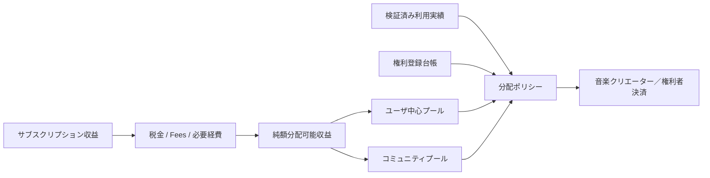
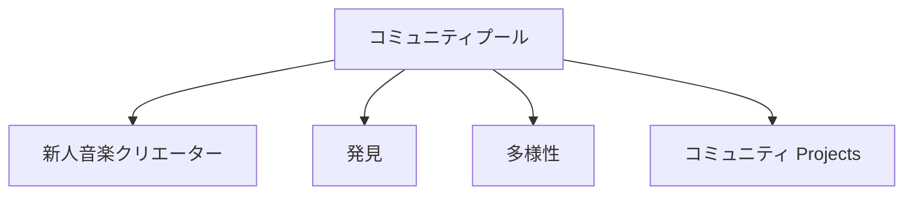
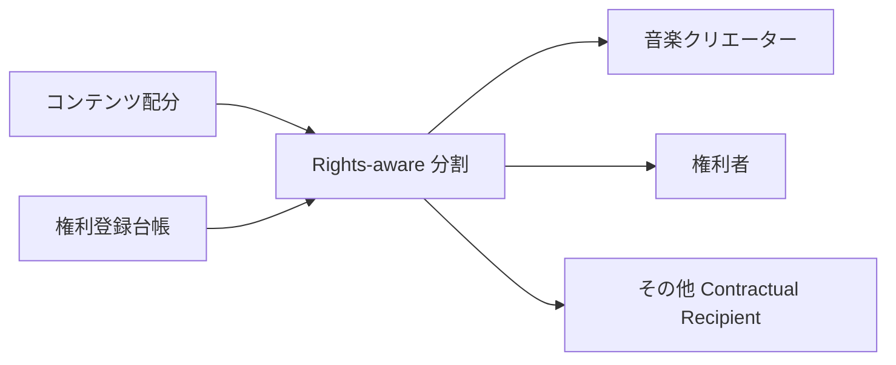
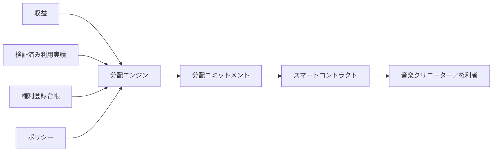

# ADR-0004: 音楽クリエーター分配モデル

**状態:** 提案
**日付:** 2026-07-29
**最終更新日:** 2026-08-23

資金の所在、期間収支、音楽クリエーター未払、税・運営・プロモーション・コミュニティ予算および残余の横断的な照合は、[ADR-0013](./ADR-0013-treasury-flow-transparency.md)で定義する。

## 1. 背景

Creator First Platform は、プラットフォームの利益最大化ではなく、音楽クリエーターの権利と持続可能な創作活動を中心に据える。

サブスクリプション等によって得られた利用収入を音楽クリエーターへ分配する際、単純な総再生回数比例モデルを採用すると、

- 人気作品への分配集中
- 大規模カタログ保有者への集中
- 新人・ニッチ音楽クリエーターの発見機会低下
- ボットや不正再生による分配操作
- ユーザの実際の支持と分配結果の乖離

が生じる可能性がある。

一方、Creator First Platform は、権利登録台帳、検証可能な利用実績情報、ガバナンスを組み合わせることによって、透明性と監査可能性を持つ分配モデルを構築できる。

したがって、音楽クリエーター分配モデルは単なる「1再生あたり単価」ではなく、

> **ユーザ貢献 → 検証済み利用実績 → 権利状態 → 分配ポリシー → 音楽クリエーター分配**

として設計する必要がある。

---

## 2. 決定

Creator First Platform は、音楽クリエーターへの分配に **ユーザ中心分配を基本原則とするハイブリッド分配モデル** を採用する。

各ユーザの分配対象額は、原則としてそのユーザ自身の検証済み利用実績に基づいて配分する。

同時に、音楽クリエーターの多様性、発見、新人音楽クリエーター支援等の公共的目的に使用するコミュニティ配分を分離して設ける。

概念的には、



具体的な比率、閾値、重み等はプロトコル仕様およびガバナンスによって管理する。

---

## 3. 分配レイヤー

サブスクリプション等から得られる収入を、概念的に次の層へ分ける。

```text
総額収益
      ↓
必須 Deductions
      ↓
純額分配可能収益
      ├── ユーザ中心プール
      ├── コミュニティ / 発見プール
      └── その他承認済み Allocations
```

必須 Deductionsには、適用される制度や契約に応じて、

- 税
- 決済手数料
- ブロックチェーン transaction cost
- 法的に必要な控除
- ガバナンスによって承認されたプラットフォーム運営費

等が含まれ得る。

これらの項目は明示的に区分し、音楽クリエーター分配とプラットフォーム収益を不透明に混在させない。

---

## 4. ユーザ中心分配

ユーザ $u$ のある分配期間における分配対象額を $D_u$ とする。

ユーザが利用した作品集合を $C_u$ とし、作品 $c$ に対する検証済み利用重みを $w_{u,c}$ とする。

基本配分は、

$$
d_{u,c}
=
D_u
\frac{w_{u,c}}
{\sum_{j \in C_u} w_{u,j}}
$$

とする。

したがってユーザが支払った分配対象額は、そのユーザ自身が実際に利用した音楽クリエーター群へ配分される。

例えばユーザAがある期間に、

```text
音楽クリエーターX : 60%
音楽クリエーターY : 30%
音楽クリエーターZ : 10%
```

相当の検証済み利用を行った場合、ユーザAに対応する分配対象額も原則として同じ比率を基礎に配分する。

これは全プラットフォームの総再生回数だけで分配するMarket-Centric モデルとは区別される。

---

## 5. 検証済み利用実績のみ

分配計算には、検証済みの利用実績イベントのみを使用する。

```text
再生
   ↓
利用実績証跡
   ↓
検証 / 証明
   ↓
検証済み利用実績
   ↓
分配
```

単純なクライアント自己申告だけを分配根拠として使用してはならない。

利用実績検証は、将来的に、

- signed playback events
- device / session integrity
- server-side verification
- anomaly detection
- cryptographic commitment
- zero-knowledge proof

等を組み合わせる。

利用実績オラクルの具体方式は別ADRまたは仕様で定義する。

---

## 6. 利用実績重みは生の再生回数とは限らない

$w_{u,c}$ は単純な再生回数だけに固定しない。

例えば、

- 有効再生時間
- 完了率
- 重複・短時間連続再生
- ユーザによる明示的な支持
- 不正検知結果

等を考慮できる。

ただし、分配アルゴリズムが恣意的な「おすすめ評価」や音楽クリエーターの知名度を使って分配額を操作してはならない。

Weighting ルールは公開されたプロトコル仕様として版管理する。

---

## 7. 集中抑制原則

Creator First Platformは、人気音楽クリエーターへの分配集中を目的としたプロトコルを採用しない。

ただし、実際のユーザ支持によって人気音楽クリエーターへの分配が大きくなること自体を禁止するものではない。

区別すべきなのは、

> **ユーザ選択による集中**

と、

> **プラットフォームアルゴリズムによる恣意的な集中**

である。

ユーザ中心プールでは、ユーザの検証済み利用選択を基本的に尊重する。

新人・ニッチ音楽クリエーターへの支援はユーザ中心プールを歪めるのではなく、原則としてコミュニティ / 発見プールによって実現する。

---

## 8. コミュニティ / 発見プール

純額分配可能収益の一部を、ガバナンスによって承認されたコミュニティ / 発見プールへ割り当てることができる。

目的には、

- 新人音楽クリエーター支援
- 発見
- 多様性確保
- 小規模ジャンル支援
- 公共的・文化的価値
- 音楽クリエーター育成
- コミュニティ活動

等を含めることができる。



コミュニティプールの配分ルールは、プラットフォーム運営者が自由に変更できるものとせず、ガバナンス手続によって決定する。

---

## 9. 資金力によるガバナンス・分配上の優位を認めない

音楽クリエーターが、

- ガバナンストークンを大量保有している
- プラットフォーム株式を保有している
- プラットフォームへ多額の資金を提供している
- 広告費等を支払っている

ことを理由として音楽クリエーター分配重みを増加させてはならない。

```text
資本権力
    ≠
分配特権
```

STO、株式、ガバナンス参加、音楽クリエーター分配は、それぞれ異なる制度として扱う。

---

## 10. 権利考慮型分配

作品への配分額が決定した後、その金額を単純にUploaderへ送金してはならない。

ADR-0003 権利登録台帳で確定した権利状態と分配指示を使用する。

作品 $c$ に割り当てられた額を $D_c$、権利者 $i$ の有効な分配比率を $s_{c,i}$ とすると、

$$
P_{c,i} = D_c s_{c,i}
$$

とする。

完全に確定した分配構成では、

$$
\sum_i s_{c,i} = 1
$$

を原則とする。



---

## 11. 紛争中権利

権利登録台帳で紛争中となっている部分については、通常の自動分配を行わない。

```text
分配 Amount
       ↓
権利状態
   ├── 検証済み → 決済
   └── 紛争中 → 保留 / Escrow
```

紛争解決後、確定した権利状態に従って保留額を分配する。

プラットフォーム運営者が恣意的に受取人を選択してはならない。

---

## 12. 分配期間

分配は明示的な分配期間単位で計算する。

例えば、

```text
2026-07 分配期間
```

について、

- 適格収益
- 検証済み利用実績
- 権利スナップショット
- 分配ポリシー版
- Calculated 配分
- 決済状態

を関連付ける。

過去の分配を再計算できるよう、計算時に使用した版とスナップショットを保存する。

---

## 13. 決定論的計算

同じ入力、

```text
収益スナップショット
検証済み利用実績スナップショット
権利スナップショット
分配ポリシー版
```

からは、同じ分配結果が得られなければならない。

概念的に、

$$
D =
F(R,U,G,P)
$$

とする。

ここで、

- $R$ = 収益スナップショット
- $U$ = 検証済み利用実績スナップショット
- $G$ = 権利登録台帳スナップショット
- $P$ = 分配ポリシー

である。

計算処理は監査可能かつ再現可能にする。

---

## 14. 丸め処理・残余額

トークンの最小単位等によって端数が発生する場合、その処理方法をプロトコル仕様で明示する。

端数処理によってプラットフォーム運営者へ不透明な利益が発生してはならない。

Residual Amountについては、

- 次期分配へ繰越
- コミュニティプールへ移動
- deterministic rounding rule

等の方法をガバナンスで定義する。

---

## 15. 最低分配

ブロックチェーン手数料や決済コストが支払額を上回る場合に備え、最低分配しきい値を設定できる。

しきい値未満の音楽クリエーター残高は失効させず、原則として次期以降へ繰り越す。

```text
音楽クリエーター残高
      ↓
Below しきい値 → Carry Forward
      ↓
At / Above しきい値 → 決済
```

しきい値値はプロトコル Parameterとして管理する。

---

## 16. ステーブルコイン精算

Creator First Platformは、JPYC等の適切なステーブルコインを決済・分配手段として利用できる。

ただし音楽クリエーター分配モデルは特定トークンへ固定しない。

```text
分配 Amount
        ↓
精算資産
        ↓
JPYC / 承認済みステーブルコイン
```

使用可能な精算資産は、

- 法的適合性
- 流動性
- スマートコントラクトリスク
- 予備 / 発行者リスク
- ネットワークコスト
- ユーザ / 音楽クリエーターAccessibility

等を評価し、ガバナンスおよび法務要件に従って決定する。

---

## 17. オンチェーン・オフチェーンの分離

全利用実績イベントや詳細なユーザ行動を公開ブロックチェーンへ記録してはならない。

基本構造は、


公開ブロックチェーンには必要に応じて、

- 分配ルート
- 期間 Identifier
- ポリシー版
- コミットメント
- 決済状態

等を記録する。

個々のユーザの視聴履歴を公開しない。

---

## 18. プライバシー

ユーザ中心分配ではユーザごとの利用情報を扱うため、プライバシーを重要な設計要件とする。

第三者が、

> 特定ユーザがどの音楽クリエーターをどれだけ利用したか

を公開ブロックチェーンから復元できる構造を避ける。

将来的にはゼロ知識証明を利用して、

> 分配計算がプロトコルルールに従っている

ことを、個々のユーザの視聴履歴を公開せず検証可能にすることを検討する。

---

## 19. 不正耐性

分配システムは少なくとも、

- ボット再生
- Self-streaming
- Replay Farming
- Multiple アカウント不正利用
- シビルユーザ
- 偽造コンテンツ
- Collusive ストリーミング
- 利用実績オラクル操作

を考慮する。

疑わしい利用実績を単純に削除するだけでなく、

```text
Observed
検証済み
Rejected
紛争中
```

等の状態を追跡可能にする。

不正検知アルゴリズムだけで最終的な権利剥奪を自動決定しない。

---

## 20. 透明性

各分配期間について、個人情報や機密情報を公開しない範囲で、少なくとも次を検証可能にする。

- Total 適格収益
- Total 分配可能収益
- プール配分
- 分配ポリシー版
- 権利スナップショット参照
- 利用実績検証参照
- 分配コミットメント
- 決済 Completion 状態

音楽クリエーターは自身への分配について、

```text
収益
↓
利用実績配分
↓
権利分割
↓
Fees / Adjustments
↓
Final 決済
```

を追跡できるようにする。

---

## 21. ガバナンス

分配ポリシーはガバナンス対象とする。

例えば、

- ユーザ中心プール比率
- コミュニティプール比率
- 利用実績 Weighting ルール
- 最低分配
- Residual Handling
- 不正 Handling ポリシー
- 精算資産

等である。

ただし、ガバナンス変更を過去の確定済み分配期間へ無条件に遡及適用してはならない。

各分配期間は適用されたポリシー版を保持する。

---

## 22. プラットフォーム収益分離

プラットフォーム運営会社の収益と音楽クリエーター分配プールを会計・プロトコル上明確に区分する。

```text
ユーザ支払
     ↓
収益配分
     ├── 音楽クリエーター分配
     ├── コミュニティ配分
     └── プラットフォーム収益
```

プラットフォーム収益の割合や費用構造は明示し、音楽クリエーター分配プールから事後的・恣意的に資金を移動できない設計を目指す。

具体的な法的・会計上の資金分別方法は法務 / 会計仕様で定義する。

---

## 23. スマートコントラクト関係

分配コントラクトは、確定済み分配結果に基づいて精算を実行する。

スマートコントラクト自身が、

- 著作権判断
- 利用実績の真偽判定
- 不正ユーザ判定
- 法的紛争判断

を行うことを前提としない。



---

## 24. 不変条件

### 不変条件 1

未検証利用実績を通常の音楽クリエーター分配へ使用してはならない。

### 不変条件 2

紛争中権利に対応する金額を通常の確定権利者へ誤って分配してはならない。

### 不変条件 3

分配期間ごとに適用されたポリシー版を再現可能にしなければならない。

### 不変条件 4

音楽クリエーター分配プールからプラットフォーム運営者が恣意的に資金を取得できてはならない。

### 不変条件 5

トークン保有量や資本力を理由として音楽クリエーター分配重みを増加させてはならない。

### 不変条件 6

同じ確定入力と同じポリシー版から異なる分配結果が生成されてはならない。

### 不変条件 7

ユーザの詳細な利用履歴を公開ブロックチェーンへ公開してはならない。

### 不変条件 8

権利登録台帳を無視してUploaderへ全額を自動送金してはならない。

---

## 25. 検討した代替案

### 市場中心比例配分モデル

プラットフォーム全体の総再生数に比例して全サブスクリプション収益を分配する。

実装は単純だが、人気作品への集中やユーザごとの支持と分配結果の乖離が生じやすいため、基本方式として採用しない。

### 均等分配 to 全音楽クリエーター

全音楽クリエーターへ均等配分する。

実際のユーザ利用・支持との関係が弱いため採用しない。

### アルゴリズム評価評価分配

プラットフォームが音楽クリエーターの「価値」をAIや推薦アルゴリズムで評価し、分配額を決定する。

プラットフォームによる恣意的な価値判断につながるため、ユーザ中心プールの基本方式として採用しない。

### トークン保有量加重の音楽クリエーター分配

音楽クリエーターまたはサポーターのトークン保有量を分配重みに利用する。

経済権力と音楽クリエーター分配を混同するため採用しない。

### 完全オンチェーン利用実績会計

すべての再生イベントを公開ブロックチェーン上で処理する。

プライバシー、コスト、拡張性の観点から採用しない。

---

## 26. 影響

### 利点

- ユーザの支払と音楽クリエーターへの分配を対応付けやすい
- 音楽クリエーターへの分配根拠を説明しやすい
- 人気集中をプラットフォーム全体の総再生数だけで増幅しにくい
- 権利登録台帳と直接接続できる
- 新人・ニッチ音楽クリエーター支援をコミュニティプールとして明示できる
- 分配アルゴリズムを監査・再現可能にできる
- プラットフォーム運営収益と音楽クリエーター分配を分離できる

### 欠点

- ユーザ中心計算は単純な総再生比例より複雑になる
- 利用実績検証インフラが必要になる
- Privacy-preserving aggregationが必要になる
- 権利登録台帳との整合性管理が必要になる
- 不正検知が必要になる
- 小額支払の精算コストを考慮する必要がある
- コミュニティプールのガバナンス設計が必要になる

---

## 27. セキュリティ上の考慮事項

分配システムは少なくとも次の攻撃・障害を考慮する。

- 偽造再生
- ボット Farming
- シビル攻撃
- 利用実績オラクル操作
- 権利登録台帳操作
- 分配ポリシー Tampering
- 決済アドレス Substitution
- Double 決済
- Unauthorized Withdrawal
- 丸め処理 Exploitation
- スマートコントラクト Vulnerability
- プライバシー Leakage
- ステーブルコイン / 精算資産 Failure

具体的な脅威モデルはセキュリティ仕様で定義する。

---

## 28. 他のADRとの関係

ADR-0001はガバナンスアーキテクチャを定義する。

ADR-0002は検証可能抽選を定義する。

ADR-0003は権利登録台帳を定義する。

ADR-0004は、収益、検証済み利用実績、権利登録台帳、分配ポリシーを接続し、音楽クリエーターおよび権利者への分配をどのように決定するかを定義する。

```text
ADR-0001 ガバナンスモデル
ADR-0002 検証可能抽選
ADR-0003 権利登録台帳
              ↓
ADR-0004 音楽クリエーター分配モデル
              ↓
プロトコル仕様s
              ↓
分配エンジン
              ↓
スマートコントラクト精算
```

---

## 29. 関連文書

- ホワイトペーパー: ビジョン
- ホワイトペーパー: 権利・資金
- ホワイトペーパー: プラットフォームアーキテクチャ
- ホワイトペーパー: 音楽クリエーター登録
- ホワイトペーパー: 経済モデル
- ホワイトペーパー: ガバナンス
- ホワイトペーパー: Technology
- ホワイトペーパー: セキュリティ
- ホワイトペーパー: 法務 / STO / 税務
- ADR-0003: 権利登録台帳

---

## 30. 後続仕様

本ADRの採択後、少なくとも次の仕様を作成する。

- `protocol/distribution-spec.md`
- `protocol/usage-verification-spec.md`
- `protocol/revenue-allocation-spec.md`
- `protocol/settlement-spec.md`

コミュニティ / 発見プールの詳細については、必要に応じて独立したADRまたは仕様を作成する。

自動分配に使用するスマートコントラクトについても、分配仕様確定後に別途設計する。
