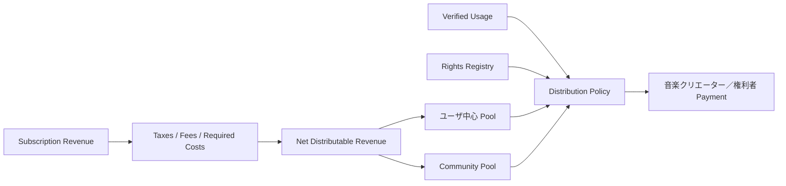
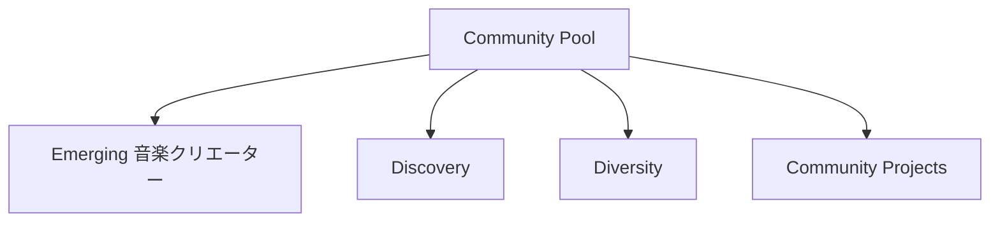
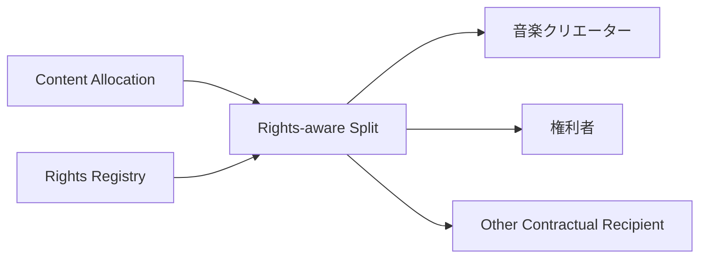
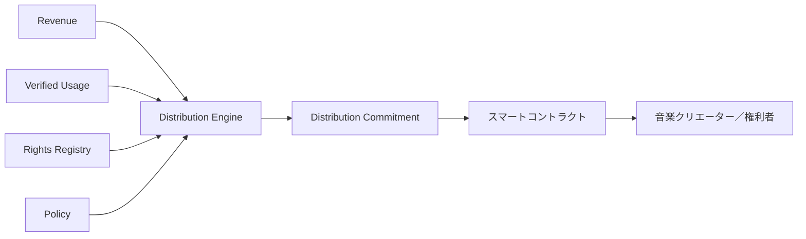

# ADR-0004: 音楽クリエーター分配 Model

**Status:** Proposed  
**Date:** 2026-07-29
**Last Updated:** 2026-08-23

資金の所在、期間収支、音楽クリエーター未払、税・運営・Promotion・Community予算および残余の横断的な照合は、[ADR-0013](./ADR-0013-treasury-flow-transparency.md)で定義する。

## 1. Context

Creator First Platform は、Platform の利益最大化ではなく、音楽クリエーター の権利と持続可能な創作活動を中心に据える。

Subscription 等によって得られた利用収入を 音楽クリエーター へ分配する際、単純な総再生回数比例モデルを採用すると、

- 人気作品への分配集中
- 大規模カタログ保有者への集中
- 新人・ニッチ音楽クリエーターの発見機会低下
- Botや不正再生による分配操作
- ユーザの実際の支持と分配結果の乖離

が生じる可能性がある。

一方、Creator First Platform は、Rights Registry、検証可能なUsage情報、Governanceを組み合わせることによって、透明性と監査可能性を持つ分配モデルを構築できる。

したがって、音楽クリエーター分配 Model は単なる「1再生あたり単価」ではなく、

> **ユーザ貢献 → Verified Usage → Rights State → Distribution Policy → 音楽クリエーター分配**

として設計する必要がある。

---

## 2. Decision

Creator First Platform は、音楽クリエーターへの分配に **ユーザ中心分配 を基本原則とするHybrid Distribution Model** を採用する。

各ユーザの分配対象額は、原則としてそのユーザ自身の検証済み利用実績に基づいて配分する。

同時に、音楽クリエーターの多様性、Discovery、新人音楽クリエーター支援等の公共的目的に使用するCommunity Allocationを分離して設ける。

概念的には、



具体的な比率、閾値、重み等はプロトコル仕様およびGovernanceによって管理する。

---

## 3. Distribution Layers

Subscription等から得られる収入を、概念的に次の層へ分ける。

```text
Gross Revenue
      ↓
Mandatory Deductions
      ↓
Net Distributable Revenue
      ├── ユーザ中心 Pool
      ├── Community / Discovery Pool
      └── Other Approved Allocations
```

Mandatory Deductionsには、適用される制度や契約に応じて、

- 税
- 決済手数料
- Blockchain transaction cost
- 法的に必要な控除
- Governanceによって承認されたPlatform運営費

等が含まれ得る。

これらの項目は明示的に区分し、音楽クリエーター分配とPlatform Revenueを不透明に混在させない。

---

## 4. ユーザ中心分配

ユーザ $u$ のあるDistribution Periodにおける分配対象額を $D_u$ とする。

ユーザが利用した作品集合を $C_u$ とし、作品 $c$ に対する検証済み利用Weightを $w_{u,c}$ とする。

基本配分は、

$$
d_{u,c}
=
D_u
\frac{w_{u,c}}
{\sum_{j \in C_u} w_{u,j}}
$$

とする。

したがってユーザが支払った分配対象額は、そのユーザ自身が実際に利用した音楽クリエーター群へ配分される。

例えばユーザAがある期間に、

```text
音楽クリエーターX : 60%
音楽クリエーターY : 30%
音楽クリエーターZ : 10%
```

相当の検証済み利用を行った場合、ユーザAに対応する分配対象額も原則として同じ比率を基礎に配分する。

これは全Platformの総再生回数だけで分配するMarket-Centric Modelとは区別される。

---

## 5. Verified Usage Only

Distribution計算には、検証済みのUsage Eventのみを使用する。

```text
Playback
   ↓
Usage Evidence
   ↓
Validation / Proof
   ↓
Verified Usage
   ↓
Distribution
```

単純なClient自己申告だけを分配根拠として使用してはならない。

Usage Verificationは、将来的に、

- signed playback events
- device / session integrity
- server-side verification
- anomaly detection
- cryptographic commitment
- zero-knowledge proof

等を組み合わせる。

Usage Oracleの具体方式は別ADRまたはSpecificationで定義する。

---

## 6. Usage Weight Is Not Necessarily Raw Play Count

$w_{u,c}$ は単純なPlay Countだけに固定しない。

例えば、

- 有効再生時間
- 完了率
- 重複・短時間連続再生
- ユーザによる明示的な支持
- 不正検知結果

等を考慮できる。

ただし、Distribution Algorithmが恣意的な「おすすめ評価」や音楽クリエーターの知名度を使って分配額を操作してはならない。

Weighting Ruleは公開されたプロトコル仕様としてVersion管理する。

---

## 7. Anti-Concentration Principle

Creator First Platformは、人気音楽クリエーターへの分配集中を目的としたProtocolを採用しない。

ただし、実際のユーザ支持によって人気音楽クリエーターへの分配が大きくなること自体を禁止するものではない。

区別すべきなのは、

> **ユーザ選択による集中**

と、

> **Platform Algorithmによる恣意的な集中**

である。

ユーザ中心 Poolでは、ユーザの検証済み利用選択を基本的に尊重する。

新人・ニッチ音楽クリエーターへの支援はユーザ中心 Poolを歪めるのではなく、原則としてCommunity / Discovery Poolによって実現する。

---

## 8. Community / Discovery Pool

Net Distributable Revenueの一部を、Governanceによって承認されたCommunity / Discovery Poolへ割り当てることができる。

目的には、

- 新人音楽クリエーター支援
- Discovery
- 多様性確保
- 小規模ジャンル支援
- 公共的・文化的価値
- 音楽クリエーター育成
- Community活動

等を含めることができる。



Community Poolの配分ルールは、Platform運営者が自由に変更できるものとせず、Governance Processによって決定する。

---

## 9. No Pay-to-Govern Distribution Advantage

音楽クリエーターが、

- Governance Tokenを大量保有している
- Platform株式を保有している
- Platformへ多額の資金を提供している
- 広告費等を支払っている

ことを理由として音楽クリエーター分配 Weightを増加させてはならない。

```text
Capital Power
    ≠
Distribution Privilege
```

STO、株式、Governance Participation、音楽クリエーター分配は、それぞれ異なる制度として扱う。

---

## 10. Rights-Aware Distribution

作品への配分額が決定した後、その金額を単純にUploaderへ送金してはならない。

ADR-0003 Rights Registryで確定したRights StateとDistribution Instructionsを使用する。

作品 $c$ に割り当てられた額を $D_c$、権利者 $i$ の有効な分配Shareを $s_{c,i}$ とすると、

$$
P_{c,i} = D_c s_{c,i}
$$

とする。

完全に確定した分配構成では、

$$
\sum_i s_{c,i} = 1
$$

を原則とする。



---

## 11. Disputed Rights

Rights RegistryでDisputedとなっている部分については、通常の自動分配を行わない。

```text
Distribution Amount
       ↓
Rights State
   ├── Verified → Payment
   └── Disputed → Hold / Escrow
```

紛争解決後、確定したRights Stateに従って保留額を分配する。

Platform運営者が恣意的に受取人を選択してはならない。

---

## 12. Distribution Period

分配は明示的なDistribution Period単位で計算する。

例えば、

```text
2026-07 Distribution Period
```

について、

- Eligible Revenue
- Verified Usage
- Rights Snapshot
- Distribution Policy Version
- Calculated Allocation
- Payment Status

を関連付ける。

過去のDistributionを再計算できるよう、計算時に使用したVersionとSnapshotを保存する。

---

## 13. Deterministic Calculation

同じ入力、

```text
Revenue Snapshot
Verified Usage Snapshot
Rights Snapshot
Distribution Policy Version
```

からは、同じDistribution Resultが得られなければならない。

概念的に、

$$
D =
F(R,U,G,P)
$$

とする。

ここで、

- $R$ = Revenue Snapshot
- $U$ = Verified Usage Snapshot
- $G$ = Rights Registry Snapshot
- $P$ = Distribution Policy

である。

計算処理は監査可能かつ再現可能にする。

---

## 14. Rounding and Residual Amounts

Tokenの最小単位等によって端数が発生する場合、その処理方法をプロトコル仕様で明示する。

端数処理によってPlatform運営者へ不透明な利益が発生してはならない。

Residual Amountについては、

- 次期Distributionへ繰越
- Community Poolへ移動
- deterministic rounding rule

等の方法をGovernanceで定義する。

---

## 15. Minimum Payout

Blockchain Feeや決済コストが支払額を上回る場合に備え、Minimum Payout Thresholdを設定できる。

Threshold未満の音楽クリエーター残高は失効させず、原則として次期以降へ繰り越す。

```text
音楽クリエーター残高
      ↓
Below Threshold → Carry Forward
      ↓
At / Above Threshold → Payment
```

Threshold値はProtocol Parameterとして管理する。

---

## 16. Stablecoin Settlement

Creator First Platformは、JPYC等の適切なStablecoinを決済・分配手段として利用できる。

ただし音楽クリエーター分配 Modelは特定Tokenへ固定しない。

```text
Distribution Amount
        ↓
Settlement Asset
        ↓
JPYC / Approved Stablecoin
```

使用可能なSettlement Assetは、

- 法的適合性
- 流動性
- スマートコントラクト Risk
- Reserve / Issuer Risk
- Network Cost
- ユーザ / 音楽クリエーターAccessibility

等を評価し、Governanceおよび法務要件に従って決定する。

---

## 17. On-chain / Off-chain Separation

全Usage Eventや詳細なユーザ行動をPublic Blockchainへ記録してはならない。

基本構造は、


Public Blockchainには必要に応じて、

- Distribution Root
- Period Identifier
- Policy Version
- Commitment
- Payment State

等を記録する。

個々のユーザの視聴履歴を公開しない。

---

## 18. Privacy

ユーザ中心分配ではユーザごとの利用情報を扱うため、Privacyを重要な設計要件とする。

第三者が、

> 特定ユーザがどの音楽クリエーターをどれだけ利用したか

をPublic Blockchainから復元できる構造を避ける。

将来的にはZero-Knowledge Proofを利用して、

> Distribution計算がProtocol Ruleに従っている

ことを、個々のユーザの視聴履歴を公開せず検証可能にすることを検討する。

---

## 19. Fraud Resistance

Distribution Systemは少なくとも、

- Bot Playback
- Self-streaming
- Replay Farming
- Multiple Account Abuse
- Sybil ユーザ
- Fake Content
- Collusive Streaming
- Usage Oracle Manipulation

を考慮する。

疑わしいUsageを単純に削除するだけでなく、

```text
Observed
Verified
Rejected
Disputed
```

等の状態を追跡可能にする。

不正検知Algorithmだけで最終的な権利剥奪を自動決定しない。

---

## 20. Transparency

各Distribution Periodについて、個人情報や機密情報を公開しない範囲で、少なくとも次を検証可能にする。

- Total Eligible Revenue
- Total Distributable Revenue
- Pool Allocation
- Distribution Policy Version
- Rights Snapshot Reference
- Usage Verification Reference
- Distribution Commitment
- Payment Completion Status

音楽クリエーターは自身への分配について、

```text
Revenue
↓
Usage Allocation
↓
Rights Split
↓
Fees / Adjustments
↓
Final Payment
```

を追跡できるようにする。

---

## 21. Governance

Distribution PolicyはGovernance対象とする。

例えば、

- ユーザ中心 Pool比率
- Community Pool比率
- Usage Weighting Rule
- Minimum Payout
- Residual Handling
- Fraud Handling Policy
- Settlement Asset

等である。

ただし、Governance変更を過去の確定済みDistribution Periodへ無条件に遡及適用してはならない。

各Distribution Periodは適用されたPolicy Versionを保持する。

---

## 22. Platform Revenue Separation

Platform運営会社の収益と音楽クリエーター分配 Poolを会計・Protocol上明確に区分する。

```text
ユーザ支払
     ↓
Revenue Allocation
     ├── 音楽クリエーター分配
     ├── Community Allocation
     └── Platform Revenue
```

Platform Revenueの割合や費用構造は明示し、音楽クリエーター分配 Poolから事後的・恣意的に資金を移動できない設計を目指す。

具体的な法的・会計上の資金分別方法はLegal / Accounting Specificationで定義する。

---

## 23. スマートコントラクト Relationship

Distribution Contractは、確定済みDistribution Resultに基づいてSettlementを実行する。

スマートコントラクト自身が、

- 著作権判断
- Usageの真偽判定
- 不正ユーザ判定
- 法的紛争判断

を行うことを前提としない。



---

## 24. Invariants

### Invariant 1

未検証Usageを通常の音楽クリエーター分配へ使用してはならない。

### Invariant 2

Disputed Rightsに対応する金額を通常の確定権利者へ誤って分配してはならない。

### Invariant 3

Distribution Periodごとに適用されたPolicy Versionを再現可能にしなければならない。

### Invariant 4

音楽クリエーター分配 PoolからPlatform運営者が恣意的に資金を取得できてはならない。

### Invariant 5

Token保有量や資本力を理由として音楽クリエーター分配 Weightを増加させてはならない。

### Invariant 6

同じ確定入力と同じPolicy Versionから異なるDistribution Resultが生成されてはならない。

### Invariant 7

ユーザの詳細な利用履歴をPublic Blockchainへ公開してはならない。

### Invariant 8

Rights Registryを無視してUploaderへ全額を自動送金してはならない。

---

## 25. Alternatives Considered

### Market-Centric Pro-Rata Model

Platform全体の総再生数に比例して全Subscription Revenueを分配する。

実装は単純だが、人気作品への集中やユーザごとの支持と分配結果の乖離が生じやすいため、基本方式として採用しない。

### Equal Distribution to All 音楽クリエーター

全音楽クリエーターへ均等配分する。

実際のユーザ利用・支持との関係が弱いため採用しない。

### Algorithmic Merit Distribution

Platformが音楽クリエーターの「価値」をAIや推薦Algorithmで評価し、分配額を決定する。

Platformによる恣意的な価値判断につながるため、ユーザ中心 Poolの基本方式として採用しない。

### Token-weighted 音楽クリエーター分配

音楽クリエーターまたはSupporterのToken保有量を分配Weightに利用する。

Economic Powerと音楽クリエーター分配を混同するため採用しない。

### Fully On-chain Usage Accounting

すべてのPlayback EventをPublic Blockchain上で処理する。

Privacy、Cost、Scalabilityの観点から採用しない。

---

## 26. Consequences

### Positive

- ユーザの支払と音楽クリエーターへの分配を対応付けやすい
- 音楽クリエーターへの分配根拠を説明しやすい
- 人気集中をPlatform全体の総再生数だけで増幅しにくい
- Rights Registryと直接接続できる
- 新人・ニッチ音楽クリエーター支援をCommunity Poolとして明示できる
- Distribution Algorithmを監査・再現可能にできる
- Platform運営収益と音楽クリエーター分配を分離できる

### Negative

- ユーザ中心計算は単純な総再生比例より複雑になる
- Usage Verification Infrastructureが必要になる
- Privacy-preserving aggregationが必要になる
- Rights Registryとの整合性管理が必要になる
- Fraud Detectionが必要になる
- 小額支払のSettlement Costを考慮する必要がある
- Community PoolのGovernance設計が必要になる

---

## 27. Security Considerations

Distribution Systemは少なくとも次の攻撃・障害を考慮する。

- Fake Playback
- Bot Farming
- Sybil Attack
- Usage Oracle Manipulation
- Rights Registry Manipulation
- Distribution Policy Tampering
- Payment Address Substitution
- Double Payment
- Unauthorized Withdrawal
- Rounding Exploitation
- スマートコントラクト Vulnerability
- Privacy Leakage
- Stablecoin / Settlement Asset Failure

具体的なThreat ModelはSecurity Specificationで定義する。

---

## 28. Relationship to Other ADRs

ADR-0001はGovernance Architectureを定義する。

ADR-0002はVerifiable Sortitionを定義する。

ADR-0003はRights Registryを定義する。

ADR-0004は、Revenue、Verified Usage、Rights Registry、Distribution Policyを接続し、音楽クリエーターおよび権利者への分配をどのように決定するかを定義する。

```text
ADR-0001 Governance Model
ADR-0002 Verifiable Sortition
ADR-0003 Rights Registry
              ↓
ADR-0004 音楽クリエーター分配 Model
              ↓
プロトコル仕様s
              ↓
Distribution Engine
              ↓
スマートコントラクト Settlement
```

---

## 29. Related Documents

- Whitepaper: Vision
- Whitepaper: Rights and Funds
- Whitepaper: Platform Architecture
- Whitepaper: 音楽クリエーター登録
- Whitepaper: Economic Model
- Whitepaper: Governance
- Whitepaper: Technology
- Whitepaper: Security
- Whitepaper: Legal / STO / Tax
- ADR-0003: Rights Registry

---

## 30. Follow-up Specifications

本ADRの採択後、少なくとも次のSpecificationを作成する。

- `protocol/distribution-spec.md`
- `protocol/usage-verification-spec.md`
- `protocol/revenue-allocation-spec.md`
- `protocol/settlement-spec.md`

Community / Discovery Poolの詳細については、必要に応じて独立したADRまたはSpecificationを作成する。

自動分配に使用するスマートコントラクトについても、Distribution Specification確定後に別途設計する。
