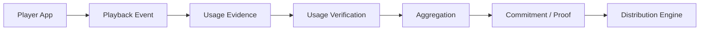
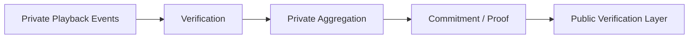
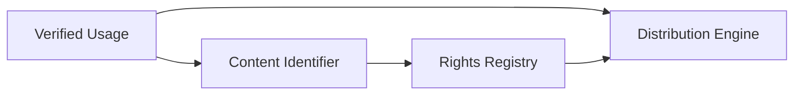
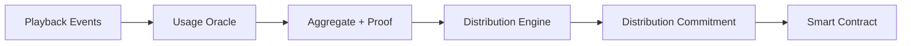

# ADR-0005: Usage Oracle

**Status:** Proposed  
**Date:** 2026-07-29
**Last Updated:** 2026-08-20

## 1. Context

Creator First Platform は、Subscription Revenue を Creator および Rights Holder へ透明かつ検証可能に分配することを目標とする。

ADR-0004 Creator Distribution Model では、Creator Distribution の基礎として **Verified Usage** を使用することを決定した。

しかし、Smart Contract はそれ自体では、

- User が実際に楽曲を再生したか
- どの作品を利用したか
- どの程度利用したか
- Playback Event が重複・偽造されていないか
- Bot や Self-streaming による不正利用ではないか
- Client が送信した情報が正しいか

を直接知ることができない。

一方、すべての Playback Event を Public Blockchain に記録すると、

- User の視聴履歴が公開される
- Transaction Cost が大きくなる
- Scalability が低下する
- 大量の利用イベントを処理できない
- Privacy Requirement を満たせない

という問題が生じる。

したがって Creator First Platform には、Off-chain の利用実績を検証し、Protocol が利用可能な形へ変換する **Usage Oracle** が必要である。

---

## 2. Decision

Creator First Platform は、利用実績を Creator Distribution へ接続するために **Usage Oracle** を設ける。

Usage Oracle は、

> **Playback Event → Evidence → Verification → Aggregation → Cryptographic Commitment / Proof → Distribution Engine**

という役割を担う。



Usage Oracle は「利用回数を報告する単一の信頼されたServer」ではなく、可能な限り第三者が検証可能なEvidence、Commitment、Proofを生成する仕組みとして設計する。

---

## 3. Oracle Boundary

Usage Oracle は、利用実績に関する事実をProtocolへ提供する。

ただし、Usage Oracle自身が、

- Creator Distribution Policyを決定する
- Rights Ownershipを決定する
- Creatorの価値を評価する
- Governance Decisionを行う
- 法的権利を判断する

ことはない。

役割を、

```text
Usage Oracle
    =
Verified Usage Facts

Distribution Engine
    =
Economic Calculation

Rights Registry
    =
Verified Rights State
```

として分離する。

---

## 4. Playback Event

Player App は、利用に関するPlayback Eventを生成する。

Playback Eventは概念的に、

```text
PlaybackEvent
├── event identifier
├── content identifier
├── session identifier
├── timestamp / time window
├── playback duration
├── completion information
├── client / device evidence
└── authentication evidence
```

等を含む。

ただし、具体的なEvent SchemaはProtocol Specificationで定義する。

個人情報や不要なDevice Fingerprintを収集することを前提としない。

---

## 5. Event Identity

各Playback Eventには一意に識別可能なEvent Identifierを付与する。

これにより、

```text
Same Event
   ↓
Multiple Submission
   ↓
Duplicate Detection
```

を可能にする。

同一Playback Eventを複数回Distributionへ算入してはならない。

Event Identifierの生成方法は、偽造耐性とPrivacyを考慮してSpecificationで定義する。

---

## 6. Authenticated Usage

単純な匿名HTTP RequestだけをVerified Usageとして扱わない。

Playback Eventは、少なくともPlatform上の有効なSessionまたはCredentialと関連付ける。

概念的には、

```text
User / Credential
      ↓
Authenticated Session
      ↓
Playback Event
      ↓
Usage Evidence
```

とする。

ただし、

> Wallet Address = Playback Identity

と固定しない。

Wallet、Platform Account、Privacy-preserving Credential等は分離可能な設計とする。

---

## 7. Valid Usage

すべてのPlayback EventがDistribution対象になるわけではない。

Protocolは **Valid Usage** の条件を定義する。

例えば、

- 最小有効再生時間
- Content Identifierが有効
- Eventが重複していない
- Sessionが有効
- Integrity Checkを満たす
- 明らかなBot Patternではない

等を条件にできる。

ただし、具体的な閾値は本ADRでは固定せず、Versioned Usage Verification Specificationで定義する。

---

## 8. Usage States

Usage Eventは少なくとも次の状態を表現できるようにする。

```text
Observed
   ↓
Verification
   ├── Verified
   ├── Rejected
   └── Disputed
```

### Observed

Player App等から受信したが、まだDistributionへ使用できると確定していないEvent。

### Verified

Protocolの検証条件を満たし、Distribution Calculationへ使用できるEvent。

### Rejected

重複、形式不正、検証失敗等によってDistribution対象外となったEvent。

### Disputed

Fraud Detectionや異議申立て等により、最終判断を保留しているEvent。

---

## 9. No Client-as-Authority

Player Appから送信された、

```text
I played this song 100 times.
```

という自己申告だけをDistributionへ使用してはならない。

ClientはEvidence Sourceの一つであり、最終的なAuthorityではない。

可能な範囲で、

- authenticated session
- signed event
- server observation
- sequence consistency
- content delivery evidence
- cryptographic commitment
- anomaly detection

等を組み合わせる。

---

## 10. Privacy by Design

Usage Oracle はUserの音楽利用履歴を扱うため、Privacyを主要な設計要件とする。

特に、

```text
User X listened to Artist Y at time T
```

という情報をPublic Blockchainへ直接記録してはならない。

PublicなProtocol Layerへ提供する情報は、可能な限り、

- Aggregate
- Commitment
- Root
- Proof
- Period Identifier

等に限定する。



---

## 11. Zero-Knowledge Direction

Creator First Platform は、Usage Verificationの将来的な主要技術としてZero-Knowledge Proofを検討する。

目的は、

> **個々のUserの視聴履歴を公開せず、Distributionに使用したUsage AggregateがProtocol Ruleに従って計算されたことを検証する**

ことである。

概念的には、

```text
Private Inputs
├── Playback Events
├── User / Session Credentials
└── Validation Data

Public Inputs
├── Usage Commitment
├── Period
├── Verification Rule Version
└── Aggregate Result

            ↓

        ZK Proof

            ↓

Verifier confirms:
"Aggregate follows protocol rules"
```

とする。

---

## 12. zk-STARK Consideration

Usage Oracleでは、大量のPlayback Eventを一定期間ごとに検証・集約する必要がある。

この用途では、透明なProof Systemと大量計算の検証可能性が重要であるため、**zk-STARKを有力候補として評価する**。

期待される特性は、

- Trusted Setupへの依存を避けられる
- 大規模計算のProofを構成できる
- Hash-based cryptographyを中心に構成できる
- 将来的な耐量子性を検討しやすい

ことである。

ただし本ADRではzk-STARK採用を確定しない。

zk-STARK、zk-SNARK、その他のProof Systemについて、

- Proving Cost
- Verification Cost
- Proof Size
- Latency
- Developer Tooling
- Blockchain Integration
- Cryptographic Assumptions

を比較し、別SpecificationまたはADRで決定する。

---

## 13. Aggregation

Distribution Engineは個々のPlayback Eventを直接処理するのではなく、Distribution PeriodごとにVerified Usageを集約する。

例えば、

```text
Verified Playback Events
          ↓
Content / User Aggregation
          ↓
Usage Snapshot
          ↓
Distribution Engine
```

とする。

User-Centric Distributionのために必要な粒度は維持するが、Public LayerへUser単位の詳細履歴を公開しない。

---

## 14. Usage Snapshot

各Distribution PeriodについてUsage Snapshotを確定する。

Usage Snapshotには概念的に、

- Period Identifier
- Event Set Commitment
- Verification Rule Version
- Aggregation Algorithm Version
- Aggregate Usage Commitment
- Proof / Verification Reference
- Finalization Timestamp

を含める。

ADR-0004のDistribution Engineは、確定済みUsage Snapshotを入力として使用する。

---

## 15. Deterministic Aggregation

同じVerified Event Setと同じAlgorithm Versionからは、同じUsage Aggregateが生成されなければならない。

Verified Event集合を $V$、Aggregation Ruleを $A$ とすると、

$$
U = A(V)
$$

とする。

同じ $V$ と $A$ から異なる $U$ が生成される実装を許容しない。

---

## 16. Commitment

大量のUsage EventそのものをBlockchainへ保存する代わりに、Event SetまたはAggregateへのCryptographic Commitmentを利用する。

例えば概念的に、

$$
C_U = H(\operatorname{MerkleRoot}(V))
$$

のようなCommitmentを使用できる。

具体的なCommitment SchemeはProtocol Specificationで決定する。

Commitmentは、

- Event Setの事後改ざん検出
- Distribution Snapshotとの対応
- Audit
- Proof Verification

に利用する。

---

## 17. Finalization

Usage SnapshotにはFinalization Processを設ける。

概念的には、

```text
Collection
   ↓
Preliminary Verification
   ↓
Fraud / Duplicate Check
   ↓
Challenge Window
   ↓
Finalization
   ↓
Distribution
```

とする。

Finalized Usage SnapshotをPlatform運営者が理由なく変更してはならない。

訂正が必要な場合は、新しいVersionまたはCorrection Recordとして監査可能にする。

---

## 18. Challenge Mechanism

Creator、User、Auditor等がUsage Aggregateの異常を指摘できる仕組みを設けることができる。

Challenge対象には、

- 不自然なUsage Spike
- Missing Usage
- Duplicate Inclusion
- Invalid Event Inclusion
- Incorrect Aggregation
- Proof Verification Failure

等を含む。

Challenge Processの詳細はGovernanceおよびProtocol Specificationで定義する。

---

## 19. Fraud Detection

Usage OracleはFraud Detectionを利用できる。

例えば、

- 異常な再生頻度
- 大量の短時間Session
- 同一パターンの反復
- 不自然なAccount Cluster
- Self-streaming Pattern
- Automated Playback

等を検出する。

ただし、

> AI / Fraud Model Output = Final Truth

とはしない。

Fraud DetectionはEvidenceまたはRisk Signalとして扱い、必要に応じてRejected / Disputed Stateへ移行する。

---

## 20. AI Role

AIはUsage Oracleにおいて、

- anomaly detection
- bot detection
- cluster analysis
- suspicious pattern detection

等を支援できる。

しかしAI Modelの出力だけでCreatorへの分配を不可逆的に停止してはならない。

AIによる判定には、

- Model Version
- Input Scope
- Decision / Score
- Review Status

等を監査可能にすることを検討する。

---

## 21. Oracle Decentralization

初期MVPではPlatform運営InfrastructureによるUsage Verificationを許容する。

ただし長期的には、単一Oracle Operatorへの依存を減らす。

候補には、

- multiple independent validators
- distributed attestations
- cryptographic proofs
- auditable open-source verifier
- third-party audit nodes

等がある。

```text
MVP
Platform Oracle
      ↓

Intermediate
Platform + Independent Verification
      ↓

Target
Cryptographically Verifiable Usage Oracle
```

という段階的移行を可能にする。

---

## 22. Availability

Usage Oracleが一時停止しても、

- Rights Registry
- User Account
- Creator Account
- 過去の確定Distribution

が破壊されてはならない。

Oracle Failure時には、未確定PeriodのDistributionを保留できる。

不完全なUsage Dataで自動的にDistributionを確定するより、検証可能性を優先する。

---

## 23. Data Retention

Raw Playback Dataを無期限保存することを前提としない。

Retention Policyは、

- Distribution Audit
- Fraud Investigation
- Legal Requirements
- Privacy
- Storage Cost

を考慮して定義する。

Raw Dataを削除した後でも、必要なCommitment、Aggregate、Proof、Audit Recordは保持できる設計とする。

---

## 24. User Transparency

Userは可能な範囲で、自身の利用がDistributionへ反映されたか確認できる仕組みを持つ。

ただし他Userの詳細な利用履歴へアクセスできてはならない。

例えば、

```text
My Usage
   ↓
Included in Period 2026-07
   ↓
Verified
```

のような確認を可能にする。

将来的にはMerkle ProofやZero-Knowledge Proof等による個別検証を検討する。

---

## 25. Creator Transparency

Creatorは、自身の作品についてDistributionへ使用されたAggregate Usageを確認できる。

例えば、

```text
Content
Period
Verified Usage
Rejected / Disputed Summary
Distribution Reference
```

等を提供できる。

ただし、Creatorが個々のUserの視聴履歴を特定できる情報は原則として提供しない。

---

## 26. Relationship to Rights Registry

Usage Oracleは作品の権利者を判断しない。

Content Identifierを通じてADR-0003 Rights Registryと接続する。



これにより、

> **何が利用されたか**

と、

> **誰に権利があるか**

を別々に検証する。

---

## 27. Relationship to Creator Distribution

ADR-0004 Creator Distribution Modelは、Usage Oracleから提供されるVerified Usage Snapshotを使用する。

```text
Usage Oracle
      ↓
Verified Usage Snapshot
      ↓
Creator Distribution Model
      +
Rights Registry
      +
Revenue Snapshot
      ↓
Distribution Result
```

Distribution Engineが未確定Raw Eventを直接使用してはならない。

---

## 28. Smart Contract Relationship

Smart Contractは個々のPlayback Eventを処理しない。

Usage Oracleから得られる、

- Usage Snapshot Commitment
- Aggregate
- Proof
- Period Identifier
- Verification Status

等を利用する。



---

## 29. Invariants

### Invariant 1

未検証Playback Eventを通常のCreator Distributionへ使用してはならない。

### Invariant 2

同一Playback Eventを複数回Distributionへ算入してはならない。

### Invariant 3

Finalized Usage Snapshotは監査履歴なしに変更してはならない。

### Invariant 4

Userの詳細な視聴履歴をPublic Blockchainへ直接記録してはならない。

### Invariant 5

Client自己申告だけをVerified Usageの唯一の根拠としてはならない。

### Invariant 6

同じVerified Event Setと同じAggregation Algorithmから異なるAggregateを生成してはならない。

### Invariant 7

Usage OracleがRights Ownershipを決定してはならない。

### Invariant 8

AI Fraud Detectionの出力だけを根拠として不可逆的な分配剥奪を行ってはならない。

---

## 30. Alternatives Considered

### Fully Trusted Central Oracle

Platform Serverが再生回数を集計し、その数値を無条件にSmart Contractへ渡す。

MVPでは一部利用可能だが、長期的なTrust Modelとしては採用しない。

### Fully On-chain Playback

すべてのPlayback EventをBlockchain Transactionとして記録する。

Privacy、Cost、Throughputの問題から採用しない。

### Client-only Reporting

Player Appの自己申告のみを利用する。

改ざん・Bot・Replayへの耐性が不足するため採用しない。

### Public User-level Usage Ledger

Userごとの利用履歴を公開Ledgerへ保存する。

Privacy上の問題が大きいため採用しない。

### AI-only Verification

AIがPlaybackの正当性を判定し、その出力を最終結果とする。

説明可能性、誤判定、Model Manipulationの問題から採用しない。

---

## 31. Consequences

### Positive

- Creator Distributionの利用根拠を検証可能にできる
- Raw PlaybackをBlockchainへ保存せずに済む
- User Privacyを保護しやすい
- Fraud Detectionを組み込める
- Distribution Periodごとの監査が可能になる
- ZK Proofによる将来的なTrust Minimizationが可能になる
- Rights RegistryとDistribution Engineの責務を分離できる

### Negative

- Oracle Infrastructureが必要になる
- Event Verificationが複雑になる
- Fraud Detection運用が必要になる
- ZK Proof導入には計算資源と開発コストが必要になる
- Client Integrityを完全には保証できない
- Oracle Decentralizationには追加Infrastructureが必要になる
- PrivacyとAuditabilityのバランス設計が必要になる

---

## 32. Security Considerations

Usage Oracleは少なくとも次の攻撃・障害を考慮する。

- Fake Playback
- Replay Attack
- Bot Farming
- Sybil Attack
- Client Tampering
- Session Theft
- Event Duplication
- Event Omission
- Timestamp Manipulation
- Oracle Operator Manipulation
- Aggregation Manipulation
- Commitment Substitution
- Proof Forgery
- Fraud Model Manipulation
- Privacy Leakage
- Denial of Service

具体的なThreat ModelはSecurity Specificationで定義する。

---

## 33. Relationship to Other ADRs

ADR-0001はGovernance Architectureを定義する。

ADR-0002はVerifiable Sortitionを定義する。

ADR-0003はRights Registryを定義する。

ADR-0004はCreator Distribution Modelを定義する。

ADR-0005は、実世界・Player App上の利用イベントを検証可能なUsage情報へ変換し、Creator Distributionへ提供するOracle Layerを定義する。

```text
Player App
    ↓
ADR-0005 Usage Oracle
    ↓
Verified Usage
    ↓
ADR-0004 Creator Distribution Model
    +
ADR-0003 Rights Registry
    ↓
Distribution
```

---

## 34. Related Documents

- Whitepaper: Vision
- Whitepaper: Platform Architecture
- Whitepaper: Economic Model
- Whitepaper: Governance
- Whitepaper: Technology
- Whitepaper: Security
- Whitepaper: Infrastructure / Cost
- ADR-0003: Rights Registry
- ADR-0004: Creator Distribution Model

---

## 35. Follow-up Specifications

本ADRの採択後、少なくとも次のSpecificationを作成する。

- `protocol/usage-event-spec.md`
- `protocol/usage-verification-spec.md`
- `protocol/usage-aggregation-spec.md`
- `protocol/usage-proof-spec.md`
- `protocol/usage-fraud-spec.md`

Zero-Knowledge Proof Systemの具体的な選択については、必要に応じて独立したADRを作成する。

MVPではまずMock / Local Usage Oracleを実装し、Verified Usage SnapshotからDistribution Engineへ接続するEnd-to-End Testを構築する。
