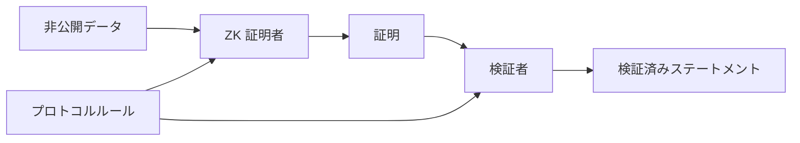
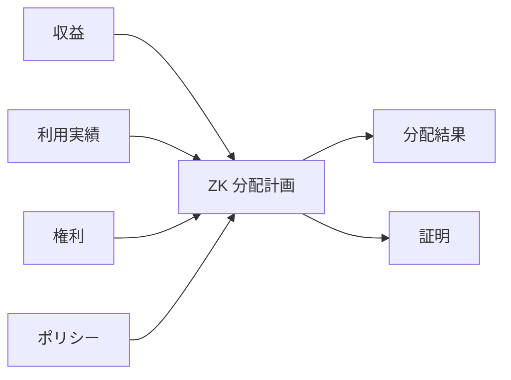

# ADR-0006: ゼロ知識証明戦略

**状態:** 提案
**日付:** 2026-07-29
**最終更新日:** 2026-08-24

## 1. 背景

Creator First Platform は、音楽クリエーターとユーザの権利、利用実績、ガバナンス、収益分配を検証可能にしながら、個人情報や詳細な利用履歴を不要に公開しないことを重要な設計原則とする。

これまでのADRでは、ゼロ知識証明（ZKP）が有効となる複数の領域が明らかになっている。

- ADR-0002 検証可能抽選
- ADR-0003 権利登録台帳
- ADR-0004 音楽クリエーター分配モデル
- ADR-0005 利用実績オラクル

特に利用実績オラクルでは、

> 個々のユーザの視聴履歴を公開せず、分配に使用された利用実績 Aggregateがプロトコルルールに従って計算されたことを検証する

必要がある。

また権利登録台帳では、

> 個人情報や契約内容を公開せず、必要な権利条件を満たしていることを証明する

ことが望ましい。

しかし、ZKPは単一の技術ではない。

候補には、

- zk-SNARK
- 透明型ゼロ知識証明（STARK、透明型SNARK等を含む）
- Plonk系証明システム
- Folding / Recursive 証明
- その他の検証可能 Computation

があり、それぞれ、

- 信頼された Setup
- 証明 Size
- Proving コスト
- 検証コスト
- Recursion
- ブロックチェーン Compatibility
- 開発者 Tooling
- Cryptographic Assumptions
- Post-Quantum セキュリティ

について異なる特性を持つ。

したがって、個別機能ごとに場当たり的に証明システムを選択するのではなく、Creator First Platform全体としてゼロ知識証明をどのように利用するかを定義する必要がある。

---

## 2. 決定

Creator First Platform は、ゼロ知識証明を **プライバシー保護型の検証可能性レイヤー** として採用する。

ZKPの目的は、

> **非公開データを公開せず、プロトコルルールに従った計算または資格条件の成立を第三者が検証可能にすること**

である。



ただし、Creator First Platformは現時点で単一の証明システムへ全機能を固定しない。

用途ごとに要件を定義し、共通の証明 Interfaceとバージョン管理を設けた上で、適切な証明システムを選択できるアーキテクチャを採用する。

---

## 3. 主要ユースケース

ZKPの主要用途を次の4領域とする。

### 利用実績証明

再生イベントの詳細を公開せず、

- 有効な利用実績イベントである
- 重複がない
- 検証ルールを満たす
- Aggregateが正しく計算された

ことを証明する。

### 権利証明

契約書や法的アイデンティティを公開せず、

- 必要な権利資格証明を持つ
- 指定時点で有効な権利状態に属する
- 必要な分配 Conditionを満たす

ことを証明する。

### ガバナンス適格性証明

個人情報を公開せず、

- 音楽クリエータ院議会 / ユーザ院議会の適格性を満たす
- 適格性スナップショットに含まれる
- 必要な資格証明を保有する

ことを証明する。

### 分配証明

ユーザの詳細な視聴履歴や個別契約を公開せず、

- 収益スナップショット
- 検証済み利用実績
- 権利状態
- 分配ポリシー

から分配結果が正しく計算されたことを証明する。

---

## 4. ZKPは正本ではない

ゼロ知識証明は事実そのものを生成しない。

例えば、

```text
偽の入力
    ↓
Correct ZK Computation
    ↓
Cryptographically 有効証明
```

は理論上あり得る。

したがってZKPは、

> **入力された非公開データに対して計算が正しいこと**

を証明するものであり、

> **現実世界の入力自体が真実であること**

を自動的に保証するものではない。

利用実績イベント、権利資格証明、アイデンティティ等の入力信頼性は、それぞれのプロトコルレイヤーで確保する。

---

## 5. 証明システム抽象化

アプリケーションレイヤーが特定証明システムへ直接依存しないよう、論理的な証明 Interfaceを設ける。

概念的には、

```text
プロトコルステートメント
        ↓
証明プログラム / Circuit
        ↓
証明 Backend
   ├── 透明型ZK方式
   ├── セットアップを伴うZK方式
   └── Future システム
        ↓
標準検証 Interface
```

とする。

証明記録は少なくとも、

```text
証明
├── proofType
├── proofVersion
├── program / circuit identifier
├── publicInputs
├── proofData
└── verification metadata
```

を識別できる構造とする。

これにより、将来証明システムを変更してもプロトコル全体を作り直す必要を減らす。

---

## 6. 透明型ゼロ知識証明の優先評価

Creator First Platformでは、特に利用実績オラクルおよび分配証明について、信頼できるセットアップを必要としない**透明型ゼロ知識証明を優先的な評価対象**とする。

理由は、

- セットアップ時の秘密が安全に破棄されたことへの依存を避けられる
- 大量計算、再帰または証明集約に適した複数方式を比較できる
- 暗号仮定と検証手続きを公開できる
- 将来の暗号方式移行を共通検証インターフェースで管理できる

ことである。

利用実績オラクルでは大量の再生イベントを期間単位で集約するため、

```text
Many 利用実績イベント
        ↓
Large Computation
        ↓
透明型ZK証明
        ↓
公開検証
```

という構造との相性がよい。

ただし、本ADRはすべてのZKP用途について透明型方式を無条件に必須とするものではない。証明サイズ、検証コストまたは対象チェーンの制約により別方式を採用する場合は、セットアップの信頼仮定と移行手続きを明示する。

---

## 7. SNARK系証明システム

zk-SNARKおよびPlonk系証明システムは、

- 小さな証明 Size
- EVM上での検証コスト
- Tooling
- Recursive 証明

等の観点から有力な場合がある。

特にスマートコントラクト上で頻繁に証明検証を行う用途では、透明型証明を直接検証するより小さい証明へ変換・集約するアーキテクチャが有利な可能性がある。

したがって、

```text
透明型ZK計算証明
        ↓
Recursive / Wrapped 証明
        ↓
Compact オンチェーン検証
```

のようなハイブリッドアーキテクチャも許容する。

---

## 8. 信頼されたセットアップのポリシー

Creator First Platformは、可能な限り信頼された Setupへの依存を避ける。

信頼された Setupを必要とする証明システムを採用する場合は、

- Setup Procedure
- 参加者
- Toxic Waste 仮定
- Ceremony 記録
- アップグレード Procedure

を明示する。

透明証明システムが要件を満たす場合は、原則として透明システムを優先する。

ただし、信頼された Setupの有無だけで証明システムを選択せず、セキュリティ、実演、運用事項 Complexityを総合的に評価する。

---

## 9. 耐量子戦略

Creator First Platformは長期運用を想定するため、証明システムのCryptographic Assumptionsを明示する。

特に、

- elliptic-curve discrete logarithm
- pairing-based cryptography
- hash-based commitments

等への依存を記録する。

Post-Quantum セキュリティが重要な長期データやプロトコルでは、Hash-basedな構成を持つ証明システムを優先的に評価する。

ただし、

> 透明型ゼロ知識証明を採用すればプラットフォーム全体が自動的にPost-Quantum安全になる

とはみなさない。

署名、ウォレット、ブロックチェーン、アイデンティティ、コミットメント等を含むシステム全体のCryptographic Dependencyを別途評価する。

---

## 10. 利用実績オラクル証明

ADR-0005 利用実績オラクルでは、分配期間ごとに検証済み利用実績スナップショットを生成する。

ZKPを利用する場合、概念的に、

非公開 Inputs:

```text
再生イベント
セッション / 資格証明データ
検証データ
不正 / Duplicate 状態
```

公開 Inputs:

```text
期間 Identifier
イベントコミットメント
検証ルール版
Aggregate 利用実績
```

を使用する。

証明は、

> Aggregate 利用実績がコミットされたイベント集合と指定された検証ルールから正しく計算された

ことを証明する。

個々のユーザの視聴履歴を公開入力にしてはならない。

---

## 11. 分配証明

ADR-0004 音楽クリエーター分配モデルについて、将来的に分配計算そのものをZK 証明で検証可能にする。

概念的に、

$$
D = F(R,U,G,P)
$$

について、

- $R$: 収益スナップショット
- $U$: 検証済み利用実績
- $G$: 権利状態
- $P$: 分配ポリシー
- $D$: 分配結果

とする。

証明は、

$$
F(R,U,G,P)=D
$$

が成立することを、必要な非公開入力を公開せず証明する。



---

## 12. 権利証明

ADR-0003 権利登録台帳では、非公開な権利情報を公開ブロックチェーンへ保存しない。

ZKPを利用して、

> 権利者が特定条件を満たす検証済み資格証明を保有する

ことを証明できる。

例えば、

```text
非公開
├── 法務アイデンティティ
├── コントラクト
└── 権利資格証明

公開
├── コンテンツ Identifier
├── 権利 Type
├── 有効性 Condition
└── 資格証明コミットメント
```

という分離を可能にする。

ただし、ZKPだけで著作権の法的帰属を決定することはできない。

---

## 13. ガバナンス適格性証明

ADR-0002 検証可能抽選では、適格集合への参加資格をPrivacy-preservingに証明する用途でZKPを利用できる。

例えば、

> この参加者はユーザ院議会参加資格を満たしているが、その法的アイデンティティは公開しない

という証明を構成できる。

また、Nullifier等を利用して、

> 同一資格が複数回抽選機会を取得しない

ことを証明する方式を検討する。

具体的なアイデンティティ / シビル耐性方式は別ADRまたは仕様で決定する。

---

## 14. 公開入力

ZKPの公開入力は必要最小限とする。

公開入力には、

- プロトコル版
- 期間 / ラウンド Identifier
- コミットメント
- Aggregate 結果
- ポリシー版
- 検証鍵 Identifier

等を使用できる。

個人情報、詳細な再生履歴、非公開コントラクト等を公開入力へ含めない。

---

## 15. 回路・プログラムのバージョン管理

ZK回路または証明プログラムはプロトコルの一部として版管理する。

例えば、

```text
usage-proof-v1
distribution-proof-v1
rights-proof-v1
eligibility-proof-v1
```

とする。

証明には必ず計画版を関連付ける。

プロトコルルールが変更された場合、

```text
計画 v1
   ↓
Governance-approved change
   ↓
計画 v2
```

として更新し、過去の証明を検証可能な状態に保つ。

---

## 16. 検証鍵管理

検証鍵が必要な証明システムでは、

- 検証鍵 Identifier
- 版
- 有効化 Time
- Retirement Time
- Corresponding 計画
- ガバナンス Approval

を管理する。

検証鍵の差し替えだけでプロトコルルールを秘密裏に変更できる設計を避ける。

---

## 17. 再帰証明

大量の証明を効率的に扱うためRecursive 証明を利用できる。

例えば、

```text
利用実績証明 1
利用実績証明 2
利用実績証明 3
     ↓
Recursive 集約
     ↓
期間利用実績証明
     ↓
分配証明
```

とする。

これにより、大量のイベントまたはバッチを少数の証明へ集約できる。

ただしRecursionの採用はComplexityとセキュリティリスクを増加させるため、MVPでは必須としない。

---

## 18. オンチェーン検証

すべての証明をスマートコントラクト上で直接検証する必要はない。

用途に応じて、

```text
オフチェーン証明
        ↓
独立検証
        ↓
コミットメント / 検証済み結果
        ↓
スマートコントラクト
```

または、

```text
証明
   ↓
オンチェーン検証者
   ↓
スマートコントラクト実行
```

を選択できる。

オンチェーン検証を採用する場合は、

- ガスコスト
- 証明 Size
- 検証 Latency
- チェーン Compatibility
- 検証者コントラクトセキュリティ

を評価する。

---

## 19. 証明世代インフラ

証明世代は計算負荷が高い可能性があるため、アプリケーションサーバーと分離できるアーキテクチャとする。


証明者インフラは将来的に、

- Platform-operated prover
- distributed prover
- outsourced prover
- user-side prover

等へ拡張できる。

非公開データを外部証明者へ渡す場合は、プライバシーと信頼境界を明示する。

---

## 20. 証明は監査を代替しない

Cryptographic 検証が成功しても、

- プロトコルルール自体が適切か
- 入力ソースが正しいか
- 権利検証が法的に妥当か
- 不正検知ポリシーが公平か

は別問題である。

したがって、

```text
Cryptographic 検証
+
プロトコル監査
+
運用事項監査
+
ガバナンス Oversight
```

を組み合わせる。

---

## 21. オープンソース検証

可能な範囲で、

- 証明プログラム
- Circuit
- 検証者
- 公開入力 Encoding
- 検証 Procedure

を公開し、第三者が独立して検証できるようにする。

秘密のCircuitによって「検証可能性」を主張する設計は避ける。

ただし、不正検知等で公開が攻撃を容易にする情報については、公開範囲を別途評価する。

---

## 22. ガバナンス

以下はガバナンス対象とする。

- 証明システム
- 計画 / Circuit 版
- 検証ルール
- 検証鍵
- Supported 証明 Types
- Deprecation Schedule
- セキュリティ Parameter

重大な証明システム変更はADRおよびプロトコル仕様を経る。

プラットフォーム運営者が独断で検証者を変更し、分配やガバナンス適格性の意味を変えてはならない。

---

## 23. 移行

証明システムは将来変更可能でなければならない。

例えば、

```text
証明システム A
      ↓
Migration 期間
      ├── A accepted
      └── B accepted
      ↓
証明システム B
```

という移行期間を設定できる。

過去の証明検証に必要な検証者や版情報は保持する。

---

## 24. 障害処理

証明世代または検証が失敗した場合、

- 無効証明
- 証明者 Failure
- Timeout
- Unsupported 版
- 検証鍵 Mismatch

等を区別する。

証明インフラ障害を理由に、未検証データを自動的に検証済みとして扱ってはならない。

必要に応じて分配等を保留する。

---

## 25. MVP 戦略

MVPではZKPを最初から全機能へ導入しない。

段階的に、

```text
フェーズ 1
決定論的計算 + テスト

フェーズ 2
Commitments + 独立検証

フェーズ 3
ZK 証明 Prototype

フェーズ 4
本番証明インフラ

フェーズ 5
Recursive / オンチェーン検証 where justified
```

と進める。

最初の実装では、ZKPなしでも同じプロトコルルールを決定論的に実行・テストできるようにする。

これにより、証明システムと業務ロジックを分離して検証できる。

---

## 26. 選定基準

個別用途の証明システムは少なくとも次の基準で評価する。

| Criterion | Description |
|---|---|
| セキュリティ | Cryptographic assumptions・maturity |
| 透明性 | 信頼された setup requirements |
| プライバシー | Ability to protect required private inputs |
| Proving コスト | CPU, memory, GPU・time requirements |
| 検証コスト | オフチェーン・on-chain verification cost |
| 証明 Size | ストレージ・network impact |
| 拡張性 | Ability to handle large usage datasets |
| Recursion | Efficient proof aggregation support |
| Tooling | Language, compiler, debugger・test support |
| EVM 連携 | Practicality of smart-contract verification |
| 監査可能性 | Ability for third parties to inspect implementation |
| アップグレード可能性 | Ability to migrate without breaking historical verification |
| Post-Quantum 方向性 | Long-term cryptographic assumptions |

証明システム選択の理由はADRまたは仕様に記録する。

---

## 27. 不変条件

### 不変条件 1

ZKPによって非公開データを不必要に公開入力へ露出してはならない。

### 不変条件 2

証明システムの変更によって過去の証明の意味を不明確にしてはならない。

### 不変条件 3

証明には対応する計画 / Circuit 版を識別可能にしなければならない。

### 不変条件 4

無効証明を検証済み結果として受理してはならない。

### 不変条件 5

証明世代失敗時に未検証データを自動承認してはならない。

### 不変条件 6

ZKPを現実世界の入力そのものの真実性の証明として扱ってはならない。

### 不変条件 7

検証者の変更によってガバナンス承認なしにプロトコルルールを変更してはならない。

### 不変条件 8

ZKP導入前後で、基礎となるプロトコル計算を独立してテスト可能にしなければならない。

---

## 28. 検討した代替案

### No ゼロ知識証明

すべての検証を信頼されたサーバーと通常のデータベース監査だけで行う。

MVPでは利用可能だが、Privacy-Preserving 検証可能性という長期目標を満たさないため最終アーキテクチャとして採用しない。

### すべてを単一証明システムで処理

全用途を単一のZKP技術へ固定する。

設計は単純になるが、利用実績、権利、適格性、オンチェーン検証で要件が異なるため採用しない。

### 完全オンチェーン透明データ

プライバシーを犠牲にして全データをブロックチェーンへ公開し、ZKPを不要にする。

ユーザプライバシー、権利情報、契約機密性の観点から採用しない。

### 業務ロジックとしてのZKP

すべてのプロトコル Logicを最初からZK回路内だけに実装する。

開発・監査・テストを複雑化するため採用しない。

業務ロジックを独立して実装し、その計算を証明化できる構造を採用する。

---

## 29. 影響

### 利点

- ユーザプライバシーと検証可能性を両立できる
- 利用実績オラクルの信頼を低減できる
- 分配計算を第三者が検証できる
- 権利資格証明を公開せず資格を証明できる
- ガバナンス適格性をPrivacy-preservingに検証できる
- 将来的なオラクル分散化を支援できる
- 証明システムを用途ごとに最適化できる

### 欠点

- 証明者インフラが必要になる
- Cryptographic 実装が複雑になる
- 証明プログラムの監査が必要になる
- 開発者 Toolingへの依存が増える
- Proving コストがインフラコストへ影響する
- 証明システム Migrationを設計する必要がある
- スマートコントラクト検証ではガスコストが発生する
- ZKPが保証する範囲について誤解を防ぐ必要がある

---

## 30. セキュリティ上の考慮事項

ZKP レイヤーは少なくとも次のリスクを考慮する。

- Unsound 証明システム
- Circuit / 計画バグ
- Incorrect 公開入力 Encoding
- 検証鍵 Substitution
- 証明者 Compromise
- 検証者コントラクト Vulnerability
- 信頼された Setup Failure
- Cryptographic ライブラリ Vulnerability
- 証明 Replay
- 版 Confusion
- Side-channel Leakage
- 非公開入力 Leakage
- Denial of サービス against 証明者インフラ
- 無効 Migration
- Weak セキュリティパラメータ

証明システムの採用前にはセキュリティレビューと独立監査を行う。

---

## 31. 他のADRとの関係

ADR-0002 検証可能抽選では、ガバナンス適格性をPrivacy-preservingに証明する用途がある。

ADR-0003 権利登録台帳では、権利資格証明や契約情報を公開せず条件成立を証明する用途がある。

ADR-0004 音楽クリエーター分配モデルでは、分配計算の正当性を証明する用途がある。

ADR-0005 利用実績オラクルでは、再生イベントを公開せず検証済み利用実績 Aggregateを証明する用途がある。

ADR-0006はこれらを横断するゼロ知識証明戦略を定義する。

```text
ADR-0002 抽選 ───────┐
ADR-0003 権利 ──────────┤
ADR-0004 分配 ────┼──> ADR-0006 ZKP 戦略
ADR-0005 利用実績オラクル ────┘
                              ↓
                     証明 Specifications
                              ↓
                     証明者 / 検証者
```

---

## 32. 関連文書

- ホワイトペーパー: ビジョン
- ホワイトペーパー: プラットフォームアーキテクチャ
- ホワイトペーパー: ガバナンス
- ホワイトペーパー: Technology
- ホワイトペーパー: セキュリティ
- ホワイトペーパー: インフラ / コスト
- ADR-0002: 検証可能抽選
- ADR-0003: 権利登録台帳
- ADR-0004: 音楽クリエーター分配モデル
- ADR-0005: 利用実績オラクル
- ADR-0017: 透明型ゼロ知識証明のテストネット／本番境界

---

## 33. 後続仕様

共通の検証境界は次の仕様として作成した。

- `protocol/zk/transparent-proof-verification-spec.md`

今後、必要に応じて次の用途別仕様を作成する。

- `protocol/usage-proof-spec.md`
- `protocol/distribution-proof-spec.md`
- `protocol/rights-proof-spec.md`
- `protocol/eligibility-proof-spec.md`

さらに、最初のZKP Prototypeについて証明システムを比較し、必要に応じて、

- 証明方式実装ADR
- Recursive proof ADR
- オンチェーン verifier ADR

を追加する。

最初の実証対象としてはADR-0005 利用実績オラクルの利用実績スナップショット証明を優先する。
