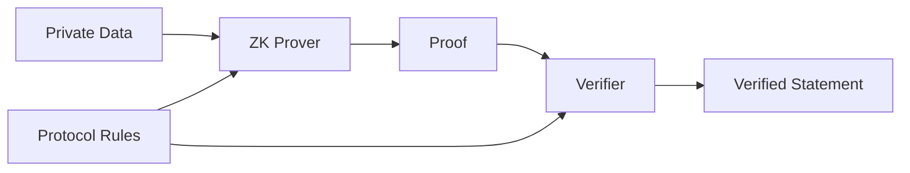
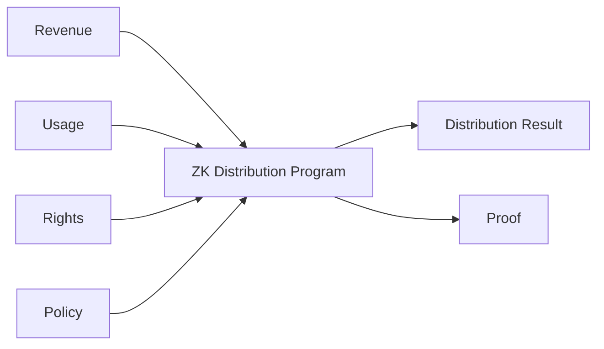

# ADR-0006: Zero-Knowledge Proof Strategy

**Status:** Proposed  
**Date:** 2026-07-29

## 1. Context

Creator First Platform は、Creator と User の権利、利用実績、Governance、収益分配を検証可能にしながら、個人情報や詳細な利用履歴を不要に公開しないことを重要な設計原則とする。

これまでのADRでは、Zero-Knowledge Proof（ZKP）が有効となる複数の領域が明らかになっている。

- ADR-0002 Verifiable Sortition
- ADR-0003 Rights Registry
- ADR-0004 Creator Distribution Model
- ADR-0005 Usage Oracle

特にUsage Oracleでは、

> 個々のUserの視聴履歴を公開せず、Distributionに使用されたUsage AggregateがProtocol Ruleに従って計算されたことを検証する

必要がある。

またRights Registryでは、

> 個人情報や契約内容を公開せず、必要な権利条件を満たしていることを証明する

ことが望ましい。

しかし、ZKPは単一の技術ではない。

候補には、

- zk-SNARK
- zk-STARK
- Plonk系Proof System
- Folding / Recursive Proof
- その他のVerifiable Computation

があり、それぞれ、

- Trusted Setup
- Proof Size
- Proving Cost
- Verification Cost
- Recursion
- Blockchain Compatibility
- Developer Tooling
- Cryptographic Assumptions
- Post-Quantum Security

について異なる特性を持つ。

したがって、個別機能ごとに場当たり的にProof Systemを選択するのではなく、Creator First Platform全体としてZero-Knowledge Proofをどのように利用するかを定義する必要がある。

---

## 2. Decision

Creator First Platform は、Zero-Knowledge Proofを **Privacy-Preserving Verifiability Layer** として採用する。

ZKPの目的は、

> **Private Dataを公開せず、Protocol Ruleに従った計算または資格条件の成立を第三者が検証可能にすること**

である。



ただし、Creator First Platformは現時点で単一のProof Systemへ全機能を固定しない。

用途ごとにRequirementsを定義し、共通のProof InterfaceとVersioningを設けた上で、適切なProof Systemを選択できるArchitectureを採用する。

---

## 3. Primary Use Cases

ZKPの主要用途を次の4領域とする。

### Usage Proof

Playback Eventの詳細を公開せず、

- 有効なUsage Eventである
- 重複がない
- Verification Ruleを満たす
- Aggregateが正しく計算された

ことを証明する。

### Rights Proof

契約書や法的Identityを公開せず、

- 必要なRights Credentialを持つ
- 指定時点で有効なRights Stateに属する
- 必要なDistribution Conditionを満たす

ことを証明する。

### Governance Eligibility Proof

個人情報を公開せず、

- Creator House / User HouseのEligibilityを満たす
- Eligibility Snapshotに含まれる
- 必要なCredentialを保有する

ことを証明する。

### Distribution Proof

Userの詳細な視聴履歴や個別契約を公開せず、

- Revenue Snapshot
- Verified Usage
- Rights State
- Distribution Policy

からDistribution Resultが正しく計算されたことを証明する。

---

## 4. ZKP Is Not the Source of Truth

Zero-Knowledge Proofは事実そのものを生成しない。

例えば、

```text
False Input
    ↓
Correct ZK Computation
    ↓
Cryptographically Valid Proof
```

は理論上あり得る。

したがってZKPは、

> **入力されたPrivate Dataに対して計算が正しいこと**

を証明するものであり、

> **現実世界の入力自体が真実であること**

を自動的に保証するものではない。

Usage Event、Rights Credential、Identity等の入力信頼性は、それぞれのProtocol Layerで確保する。

---

## 5. Proof System Abstraction

Application Layerが特定Proof Systemへ直接依存しないよう、論理的なProof Interfaceを設ける。

概念的には、

```text
Protocol Statement
        ↓
Proof Program / Circuit
        ↓
Proof Backend
   ├── STARK
   ├── SNARK
   └── Future System
        ↓
Standard Verification Interface
```

とする。

Proof Recordは少なくとも、

```text
Proof
├── proofType
├── proofVersion
├── program / circuit identifier
├── publicInputs
├── proofData
└── verification metadata
```

を識別できる構造とする。

これにより、将来Proof Systemを変更してもProtocol全体を作り直す必要を減らす。

---

## 6. zk-STARK as a Strategic Candidate

Creator First Platformでは、特にUsage OracleおよびDistribution Proofについて **zk-STARKを戦略的な有力候補** とする。

理由は、

- Transparent Setupを採用できる
- 大量計算の検証に適する
- Hash-based cryptographic assumptionsを中心に構成できる
- Post-Quantum Securityを考慮した長期設計と整合しやすい

ことである。

Usage Oracleでは大量のPlayback Eventを期間単位で集約するため、

```text
Many Usage Events
        ↓
Large Computation
        ↓
STARK Proof
        ↓
Public Verification
```

という構造との相性がよい。

ただし、本ADRはすべてのZKP用途についてzk-STARKを必須とするものではない。

---

## 7. SNARK-family Systems

zk-SNARKおよびPlonk系Proof Systemは、

- 小さなProof Size
- EVM上でのVerification Cost
- Tooling
- Recursive Proof

等の観点から有力な場合がある。

特にSmart Contract上で頻繁にProof Verificationを行う用途では、STARK Proofを直接検証するよりSNARK系Proofへ変換・集約するArchitectureが有利な可能性がある。

したがって、

```text
STARK Computation Proof
        ↓
Recursive / Wrapped Proof
        ↓
Compact On-chain Verification
```

のようなHybrid Architectureも許容する。

---

## 8. Trusted Setup Policy

Creator First Platformは、可能な限りTrusted Setupへの依存を避ける。

Trusted Setupを必要とするProof Systemを採用する場合は、

- Setup Procedure
- Participants
- Toxic Waste Assumption
- Ceremony Record
- Upgrade Procedure

を明示する。

Transparent Proof SystemがRequirementsを満たす場合は、原則としてTransparent Systemを優先する。

ただし、Trusted Setupの有無だけでProof Systemを選択せず、Security、Performance、Operational Complexityを総合的に評価する。

---

## 9. Post-Quantum Strategy

Creator First Platformは長期運用を想定するため、Proof SystemのCryptographic Assumptionsを明示する。

特に、

- elliptic-curve discrete logarithm
- pairing-based cryptography
- hash-based commitments

等への依存を記録する。

Post-Quantum Securityが重要な長期データやProtocolでは、Hash-basedな構成を持つProof Systemを優先的に評価する。

ただし、

> STARKを採用すればPlatform全体が自動的にPost-Quantum Secureになる

とはみなさない。

Signature、Wallet、Blockchain、Identity、Commitment等を含むSystem全体のCryptographic Dependencyを別途評価する。

---

## 10. Usage Oracle Proof

ADR-0005 Usage Oracleでは、Distribution PeriodごとにVerified Usage Snapshotを生成する。

ZKPを利用する場合、概念的に、

Private Inputs:

```text
Playback Events
Session / Credential Data
Validation Data
Fraud / Duplicate State
```

Public Inputs:

```text
Period Identifier
Event Commitment
Verification Rule Version
Aggregate Usage
```

を使用する。

Proofは、

> Aggregate UsageがCommitされたEvent集合と指定されたVerification Ruleから正しく計算された

ことを証明する。

個々のUserの視聴履歴をPublic Inputにしてはならない。

---

## 11. Distribution Proof

ADR-0004 Creator Distribution Modelについて、将来的にDistribution CalculationそのものをZK Proofで検証可能にする。

概念的に、

$$
D = F(R,U,G,P)
$$

について、

- $R$: Revenue Snapshot
- $U$: Verified Usage
- $G$: Rights State
- $P$: Distribution Policy
- $D$: Distribution Result

とする。

Proofは、

$$
F(R,U,G,P)=D
$$

が成立することを、必要なPrivate Inputを公開せず証明する。



---

## 12. Rights Proof

ADR-0003 Rights Registryでは、PrivateなRights InformationをPublic Blockchainへ保存しない。

ZKPを利用して、

> Rights Holderが特定条件を満たすVerified Credentialを保有する

ことを証明できる。

例えば、

```text
Private
├── Legal Identity
├── Contract
└── Rights Credential

Public
├── Content Identifier
├── Rights Type
├── Validity Condition
└── Credential Commitment
```

という分離を可能にする。

ただし、ZKPだけで著作権の法的帰属を決定することはできない。

---

## 13. Governance Eligibility Proof

ADR-0002 Verifiable Sortitionでは、Eligible Setへの参加資格をPrivacy-preservingに証明する用途でZKPを利用できる。

例えば、

> この参加者はUser House Eligibilityを満たしているが、その法的Identityは公開しない

というProofを構成できる。

また、Nullifier等を利用して、

> 同一資格が複数回抽選機会を取得しない

ことを証明する方式を検討する。

具体的なIdentity / Sybil Resistance方式は別ADRまたはSpecificationで決定する。

---

## 14. Public Inputs

ZKPのPublic Inputは必要最小限とする。

Public Inputには、

- Protocol Version
- Period / Round Identifier
- Commitment
- Aggregate Result
- Policy Version
- Verification Key Identifier

等を使用できる。

個人情報、詳細なPlayback History、Private Contract等をPublic Inputへ含めない。

---

## 15. Circuit / Program Versioning

ZK CircuitまたはProof ProgramはProtocolの一部としてVersion管理する。

例えば、

```text
usage-proof-v1
distribution-proof-v1
rights-proof-v1
eligibility-proof-v1
```

とする。

Proofには必ずProgram Versionを関連付ける。

Protocol Ruleが変更された場合、

```text
Program v1
   ↓
Governance-approved change
   ↓
Program v2
```

として更新し、過去のProofを検証可能な状態に保つ。

---

## 16. Verification Key Management

Verification Keyが必要なProof Systemでは、

- Verification Key Identifier
- Version
- Activation Time
- Retirement Time
- Corresponding Program
- Governance Approval

を管理する。

Verification Keyの差し替えだけでProtocol Ruleを秘密裏に変更できる設計を避ける。

---

## 17. Recursive Proofs

大量のProofを効率的に扱うためRecursive Proofを利用できる。

例えば、

```text
Usage Proof 1
Usage Proof 2
Usage Proof 3
     ↓
Recursive Aggregation
     ↓
Period Usage Proof
     ↓
Distribution Proof
```

とする。

これにより、大量のEventまたはBatchを少数のProofへ集約できる。

ただしRecursionの採用はComplexityとSecurity Riskを増加させるため、MVPでは必須としない。

---

## 18. On-chain Verification

すべてのProofをSmart Contract上で直接検証する必要はない。

用途に応じて、

```text
Off-chain Proof
        ↓
Independent Verification
        ↓
Commitment / Verified Result
        ↓
Smart Contract
```

または、

```text
Proof
   ↓
On-chain Verifier
   ↓
Smart Contract Execution
```

を選択できる。

On-chain Verificationを採用する場合は、

- Gas Cost
- Proof Size
- Verification Latency
- Chain Compatibility
- Verifier Contract Security

を評価する。

---

## 19. Proof Generation Infrastructure

Proof Generationは計算負荷が高い可能性があるため、Application Serverと分離できるArchitectureとする。


Prover Infrastructureは将来的に、

- Platform-operated prover
- distributed prover
- outsourced prover
- user-side prover

等へ拡張できる。

Private Dataを外部Proverへ渡す場合は、PrivacyとTrust Boundaryを明示する。

---

## 20. Proof Does Not Replace Audit

Cryptographic Verificationが成功しても、

- Protocol Rule自体が適切か
- Input Sourceが正しいか
- Rights Verificationが法的に妥当か
- Fraud Detection Policyが公平か

は別問題である。

したがって、

```text
Cryptographic Verification
+
Protocol Audit
+
Operational Audit
+
Governance Oversight
```

を組み合わせる。

---

## 21. Open Source Verification

可能な範囲で、

- Proof Program
- Circuit
- Verifier
- Public Input Encoding
- Verification Procedure

を公開し、第三者が独立して検証できるようにする。

秘密のCircuitによって「検証可能性」を主張する設計は避ける。

ただし、Fraud Detection等で公開が攻撃を容易にする情報については、公開範囲を別途評価する。

---

## 22. Governance

以下はGovernance対象とする。

- Proof System
- Program / Circuit Version
- Verification Rules
- Verification Key
- Supported Proof Types
- Deprecation Schedule
- Security Parameter

重大なProof System変更はADRおよびProtocol Specificationを経る。

Platform運営者が独断でVerifierを変更し、DistributionやGovernance Eligibilityの意味を変えてはならない。

---

## 23. Migration

Proof Systemは将来変更可能でなければならない。

例えば、

```text
Proof System A
      ↓
Migration Period
      ├── A accepted
      └── B accepted
      ↓
Proof System B
```

という移行期間を設定できる。

過去のProof Verificationに必要なVerifierやVersion情報は保持する。

---

## 24. Failure Handling

Proof GenerationまたはVerificationが失敗した場合、

- Invalid Proof
- Prover Failure
- Timeout
- Unsupported Version
- Verification Key Mismatch

等を区別する。

Proof Infrastructure障害を理由に、未検証Dataを自動的にVerifiedとして扱ってはならない。

必要に応じてDistribution等を保留する。

---

## 25. MVP Strategy

MVPではZKPを最初から全機能へ導入しない。

段階的に、

```text
Phase 1
Deterministic Calculation + Tests

Phase 2
Commitments + Independent Verification

Phase 3
ZK Proof Prototype

Phase 4
Production Proof Infrastructure

Phase 5
Recursive / On-chain Verification where justified
```

と進める。

最初の実装では、ZKPなしでも同じProtocol Ruleを決定論的に実行・テストできるようにする。

これにより、Proof SystemとBusiness Logicを分離して検証できる。

---

## 26. Selection Criteria

個別用途のProof Systemは少なくとも次の基準で評価する。

| Criterion | Description |
|---|---|
| Security | Cryptographic assumptions and maturity |
| Transparency | Trusted setup requirements |
| Privacy | Ability to protect required private inputs |
| Proving Cost | CPU, memory, GPU and time requirements |
| Verification Cost | Off-chain and on-chain verification cost |
| Proof Size | Storage and network impact |
| Scalability | Ability to handle large usage datasets |
| Recursion | Efficient proof aggregation support |
| Tooling | Language, compiler, debugger and test support |
| EVM Integration | Practicality of smart-contract verification |
| Auditability | Ability for third parties to inspect implementation |
| Upgradeability | Ability to migrate without breaking historical verification |
| Post-Quantum Direction | Long-term cryptographic assumptions |

Proof System選択の理由はADRまたはSpecificationに記録する。

---

## 27. Invariants

### Invariant 1

ZKPによってPrivate Dataを不必要にPublic Inputへ露出してはならない。

### Invariant 2

Proof Systemの変更によって過去のProofの意味を不明確にしてはならない。

### Invariant 3

Proofには対応するProgram / Circuit Versionを識別可能にしなければならない。

### Invariant 4

Invalid ProofをVerified Resultとして受理してはならない。

### Invariant 5

Proof Generation失敗時に未検証Dataを自動承認してはならない。

### Invariant 6

ZKPを現実世界の入力そのものの真実性の証明として扱ってはならない。

### Invariant 7

Verifierの変更によってGovernance承認なしにProtocol Ruleを変更してはならない。

### Invariant 8

ZKP導入前後で、基礎となるProtocol Calculationを独立してテスト可能にしなければならない。

---

## 28. Alternatives Considered

### No Zero-Knowledge Proof

すべての検証をTrusted Serverと通常のDatabase Auditだけで行う。

MVPでは利用可能だが、Privacy-Preserving Verifiabilityという長期目標を満たさないため最終Architectureとして採用しない。

### Single Proof System for Everything

全用途を単一のZKP技術へ固定する。

設計は単純になるが、Usage、Rights、Eligibility、On-chain VerificationでRequirementsが異なるため採用しない。

### Fully On-chain Transparent Data

Privacyを犠牲にして全データをBlockchainへ公開し、ZKPを不要にする。

User Privacy、Rights Information、契約機密性の観点から採用しない。

### ZKP as Business Logic

すべてのProtocol Logicを最初からZK Circuit内だけに実装する。

開発・監査・テストを複雑化するため採用しない。

Business Logicを独立して実装し、その計算をProof化できる構造を採用する。

---

## 29. Consequences

### Positive

- User Privacyと検証可能性を両立できる
- Usage OracleのTrustを低減できる
- Distribution Calculationを第三者が検証できる
- Rights Credentialを公開せず資格を証明できる
- Governance EligibilityをPrivacy-preservingに検証できる
- 将来的なOracle Decentralizationを支援できる
- Proof Systemを用途ごとに最適化できる

### Negative

- Prover Infrastructureが必要になる
- Cryptographic Implementationが複雑になる
- Proof Programの監査が必要になる
- Developer Toolingへの依存が増える
- Proving CostがInfrastructure Costへ影響する
- Proof System Migrationを設計する必要がある
- Smart Contract VerificationではGas Costが発生する
- ZKPが保証する範囲について誤解を防ぐ必要がある

---

## 30. Security Considerations

ZKP Layerは少なくとも次のリスクを考慮する。

- Unsound Proof System
- Circuit / Program Bug
- Incorrect Public Input Encoding
- Verification Key Substitution
- Prover Compromise
- Verifier Contract Vulnerability
- Trusted Setup Failure
- Cryptographic Library Vulnerability
- Proof Replay
- Version Confusion
- Side-channel Leakage
- Private Input Leakage
- Denial of Service against Prover Infrastructure
- Invalid Migration
- Weak Security Parameters

Proof Systemの採用前にはSecurity ReviewとIndependent Auditを行う。

---

## 31. Relationship to Other ADRs

ADR-0002 Verifiable Sortitionでは、Governance EligibilityをPrivacy-preservingに証明する用途がある。

ADR-0003 Rights Registryでは、Rights Credentialや契約情報を公開せず条件成立を証明する用途がある。

ADR-0004 Creator Distribution Modelでは、Distribution Calculationの正当性を証明する用途がある。

ADR-0005 Usage Oracleでは、Playback Eventを公開せずVerified Usage Aggregateを証明する用途がある。

ADR-0006はこれらを横断するZero-Knowledge Proof Strategyを定義する。

```text
ADR-0002 Sortition ───────┐
ADR-0003 Rights ──────────┤
ADR-0004 Distribution ────┼──> ADR-0006 ZKP Strategy
ADR-0005 Usage Oracle ────┘
                              ↓
                     Proof Specifications
                              ↓
                     Prover / Verifier
```

---

## 32. Related Documents

- Whitepaper: Vision
- Whitepaper: Platform Architecture
- Whitepaper: Governance
- Whitepaper: Technology
- Whitepaper: Security
- Whitepaper: Infrastructure / Cost
- ADR-0002: Verifiable Sortition
- ADR-0003: Rights Registry
- ADR-0004: Creator Distribution Model
- ADR-0005: Usage Oracle

---

## 33. Follow-up Specifications

本ADRの採択後、少なくとも次のSpecificationを作成する。

- `protocol/zk-proof-interface-spec.md`
- `protocol/usage-proof-spec.md`
- `protocol/distribution-proof-spec.md`
- `protocol/rights-proof-spec.md`
- `protocol/eligibility-proof-spec.md`

さらに、最初のZKP PrototypeについてProof Systemを比較し、必要に応じて、

- STARK implementation ADR
- Recursive proof ADR
- On-chain verifier ADR

を追加する。

最初の実証対象としてはADR-0005 Usage OracleのUsage Snapshot Proofを優先する。
