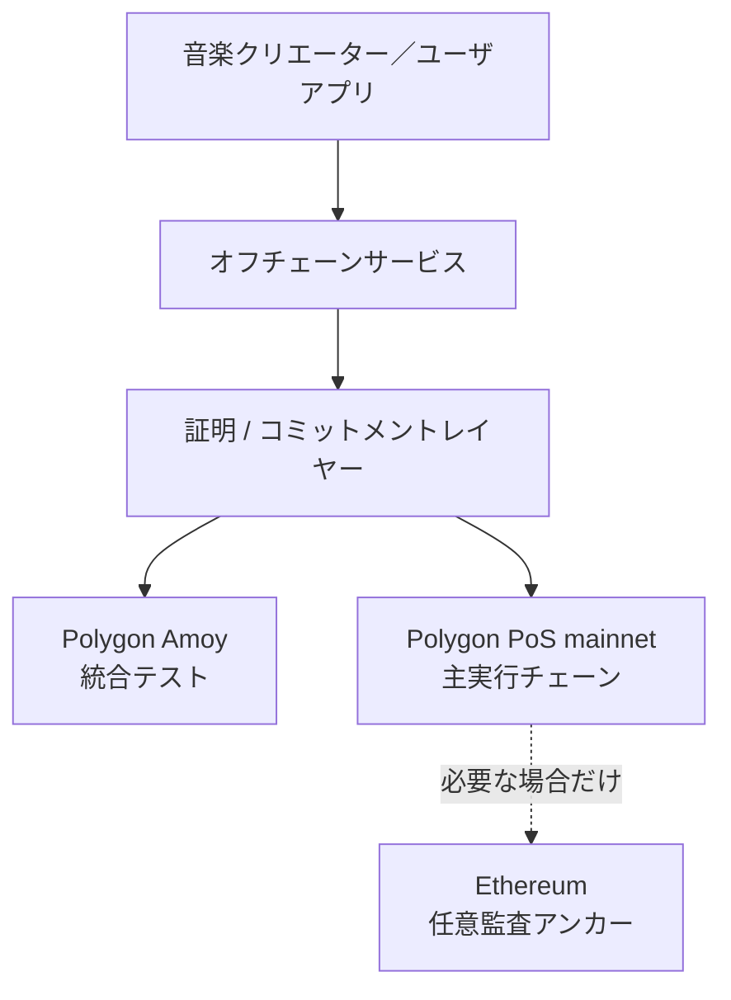
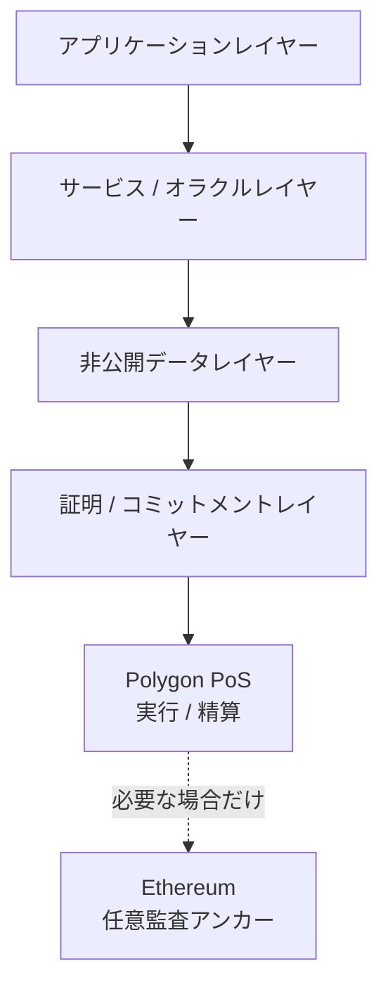
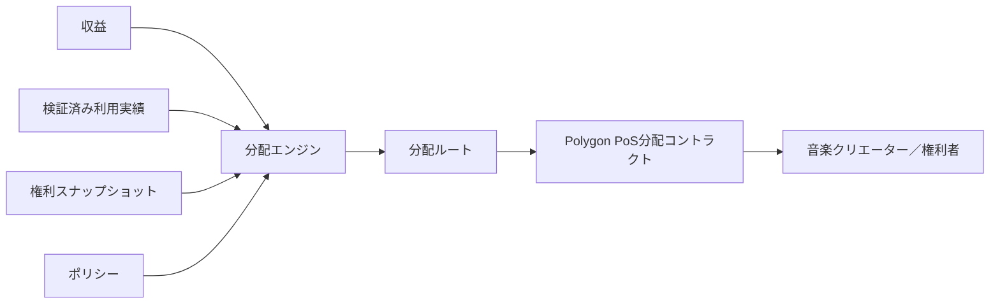

# ADR-0007: ブロックチェーン / L2 戦略

**状態:** 提案
**日付:** 2026-07-29
**最終更新日:** 2026-08-26

## 1. 背景

Creator First Platform は、音楽クリエーター／ユーザを中心とするガバナンス、権利登録台帳、利用実績オラクル、音楽クリエーター分配、ゼロ知識証明を組み合わせたコンテンツ配信プロトコルを構築する。

これまでのADRでは、

- ADR-0002 検証可能抽選
- ADR-0003 権利登録台帳
- ADR-0004 音楽クリエーター分配モデル
- ADR-0005 利用実績オラクル
- ADR-0006 ゼロ知識証明戦略

を定義した。

これらを実装するには、少なくとも次のブロックチェーン機能が必要となる。

- ステーブルコインによる決済
- 音楽クリエーター／権利者への分配
- 分配コミットメントの記録
- ガバナンス結果の確定
- 権利状態コミットメントのアンカー
- ZK 証明の検証
- プロトコルコントラクトの実行
- 監査可能な履歴

一方、音楽配信プラットフォームでは大量の再生イベントが発生するため、すべてをブロックチェーン上で処理することは現実的ではない。

また、特定ブロックチェーンや特定実行環境へプロトコル全体を強く依存させると、

- トランザクションコスト
- ネットワーク Congestion
- 合意・Validator・実行レイヤー Failure
- ブリッジリスク
- チェーンガバナンスリスク
- ステーブルコイン可用性
- Vendor Lock-in

等がプラットフォーム全体のリスクとなる。

したがってCreator First Platformは、ブロックチェーンを「すべての処理を行うデータベース」としてではなく、

> **精算、コミットメント、検証、ガバナンス実行のためのTrust-Minimized インフラ**

として位置付ける。

---

## 2. 決定

Creator First Platform は、**本番の主実行チェーンにPolygon PoS mainnet（チェーンID `137`）、本番リハーサルと新規統合テストにPolygon Amoy（チェーンID `80002`）を使用する**。ガス資産は両環境ともPOLとし、ユーザ向けにはリレイヤーまたはペイマスターで抽象化する。

Polygon PoSはEVM互換のPoSサイドチェーンであり、Ethereumのrollup型L2ではない。Heimdall-v2のMilestoneによるPolygon内の確定と、Ethereumへ提出されるCheckpointを区別する。Ethereumへの追加アンカーは、高価値かつ低頻度の監査コミットメントについて必要性が認められる場合だけ採用する。

プロトコル CoreをPolygon固有API、ブリッジまたは単一RPC事業者へ固定しない。



本決定は本番開始の無条件な承認ではない。公式JPYC商品・コントラクト、RPC、ファイナリティ、ガス支援、鍵管理、監査、法務・会計および障害手順を本番移行ゲートで再確認する。

---

## 3. ブロックチェーンの役割

ブロックチェーンレイヤーの責務を限定する。

ブロックチェーンは主として、

- 精算
- 資産転送
- 分配実行
- プロトコル Parameter コミットメント
- ガバナンス結果原盤
- 権利コミットメントアンカー記録
- 証明検証
- 監査 Trail

を担当する。

ブロックチェーンは原則として、

- 生の再生イベント
- ユーザ閲覧履歴
- 個人情報
- コントラクト Documents
- 音声 Files
- Large 権利メタデータ

を保存しない。

---

## 4. レイヤー構成

Creator First Platformは概念的に次のレイヤーを持つ。



各レイヤーの責務を分離し、アプリケーション業務ロジックをブロックチェーンへ過剰に移さない。

---

## 5. Polygon PoSを採用する理由

Creator First Platformでは、

- サブスクリプション精算
- 音楽クリエーター分配
- Rights-related 状態更新
- ガバナンス実行
- 証明検証

等のブロックチェーントランザクションが発生する。

Ethereum L1だけでこれらを処理すると、トランザクションコストやThroughputがユーザ体験と分配効率へ影響する可能性がある。Polygon PoSは低コストのEVM実行環境、短時間のMilestone確定、Polygon上で公式提供されるJPYC候補および既存のウォレット・監査Toolingを組み合わせやすい。

そのため通常のプロトコル実行とJPYC等による精算はPolygon PoS内で完結させ、ユーザへブリッジ操作を要求しない。EthereumはPolygon PoSの親チェーンおよび任意の監査アンカーとして位置付け、各ユーザ操作をEthereumへ複製しない。

---

## 6. Ethereum互換性

主実行チェーンはEthereum-compatibleであることを重視する。

理由は、

- Solidity ecosystem
- スマートコントラクト tooling
- ウォレット ecosystem
- ステーブルコイン integration
- セキュリティ tooling
- 監査 ecosystem
- 開発者 availability

を利用できるためである。

ただしEVM Compatibilityを目的そのものとはせず、セキュリティやプロトコル要件が優先される。

---

## 7. チェーン選定評価

Polygon PoSの採用と継続利用を少なくとも次の基準で評価する。

| Criterion | Description |
|---|---|
| セキュリティ | Validator、Heimdall-v2、Bor、Checkpoint、アップグレードリスク |
| コスト | ユーザ支払、distribution、proof verification cost |
| ファイナリティ | 精算確定までの時間 |
| 可用性 | ネットワーク、Validator、RPC availability |
| データ可用性 | トランザクション dataの検証可能性 |
| ZK 支援 | ZKP verifierおよびproof infrastructureとの適合性 |
| EVM Compatibility | Solidity / toolingとの互換性 |
| ステーブルコイン支援 | JPYC等の利用可能性 |
| ブリッジセキュリティ | Polygon / Ethereum間資産移動を行う場合のリスク |
| 分散化 | Validator集合、運用主体への依存度 |
| ガバナンス | プロトコル upgrade governance |
| Exit Path | 障害時の資産・状態復旧とチェーン移行可能性 |
| 開発者エコシステム | SDK、RPC、indexer、monitoring |
| Longevity | 長期運用可能性 |

これらの条件が本番開始前または運用中に満たされない場合は、ガバナンスと法人承認を経て停止、縮退または移行を判断する。

---

## 8. No チェーン固有業務ロジック

音楽クリエーター分配、権利モデル、利用実績検証等のプロトコルルールを特定チェーン固有機能に直接依存させない。

例えば、

```text
分配ポリシー
      ↓
Chain-independent 仕様
      ↓
スマートコントラクト実装
      ↓
Polygon PoS実装
```

とする。

チェーン変更時にもプロトコル仕様の意味が維持されることを目標とする。

---

## 9. ステーブルコイン精算

サブスクリプションおよび音楽クリエーター分配には、法的・技術的要件を満たすJPYC等のステーブルコインを使用する。ETH等のネイティブトークンはガスまたはネットワーク手数料の精算にだけ使用し、サブスクリプション価格または音楽クリエーター分配資産として暗黙に採用しない。

JPYCは重要な候補であるが、プロトコル Coreを特定ステーブルコインコントラクトアドレスへ固定しない。

概念的には、

```text
承認済み精算資産
├── JPYC
└── その他 Governance-approved ステーブルコイン
```

とする。

精算資産登録台帳を設け、

- チェーン
- コントラクトアドレス
- トークン標準
- Decimals
- 状態
- 有効化期間
- Allowed 運用 Type

等を版管理する。

テストネットでは、金銭的価値、償還請求権または実在JPYCとの交換可能性を持たない`MockJPYC`だけをデモサブスクリプションの精算資産として承認する。Mainnet JPYCとテストトークンは異なる資産 ID、コントラクトアドレス、ネットワークおよび表示を持たなければならない。

本番候補は、Polygon PoS（チェーンID `137`）上でJPYC発行者が公式に公表し、法務・技術・セキュリティ審査を通過した資金移動業型JPYCとする。本ADR更新時に公表されているコントラクトアドレスは`0xE7C3D8C9a439feDe00D2600032D5dB0Be71C3c29`であるが、名称だけで信頼せず、本番登録時に発行者の公式情報、チェーンID、Bytecode、プロキシ実装、Decimals、停止・凍結・アップグレード権限および利用条件を再確認する。JPYC Prepaidその他の同名・旧商品と混同しない。

新規の本番リハーサルはPolygon Amoy（チェーンID `80002`）で行い、Amoy POLはガスだけ、`MockJPYC`は無価値・償還不可の試験資産だけとして使用する。Amoy上のモックコントラクトまたはテスト資産をPolygon PoS mainnetのJPYCとして表示・移行しない。

最初のスマートコントラクト開発プロフィールには、Hardhat 3、Viem、Infura RPCおよびEthereum Sepolia（チェーンID `11155111`）を使用した。これは過去のEVM互換性とコントラクト境界を検証した旧環境であり、現在の公開テストネットではない。SepoliaではETHをガスにだけ使用し、サブスクリプションと資金庫のテスト資産には無価値・償還不可の`MockJPYC`だけを使用した。

2026-08-26に、`MockJPYC`、サブスクリプション、テスト資金庫、一般／初期サポーター SBT、ERC-1967／UUPS プロキシ、音楽クリエーター登録台帳、二院制ガバナー、登録アダプター、CFP-0002デプロイファクトリーおよび透明型ZKモック境界を、ソースコミット`16b33334e6457337054c66824620d64cbed4f473`からPolygon Amoyへ新規デプロイした。公開RPCでBytecode、コントラクト接続、計画、プロキシ実装先、役割付与、公開デモ会期およびテスト専用通知を検証済みである。Polygonscanソース検証、役割分離、インデクサー／ゲートウェイ接続、脅威モデルおよび独立監査は未完了である。

旧Ethereum Sepoliaデプロイは履歴参照に限定し、現在の公開デモ、Polygon本番系のステージング環境または正本として使用しない。Polygon Amoyでは新しいRPC、デプロイID、コントラクトアドレス、資産ID、マニフェスト、インデクサー開始点および監視を用い、Sepoliaの状態・権限・テスト資産を移植しない。

---

## 10. 資産抽象化

分配エンジンは原則として、

```text
Amount + 資産 Identifier
```

を扱う。

これにより、将来精算資産が追加・変更された場合でも音楽クリエーター分配 Logic自体を変更しない構造を目指す。

ただし異なるステーブルコイン間の価値同等性をプロトコルが自動的に仮定してはならない。

---

## 11. スマートコントラクト範囲

スマートコントラクトは主として、

- サブスクリプション精算
- 分配 Escrow
- 音楽クリエーター／権利者決済
- Governance-approved Parameter 有効化
- コミットメント登録台帳
- 証明検証
- 資金庫制御

等を担当する。

スマートコントラクト自身が、

- 生の利用実績検証
- 著作権法務 Judgment
- アイデンティティ検証
- 不正 AI Inference

を直接実行することを前提としない。

---

## 12. 権利登録台帳アンカー記録

ADR-0003 権利登録台帳の詳細情報はオフチェーンで管理する。

ブロックチェーンには必要に応じて、

```text
権利スナップショット
      ↓
コミットメント / ルート
      ↓
Polygon PoSアンカー
```

を記録する。

これにより、権利データそのものを公開せず、特定時点の権利状態が事後改ざんされていないことを検証できる。

---

## 13. 利用実績オラクル連携

ADR-0005 利用実績オラクルは生の再生イベントをオフチェーンで処理する。

Polygon PoSへは、

- 利用実績スナップショット Identifier
- コミットメント
- Aggregate
- 証明
- 検証状態

等の必要情報のみを提供する。


---

## 14. ZK 証明連携

ADR-0006に従い、Polygon PoSはZK 証明検証の実行レイヤーとして利用できる。

ただし、証明検証コストが高い場合は、

```text
Large 証明
    ↓
オフチェーン検証 / Recursion
    ↓
Compact 証明
    ↓
Polygon PoS検証
```

等の方式を許容する。

証明システムとPolygon固有機能を過度に結合しない。

---

## 15. 分配精算

ADR-0004 音楽クリエーター分配モデルによる分配結果をPolygon PoS上で精算する。

概念的には、



大量のRecipientへ一度に送金することが非効率な場合、申請方式分配やMerkle 分配等を検討する。

---

## 16. 申請方式分配

多数の音楽クリエーター／権利者への分配では、

```text
分配結果
       ↓
マークルルート
       ↓
分配コントラクト
       ↓
Recipient 主張 + 証明
       ↓
決済
```

のような方式を利用できる。

これによりプラットフォーム側が全Recipientへの個別トランザクションを送信する必要を減らせる。

ただし、ユーザ体験や未請求残高の扱いは分配仕様で定義する。

---

## 17. Ethereumへの任意アンカー記録

重要なプロトコル状態について、必要に応じてEthereum L1へアンカーする。

候補には、

- ガバナンス Checkpoint
- 分配ルート
- 権利登録台帳ルート
- プロトコル版
- 重大アップグレードコミットメント

等がある。

Polygon PoSはCheckpointをEthereumへ提出するが、それだけでCFP固有の意味や長期証拠保存が自動的に成立するわけではない。一方、すべてのPolygon状態をCFPがEthereumへ再記録する必要もない。追加アンカーは、対象、頻度、検証手順、費用および復旧上の効果を示せる場合だけガバナンスで承認する。

---

## 18. Polygon PoSの合意・運用リスク

Polygon PoSではValidator、Heimdall-v2、Bor、Milestone、CheckpointおよびRPCの障害またはCensorship リスクを考慮する。

継続評価では、

- Validator集合と集中度
- MilestoneとCheckpointの進行
- Bor / Heimdall-v2の更新・障害履歴
- Polygon / Ethereum間の資産回収経路
- downtime history
- プロトコル・ガバナンス変更

等を評価する。

チェーンまたは主要RPCの停止によって音楽クリエーターの確定済み資産や分配債務が復旧不能になる設計を許容しない。

---

## 19. ブリッジリスク

Polygon / Ethereumおよび異なるチェーン間のブリッジは重大なセキュリティ境界である。

Creator First Platformは不要なCross-chain 転送を最小化する。

```text
Preferred:
ユーザ → Polygon PoS → 音楽クリエーター

Avoid where unnecessary:
ユーザ → チェーン A → ブリッジ → チェーン B → ブリッジ → チェーン C
```

ネイティブ / 正規ブリッジを優先的に評価し、第三者ブリッジへの依存をプロトコル Coreへ組み込まない。

---

## 20. マルチチェーン戦略

初期段階ではPolygon PoSを単一の本番主実行チェーンとする。

最初から複数チェーンへ同一プロトコル状態を展開すると、

- 状態 Synchronization
- Double Spending
- ガバナンス Consistency
- 権利スナップショット Consistency
- Liquidity Fragmentation
- 運用事項 Complexity

が増大するためである。

```text
MVP
Single Polygon PoS mainnet

        ↓

Mature プロトコル
任意マルチチェーンアクセス
```

マルチチェーン化が必要になった場合は別ADRで決定する。

---

## 21. 正規プロトコル状態

マルチチェーン展開を将来行う場合でも、正規プロトコル状態を明確にする。

例えば、

```text
正規ガバナンス状態
正規権利コミットメント
正規分配期間
正規プロトコル版
```

が複数チェーン上で競合して存在する状態を避ける。

正規状態の所在は将来のCross-chain ADRで定義する。

---

## 22. アップグレード可能性

スマートコントラクトアップグレードは必要最小限にする。

アップグレード可能なコントラクトを利用する場合、

- アップグレード Authority
- ガバナンス Approval
- タイムロック
- 緊急 Procedure
- 版
- Migration 計画

を明示する。

```text
ガバナンス決定
      ↓
タイムロック
      ↓
アップグレード
      ↓
公開検証
```

プラットフォーム運営者の単独鍵だけで音楽クリエーター分配 Logicを変更できる構造を最終形としない。

---

## 23. 緊急制御

重大なスマートコントラクト Vulnerability等に備えて緊急停止を設けることができる。

ただし緊急権限は、

- 範囲
- Duration
- Trigger Condition
- 必要 Signatures
- 監査 Log
- ガバナンスレビュー

を明示する。

緊急停止を資金没収やガバナンス回避の手段として使用できない設計とする。

---

## 24. 鍵管理

資金庫、アップグレード、緊急等の重要権限を単一の個人鍵へ依存させない。

段階的に、

```text
MVP
マルチシグ

↓

ガバナンス + タイムロック

↓

Protocol-controlled 実行
```

へ移行する。

Hardware-backed 鍵管理や運用事項セキュリティを別セキュリティ仕様で定義する。

---

## 25. データ可用性

Polygon PoSの利用ではデータ可用性を重要なセキュリティ要件として評価する。

Creator First Platformが検証に必要なプロトコルデータを、特定運用者だけが保持する構造を避ける。

特に、

- 分配コミットメント
- ガバナンストランザクション
- 権利アンカー
- 証明検証結果

について、長期監査可能性を確保する。

---

## 26. ファイナリティ

音楽クリエーター分配やガバナンス実行では、トランザクション Inclusionと経済ファイナリティを区別する。

アプリケーションは、

```text
Submitted
Included
Confirmed
確定済み
```

等の状態を扱えるようにする。

音楽クリエーターへ「確定済み」と表示した支払いが通常のチェーン Reorganization等で容易に消失することを避ける。

---

## 27. チェーン障害

Polygon PoSが長期間利用不能または採用基準を満たさなくなった場合のMigration Pathを設計する。

少なくとも、

- 資産復旧
- 権利スナップショット復旧
- 分配状態復旧
- ガバナンス状態復旧
- プロトコル版復旧

を可能にする。

オフチェーンデータとブロックチェーン状態を組み合わせてプロトコルを再構築できるよう、スナップショットとコミットメントを保持する。

---

## 28. 可観測性

ブロックチェーンインフラについて、

- RPC availability
- transaction latency
- transaction failure
- gas / fee level
- Milestone / Checkpoint進行
- Validator / Bor / Heimdall-v2の状態
- contract events
- proof verification failure
- bridge status

等を監視する。

ブロックチェーンが動いていることだけでプラットフォームが正常とは判断しない。

---

## 29. コスト戦略

ブロックチェーンコストは音楽クリエーター分配を圧迫しないよう管理する。

主なコスト Driverは、

- 精算 Transactions
- 証明検証
- コントラクトストレージ
- 分配 Claims
- Checkpoint・任意Ethereumアンカーコスト
- ブリッジコスト

である。

大量の再生イベントをオンチェーン化せず、集約、コミットメント、Batchingを利用する。

```text
Millions of 再生イベント
          ↓
オフチェーン集約
          ↓
One / Few Commitments
          ↓
Polygon PoS
```

を基本方針とする。

---

## 30. ユーザ体験

一般ユーザが、

- ガストークンの取得
- ネットワーク Switching
- ブリッジ操作
- Nonce管理

等を意識しなくてもプラットフォームを利用できることを目標とする。

アカウント抽象化、リレイヤー、ペイマスター、ガス代支援、Bundling等を利用できる。ユーザが確認する支払額はJPYC等の承認済み精算資産で固定し、Sponsorが支払うネイティブ手数料をサブスクリプション決済として記録しない。具体方式とSponsorship ポリシーはADR-0008および各デプロイポリシーで決定する。

ブロックチェーンはユーザ体験を複雑化する目的で導入しない。

---

## 31. 音楽クリエーター体験

音楽クリエーターもブロックチェーンの専門知識を前提としない。

音楽クリエーターは、

```text
登録簿
アップロード / Manage 権利
Receive 分配
Withdraw / Use 資金
```

というサービスフローを利用できるようにする。

ウォレット管理や精算資産の選択は、セキュリティとSelf-custodyの選択肢を維持しつつ簡素化する。

---

## 32. ガバナンス関係

ブロックチェーンはガバナンスの正統性を生成するものではない。

ADR-0001およびADR-0002で決定されたガバナンス手続の結果を、

- 記録
- 検証
- 実行

するインフラとして利用する。

```text
音楽クリエーター／ユーザ
      ↓
抽選 + 熟議
      ↓
プロトコル決定
      ↓
ブロックチェーン実行
```

とする。

`Token Holder Vote = Governance` とはしない。

---

## 33. インフラ中立性

Creator First Platformの理念は特定ブロックチェーンプロジェクトの成功に依存させない。

Polygon PoS / Amoy戦略は現時点で最も適切と判断する技術アーキテクチャであり、プロトコル原則そのものではない。

将来、

- セキュリティ
- 規制
- コスト
- Technology
- エコシステム

が大きく変化した場合、ガバナンス手続を経てMigrationできる。

---

## 34. MVP 戦略

MVPでは複雑なマルチチェーンアーキテクチャを構築しない。

段階的に、

```text
フェーズ 1
ローカル開発チェーン

フェーズ 2
旧Ethereum Sepoliaデモの履歴保全

フェーズ 3
Polygon Amoyで公開テストと本番リハーサル

フェーズ 4
Polygon PoSで段階的本番精算

フェーズ 5
任意 L1 アンカー記録 / Advanced ZK 検証

フェーズ 6
マルチチェーン only if justified
```

と進める。

まずサブスクリプション → 利用実績 → 分配 → 精算のエンドツーエンドフローを一つの実行環境で成立させる。

---

## 35. 不変条件

### 不変条件 1

生の再生履歴を公開ブロックチェーンへ保存してはならない。

### 不変条件 2

個人情報や非公開コントラクトを公開ブロックチェーンへ保存してはならない。

### 不変条件 3

音楽クリエーター分配ポリシーをPolygon固有仕様だけで定義してはならない。

### 不変条件 4

Polygon PoS障害によって確定済みプロトコル状態を復旧不能にしてはならない。

### 不変条件 5

ブリッジを不要にプロトコル Coreへ組み込んではならない。

### 不変条件 6

プラットフォーム運営者の単独鍵だけで重要な分配 Logicを恒久的に変更できてはならない。

### 不変条件 7

ガバナンスの正統性をトークン保有量だけで決定してはならない。

### 不変条件 8

ブロックチェーントランザクションコストを理由として生の利用実績検証の正確性を犠牲にしてはならない。

### 不変条件 9

チェーン Migration時にも過去の分配、権利コミットメント、ガバナンス結果を検証可能にしなければならない。

---

## 36. 検討した代替案

### Ethereum L1のみ

セキュリティとエコシステムは強いが、プラットフォームの日常的な実行レイヤーとしてコストと拡張性の制約が大きくなる可能性があるため基本方式として採用しない。

### Ethereum rollup型L2

低コストとEthereum由来のセキュリティ特性は有力だが、現時点では本番利用する公式JPYC、ガス支援、ブリッジ不要の一体UXをPolygon PoSほど直接構成しにくいため初期本番の主実行環境には採用しない。公式JPYC対応や運用条件が変化した場合は再評価する。

### 完全オフチェーン型プラットフォーム

コストとUXは単純化できるが、精算、ガバナンス実行、分配監査の信頼最小化を実現しにくいため採用しない。

### 独自ブロックチェーン

プロトコルに最適化できるが、Validator ネットワーク、セキュリティ、ブリッジ、ウォレット、開発者エコシステムを独自構築する必要があり、初期段階では採用しない。

### 開始時からのマルチチェーン

可用性やユーザ到達範囲を拡大できる可能性があるが、状態 Consistency、ブリッジリスク、運用事項 Complexityが大きいため採用しない。

### すべてをオンチェーンへ保存

最大限の公開性は得られるが、プライバシー、コスト、拡張性、法務要件に適合しないため採用しない。

---

## 37. 影響

### 利点

- Ethereum互換のウォレット、Solidity、監査Toolingを活用できる
- L1のみよりコストを抑えやすい
- Polygon上で公式提供されるJPYC候補を同一チェーンで扱える
- ステーブルコイン精算とスマートコントラクト分配を統合しやすい
- ZKP 検証との接続が可能
- 生の利用実績をオフチェーンに維持できる
- プロトコルをPolygon固有APIから一定程度分離できる
- 将来のチェーン Migration余地を残せる

### 欠点

- Polygon PoS固有のValidator、Bor、Heimdall-v2、MilestoneおよびCheckpointを理解する必要がある
- Polygon PoSはEthereum rollup型L2ではなく、異なる信頼・データ可用性モデルを持つ
- ブリッジリスクを管理する必要がある
- Polygon内のMilestone確定とEthereum Checkpoint・ブリッジ確定の違いを扱う必要がある
- スマートコントラクトアップグレードセキュリティが必要になる
- チェーン Migration 戦略が必要になる
- インフラ監視が複雑になる

---

## 38. セキュリティ上の考慮事項

Polygon PoSを含むブロックチェーンレイヤーは少なくとも次のリスクを考慮する。

- スマートコントラクト Vulnerability
- アップグレード鍵 Compromise
- 資金庫鍵 Compromise
- Validator / Bor / Heimdall-v2 Failure
- Validator Censorshipまたは集中
- Milestone / Checkpoint停止
- データ可用性 Failure
- ブリッジ Exploit
- RPC 操作
- チェーン Reorganization
- ステーブルコインコントラクトリスク
- ガバナンス実行攻撃
- 証明検証者 Vulnerability
- Cross-chain Replay
- Migration Failure

具体的な脅威モデルはセキュリティ仕様で定義する。

---

## 39. 他のADRとの関係

ADR-0003 権利登録台帳は権利状態のコミットメントをブロックチェーンへアンカーできる。

ADR-0004 音楽クリエーター分配モデルは分配結果をPolygon PoSで精算する。

ADR-0005 利用実績オラクルは検証済み利用実績スナップショット / 証明をPolygon PoSへ提供する。

ADR-0006 ゼロ知識証明戦略は証明検証レイヤーを提供する。

ADR-0007はこれらを実行・決済・アンカーするブロックチェーン / L2 インフラ戦略を定義する。

```text
権利登録台帳 ──────────┐
利用実績オラクル ─────────────┤
分配モデル ───────┼──> Polygon PoS
ZK 証明戦略 ────────┘
                                ↓
                         精算 / アンカー
                                ↓
                     任意Ethereumアンカー
```

---

## 40. 関連文書

- ホワイトペーパー: ビジョン
- ホワイトペーパー: 権利・資金
- ホワイトペーパー: プラットフォームアーキテクチャ
- ホワイトペーパー: 経済モデル
- ホワイトペーパー: ガバナンス
- ホワイトペーパー: Technology
- ホワイトペーパー: セキュリティ
- ホワイトペーパー: インフラ / コスト
- ADR-0003: 権利登録台帳
- ADR-0004: 音楽クリエーター分配モデル
- ADR-0005: 利用実績オラクル
- ADR-0006: ゼロ知識証明戦略
- [Polygon PoS Overview](https://docs.polygon.technology/pos/overview)
- [Polygon PoS RPC endpoints](https://docs.polygon.technology/pos/reference/rpc-endpoints)
- [JPYC公式コントラクト情報](https://github.com/jpycoin)

---

## 41. 後続仕様

本ADRの採択後、少なくとも次の仕様を作成する。

- `protocol/blockchain-interface-spec.md`
- `protocol/settlement-spec.md`
- `protocol/contract-upgrade-spec.md`
- `protocol/chain-state-spec.md`
- `protocol/asset-registry-spec.md`

Polygon PoSの継続利用を、

- セキュリティ
- コスト
- ファイナリティ
- ZK Compatibility
- JPYC / ステーブルコイン支援
- ブリッジリスク
- 開発者 Tooling
- 分散化

の観点から本番デプロイ前と運用中に再評価する。
