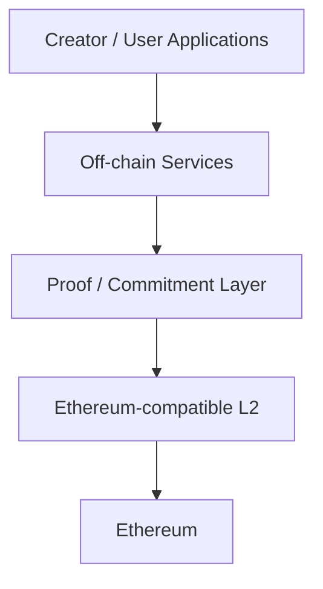
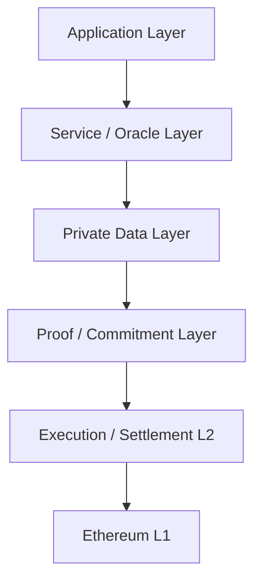
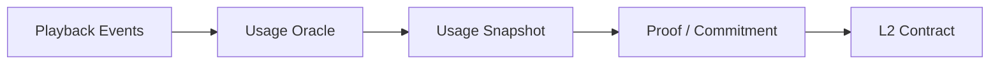
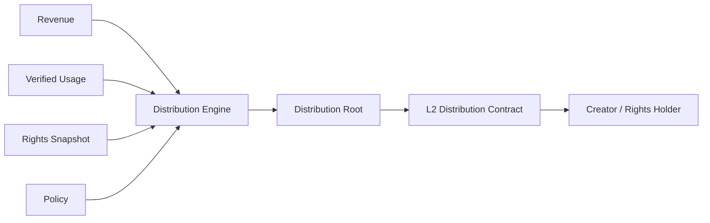

# ADR-0007: Blockchain / L2 Strategy

**Status:** Proposed  
**Date:** 2026-07-29
**Last Updated:** 2026-08-23

## 1. Context

Creator First Platform は、Creator / Userを中心とするGovernance、Rights Registry、Usage Oracle、Creator Distribution、Zero-Knowledge Proofを組み合わせたコンテンツ配信Protocolを構築する。

これまでのADRでは、

- ADR-0002 Verifiable Sortition
- ADR-0003 Rights Registry
- ADR-0004 Creator Distribution Model
- ADR-0005 Usage Oracle
- ADR-0006 Zero-Knowledge Proof Strategy

を定義した。

これらを実装するには、少なくとも次のBlockchain機能が必要となる。

- Stablecoinによる決済
- Creator / Rights Holderへの分配
- Distribution Commitmentの記録
- Governance Resultの確定
- Rights State CommitmentのAnchor
- ZK Proofの検証
- Protocol Contractの実行
- 監査可能な履歴

一方、音楽配信Platformでは大量のPlayback Eventが発生するため、すべてをBlockchain上で処理することは現実的ではない。

また、特定Blockchainや特定L2へProtocol全体を強く依存させると、

- Transaction Cost
- Network Congestion
- Sequencer Failure
- Bridge Risk
- Chain Governance Risk
- Stablecoin Availability
- Vendor Lock-in

等がPlatform全体のRiskとなる。

したがってCreator First Platformは、Blockchainを「すべての処理を行うDatabase」としてではなく、

> **Settlement、Commitment、Verification、Governance ExecutionのためのTrust-Minimized Infrastructure**

として位置付ける。

---

## 2. Decision

Creator First Platform は、**Ethereum-compatible L2をPrimary Execution Layerとし、EthereumをSettlement / Security Anchorとして利用可能な構造**を基本戦略とする。

ただし、Protocol Coreを単一のL2固有機能へ固定しない。



Primary L2は、実装・運用時点のSecurity、Cost、ZK Compatibility、Stablecoin Support、Developer Ecosystem等を評価して別ADRで決定する。

---

## 3. Role of Blockchain

Blockchain Layerの責務を限定する。

Blockchainは主として、

- Settlement
- Asset Transfer
- Distribution Execution
- Protocol Parameter Commitment
- Governance Result Recording
- Rights Commitment Anchoring
- Proof Verification
- Audit Trail

を担当する。

Blockchainは原則として、

- Raw Playback Events
- User Viewing History
- Personal Information
- Contract Documents
- Audio Files
- Large Rights Metadata

を保存しない。

---

## 4. Layered Architecture

Creator First Platformは概念的に次のLayerを持つ。



各Layerの責務を分離し、Application Business LogicをBlockchainへ過剰に移さない。

---

## 5. Why L2

Creator First Platformでは、

- Subscription Settlement
- Creator Distribution
- Rights-related State Update
- Governance Execution
- Proof Verification

等のBlockchain Transactionが発生する。

Ethereum L1だけでこれらを処理すると、Transaction CostやThroughputがUser ExperienceとDistribution Efficiencyへ影響する可能性がある。

そのため通常のProtocol ExecutionはL2で行い、L1はSecurity / Settlement Anchorとして利用する。

---

## 6. Ethereum Compatibility

Primary L2は原則としてEthereum-compatibleであることを重視する。

理由は、

- Solidity ecosystem
- Smart Contract tooling
- Wallet ecosystem
- Stablecoin integration
- Security tooling
- Audit ecosystem
- Developer availability

を利用できるためである。

ただしEVM Compatibilityを目的そのものとはせず、SecurityやProtocol Requirementsが優先される。

---

## 7. L2 Selection Criteria

Primary L2は少なくとも次の基準で評価する。

| Criterion | Description |
|---|---|
| Security | L1依存関係、Proof System、Upgrade Risk |
| Cost | User payment、distribution、proof verification cost |
| Finality | Settlement確定までの時間 |
| Availability | Network / Sequencer availability |
| Data Availability | Transaction dataの検証可能性 |
| ZK Support | ZKP verifierおよびproof infrastructureとの適合性 |
| EVM Compatibility | Solidity / toolingとの互換性 |
| Stablecoin Support | JPYC等の利用可能性 |
| Bridge Security | L1 / L2間Asset移動Risk |
| Decentralization | Sequencer / operator依存度 |
| Governance | Protocol upgrade governance |
| Exit Path | L2障害時の資産回収可能性 |
| Developer Ecosystem | SDK、RPC、indexer、monitoring |
| Longevity | 長期運用可能性 |

選択理由は独立したADRに記録する。

---

## 8. No Chain-specific Business Logic

Creator Distribution、Rights Model、Usage Verification等のProtocol Ruleを特定Chain固有機能に直接依存させない。

例えば、

```text
Distribution Policy
      ↓
Chain-independent Specification
      ↓
Smart Contract Implementation
      ↓
Selected L2
```

とする。

Chain変更時にもProtocol Specificationの意味が維持されることを目標とする。

---

## 9. Stablecoin Settlement

SubscriptionおよびCreator Distributionには、法的・技術的要件を満たすJPYC等のStablecoinを使用する。ETH等のネイティブトークンはGasまたはNetwork Feeの精算にだけ使用し、Subscription PriceまたはCreator Distribution Assetとして暗黙に採用しない。

JPYCは重要な候補であるが、Protocol Coreを特定Stablecoin Contract Addressへ固定しない。

概念的には、

```text
Approved Settlement Asset
├── JPYC
└── Other Governance-approved Stablecoin
```

とする。

Settlement Asset Registryを設け、

- Chain
- Contract Address
- Token Standard
- Decimals
- Status
- Activation Period
- Allowed Operation Type

等をVersion管理する。

Testnetでは、金銭的価値、償還請求権または実在JPYCとの交換可能性を持たない`MockJPYC`だけをDemo SubscriptionのSettlement Assetとして承認する。Mainnet JPYCとTest Tokenは異なるAsset ID、Contract Address、Networkおよび表示を持たなければならない。

最初のSmart Contract開発Profileは、Hardhat 3、Viem、Infura RPCおよびEthereum Sepolia（Chain ID `11155111`）とする。これはTestnet ToolingとEVM上のContract境界を検証する選択であり、本番ChainまたはPrimary L2の決定ではない。SepoliaではETHをGasにだけ使用し、SubscriptionとTreasuryのTest Assetには無価値・償還不可の`MockJPYC`だけを使用する。

2026-08-23時点で、`MockJPYC`、Subscription、Test Treasury、一般／Early Supporter SBT、ERC-1967／UUPS Proxy、Creator RegistryおよびIgnition ModuleをRepositoryへ実装し、公開構成Source Commit `9e46420ebf68a0dbe4175b43e6501a5ee0ca34a7`をEthereum Sepoliaへデプロイした。公開RPCでBytecode、Contract接続、Plan、Proxy実装先およびCreator Registry Noticeを検証済みである。Etherscan Source Verification、Role分離、Indexer／Gateway接続、Threat Modelおよび独立監査は未完了である。

---

## 10. Asset Abstraction

Distribution Engineは原則として、

```text
Amount + Asset Identifier
```

を扱う。

これにより、将来Settlement Assetが追加・変更された場合でもCreator Distribution Logic自体を変更しない構造を目指す。

ただし異なるStablecoin間の価値同等性をProtocolが自動的に仮定してはならない。

---

## 11. Smart Contract Scope

Smart Contractは主として、

- Subscription Settlement
- Distribution Escrow
- Creator / Rights Holder Payment
- Governance-approved Parameter Activation
- Commitment Registry
- Proof Verification
- Treasury Control

等を担当する。

Smart Contract自身が、

- Raw Usage Validation
- Copyright Legal Judgment
- Identity Verification
- Fraud AI Inference

を直接実行することを前提としない。

---

## 12. Rights Registry Anchoring

ADR-0003 Rights Registryの詳細情報はOff-chainで管理する。

Blockchainには必要に応じて、

```text
Rights Snapshot
      ↓
Commitment / Root
      ↓
L2 Anchor
```

を記録する。

これにより、Rights Dataそのものを公開せず、特定時点のRights Stateが事後改ざんされていないことを検証できる。

---

## 13. Usage Oracle Integration

ADR-0005 Usage OracleはRaw Playback EventをOff-chainで処理する。

L2へは、

- Usage Snapshot Identifier
- Commitment
- Aggregate
- Proof
- Verification Status

等の必要情報のみを提供する。



---

## 14. ZK Proof Integration

ADR-0006に従い、L2はZK Proof VerificationのExecution Layerとして利用できる。

ただし、Proof Verification Costが高い場合は、

```text
Large Proof
    ↓
Off-chain Verification / Recursion
    ↓
Compact Proof
    ↓
L2 Verification
```

等の方式を許容する。

Proof SystemとL2の選択を過度に結合しない。

---

## 15. Distribution Settlement

ADR-0004 Creator Distribution ModelによるDistribution ResultをL2上でSettlementする。

概念的には、



大量のRecipientへ一度に送金することが非効率な場合、Claim-based DistributionやMerkle Distribution等を検討する。

---

## 16. Claim-based Distribution

多数のCreator / Rights Holderへの分配では、

```text
Distribution Result
       ↓
Merkle Root
       ↓
Distribution Contract
       ↓
Recipient Claim + Proof
       ↓
Payment
```

のような方式を利用できる。

これによりPlatform側が全Recipientへの個別Transactionを送信する必要を減らせる。

ただし、User Experienceや未請求残高の扱いはDistribution Specificationで定義する。

---

## 17. L1 Anchoring

重要なProtocol Stateについて、必要に応じてEthereum L1へAnchorする。

候補には、

- Governance Checkpoint
- Distribution Root
- Rights Registry Root
- Protocol Version
- Critical Upgrade Commitment

等がある。

すべてのL2 Stateを独自にL1へ再記録する必要はなく、利用するL2のSecurity Modelを踏まえて必要性を判断する。

---

## 18. Sequencer Risk

L2ではSequencer障害またはCensorship Riskを考慮する。

Primary L2選択時には、

- Sequencer architecture
- forced inclusion
- escape hatch
- L1 withdrawal
- downtime history
- decentralization roadmap

等を評価する。

Sequencer停止によってCreatorの確定済み資産が永久に失われる設計を許容しない。

---

## 19. Bridge Risk

L1 / L2および異なるChain間のBridgeは重大なSecurity Boundaryである。

Creator First Platformは不要なCross-chain Transferを最小化する。

```text
Preferred:
User → Primary L2 → Creator

Avoid where unnecessary:
User → Chain A → Bridge → Chain B → Bridge → Chain C
```

Native / Canonical Bridgeを優先的に評価し、第三者Bridgeへの依存をProtocol Coreへ組み込まない。

---

## 20. Multi-chain Strategy

初期段階ではPrimary L2を一つ選択する。

最初から複数Chainへ同一Protocol Stateを展開すると、

- State Synchronization
- Double Spending
- Governance Consistency
- Rights Snapshot Consistency
- Liquidity Fragmentation
- Operational Complexity

が増大するためである。

```text
MVP
Single Primary L2

        ↓

Mature Protocol
Optional Multi-chain Access
```

Multi-chain化が必要になった場合は別ADRで決定する。

---

## 21. Canonical Protocol State

Multi-chain展開を将来行う場合でも、Canonical Protocol Stateを明確にする。

例えば、

```text
Canonical Governance State
Canonical Rights Commitment
Canonical Distribution Period
Canonical Protocol Version
```

が複数Chain上で競合して存在する状態を避ける。

Canonical Stateの所在は将来のCross-chain ADRで定義する。

---

## 22. Upgradeability

Smart Contract Upgradeは必要最小限にする。

Upgrade可能なContractを利用する場合、

- Upgrade Authority
- Governance Approval
- Timelock
- Emergency Procedure
- Version
- Migration Plan

を明示する。

```text
Governance Decision
      ↓
Timelock
      ↓
Upgrade
      ↓
Public Verification
```

Platform運営者の単独KeyだけでCreator Distribution Logicを変更できる構造を最終形としない。

---

## 23. Emergency Controls

重大なSmart Contract Vulnerability等に備えてEmergency Pauseを設けることができる。

ただしEmergency Authorityは、

- Scope
- Duration
- Trigger Condition
- Required Signatures
- Audit Log
- Governance Review

を明示する。

Emergency Pauseを資金没収やGovernance回避の手段として使用できない設計とする。

---

## 24. Key Management

Treasury、Upgrade、Emergency等の重要権限を単一の個人Keyへ依存させない。

段階的に、

```text
MVP
Multisig

↓ 

Governance + Timelock

↓

Protocol-controlled Execution
```

へ移行する。

Hardware-backed Key ManagementやOperational Securityを別Security Specificationで定義する。

---

## 25. Data Availability

L2選択ではData Availabilityを重要なSecurity要件として評価する。

Creator First Platformが検証に必要なProtocol Dataを、特定Operatorだけが保持する構造を避ける。

特に、

- Distribution Commitment
- Governance Transaction
- Rights Anchor
- Proof Verification Result

について、長期監査可能性を確保する。

---

## 26. Finality

Creator DistributionやGovernance Executionでは、Transaction InclusionとEconomic Finalityを区別する。

Applicationは、

```text
Submitted
Included
Confirmed
Finalized
```

等の状態を扱えるようにする。

Creatorへ「確定済み」と表示した支払いが通常のChain Reorganization等で容易に消失することを避ける。

---

## 27. Chain Failure

Primary L2が長期間利用不能になった場合のMigration Pathを設計する。

少なくとも、

- Asset Recovery
- Rights Snapshot Recovery
- Distribution State Recovery
- Governance State Recovery
- Protocol Version Recovery

を可能にする。

Off-chain DataとBlockchain Stateを組み合わせてProtocolを再構築できるよう、SnapshotとCommitmentを保持する。

---

## 28. Observability

Blockchain Infrastructureについて、

- RPC availability
- transaction latency
- transaction failure
- gas / fee level
- sequencer status
- contract events
- proof verification failure
- bridge status

等を監視する。

Blockchainが動いていることだけでPlatformが正常とは判断しない。

---

## 29. Cost Strategy

Blockchain CostはCreator Distributionを圧迫しないよう管理する。

主なCost Driverは、

- Settlement Transactions
- Proof Verification
- Contract Storage
- Distribution Claims
- L1 Data Cost
- Bridge Cost

である。

大量のPlayback EventをOn-chain化せず、Aggregation、Commitment、Batchingを利用する。

```text
Millions of Playback Events
          ↓
Off-chain Aggregation
          ↓
One / Few Commitments
          ↓
L2
```

を基本方針とする。

---

## 30. User Experience

一般Userが、

- Gas Tokenの取得
- Network Switching
- Bridge操作
- Nonce管理

等を意識しなくてもPlatformを利用できることを目標とする。

Account Abstraction、Relayer、Paymaster、Gas Sponsorship、Bundling等を利用できる。利用者が確認する支払額はJPYC等の承認済みSettlement Assetで固定し、Sponsorが支払うNative FeeをSubscription Paymentとして記録しない。具体方式とSponsorship PolicyはADR-0008および各Deployment Policyで決定する。

BlockchainはUser Experienceを複雑化する目的で導入しない。

---

## 31. Creator Experience

CreatorもBlockchainの専門知識を前提としない。

Creatorは、

```text
Register
Upload / Manage Rights
Receive Distribution
Withdraw / Use Funds
```

というService Flowを利用できるようにする。

Wallet管理やSettlement Assetの選択は、SecurityとSelf-custodyの選択肢を維持しつつ簡素化する。

---

## 32. Governance Relationship

BlockchainはGovernanceの正統性を生成するものではない。

ADR-0001およびADR-0002で決定されたGovernance Processの結果を、

- 記録
- 検証
- 実行

するInfrastructureとして利用する。

```text
Creator / User
      ↓
Sortition + Deliberation
      ↓
Protocol Decision
      ↓
Blockchain Execution
```

とする。

`Token Holder Vote = Governance` とはしない。

---

## 33. Infrastructure Neutrality

Creator First Platformの理念は特定Blockchain Projectの成功に依存させない。

Ethereum / L2 Strategyは現時点で最も適切と判断するTechnical Architectureであり、Protocol Principleそのものではない。

将来、

- Security
- Regulation
- Cost
- Technology
- Ecosystem

が大きく変化した場合、Governance Processを経てMigrationできる。

---

## 34. MVP Strategy

MVPでは複雑なMulti-chain Architectureを構築しない。

段階的に、

```text
Phase 1
Local Development Chain

Phase 2
Ethereum-compatible Testnet / L2 Test Environment

Phase 3
Selected Primary L2

Phase 4
Production Settlement

Phase 5
Optional L1 Anchoring / Advanced ZK Verification

Phase 6
Multi-chain only if justified
```

と進める。

まずSubscription → Usage → Distribution → SettlementのEnd-to-End Flowを一つのExecution Environmentで成立させる。

---

## 35. Invariants

### Invariant 1

Raw Playback HistoryをPublic Blockchainへ保存してはならない。

### Invariant 2

個人情報やPrivate ContractをPublic Blockchainへ保存してはならない。

### Invariant 3

Creator Distribution Policyを特定L2固有仕様だけで定義してはならない。

### Invariant 4

Primary L2障害によって確定済みProtocol Stateを復旧不能にしてはならない。

### Invariant 5

Bridgeを不要にProtocol Coreへ組み込んではならない。

### Invariant 6

Platform運営者の単独Keyだけで重要なDistribution Logicを恒久的に変更できてはならない。

### Invariant 7

Governanceの正統性をToken保有量だけで決定してはならない。

### Invariant 8

Blockchain Transaction Costを理由としてRaw Usage Verificationの正確性を犠牲にしてはならない。

### Invariant 9

Chain Migration時にも過去のDistribution、Rights Commitment、Governance Resultを検証可能にしなければならない。

---

## 36. Alternatives Considered

### Ethereum L1 Only

SecurityとEcosystemは強いが、Platformの日常的なExecution LayerとしてCostとScalabilityの制約が大きくなる可能性があるため基本方式として採用しない。

### Fully Off-chain Platform

CostとUXは単純化できるが、Settlement、Governance Execution、Distribution AuditのTrust Minimizationを実現しにくいため採用しない。

### Custom Blockchain

Protocolに最適化できるが、Validator Network、Security、Bridge、Wallet、Developer Ecosystemを独自構築する必要があり、初期段階では採用しない。

### Multi-chain from Launch

可用性やUser Reachを拡大できる可能性があるが、State Consistency、Bridge Risk、Operational Complexityが大きいため採用しない。

### Store Everything On-chain

最大限の公開性は得られるが、Privacy、Cost、Scalability、Legal Requirementsに適合しないため採用しない。

---

## 37. Consequences

### Positive

- Ethereum ecosystemを活用できる
- L1のみよりCostを抑えやすい
- Stablecoin SettlementとSmart Contract Distributionを統合しやすい
- ZKP Verificationとの接続が可能
- Raw UsageをOff-chainに維持できる
- Protocolを特定L2から一定程度分離できる
- 将来のChain Migration余地を残せる

### Negative

- L2固有のSecurity Modelを理解する必要がある
- Sequencer Riskがある
- Bridge Riskを管理する必要がある
- L1 / L2 Finalityの違いを扱う必要がある
- Smart Contract Upgrade Securityが必要になる
- Chain Migration Strategyが必要になる
- Infrastructure Monitoringが複雑になる

---

## 38. Security Considerations

Blockchain / L2 Layerは少なくとも次のリスクを考慮する。

- Smart Contract Vulnerability
- Upgrade Key Compromise
- Treasury Key Compromise
- Sequencer Failure
- Sequencer Censorship
- L2 Proof Failure
- Data Availability Failure
- Bridge Exploit
- RPC Manipulation
- Chain Reorganization
- Stablecoin Contract Risk
- Governance Execution Attack
- Proof Verifier Vulnerability
- Cross-chain Replay
- Migration Failure

具体的なThreat ModelはSecurity Specificationで定義する。

---

## 39. Relationship to Other ADRs

ADR-0003 Rights RegistryはRights StateのCommitmentをBlockchainへAnchorできる。

ADR-0004 Creator Distribution ModelはDistribution ResultをL2でSettlementする。

ADR-0005 Usage OracleはVerified Usage Snapshot / ProofをL2へ提供する。

ADR-0006 Zero-Knowledge Proof StrategyはProof Verification Layerを提供する。

ADR-0007はこれらを実行・決済・AnchorするBlockchain / L2 Infrastructure Strategyを定義する。

```text
Rights Registry ──────────┐
Usage Oracle ─────────────┤
Distribution Model ───────┼──> Blockchain / L2
ZK Proof Strategy ────────┘
                                ↓
                         Settlement / Anchor
                                ↓
                             Ethereum
```

---

## 40. Related Documents

- Whitepaper: Vision
- Whitepaper: Rights and Funds
- Whitepaper: Platform Architecture
- Whitepaper: Economic Model
- Whitepaper: Governance
- Whitepaper: Technology
- Whitepaper: Security
- Whitepaper: Infrastructure / Cost
- ADR-0003: Rights Registry
- ADR-0004: Creator Distribution Model
- ADR-0005: Usage Oracle
- ADR-0006: Zero-Knowledge Proof Strategy

---

## 41. Follow-up Specifications

本ADRの採択後、少なくとも次のSpecificationを作成する。

- `protocol/blockchain-interface-spec.md`
- `protocol/settlement-spec.md`
- `protocol/contract-upgrade-spec.md`
- `protocol/chain-state-spec.md`
- `protocol/asset-registry-spec.md`

さらに、実際のPrimary L2選定について独立したADRを作成する。

候補L2を、

- Security
- Cost
- Finality
- ZK Compatibility
- JPYC / Stablecoin Support
- Bridge Risk
- Developer Tooling
- Decentralization

の観点から比較し、Production Deployment前に決定する。
