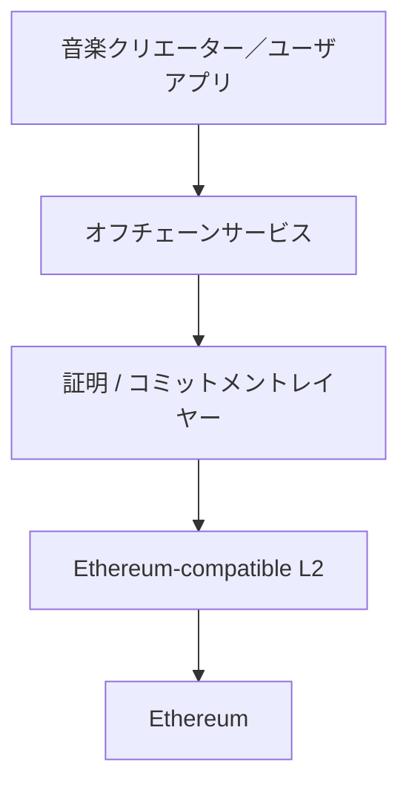
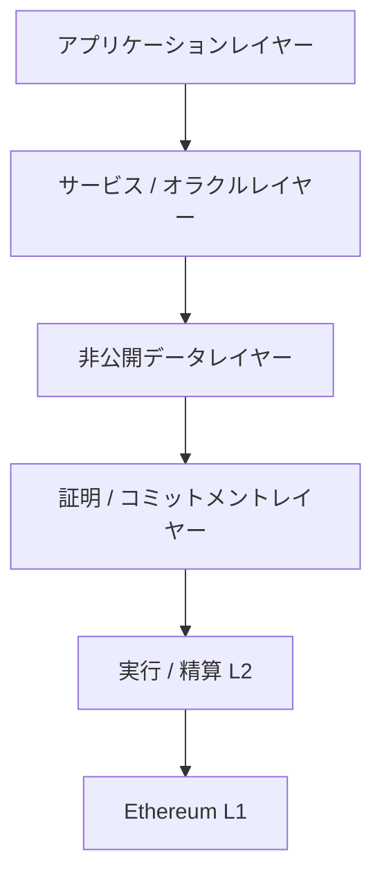
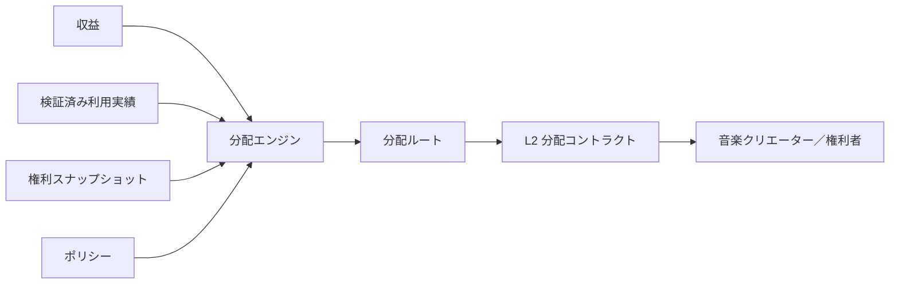

# ADR-0007: ブロックチェーン / L2 戦略

**状態:** 提案
**日付:** 2026-07-29
**最終更新日:** 2026-08-23

## 1. 背景

Creator First Platform は、音楽クリエーター／ユーザを中心とするガバナンス、権利登録台帳、利用実績オラクル、音楽クリエーター分配、ゼロ知識証明を組み合わせたコンテンツ配信プロトコルを構築する。

これまでのADRでは、

- ADR-0002 検証可能抽選
- ADR-0003 権利登録台帳
- ADR-0004 音楽クリエーター分配モデル
- ADR-0005 利用実績オラクル
- ADR-0006 ゼロ知識証明戦略

を定義した。

これらを実装するには、少なくとも次のブロックチェーン機能が必要となる。

- ステーブルコインによる決済
- 音楽クリエーター／権利者への分配
- 分配コミットメントの記録
- ガバナンス結果の確定
- 権利状態コミットメントのアンカー
- ZK 証明の検証
- プロトコルコントラクトの実行
- 監査可能な履歴

一方、音楽配信プラットフォームでは大量の再生イベントが発生するため、すべてをブロックチェーン上で処理することは現実的ではない。

また、特定ブロックチェーンや特定L2へプロトコル全体を強く依存させると、

- トランザクションコスト
- ネットワーク Congestion
- シーケンサー Failure
- ブリッジリスク
- チェーンガバナンスリスク
- ステーブルコイン可用性
- Vendor Lock-in

等がプラットフォーム全体のリスクとなる。

したがってCreator First Platformは、ブロックチェーンを「すべての処理を行うデータベース」としてではなく、

> **精算、コミットメント、検証、ガバナンス実行のためのTrust-Minimized インフラ**

として位置付ける。

---

## 2. 決定

Creator First Platform は、**Ethereum-compatible L2を主実行レイヤーとし、Ethereumを精算 / セキュリティアンカーとして利用可能な構造**を基本戦略とする。

ただし、プロトコル Coreを単一のL2固有機能へ固定しない。



主 L2は、実装・運用時点のセキュリティ、コスト、ZK Compatibility、ステーブルコイン支援、開発者エコシステム等を評価して別ADRで決定する。

---

## 3. ブロックチェーンの役割

ブロックチェーンレイヤーの責務を限定する。

ブロックチェーンは主として、

- 精算
- 資産転送
- 分配実行
- プロトコル Parameter コミットメント
- ガバナンス結果原盤
- 権利コミットメントアンカー記録
- 証明検証
- 監査 Trail

を担当する。

ブロックチェーンは原則として、

- 生の再生イベント
- ユーザ閲覧履歴
- 個人情報
- コントラクト Documents
- 音声 Files
- Large 権利メタデータ

を保存しない。

---

## 4. レイヤー構成

Creator First Platformは概念的に次のレイヤーを持つ。



各レイヤーの責務を分離し、アプリケーション業務ロジックをブロックチェーンへ過剰に移さない。

---

## 5. L2を採用する理由

Creator First Platformでは、

- サブスクリプション精算
- 音楽クリエーター分配
- Rights-related 状態更新
- ガバナンス実行
- 証明検証

等のブロックチェーントランザクションが発生する。

Ethereum L1だけでこれらを処理すると、トランザクションコストやThroughputがユーザ体験と分配効率へ影響する可能性がある。

そのため通常のプロトコル実行はL2で行い、L1はセキュリティ / 精算アンカーとして利用する。

---

## 6. Ethereum互換性

主 L2は原則としてEthereum-compatibleであることを重視する。

理由は、

- Solidity ecosystem
- スマートコントラクト tooling
- ウォレット ecosystem
- ステーブルコイン integration
- セキュリティ tooling
- 監査 ecosystem
- 開発者 availability

を利用できるためである。

ただしEVM Compatibilityを目的そのものとはせず、セキュリティやプロトコル要件が優先される。

---

## 7. L2 選定基準

主 L2は少なくとも次の基準で評価する。

| Criterion | Description |
|---|---|
| セキュリティ | L1依存関係、証明システム、アップグレードリスク |
| コスト | ユーザ支払、distribution、proof verification cost |
| ファイナリティ | 精算確定までの時間 |
| 可用性 | ネットワーク / シーケンサー availability |
| データ可用性 | トランザクション dataの検証可能性 |
| ZK 支援 | ZKP verifierおよびproof infrastructureとの適合性 |
| EVM Compatibility | Solidity / toolingとの互換性 |
| ステーブルコイン支援 | JPYC等の利用可能性 |
| ブリッジセキュリティ | L1 / L2間資産移動リスク |
| 分散化 | シーケンサー / operator依存度 |
| ガバナンス | プロトコル upgrade governance |
| Exit Path | L2障害時の資産回収可能性 |
| 開発者エコシステム | SDK、RPC、indexer、monitoring |
| Longevity | 長期運用可能性 |

選択理由は独立したADRに記録する。

---

## 8. No チェーン固有業務ロジック

音楽クリエーター分配、権利モデル、利用実績検証等のプロトコルルールを特定チェーン固有機能に直接依存させない。

例えば、

```text
分配ポリシー
      ↓
Chain-independent 仕様
      ↓
スマートコントラクト実装
      ↓
Selected L2
```

とする。

チェーン変更時にもプロトコル仕様の意味が維持されることを目標とする。

---

## 9. ステーブルコイン精算

サブスクリプションおよび音楽クリエーター分配には、法的・技術的要件を満たすJPYC等のステーブルコインを使用する。ETH等のネイティブトークンはガスまたはネットワーク手数料の精算にだけ使用し、サブスクリプション価格または音楽クリエーター分配資産として暗黙に採用しない。

JPYCは重要な候補であるが、プロトコル Coreを特定ステーブルコインコントラクトアドレスへ固定しない。

概念的には、

```text
承認済み精算資産
├── JPYC
└── その他 Governance-approved ステーブルコイン
```

とする。

精算資産登録台帳を設け、

- チェーン
- コントラクトアドレス
- トークン標準
- Decimals
- 状態
- 有効化期間
- Allowed 運用 Type

等を版管理する。

テストネットでは、金銭的価値、償還請求権または実在JPYCとの交換可能性を持たない`MockJPYC`だけをデモサブスクリプションの精算資産として承認する。Mainnet JPYCとテストトークンは異なる資産 ID、コントラクトアドレス、ネットワークおよび表示を持たなければならない。

最初のスマートコントラクト開発プロフィールは、Hardhat 3、Viem、Infura RPCおよびEthereum Sepolia（チェーン ID `11155111`）とする。これはテストネット ToolingとEVM上のコントラクト境界を検証する選択であり、本番チェーンまたは主 L2の決定ではない。SepoliaではETHをガスにだけ使用し、サブスクリプションと資金庫のテスト資産には無価値・償還不可の`MockJPYC`だけを使用する。

2026-08-23時点で、`MockJPYC`、サブスクリプション、テスト資金庫、一般／初期サポーター SBT、ERC-1967／UUPS プロキシ、音楽クリエーター登録台帳およびIgnition Moduleをリポジトリへ実装し、公開構成ソースコミット `9e46420ebf68a0dbe4175b43e6501a5ee0ca34a7`をEthereum Sepoliaへデプロイした。公開RPCでBytecode、コントラクト接続、計画、プロキシ実装先および音楽クリエーター登録台帳通知を検証済みである。Etherscan ソース検証、役割分離、インデクサー／ゲートウェイ接続、脅威モデルおよび独立監査は未完了である。

---

## 10. 資産抽象化

分配エンジンは原則として、

```text
Amount + 資産 Identifier
```

を扱う。

これにより、将来精算資産が追加・変更された場合でも音楽クリエーター分配 Logic自体を変更しない構造を目指す。

ただし異なるステーブルコイン間の価値同等性をプロトコルが自動的に仮定してはならない。

---

## 11. スマートコントラクト範囲

スマートコントラクトは主として、

- サブスクリプション精算
- 分配 Escrow
- 音楽クリエーター／権利者決済
- Governance-approved Parameter 有効化
- コミットメント登録台帳
- 証明検証
- 資金庫制御

等を担当する。

スマートコントラクト自身が、

- 生の利用実績検証
- 著作権法務 Judgment
- アイデンティティ検証
- 不正 AI Inference

を直接実行することを前提としない。

---

## 12. 権利登録台帳アンカー記録

ADR-0003 権利登録台帳の詳細情報はオフチェーンで管理する。

ブロックチェーンには必要に応じて、

```text
権利スナップショット
      ↓
コミットメント / ルート
      ↓
L2 アンカー
```

を記録する。

これにより、権利データそのものを公開せず、特定時点の権利状態が事後改ざんされていないことを検証できる。

---

## 13. 利用実績オラクル連携

ADR-0005 利用実績オラクルは生の再生イベントをオフチェーンで処理する。

L2へは、

- 利用実績スナップショット Identifier
- コミットメント
- Aggregate
- 証明
- 検証状態

等の必要情報のみを提供する。


---

## 14. ZK 証明連携

ADR-0006に従い、L2はZK 証明検証の実行レイヤーとして利用できる。

ただし、証明検証コストが高い場合は、

```text
Large 証明
    ↓
オフチェーン検証 / Recursion
    ↓
Compact 証明
    ↓
L2 検証
```

等の方式を許容する。

証明システムとL2の選択を過度に結合しない。

---

## 15. 分配精算

ADR-0004 音楽クリエーター分配モデルによる分配結果をL2上で精算する。

概念的には、



大量のRecipientへ一度に送金することが非効率な場合、申請方式分配やMerkle 分配等を検討する。

---

## 16. 申請方式分配

多数の音楽クリエーター／権利者への分配では、

```text
分配結果
       ↓
マークルルート
       ↓
分配コントラクト
       ↓
Recipient 主張 + 証明
       ↓
決済
```

のような方式を利用できる。

これによりプラットフォーム側が全Recipientへの個別トランザクションを送信する必要を減らせる。

ただし、ユーザ体験や未請求残高の扱いは分配仕様で定義する。

---

## 17. L1 アンカー記録

重要なプロトコル状態について、必要に応じてEthereum L1へアンカーする。

候補には、

- ガバナンス Checkpoint
- 分配ルート
- 権利登録台帳ルート
- プロトコル版
- 重大アップグレードコミットメント

等がある。

すべてのL2 状態を独自にL1へ再記録する必要はなく、利用するL2のセキュリティモデルを踏まえて必要性を判断する。

---

## 18. シーケンサーリスク

L2ではシーケンサー障害またはCensorship リスクを考慮する。

主 L2選択時には、

- シーケンサー architecture
- forced inclusion
- escape hatch
- L1 withdrawal
- downtime history
- decentralization roadmap

等を評価する。

シーケンサー停止によって音楽クリエーターの確定済み資産が永久に失われる設計を許容しない。

---

## 19. ブリッジリスク

L1 / L2および異なるチェーン間のブリッジは重大なセキュリティ境界である。

Creator First Platformは不要なCross-chain 転送を最小化する。

```text
Preferred:
ユーザ → 主 L2 → 音楽クリエーター

Avoid where unnecessary:
ユーザ → チェーン A → ブリッジ → チェーン B → ブリッジ → チェーン C
```

ネイティブ / 正規ブリッジを優先的に評価し、第三者ブリッジへの依存をプロトコル Coreへ組み込まない。

---

## 20. マルチチェーン戦略

初期段階では主 L2を一つ選択する。

最初から複数チェーンへ同一プロトコル状態を展開すると、

- 状態 Synchronization
- Double Spending
- ガバナンス Consistency
- 権利スナップショット Consistency
- Liquidity Fragmentation
- 運用事項 Complexity

が増大するためである。

```text
MVP
Single 主 L2

        ↓

Mature プロトコル
任意マルチチェーンアクセス
```

マルチチェーン化が必要になった場合は別ADRで決定する。

---

## 21. 正規プロトコル状態

マルチチェーン展開を将来行う場合でも、正規プロトコル状態を明確にする。

例えば、

```text
正規ガバナンス状態
正規権利コミットメント
正規分配期間
正規プロトコル版
```

が複数チェーン上で競合して存在する状態を避ける。

正規状態の所在は将来のCross-chain ADRで定義する。

---

## 22. アップグレード可能性

スマートコントラクトアップグレードは必要最小限にする。

アップグレード可能なコントラクトを利用する場合、

- アップグレード Authority
- ガバナンス Approval
- タイムロック
- 緊急 Procedure
- 版
- Migration 計画

を明示する。

```text
ガバナンス決定
      ↓
タイムロック
      ↓
アップグレード
      ↓
公開検証
```

プラットフォーム運営者の単独鍵だけで音楽クリエーター分配 Logicを変更できる構造を最終形としない。

---

## 23. 緊急制御

重大なスマートコントラクト Vulnerability等に備えて緊急停止を設けることができる。

ただし緊急権限は、

- 範囲
- Duration
- Trigger Condition
- 必要 Signatures
- 監査 Log
- ガバナンスレビュー

を明示する。

緊急停止を資金没収やガバナンス回避の手段として使用できない設計とする。

---

## 24. 鍵管理

資金庫、アップグレード、緊急等の重要権限を単一の個人鍵へ依存させない。

段階的に、

```text
MVP
マルチシグ

↓

ガバナンス + タイムロック

↓

Protocol-controlled 実行
```

へ移行する。

Hardware-backed 鍵管理や運用事項セキュリティを別セキュリティ仕様で定義する。

---

## 25. データ可用性

L2選択ではデータ可用性を重要なセキュリティ要件として評価する。

Creator First Platformが検証に必要なプロトコルデータを、特定運用者だけが保持する構造を避ける。

特に、

- 分配コミットメント
- ガバナンストランザクション
- 権利アンカー
- 証明検証結果

について、長期監査可能性を確保する。

---

## 26. ファイナリティ

音楽クリエーター分配やガバナンス実行では、トランザクション Inclusionと経済ファイナリティを区別する。

アプリケーションは、

```text
Submitted
Included
Confirmed
確定済み
```

等の状態を扱えるようにする。

音楽クリエーターへ「確定済み」と表示した支払いが通常のチェーン Reorganization等で容易に消失することを避ける。

---

## 27. チェーン障害

主 L2が長期間利用不能になった場合のMigration Pathを設計する。

少なくとも、

- 資産復旧
- 権利スナップショット復旧
- 分配状態復旧
- ガバナンス状態復旧
- プロトコル版復旧

を可能にする。

オフチェーンデータとブロックチェーン状態を組み合わせてプロトコルを再構築できるよう、スナップショットとコミットメントを保持する。

---

## 28. 可観測性

ブロックチェーンインフラについて、

- RPC availability
- transaction latency
- transaction failure
- gas / fee level
- sequencer status
- contract events
- proof verification failure
- bridge status

等を監視する。

ブロックチェーンが動いていることだけでプラットフォームが正常とは判断しない。

---

## 29. コスト戦略

ブロックチェーンコストは音楽クリエーター分配を圧迫しないよう管理する。

主なコスト Driverは、

- 精算 Transactions
- 証明検証
- コントラクトストレージ
- 分配 Claims
- L1 データコスト
- ブリッジコスト

である。

大量の再生イベントをオンチェーン化せず、集約、コミットメント、Batchingを利用する。

```text
Millions of 再生イベント
          ↓
オフチェーン集約
          ↓
One / Few Commitments
          ↓
L2
```

を基本方針とする。

---

## 30. ユーザ体験

一般ユーザが、

- ガストークンの取得
- ネットワーク Switching
- ブリッジ操作
- Nonce管理

等を意識しなくてもプラットフォームを利用できることを目標とする。

アカウント抽象化、リレイヤー、ペイマスター、ガス代支援、Bundling等を利用できる。ユーザが確認する支払額はJPYC等の承認済み精算資産で固定し、Sponsorが支払うネイティブ手数料をサブスクリプション決済として記録しない。具体方式とSponsorship ポリシーはADR-0008および各デプロイポリシーで決定する。

ブロックチェーンはユーザ体験を複雑化する目的で導入しない。

---

## 31. 音楽クリエーター体験

音楽クリエーターもブロックチェーンの専門知識を前提としない。

音楽クリエーターは、

```text
登録簿
アップロード / Manage 権利
Receive 分配
Withdraw / Use 資金
```

というサービスフローを利用できるようにする。

ウォレット管理や精算資産の選択は、セキュリティとSelf-custodyの選択肢を維持しつつ簡素化する。

---

## 32. ガバナンス関係

ブロックチェーンはガバナンスの正統性を生成するものではない。

ADR-0001およびADR-0002で決定されたガバナンス手続の結果を、

- 記録
- 検証
- 実行

するインフラとして利用する。

```text
音楽クリエーター／ユーザ
      ↓
抽選 + 熟議
      ↓
プロトコル決定
      ↓
ブロックチェーン実行
```

とする。

`Token Holder Vote = Governance` とはしない。

---

## 33. インフラ中立性

Creator First Platformの理念は特定ブロックチェーンプロジェクトの成功に依存させない。

Ethereum / L2 戦略は現時点で最も適切と判断する技術アーキテクチャであり、プロトコル原則そのものではない。

将来、

- セキュリティ
- 規制
- コスト
- Technology
- エコシステム

が大きく変化した場合、ガバナンス手続を経てMigrationできる。

---

## 34. MVP 戦略

MVPでは複雑なマルチチェーンアーキテクチャを構築しない。

段階的に、

```text
フェーズ 1
ローカル開発チェーン

フェーズ 2
Ethereum-compatible テストネット / L2 テスト環境

フェーズ 3
Selected 主 L2

フェーズ 4
本番精算

フェーズ 5
任意 L1 アンカー記録 / Advanced ZK 検証

フェーズ 6
マルチチェーン only if justified
```

と進める。

まずサブスクリプション → 利用実績 → 分配 → 精算のエンドツーエンドフローを一つの実行環境で成立させる。

---

## 35. 不変条件

### 不変条件 1

生の再生履歴を公開ブロックチェーンへ保存してはならない。

### 不変条件 2

個人情報や非公開コントラクトを公開ブロックチェーンへ保存してはならない。

### 不変条件 3

音楽クリエーター分配ポリシーを特定L2固有仕様だけで定義してはならない。

### 不変条件 4

主 L2障害によって確定済みプロトコル状態を復旧不能にしてはならない。

### 不変条件 5

ブリッジを不要にプロトコル Coreへ組み込んではならない。

### 不変条件 6

プラットフォーム運営者の単独鍵だけで重要な分配 Logicを恒久的に変更できてはならない。

### 不変条件 7

ガバナンスの正統性をトークン保有量だけで決定してはならない。

### 不変条件 8

ブロックチェーントランザクションコストを理由として生の利用実績検証の正確性を犠牲にしてはならない。

### 不変条件 9

チェーン Migration時にも過去の分配、権利コミットメント、ガバナンス結果を検証可能にしなければならない。

---

## 36. 検討した代替案

### Ethereum L1のみ

セキュリティとエコシステムは強いが、プラットフォームの日常的な実行レイヤーとしてコストと拡張性の制約が大きくなる可能性があるため基本方式として採用しない。

### 完全オフチェーン型プラットフォーム

コストとUXは単純化できるが、精算、ガバナンス実行、分配監査の信頼最小化を実現しにくいため採用しない。

### 独自ブロックチェーン

プロトコルに最適化できるが、Validator ネットワーク、セキュリティ、ブリッジ、ウォレット、開発者エコシステムを独自構築する必要があり、初期段階では採用しない。

### 開始時からのマルチチェーン

可用性やユーザ到達範囲を拡大できる可能性があるが、状態 Consistency、ブリッジリスク、運用事項 Complexityが大きいため採用しない。

### すべてをオンチェーンへ保存

最大限の公開性は得られるが、プライバシー、コスト、拡張性、法務要件に適合しないため採用しない。

---

## 37. 影響

### 利点

- Ethereum ecosystemを活用できる
- L1のみよりコストを抑えやすい
- ステーブルコイン精算とスマートコントラクト分配を統合しやすい
- ZKP 検証との接続が可能
- 生の利用実績をオフチェーンに維持できる
- プロトコルを特定L2から一定程度分離できる
- 将来のチェーン Migration余地を残せる

### 欠点

- L2固有のセキュリティモデルを理解する必要がある
- シーケンサーリスクがある
- ブリッジリスクを管理する必要がある
- L1 / L2 ファイナリティの違いを扱う必要がある
- スマートコントラクトアップグレードセキュリティが必要になる
- チェーン Migration 戦略が必要になる
- インフラ監視が複雑になる

---

## 38. セキュリティ上の考慮事項

ブロックチェーン / L2 レイヤーは少なくとも次のリスクを考慮する。

- スマートコントラクト Vulnerability
- アップグレード鍵 Compromise
- 資金庫鍵 Compromise
- シーケンサー Failure
- シーケンサー Censorship
- L2 証明 Failure
- データ可用性 Failure
- ブリッジ Exploit
- RPC 操作
- チェーン Reorganization
- ステーブルコインコントラクトリスク
- ガバナンス実行攻撃
- 証明検証者 Vulnerability
- Cross-chain Replay
- Migration Failure

具体的な脅威モデルはセキュリティ仕様で定義する。

---

## 39. 他のADRとの関係

ADR-0003 権利登録台帳は権利状態のコミットメントをブロックチェーンへアンカーできる。

ADR-0004 音楽クリエーター分配モデルは分配結果をL2で精算する。

ADR-0005 利用実績オラクルは検証済み利用実績スナップショット / 証明をL2へ提供する。

ADR-0006 ゼロ知識証明戦略は証明検証レイヤーを提供する。

ADR-0007はこれらを実行・決済・アンカーするブロックチェーン / L2 インフラ戦略を定義する。

```text
権利登録台帳 ──────────┐
利用実績オラクル ─────────────┤
分配モデル ───────┼──> ブロックチェーン / L2
ZK 証明戦略 ────────┘
                                ↓
                         精算 / アンカー
                                ↓
                             Ethereum
```

---

## 40. 関連文書

- ホワイトペーパー: ビジョン
- ホワイトペーパー: 権利・資金
- ホワイトペーパー: プラットフォームアーキテクチャ
- ホワイトペーパー: 経済モデル
- ホワイトペーパー: ガバナンス
- ホワイトペーパー: Technology
- ホワイトペーパー: セキュリティ
- ホワイトペーパー: インフラ / コスト
- ADR-0003: 権利登録台帳
- ADR-0004: 音楽クリエーター分配モデル
- ADR-0005: 利用実績オラクル
- ADR-0006: ゼロ知識証明戦略

---

## 41. 後続仕様

本ADRの採択後、少なくとも次の仕様を作成する。

- `protocol/blockchain-interface-spec.md`
- `protocol/settlement-spec.md`
- `protocol/contract-upgrade-spec.md`
- `protocol/chain-state-spec.md`
- `protocol/asset-registry-spec.md`

さらに、実際の主 L2選定について独立したADRを作成する。

候補L2を、

- セキュリティ
- コスト
- ファイナリティ
- ZK Compatibility
- JPYC / ステーブルコイン支援
- ブリッジリスク
- 開発者 Tooling
- 分散化

の観点から比較し、本番デプロイ前に決定する。
