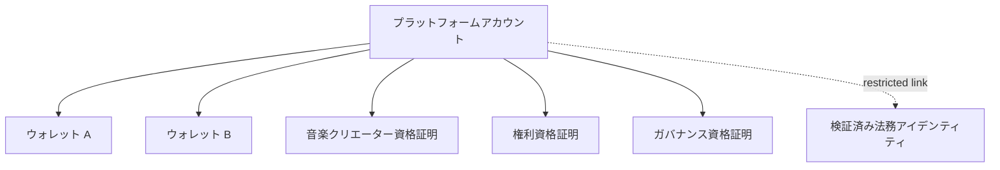
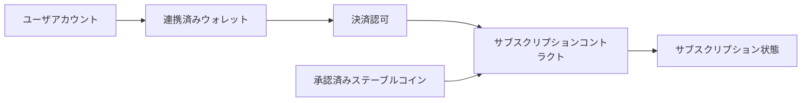
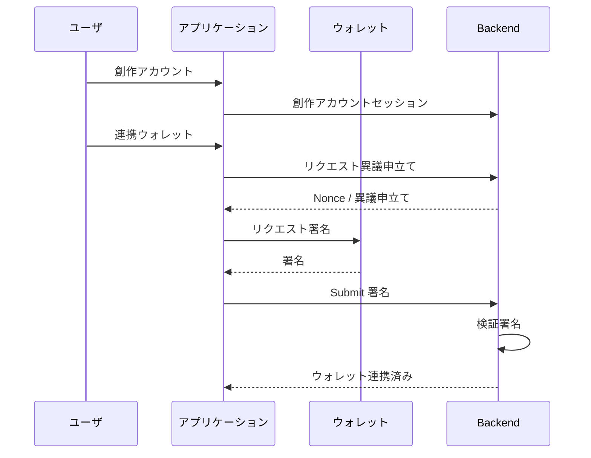
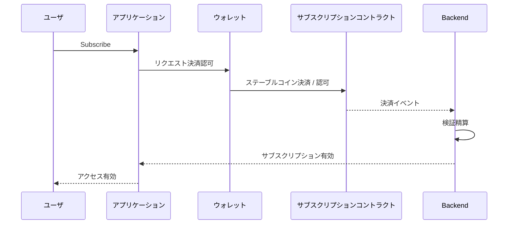

# ADR-0008: アカウント / ウォレット / アイデンティティ戦略

**状態:** 提案
**日付:** 2026-07-29
**最終更新日:** 2026-08-23

## 1. 背景

Creator First Platform は、音楽クリエーターとユーザがコンテンツを利用し、権利を管理し、ステーブルコインで支払いを行い、音楽クリエーター分配を受け取り、ガバナンスへ参加できるプラットフォームを目指す。

これまでのADRでは、

- ADR-0002 検証可能抽選
- ADR-0003 権利登録台帳
- ADR-0004 音楽クリエーター分配モデル
- ADR-0005 利用実績オラクル
- ADR-0006 ゼロ知識証明戦略
- ADR-0007 ブロックチェーン / L2 戦略

を定義した。

これらを実際のアプリケーションへ接続するためには、

- ユーザアカウント
- 音楽クリエーターアカウント
- ウォレット
- 決済認可
- ガバナンスアイデンティティ
- 権利者アイデンティティ
- 資格証明

の関係を明確にする必要がある。

単純に、

```text
ウォレットアドレス = ユーザ本人性
```

とすると、

- ウォレット変更時のアカウント継続
- 複数ウォレット利用
- ウォレット紛失
- シビル耐性
- プライバシー
- ガバナンス適格性
- 音楽クリエーター／権利者検証
- アカウント復旧

を適切に扱えない。

逆に、従来型のEmail / Password アカウントだけでは、ステーブルコイン精算やSelf-custody ウォレットとの接続が不十分になる。

したがってCreator First Platformでは、アカウント、ウォレット、アイデンティティ、資格証明を分離したアーキテクチャが必要である。

---

## 2. 決定

Creator First Platform は、

> **アカウント ≠ ウォレット ≠ 法務アイデンティティ ≠ ガバナンスアイデンティティ**

を基本原則とする。

アプリケーションアカウントを中心に、複数のウォレットおよび資格証明を関連付けられる構造を採用する。



法務アイデンティティ等の機密情報は、必要な場合のみ適切なアクセス制御の下で管理し、公開ブロックチェーンへ直接記録しない。

---

## 3. アカウント

アカウントはCreator First Platform上で継続的なサービス利用を表すApplication-level 主体とする。

アカウントは、

- プロフィール
- サブスクリプション状態
- コンテンツライブラリ
- 音楽クリエーター登録
- Rights-related References
- ガバナンス適格性参照
- 連携済み Wallets
- セキュリティ Settings

等を関連付ける。

アカウント Identifierを公開ウォレットアドレスへ固定しない。

---

## 4. ウォレット

ウォレットはブロックチェーン上の資産制御および署名を担当する。

ウォレットは、

- ステーブルコイン決済
- 分配 Receipt
- オンチェーン認可
- スマートコントラクト連携
- Cryptographic 署名

等に利用する。

ただしウォレットアドレスだけから、

- 一人のユーザである
- 音楽クリエーターである
- 権利者である
- ガバナンス議員である

と判断してはならない。

```text
ウォレット
    =
Cryptographic / 資産制御

ウォレット
    ≠
Complete アイデンティティ
```

---

## 5. 複数ウォレット

一つのアカウントに複数ウォレットを関連付けられるようにする。

例えば、

```text
アカウント
├── 決済ウォレット
├── 分配ウォレット
└── ガバナンスウォレット
```

を分離できる。

同一ウォレットを複数用途に使用することも許容できるが、プロトコルがそれを強制しない。

これによりプライバシー、セキュリティ、運用事項 Flexibilityを向上させる。

---

## 6. ウォレット連携

ウォレットをアカウントへ追加する際は、ウォレット制御をCryptographic 署名によって確認する。

概念的には、

```text
アカウントセッション
      ↓
連携ウォレットリクエスト
      ↓
サーバー異議申立て
      ↓
ウォレット署名
      ↓
署名検証
      ↓
ウォレット連携済み
```

とする。

ウォレットアドレスを入力しただけでアカウントへ登録してはならない。

異議申立てには、

- nonce
- domain
- account context
- expiration
- chain context

等を含め、Replay 攻撃を防止する。

---

## 7. ウォレット連携解除

ウォレットの関連付け解除もアカウントセキュリティ運用として扱う。

特に、

- 分配 Destination
- ガバナンス認可
- 有効サブスクリプション決済

に利用中のウォレットについては、解除前に代替手段の確認を要求できる。

ウォレット履歴は監査可能にするが、不要な個人情報を公開しない。

---

## 8. ウォレット変更・復旧

ウォレット紛失によってプラットフォームアカウント全体が失われる設計を避ける。

アカウント復旧後、新しいウォレットを関連付けられるようにする。

```text
Old ウォレット Lost
      ↓
アカウント復旧
      ↓
セキュリティ検証
      ↓
新規ウォレット連携済み
```

ただし、ブロックチェーン上で旧ウォレットが保有するSelf-custody 資産をプラットフォームが勝手に移動できることを意味しない。

アカウント復旧とブロックチェーン資産復旧を区別する。

---

## 9. 認証

プラットフォーム認証は特定方式へ固定しない。

候補には、

- Passkey
- Email-based 認証
- ウォレット署名
- Federated アイデンティティ
- Hardware-backed 認証

等がある。

長期的にはPasskey等のPhishing-resistant 認証を優先的に評価する。

ウォレット署名のみを唯一のLogin Methodとしない。

---

## 10. 認証・認可

認証と認可を分離する。

```text
認証:
"Who controls this アカウント session?"

認可:
"Is this アカウント allowed to perform this operation?"
```

例えばアカウントへLoginできても、

- 音楽クリエーターの権利変更
- 分配アドレス変更
- ガバナンス投票
- 資金庫運用

には追加資格証明またはStep-up 認証を要求できる。

---

## 11. アイデンティティレイヤー

アイデンティティを単一のアイデンティティ記録へ統合しない。

概念的に、

```text
アプリケーションアイデンティティ
音楽クリエーター本人性
権利アイデンティティ
決済アイデンティティ
ガバナンスアイデンティティ
法務アイデンティティ
```

を区別する。

同じPersonに関連する場合でも、必要のないレイヤー間で情報を共有しない。

---

## 12. 音楽クリエーター本人性

音楽クリエーターとしてコンテンツを登録するためには、音楽クリエーター登録手続を経る。

```text
アカウント
   ↓
音楽クリエーター登録
   ↓
音楽クリエーター資格証明
```

音楽クリエーター資格証明は、

> このアカウントがプラットフォーム上で音楽クリエーターとして承認されている

ことを表す。

ただしADR-0003に従い、

```text
音楽クリエーター資格証明
    ≠
権利所有
```

とする。

---

## 13. 権利アイデンティティ

権利者としての資格は権利登録台帳によって管理する。

法務アイデンティティやコントラクト証跡が必要な場合でも、それらをアプリケーションプロフィールへ無条件に公開しない。

権利資格証明を利用して、

> 特定の権利主張または検証済み権利状態と関係する主体である

ことを表現できる。

---

## 14. ガバナンスアイデンティティ

ADR-0002の検証可能抽選では、

> One 適格 Person = One 抽選機会

を基本原則とする。

したがってガバナンスアイデンティティをウォレットアドレスだけで表現してはならない。

```text
アカウント
   ↓
適格性検証
   ↓
ガバナンス資格証明
   ↓
抽選適格性
```

ガバナンス資格証明はシビル耐性を満たす必要がある。

具体的な証明 of 一人性 / 資格証明方式は別ADRまたは仕様で決定する。

---

## 15. プライバシー保護型資格証明

Creator First Platformは、必要に応じてPrivacy-preserving 資格証明を利用できる。

例えば、

> ユーザ院議会参加資格を満たしている

ことを証明するために、

- 氏名
- 生年月日
- 住所
- ウォレット履歴

を公開する必要はない。

ADR-0006に従い、ゼロ知識証明等を利用して資格証明の条件成立のみを証明する方式を検討する。

---

## 16. 無効化識別子

匿名またはPrivacy-preserving 資格証明を利用する場合でも、同一資格の多重使用を防ぐ必要がある。

例えばガバナンス抽選登録項目に、

```text
資格証明
   ↓
Context-specific Nullifier
   ↓
One 有効登録項目
```

という方式を利用できる。

Nullifierは異なるサービス背景間でユーザ追跡 Identifierとして再利用しない。

具体方式は適格性証明仕様で定義する。

---

## 17. サブスクリプション決済

ユーザは関連付けられたウォレットを使用してJPYC等の承認済み精算資産でサブスクリプション決済を行える。

サブスクリプション価格、決済意思、決済イベントおよび会計上の受領額は承認済み精算資産で表現する。ETH等のネイティブガストークンはネットワーク手数料であり、サブスクリプション決済ではない。

概念的には、



ウォレット保有だけでサブスクリプションが有効になるわけではない。

指定資産、チェーン、コントラクト、Amount、ウォレットおよび決済意思に一致する転送がファイナリティ条件を満たした場合だけ、決済の成立とサブスクリプション状態を明示的に関連付ける。

---

## 18. 継続決済

ブロックチェーンウォレットでは従来型Credit Cardと同じ自動引落しを当然には仮定できない。

継続サブスクリプションには、

- ユーザ-approved allowance
- Permit-based authorization
- スマートアカウント authorization
- 定期的 user approval
- その他 bounded authorization

等を利用できる。

重要な原則は、

> **プラットフォームへ無制限・無期限の資産制御を与えない**

ことである。

継続決済認可には、

- 資産
- Maximum Amount
- 期間
- Expiration
- Recipient / コントラクト
- 失効

を明示できる構造を優先する。

---

## 19. 決済認可ではないアイデンティティ

ステーブルコインを支払ったウォレットが、そのままガバナンスアイデンティティや法務アイデンティティになるとは限らない。

例えば、

```text
ユーザアカウント
    ↓
決済ウォレット A

ユーザアカウント
    ↓
ガバナンス資格証明 B
```

という分離を許容する。

これによりウォレットトランザクション履歴からガバナンス参加等が容易に関連付けられることを避けられる。

---

## 20. 音楽クリエーター分配ウォレット

音楽クリエーター／権利者は分配を受け取るウォレットを登録できる。

分配ウォレット変更は重要なセキュリティ運用として扱う。

少なくとも、

- strong authentication
- confirmation
- audit record
- optional delay / timelock

等を検討する。

アカウント乗っ取りによる決済アドレス Substitutionを防止する。

---

## 21. スマートアカウント・アカウント抽象化

ユーザ体験向上のため、スマートアカウント / アカウント抽象化を利用できる。

期待される機能には、

- ガス代支援
- Batched Transactions
- セッション Keys
- Spending Limits
- 復旧
- 継続認可

等がある。

```text
ユーザ
  ↓
単純アプリケーション対応
  ↓
スマートアカウント
  ↓
ブロックチェーン Transactions
```

ただしADR-0007と同様に、プロトコル Coreを特定アカウント抽象化事業者へ固定しない。

---

## 22. ガス抽象化

一般ユーザにガストークンの購入を必須としないUXを目標とする。

例えばサブスクリプション決済時に、

```text
ユーザが支払う JPYC
```

だけを意識し、ガス処理は、

- ペイマスター
- リレイヤー
- Sponsored トランザクション
- 手数料 Conversion
- プラットフォーム Subsidy

等で抽象化できる。

ガス代支援ポリシーは不正利用耐性とコスト制御を考慮する。

リレイヤーまたはペイマスターの受付結果、トランザクションハッシュまたはガス支払だけをサブスクリプション決済の証拠としてはならない。精算アダプターは承認済みステーブルコイン転送を独立に検証する。

テストネットデモでは`MockJPYC`を支払資産とし、Faucet由来のネイティブトークンはリレイヤーのガスにだけ使用する。ユーザへテストネット ETHの取得を要求せず、Mainnet 資産、本番ウォレットまたは本番秘密鍵を使用しない。

2026-08-23の公開テストユーザ利用フローは、アカウント／ウォレット／サブスクリプションのUI境界を先行検証する暫定実装である。Same-originの検証済みマニフェストがPolygon Amoy、全コントラクトアドレスおよびソースコミットを`active`として公開した場合だけ書込みを許し、任意アドレス入力、Mainnet追加または自動接続を認めない。現段階ではリレイヤー／ペイマスターが未実装であるため、ウォレットによる書込みはユーザのAmoy POLをガスに必要とし、上記のガス Sponsored終了条件を満たさない。プロフィール Aliasとウォレットアドレスはプラットフォームアカウントとして永続結合しない。

---

## 23. セッション認可

プレーヤーアプリが楽曲再生ごとにウォレット署名を要求する設計は採用しない。

Login セッションまたは限定されたセッション資格証明を利用し、

```text
強固な認証
      ↓
セッション Established
      ↓
Normal 再生
```

とする。

ブロックチェーン署名は決済、ウォレット連携、重要な認可等の必要な操作に限定する。

---

## 24. 端末への結付け

必要に応じてアカウントセキュリティや利用実績不正耐性のためDevice-related 証跡を利用できる。

ただし、

- Permanent Device Fingerprinting
- Cross-service Tracking
- Unnecessary Hardware Identifier コレクション

を避ける。

Device 証跡はプライバシー原則に従って最小化する。

---

## 25. 個人情報

個人情報は公開ブロックチェーンへ記録しない。

特に、

- 法務名称
- アドレス
- 日付 of Birth
- Phone Number
- Email アドレス
- アイデンティティ Document
- Bank 情報

をオンチェーンデータとして保存してはならない。

必要な場合はオフチェーンでアクセス制御、暗号化、保存期間ポリシーを適用する。

---

## 26. アイデンティティプロバイダーからの独立

Creator First Platformは、単一のアイデンティティ事業者へプラットフォームアイデンティティ全体を依存させない。

外部アイデンティティ検証サービスを利用する場合でも、

```text
事業者結果
      ↓
プラットフォーム資格証明
```

として抽象化する。

事業者変更時に全アカウントを作り直す必要がない構造を目指す。

---

## 27. 資格証明ライフサイクル

資格証明にはライフサイクルを持たせる。

```text
Issued
  ↓
有効
  ↓
Expired / Revoked / Replaced
```

資格証明には、

- issuer
- type
- version
- issued time
- expiration
- status

等を関連付ける。

失効済み資格証明を新しい認可へ使用してはならない。

---

## 28. 失効

音楽クリエーター資格証明、権利資格証明、ガバナンス資格証明等は必要に応じて失効可能にする。

ただし、失効によって過去の正当なプロトコル履歴を消去してはならない。

例えば、

```text
資格証明 valid at T1
資格証明 revoked at T2
```

の場合、T1時点で行われた正当な操作は履歴として検証可能にする。

---

## 29. アカウント役割

一つのアカウントが複数役割を持てる。

```text
アカウント
├── ユーザ
├── 音楽クリエーター
├── 権利者
└── ガバナンス参加者
```

音楽クリエーターも同時にユーザであり得る。

役割は排他的に設計しない。

ただし各役割の権限は資格証明 / 認可によって明確に区別する。

---

## 30. ガバナンスの源泉としてのユーザ

ガバナンス議員はユーザとは別の固定階級ではない。

ユーザコミュニティから適格性を満たすMemberがADR-0002の検証可能抽選によって一時的なRepresentativeとなる。

```text
ユーザ
  ↓
適格ユーザ
  ↓
抽選
  ↓
ユーザ院議会議員
  ↓
Term Ends
  ↓
ユーザ
```

音楽クリエーターについても同様である。

この構造により、ガバナンス議員が音楽クリエーター／ユーザコミュニティの代表であり続けることを制度的に支える。

---

## 31. アイデンティティ・権利分離

アカウントが本人確認済みであることと、作品の権利者であることを混同しない。

```text
検証済み Person
      ≠
検証済み著作権 Owner
```

権利所有はADR-0003 権利登録台帳の検証手続に従う。

---

## 32. アイデンティティ・経済権力分離

ウォレット均衡、ステーブルコイン保有量、株式、STO トークン等をガバナンスアイデンティティの強さとして使用しない。

```text
経済 Assets
      ≠
アイデンティティ重み
      ≠
ガバナンス重み
```

これはADR-0002およびADR-0004の原則と整合する。

---

## 33. 監査可能性

重要なアカウント / アイデンティティ操作について監査 Trailを保持する。

例えば、

```text
WALLET_LINKED
WALLET_UNLINKED
DISTRIBUTION_WALLET_CHANGED
CREATOR_CREDENTIAL_ISSUED
RIGHTS_CREDENTIAL_UPDATED
GOVERNANCE_CREDENTIAL_ISSUED
CREDENTIAL_REVOKED
ACCOUNT_RECOVERY
```

等である。

監査記録には必要最小限の情報のみを保持し、機密情報そのものをLogへ書き込まない。

---

## 34. セキュリティイベント

アカウントセキュリティに関する重要操作についてユーザへ通知できるようにする。

例えば、

- 新規ウォレット連携済み
- 分配ウォレット Changed
- 復旧 Performed
- 新規 Passkey Added
- ガバナンス資格証明 Changed

等である。

これによりアカウント乗っ取りを早期に検知できる。

---

## 35. アカウント削除

ユーザがアカウント削除を要求した場合、法的・監査上必要な記録と削除可能な個人データを区別する。

ブロックチェーン上の確定トランザクションを削除することはできないため、オンチェーンデータには最初から個人情報を記録しない。

オフチェーン個人データについては適用法令および保存期間ポリシーに従う。

---

## 36. 仮名参加

法的本人確認が不要なサービス領域では、仮名アカウントを許容できる。

ただし、

- 権利主張
- 法的契約
- 規制上必要な取引
- ガバナンスシビル耐性

等では追加資格証明が必要になる場合がある。

全ユーザに不要なKYCを一律要求する設計は採用しない。

---

## 37. 規制上の境界

アイデンティティ検証の要否は、

- 決済
- ステーブルコイン
- 権利コントラクト
- STO
- 税務
- AML / CFT
- 適用 Jurisdiction

等によって異なる。

そのため本ADRでは「全アカウントをKYCする」「KYCしない」のどちらにも固定しない。

必要な運用に対して必要な資格証明を要求する **段階的検証** を基本方針とする。

---

## 38. 段階的検証

アカウント作成時にすべてのアイデンティティ検証を要求せず、サービス利用に応じて必要な資格証明を追加する。

```text
Basic ユーザ
    ↓
サブスクリプションユーザ
    ↓
音楽クリエーター
    ↓
権利者
    ↓
ガバナンス適格 Member
```

各段階で必要な検証を明示する。

これによりUXとプライバシーを維持しながら、法務・セキュリティ要件へ対応する。

---

## 39. MVP 戦略

MVPではアイデンティティインフラを過度に複雑化しない。

最初の実装目標を、

> **JPYC等のステーブルコインウォレットを持つユーザがプラットフォームアカウントを作成し、ウォレットを安全に関連付け、サブスクリプション決済を行える**

こととする。

段階的に、

```text
フェーズ 1
プラットフォームアカウント
+ 認証

フェーズ 2
ウォレット連携
+ 署名検証

フェーズ 3
ステーブルコインサブスクリプション決済

フェーズ 4
音楽クリエーター登録
+ 分配ウォレット

フェーズ 5
権利資格証明

フェーズ 6
ガバナンス資格証明
+ Privacy-preserving 適格性証明
```

と進める。

---

## 40. MVP 登録フロー

最初のユーザ登録フローは概念的に、



とする。

このフローを最初のCodex実装単位として利用できる。

---

## 41. MVP サブスクリプションフロー

ウォレット連携後、



とする。

Backendがウォレット画面の表示だけを見て決済済みと判断してはならず、ブロックチェーン精算を検証する。

---

## 42. 不変条件

### 不変条件 1

ウォレットアドレスをPerson アイデンティティと同一視してはならない。

### 不変条件 2

音楽クリエーター資格証明を権利所有の証明として扱ってはならない。

### 不変条件 3

ウォレット均衡をガバナンス重みとして使用してはならない。

### 不変条件 4

ウォレット連携にはウォレット制御のCryptographic 検証を必要とする。

### 不変条件 5

個人情報を公開ブロックチェーンへ記録してはならない。

### 不変条件 6

ウォレット紛失によってアプリケーションアカウントそのものを必ず失う設計にしてはならない。

### 不変条件 7

継続決済のためにプラットフォームへ無制限・無期限の資産制御を当然に要求してはならない。

### 不変条件 8

ガバナンス適格性で同一Personが複数ウォレットを使って抽選確率を増加させることを許容してはならない。

### 不変条件 9

分配ウォレット変更を通常のプロフィール編集と同等の低セキュリティ操作として扱ってはならない。

### 不変条件 10

資格証明失効によって過去の正当なプロトコル履歴を消去してはならない。

---

## 43. 検討した代替案

### ウォレットだけのアイデンティティ

ウォレットアドレスをアカウント Identifierとして使用する。

実装は単純だが、復旧、Multiple ウォレット、プライバシー、シビル耐性、役割分離の問題があるため採用しない。

### 従来型アカウントのみ

Email / Password等のアカウントだけを利用しウォレットをプロトコルアイデンティティから切り離す。

ステーブルコイン精算、オンチェーン認可、Self-custodyとの統合が弱いため採用しない。

### 全ユーザへのKYC義務付け

全ユーザにアカウント作成時から法的本人確認を要求する。

不要な個人データ収集、UX、プライバシーの問題があるため基本方式として採用しない。

### すべての役割で一つのウォレット

決済、分配、ガバナンスを同一ウォレットへ固定する。

プライバシーとセキュリティ分離を損なうため採用しない。

### トークン基準のガバナンス・アイデンティティ

トークン保有量をアイデンティティ / 適格性として使用する。

経済権力とガバナンス代表性を混同するため採用しない。

---

## 44. 影響

### 利点

- ウォレット変更・追加に対応できる
- ユーザアカウントをウォレット紛失から分離できる
- 決済、権利、ガバナンスのアイデンティティを分離できる
- プライバシーを保護しやすい
- シビル耐性をガバナンスレイヤーへ導入できる
- JPYC等のステーブルコインサブスクリプションへ自然に接続できる
- 音楽クリエーター／権利者の役割を明確に管理できる
- 段階的検証が可能になる
- アカウント抽象化を将来導入しやすい

### 欠点

- アイデンティティモデルがWallet-only方式より複雑になる
- アカウント復旧インフラが必要になる
- 資格証明ライフサイクル管理が必要になる
- ウォレット連携セキュリティが必要になる
- アイデンティティ事業者との連携が必要になる可能性がある
- Privacy-preserving ガバナンスアイデンティティの実装難度が高い
- アカウントとオンチェーン状態の整合性管理が必要になる

---

## 45. セキュリティ上の考慮事項

アカウント / ウォレット / アイデンティティレイヤーは少なくとも次のリスクを考慮する。

- アカウント乗っ取り
- Phishing
- ウォレット署名 Phishing
- Replay 攻撃
- セッション Hijacking
- 資格証明 Theft
- ウォレットアドレス Substitution
- 分配アドレス Substitution
- 復旧不正利用
- シビル攻撃
- アイデンティティ事業者 Compromise
- 資格証明 Forgery
- Unauthorized ウォレット連携
- スマートアカウント Vulnerability
- ペイマスター不正利用
- プライバシー Leakage
- Cross-role Correlation

具体的な脅威モデルはセキュリティ仕様で定義する。

---

## 46. 他のADRとの関係

ADR-0002はガバナンス適格性と検証可能抽選を定義する。

ADR-0003は権利者と権利状態を定義する。

ADR-0004は音楽クリエーター／権利者への分配を定義する。

ADR-0005はユーザの利用実績イベントを扱う。

ADR-0006はアイデンティティ / 適格性をPrivacy-preservingに証明する技術戦略を提供する。

ADR-0007はウォレットが利用するブロックチェーン / L2 インフラを定義する。

ADR-0008はこれらをアプリケーションアカウント、ウォレット、アイデンティティ、資格証明として接続する。

```text
                     プラットフォームアカウント
                           │
          ┌────────────────┼────────────────┐
          ↓                ↓                ↓
       ウォレット資格証明セッション
          │                │
          ↓          ┌─────┼─────┐
 ブロックチェーン / L2     ↓     ↓     ↓
                  音楽クリエーターの権利ガバナンス
```

---

## 47. 関連文書

- ホワイトペーパー: ビジョン
- ホワイトペーパー: 権利・資金
- ホワイトペーパー: プラットフォームアーキテクチャ
- ホワイトペーパー: 音楽クリエーター登録
- ホワイトペーパー: 経済モデル
- ホワイトペーパー: ガバナンス
- ホワイトペーパー: Technology
- ホワイトペーパー: セキュリティ
- ホワイトペーパー: 法務 / STO / 税務
- ADR-0002: 検証可能抽選
- ADR-0003: 権利登録台帳
- ADR-0004: 音楽クリエーター分配モデル
- ADR-0005: 利用実績オラクル
- ADR-0006: ゼロ知識証明戦略
- ADR-0007: ブロックチェーン / L2 戦略
- ADR-0014: 公開テストネットユーザ利用フロー

---

## 48. 後続仕様

本ADRの採択後、少なくとも次の仕様を作成する。

- `protocol/account-spec.md`
- `protocol/wallet-linking-spec.md`
- `protocol/authentication-spec.md`
- `protocol/payment-authorization-spec.md`
- `protocol/credential-spec.md`
- `protocol/account-recovery-spec.md`

さらに、MVP実装の最初の最小縦断実装として、

```text
アカウント登録
      ↓
ウォレット連携
      ↓
JPYC 決済認可
      ↓
サブスクリプション精算
      ↓
サブスクリプション有効化
```

を実装する。

この最小縦断実装は、Creator First Platformのアプリケーションレイヤー、ウォレットレイヤー、ブロックチェーンレイヤーを最小構成でエンドツーエンド接続する最初の実装単位とする。
