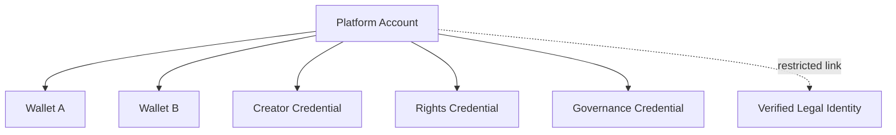
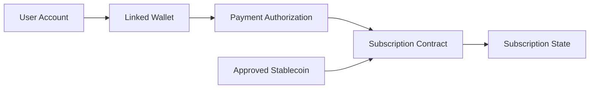
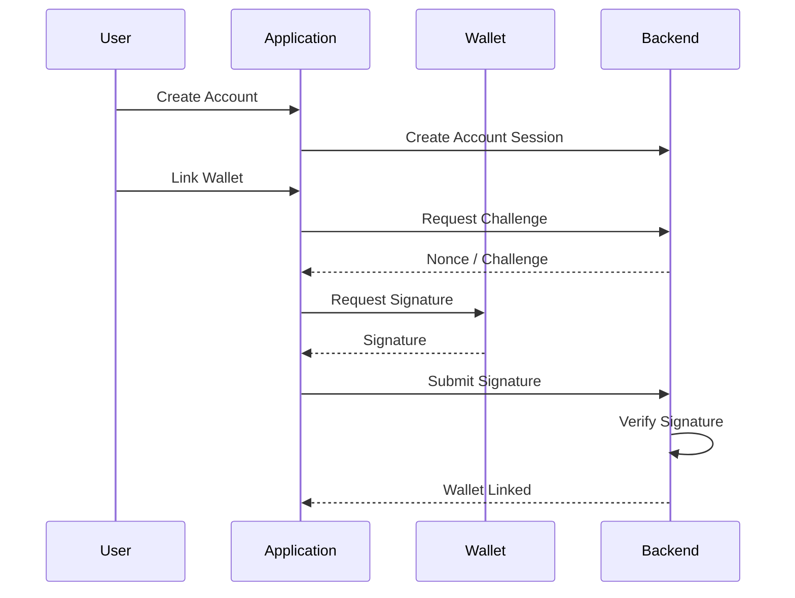
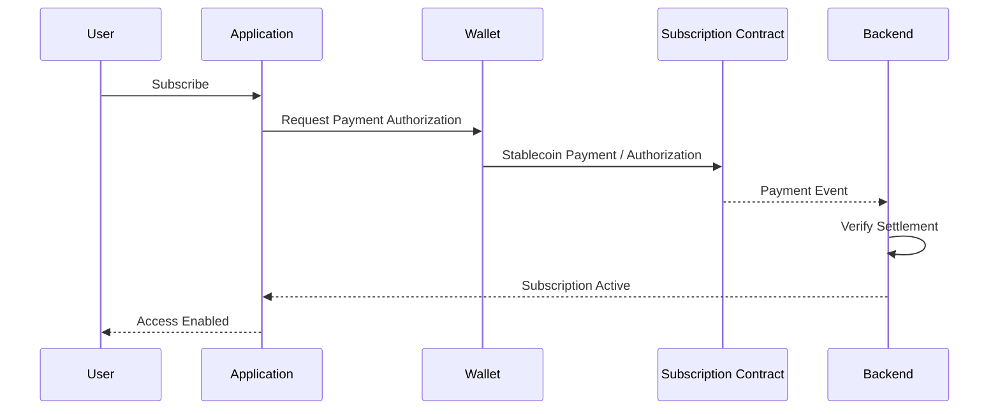

# ADR-0008: Account / Wallet / Identity Strategy

**Status:** Proposed  
**Date:** 2026-07-29

## 1. Context

Creator First Platform は、Creator と User がコンテンツを利用し、権利を管理し、Stablecoinで支払いを行い、Creator Distributionを受け取り、Governanceへ参加できるPlatformを目指す。

これまでのADRでは、

- ADR-0002 Verifiable Sortition
- ADR-0003 Rights Registry
- ADR-0004 Creator Distribution Model
- ADR-0005 Usage Oracle
- ADR-0006 Zero-Knowledge Proof Strategy
- ADR-0007 Blockchain / L2 Strategy

を定義した。

これらを実際のApplicationへ接続するためには、

- User Account
- Creator Account
- Wallet
- Payment Authorization
- Governance Identity
- Rights Holder Identity
- Credentials

の関係を明確にする必要がある。

単純に、

```text
Wallet Address = User Identity
```

とすると、

- Wallet変更時のAccount継続
- 複数Wallet利用
- Wallet紛失
- Sybil Resistance
- Privacy
- Governance Eligibility
- Creator / Rights Holder Verification
- Account Recovery

を適切に扱えない。

逆に、従来型のEmail / Password Accountだけでは、Stablecoin SettlementやSelf-custody Walletとの接続が不十分になる。

したがってCreator First Platformでは、Account、Wallet、Identity、Credentialを分離したArchitectureが必要である。

---

## 2. Decision

Creator First Platform は、

> **Account ≠ Wallet ≠ Legal Identity ≠ Governance Identity**

を基本原則とする。

Application Accountを中心に、複数のWalletおよびCredentialを関連付けられる構造を採用する。



Legal Identity等の機密情報は、必要な場合のみ適切なAccess Controlの下で管理し、Public Blockchainへ直接記録しない。

---

## 3. Account

AccountはCreator First Platform上で継続的なService利用を表すApplication-level Entityとする。

Accountは、

- Profile
- Subscription State
- Content Library
- Creator Registration
- Rights-related References
- Governance Eligibility Reference
- Linked Wallets
- Security Settings

等を関連付ける。

Account IdentifierをPublic Wallet Addressへ固定しない。

---

## 4. Wallet

WalletはBlockchain上のAsset ControlおよびSignatureを担当する。

Walletは、

- Stablecoin Payment
- Distribution Receipt
- On-chain Authorization
- Smart Contract Interaction
- Cryptographic Signature

等に利用する。

ただしWallet Addressだけから、

- 一人のUserである
- Creatorである
- Rights Holderである
- Governance Memberである

と判断してはならない。

```text
Wallet
    =
Cryptographic / Asset Control

Wallet
    ≠
Complete Identity
```

---

## 5. Multiple Wallets

一つのAccountに複数Walletを関連付けられるようにする。

例えば、

```text
Account
├── Payment Wallet
├── Distribution Wallet
└── Governance Wallet
```

を分離できる。

同一Walletを複数用途に使用することも許容できるが、Protocolがそれを強制しない。

これによりPrivacy、Security、Operational Flexibilityを向上させる。

---

## 6. Wallet Linking

WalletをAccountへ追加する際は、Wallet ControlをCryptographic Signatureによって確認する。

概念的には、

```text
Account Session
      ↓
Link Wallet Request
      ↓
Server Challenge
      ↓
Wallet Signature
      ↓
Signature Verification
      ↓
Wallet Linked
```

とする。

Wallet Addressを入力しただけでAccountへ登録してはならない。

Challengeには、

- nonce
- domain
- account context
- expiration
- chain context

等を含め、Replay Attackを防止する。

---

## 7. Wallet Unlinking

Walletの関連付け解除もAccount Security Operationとして扱う。

特に、

- Distribution Destination
- Governance Authorization
- Active Subscription Payment

に利用中のWalletについては、解除前に代替手段の確認を要求できる。

Wallet履歴は監査可能にするが、不要な個人情報を公開しない。

---

## 8. Wallet Change and Recovery

Wallet紛失によってPlatform Account全体が失われる設計を避ける。

Account Recovery後、新しいWalletを関連付けられるようにする。

```text
Old Wallet Lost
      ↓
Account Recovery
      ↓
Security Verification
      ↓
New Wallet Linked
```

ただし、Blockchain上で旧Walletが保有するSelf-custody AssetをPlatformが勝手に移動できることを意味しない。

Account RecoveryとBlockchain Asset Recoveryを区別する。

---

## 9. Authentication

Platform Authenticationは特定方式へ固定しない。

候補には、

- Passkey
- Email-based Authentication
- Wallet Signature
- Federated Identity
- Hardware-backed Authentication

等がある。

長期的にはPasskey等のPhishing-resistant Authenticationを優先的に評価する。

Wallet Signatureのみを唯一のLogin Methodとしない。

---

## 10. Authentication and Authorization

AuthenticationとAuthorizationを分離する。

```text
Authentication:
"Who controls this Account session?"

Authorization:
"Is this Account allowed to perform this operation?"
```

例えばAccountへLoginできても、

- Creator Rights変更
- Distribution Address変更
- Governance Vote
- Treasury Operation

には追加CredentialまたはStep-up Authenticationを要求できる。

---

## 11. Identity Layers

Identityを単一のIdentity Recordへ統合しない。

概念的に、

```text
Application Identity
Creator Identity
Rights Identity
Payment Identity
Governance Identity
Legal Identity
```

を区別する。

同じPersonに関連する場合でも、必要のないLayer間で情報を共有しない。

---

## 12. Creator Identity

CreatorとしてContentを登録するためには、Creator Registration Processを経る。

```text
Account
   ↓
Creator Registration
   ↓
Creator Credential
```

Creator Credentialは、

> このAccountがPlatform上でCreatorとして承認されている

ことを表す。

ただしADR-0003に従い、

```text
Creator Credential
    ≠
Rights Ownership
```

とする。

---

## 13. Rights Identity

Rights Holderとしての資格はRights Registryによって管理する。

Legal IdentityやContract Evidenceが必要な場合でも、それらをApplication Profileへ無条件に公開しない。

Rights Credentialを利用して、

> 特定のRights ClaimまたはVerified Rights Stateと関係する主体である

ことを表現できる。

---

## 14. Governance Identity

ADR-0002のVerifiable Sortitionでは、

> One Eligible Person = One Sortition Opportunity

を基本原則とする。

したがってGovernance IdentityをWallet Addressだけで表現してはならない。

```text
Account
   ↓
Eligibility Verification
   ↓
Governance Credential
   ↓
Sortition Eligibility
```

Governance CredentialはSybil Resistanceを満たす必要がある。

具体的なProof of Personhood / Credential方式は別ADRまたはSpecificationで決定する。

---

## 15. Privacy-preserving Credentials

Creator First Platformは、必要に応じてPrivacy-preserving Credentialを利用できる。

例えば、

> User House Eligibilityを満たしている

ことを証明するために、

- 氏名
- 生年月日
- 住所
- Wallet履歴

を公開する必要はない。

ADR-0006に従い、Zero-Knowledge Proof等を利用してCredentialの条件成立のみを証明する方式を検討する。

---

## 16. Nullifiers

匿名またはPrivacy-preserving Credentialを利用する場合でも、同一資格の多重使用を防ぐ必要がある。

例えばGovernance Sortition Entryに、

```text
Credential
   ↓
Context-specific Nullifier
   ↓
One Valid Entry
```

という方式を利用できる。

Nullifierは異なるService Context間でUser Tracking Identifierとして再利用しない。

具体方式はEligibility Proof Specificationで定義する。

---

## 17. Subscription Payment

Userは関連付けられたWalletを使用してJPYC等のApproved Settlement AssetでSubscription Paymentを行える。

概念的には、



Wallet保有だけでSubscriptionが有効になるわけではない。

Paymentの成立とSubscription Stateを明示的に関連付ける。

---

## 18. Recurring Payment

Blockchain Walletでは従来型Credit Cardと同じ自動引落しを当然には仮定できない。

Recurring Subscriptionには、

- User-approved allowance
- Permit-based authorization
- Smart Account authorization
- Periodic user approval
- Other bounded authorization

等を利用できる。

重要な原則は、

> **Platformへ無制限・無期限のAsset Controlを与えない**

ことである。

Recurring Payment Authorizationには、

- Asset
- Maximum Amount
- Period
- Expiration
- Recipient / Contract
- Revocation

を明示できる構造を優先する。

---

## 19. Payment Authorization Is Not Identity

Stablecoinを支払ったWalletが、そのままGovernance IdentityやLegal Identityになるとは限らない。

例えば、

```text
User Account
    ↓
Payment Wallet A

User Account
    ↓
Governance Credential B
```

という分離を許容する。

これによりWallet Transaction HistoryからGovernance Participation等が容易に関連付けられることを避けられる。

---

## 20. Creator Distribution Wallet

Creator / Rights HolderはDistributionを受け取るWalletを登録できる。

Distribution Wallet変更は重要なSecurity Operationとして扱う。

少なくとも、

- strong authentication
- confirmation
- audit record
- optional delay / timelock

等を検討する。

Account TakeoverによるPayment Address Substitutionを防止する。

---

## 21. Smart Accounts / Account Abstraction

User Experience向上のため、Smart Account / Account Abstractionを利用できる。

期待される機能には、

- Gas Sponsorship
- Batched Transactions
- Session Keys
- Spending Limits
- Recovery
- Recurring Authorization

等がある。

```text
User
  ↓
Simple Application Action
  ↓
Smart Account
  ↓
Blockchain Transactions
```

ただしADR-0007と同様に、Protocol Coreを特定Account Abstraction Providerへ固定しない。

---

## 22. Gas Abstraction

一般UserにGas Tokenの購入を必須としないUXを目標とする。

例えばSubscription Payment時に、

```text
User pays JPYC
```

だけを意識し、Gas処理は、

- Paymaster
- Sponsored Transaction
- Fee Conversion
- Platform Subsidy

等で抽象化できる。

Gas Sponsorship PolicyはAbuse ResistanceとCost Controlを考慮する。

---

## 23. Session Authorization

Player Appが楽曲再生ごとにWallet Signatureを要求する設計は採用しない。

Login Sessionまたは限定されたSession Credentialを利用し、

```text
Strong Authentication
      ↓
Session Established
      ↓
Normal Playback
```

とする。

Blockchain SignatureはPayment、Wallet Linking、重要なAuthorization等の必要な操作に限定する。

---

## 24. Device Binding

必要に応じてAccount SecurityやUsage Fraud ResistanceのためDevice-related Evidenceを利用できる。

ただし、

- Permanent Device Fingerprinting
- Cross-service Tracking
- Unnecessary Hardware Identifier Collection

を避ける。

Device EvidenceはPrivacy Principleに従って最小化する。

---

## 25. Personal Information

個人情報はPublic Blockchainへ記録しない。

特に、

- Legal Name
- Address
- Date of Birth
- Phone Number
- Email Address
- Identity Document
- Bank Information

をOn-chain Dataとして保存してはならない。

必要な場合はOff-chainでAccess Control、Encryption、Retention Policyを適用する。

---

## 26. Identity Provider Independence

Creator First Platformは、単一のIdentity ProviderへPlatform Identity全体を依存させない。

外部Identity Verification Serviceを利用する場合でも、

```text
Provider Result
      ↓
Platform Credential
```

として抽象化する。

Provider変更時に全Accountを作り直す必要がない構造を目指す。

---

## 27. Credential Lifecycle

CredentialにはLifecycleを持たせる。

```text
Issued
  ↓
Active
  ↓
Expired / Revoked / Replaced
```

Credentialには、

- issuer
- type
- version
- issued time
- expiration
- status

等を関連付ける。

失効済みCredentialを新しいAuthorizationへ使用してはならない。

---

## 28. Revocation

Creator Credential、Rights Credential、Governance Credential等は必要に応じて失効可能にする。

ただし、失効によって過去の正当なProtocol Historyを消去してはならない。

例えば、

```text
Credential valid at T1
Credential revoked at T2
```

の場合、T1時点で行われた正当な操作は履歴として検証可能にする。

---

## 29. Account Roles

一つのAccountが複数Roleを持てる。

```text
Account
├── User
├── Creator
├── Rights Holder
└── Governance Participant
```

Creatorも同時にUserであり得る。

Roleは排他的に設計しない。

ただし各Roleの権限はCredential / Authorizationによって明確に区別する。

---

## 30. User as Governance Source

Governance MemberはUserとは別の固定階級ではない。

User CommunityからEligibilityを満たすMemberがADR-0002のVerifiable Sortitionによって一時的なRepresentativeとなる。

```text
User
  ↓
Eligible User
  ↓
Sortition
  ↓
User House Member
  ↓
Term Ends
  ↓
User
```

Creatorについても同様である。

この構造により、Governance MemberがCreator / User Communityの代表であり続けることを制度的に支える。

---

## 31. Identity and Rights Separation

Accountが本人確認済みであることと、作品のRights Holderであることを混同しない。

```text
Verified Person
      ≠
Verified Copyright Owner
```

Rights OwnershipはADR-0003 Rights RegistryのVerification Processに従う。

---

## 32. Identity and Economic Power Separation

Wallet Balance、Stablecoin保有量、株式、STO Token等をGovernance Identityの強さとして使用しない。

```text
Economic Assets
      ≠
Identity Weight
      ≠
Governance Weight
```

これはADR-0002およびADR-0004の原則と整合する。

---

## 33. Auditability

重要なAccount / Identity操作についてAudit Trailを保持する。

例えば、

```text
WALLET_LINKED
WALLET_UNLINKED
DISTRIBUTION_WALLET_CHANGED
CREATOR_CREDENTIAL_ISSUED
RIGHTS_CREDENTIAL_UPDATED
GOVERNANCE_CREDENTIAL_ISSUED
CREDENTIAL_REVOKED
ACCOUNT_RECOVERY
```

等である。

Audit Recordには必要最小限の情報のみを保持し、機密情報そのものをLogへ書き込まない。

---

## 34. Security Events

Account Securityに関する重要操作についてUserへ通知できるようにする。

例えば、

- New Wallet Linked
- Distribution Wallet Changed
- Recovery Performed
- New Passkey Added
- Governance Credential Changed

等である。

これによりAccount Takeoverを早期に検知できる。

---

## 35. Account Deletion

UserがAccount削除を要求した場合、法的・監査上必要な記録と削除可能なPersonal Dataを区別する。

Blockchain上の確定Transactionを削除することはできないため、On-chain Dataには最初から個人情報を記録しない。

Off-chain Personal DataについてはApplicable LawおよびRetention Policyに従う。

---

## 36. Pseudonymous Participation

法的本人確認が不要なService領域では、Pseudonymous Accountを許容できる。

ただし、

- Rights Claim
- 法的契約
- 規制上必要な取引
- Governance Sybil Resistance

等では追加Credentialが必要になる場合がある。

全Userに不要なKYCを一律要求する設計は採用しない。

---

## 37. Regulatory Boundary

Identity Verificationの要否は、

- Payment
- Stablecoin
- Rights Contract
- STO
- Tax
- AML / CFT
- Applicable Jurisdiction

等によって異なる。

そのため本ADRでは「全AccountをKYCする」「KYCしない」のどちらにも固定しない。

必要なOperationに対して必要なCredentialを要求する **Progressive Verification** を基本方針とする。

---

## 38. Progressive Verification

Account作成時にすべてのIdentity Verificationを要求せず、Service利用に応じて必要なCredentialを追加する。

```text
Basic User
    ↓
Subscription User
    ↓
Creator
    ↓
Rights Holder
    ↓
Governance Eligible Member
```

各段階で必要なVerificationを明示する。

これによりUXとPrivacyを維持しながら、法務・Security Requirementsへ対応する。

---

## 39. MVP Strategy

MVPではIdentity Infrastructureを過度に複雑化しない。

最初の実装目標を、

> **JPYC等のStablecoin Walletを持つUserがPlatform Accountを作成し、Walletを安全に関連付け、Subscription Paymentを行える**

こととする。

段階的に、

```text
Phase 1
Platform Account
+ Authentication

Phase 2
Wallet Linking
+ Signature Verification

Phase 3
Stablecoin Subscription Payment

Phase 4
Creator Registration
+ Distribution Wallet

Phase 5
Rights Credentials

Phase 6
Governance Credentials
+ Privacy-preserving Eligibility Proof
```

と進める。

---

## 40. MVP Registration Flow

最初のUser Registration Flowは概念的に、



とする。

このFlowを最初のCodex実装単位として利用できる。

---

## 41. MVP Subscription Flow

Wallet Linking後、



とする。

BackendがWallet画面の表示だけを見てPayment済みと判断してはならず、Blockchain Settlementを検証する。

---

## 42. Invariants

### Invariant 1

Wallet AddressをPerson Identityと同一視してはならない。

### Invariant 2

Creator CredentialをRights Ownershipの証明として扱ってはならない。

### Invariant 3

Wallet BalanceをGovernance Weightとして使用してはならない。

### Invariant 4

Wallet LinkingにはWallet ControlのCryptographic Verificationを必要とする。

### Invariant 5

Personal InformationをPublic Blockchainへ記録してはならない。

### Invariant 6

Wallet紛失によってApplication Accountそのものを必ず失う設計にしてはならない。

### Invariant 7

Recurring PaymentのためにPlatformへ無制限・無期限のAsset Controlを当然に要求してはならない。

### Invariant 8

Governance Eligibilityで同一Personが複数Walletを使って抽選確率を増加させることを許容してはならない。

### Invariant 9

Distribution Wallet変更を通常のProfile編集と同等の低Security操作として扱ってはならない。

### Invariant 10

Credential失効によって過去の正当なProtocol Historyを消去してはならない。

---

## 43. Alternatives Considered

### Wallet-only Identity

Wallet AddressをAccount Identifierとして使用する。

実装は単純だが、Recovery、Multiple Wallet、Privacy、Sybil Resistance、Role Separationの問題があるため採用しない。

### Traditional Account Only

Email / Password等のAccountだけを利用しWalletをProtocol Identityから切り離す。

Stablecoin Settlement、On-chain Authorization、Self-custodyとの統合が弱いため採用しない。

### Mandatory KYC for Every User

全UserにAccount作成時から法的本人確認を要求する。

不要なPersonal Data収集、UX、Privacyの問題があるため基本方式として採用しない。

### One Wallet for Every Role

Payment、Distribution、Governanceを同一Walletへ固定する。

PrivacyとSecurity Separationを損なうため採用しない。

### Token-based Governance Identity

Token保有量をIdentity / Eligibilityとして使用する。

Economic PowerとGovernance Representationを混同するため採用しない。

---

## 44. Consequences

### Positive

- Wallet変更・追加に対応できる
- User AccountをWallet紛失から分離できる
- Payment、Rights、GovernanceのIdentityを分離できる
- Privacyを保護しやすい
- Sybil ResistanceをGovernance Layerへ導入できる
- JPYC等のStablecoin Subscriptionへ自然に接続できる
- Creator / Rights HolderのRoleを明確に管理できる
- Progressive Verificationが可能になる
- Account Abstractionを将来導入しやすい

### Negative

- Identity ModelがWallet-only方式より複雑になる
- Account Recovery Infrastructureが必要になる
- Credential Lifecycle管理が必要になる
- Wallet Linking Securityが必要になる
- Identity ProviderとのIntegrationが必要になる可能性がある
- Privacy-preserving Governance Identityの実装難度が高い
- AccountとOn-chain Stateの整合性管理が必要になる

---

## 45. Security Considerations

Account / Wallet / Identity Layerは少なくとも次のリスクを考慮する。

- Account Takeover
- Phishing
- Wallet Signature Phishing
- Replay Attack
- Session Hijacking
- Credential Theft
- Wallet Address Substitution
- Distribution Address Substitution
- Recovery Abuse
- Sybil Attack
- Identity Provider Compromise
- Credential Forgery
- Unauthorized Wallet Linking
- Smart Account Vulnerability
- Paymaster Abuse
- Privacy Leakage
- Cross-role Correlation

具体的なThreat ModelはSecurity Specificationで定義する。

---

## 46. Relationship to Other ADRs

ADR-0002はGovernance EligibilityとVerifiable Sortitionを定義する。

ADR-0003はRights HolderとRights Stateを定義する。

ADR-0004はCreator / Rights HolderへのDistributionを定義する。

ADR-0005はUserのUsage Eventを扱う。

ADR-0006はIdentity / EligibilityをPrivacy-preservingに証明する技術戦略を提供する。

ADR-0007はWalletが利用するBlockchain / L2 Infrastructureを定義する。

ADR-0008はこれらをApplication Account、Wallet、Identity、Credentialとして接続する。

```text
                     Platform Account
                           │
          ┌────────────────┼────────────────┐
          ↓                ↓                ↓
       Wallet         Credentials        Session
          │                │
          ↓          ┌─────┼─────┐
 Blockchain / L2     ↓     ↓     ↓
                  Creator Rights Governance
```

---

## 47. Related Documents

- Whitepaper: Vision
- Whitepaper: Rights and Funds
- Whitepaper: Platform Architecture
- Whitepaper: Creator Registration
- Whitepaper: Economic Model
- Whitepaper: Governance
- Whitepaper: Technology
- Whitepaper: Security
- Whitepaper: Legal / STO / Tax
- ADR-0002: Verifiable Sortition
- ADR-0003: Rights Registry
- ADR-0004: Creator Distribution Model
- ADR-0005: Usage Oracle
- ADR-0006: Zero-Knowledge Proof Strategy
- ADR-0007: Blockchain / L2 Strategy

---

## 48. Follow-up Specifications

本ADRの採択後、少なくとも次のSpecificationを作成する。

- `protocol/account-spec.md`
- `protocol/wallet-linking-spec.md`
- `protocol/authentication-spec.md`
- `protocol/payment-authorization-spec.md`
- `protocol/credential-spec.md`
- `protocol/account-recovery-spec.md`

さらに、MVP実装の最初のVertical Sliceとして、

```text
Account Registration
      ↓
Wallet Linking
      ↓
JPYC Payment Authorization
      ↓
Subscription Settlement
      ↓
Subscription Activation
```

を実装する。

このVertical Sliceは、Creator First PlatformのApplication Layer、Wallet Layer、Blockchain Layerを最小構成でEnd-to-End接続する最初の実装単位とする。
