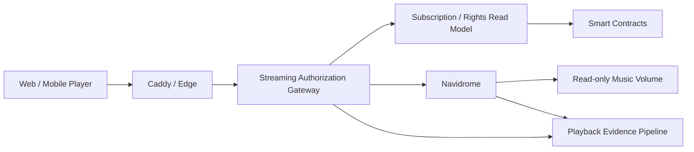
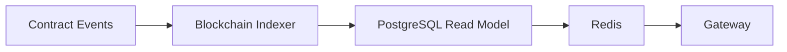
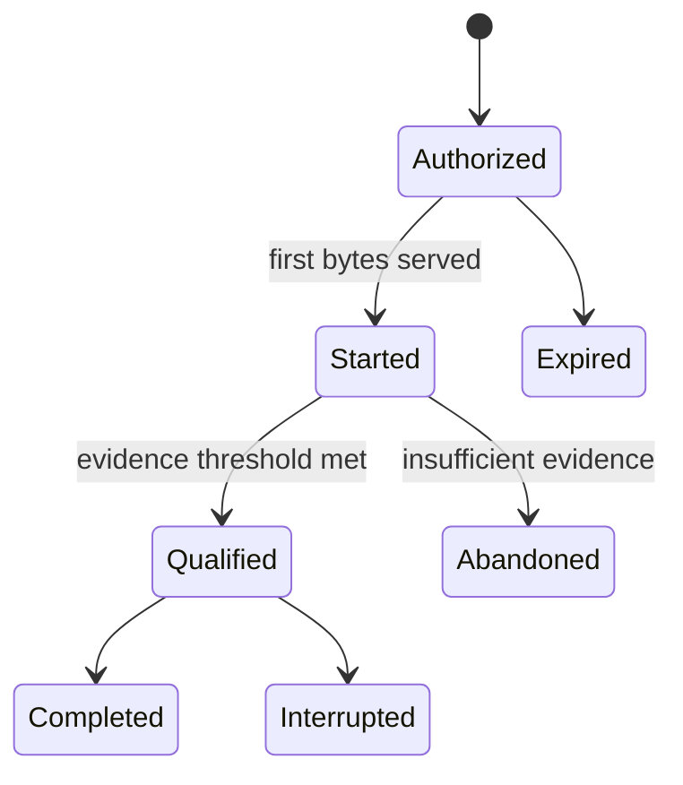

# ADR-0009: Navidrome / Streaming Authorization Gateway

**Status:** Proposed
**Date:** 2026-08-19

## 1. Context

Creator First Platform は、Stablecoin Subscription、Rights Registry、Usage Verification、Creator Distributionを、実際の音楽ストリーミングへ接続する必要がある。

一方、次の処理を一つのサービスへ集中させると、責任境界が不明確になる。

- 音源スキャン、検索、プレイリスト、トランスコード
- Account / Wallet認証
- On-chain Subscriptionの確認
- 楽曲ごとの権利、地域、期間、Plan判定
- HTTP Range配信
- Playback Evidenceの生成
- 分配対象となるValid Usageの確定

Navidromeは音楽ライブラリとストリーミングの実装を早期に検証するために有用だが、Subscription、Rights、法的な利用実績またはCreator DistributionのSource of Truthではない。

また、音楽再生ごとにBlockchain RPCへ同期問い合わせを行うと、再生開始遅延と外部依存障害がCritical Pathへ入る。

## 2. Decision

Creator First Platform は、初期実装において次の構成を採用候補とする。

> **Navidromeは非公開のMedia Serverとし、Creator First Streaming Authorization Gatewayを唯一の公開再生境界とする。**



NavidromeのPortはPublic Networkへ公開しない。Gatewayだけが専用内部NetworkからNavidromeへ接続できるものとする。

## 3. Responsibility Boundary

### Navidrome

Navidromeは次を担当する。

- 音源ファイルのスキャン
- 楽曲、Album、ArtistのMetadata Index
- SearchおよびPlaylist
- Cover Art
- HTTP Range Response
- Direct PlayおよびFFmpeg Transcoding
- OpenSubsonic互換API

### Streaming Authorization Gateway

Gatewayは次を担当する。

- Platform Sessionの検証
- AccountとWalletの関連確認
- Subscription Read Modelの参照
- Track、Plan、Territory、License Window、Rights Versionの判定
- Concurrent StreamおよびRate Limit
- 短時間Playback Sessionの発行
- Navidrome内部IDへのMapping
- 許可済みRequestだけのStreaming Proxy
- Server-side Playback Evidenceの生成
- Client supplied authentication headerの除去

### Smart Contracts

Smart Contractは次を担当する。

- Subscriptionの成立、更新、取消しおよび期限
- Settlement Assetの許可状態
- Versioned Rights StateのCommitment
- Usage RootおよびDistribution Root
- Creator / Rights HolderによるClaim

### Operating Corporation

運営株式会社は次を担当する。

- 配信契約と権利審査
- 音源公開・停止の業務判断
- 個人情報と監査証拠の管理
- 返金、税務、会計および法令対応
- Security Incident対応

## 4. Public API Boundary

ClientへNavidromeのInternal APIまたはMedia IDを直接公開しない。

初期Gatewayは少なくとも次のAPIを提供する。

```text
POST   /v1/auth/siwe/nonce
POST   /v1/auth/siwe/verify
POST   /v1/auth/refresh
POST   /v1/auth/logout
GET    /v1/catalog/tracks/:trackId
POST   /v1/playback-sessions
GET    /v1/streams/:playbackSessionId
POST   /v1/playback-events
DELETE /v1/playback-sessions/:playbackSessionId
```

任意のNavidrome Pathを転送できる汎用Proxyは提供しない。

## 5. Authentication

Walletを使用する場合は、nonce、domain、chain ID、有効期限を検証するSIWE等の標準的なOff-chain Signature Flowを利用する。

署名検証後は短時間のPlatform Sessionへ変換し、音楽再生ごとにWallet Signatureを要求しない。これはADR-0008のAccount / Wallet分離に従う。

Navidrome Externalized Authenticationを利用する場合、Gatewayが生成したPseudonymous Usernameを`Remote-User`として内部Requestへ付与する。

次を必須とする。

- Clientから受信した`Remote-User`を破棄する
- Gateway以外をNavidromeのTrusted Sourceにしない
- NavidromeのPublic ShareおよびDownloadを無効化する
- Navidrome固有のCookie、PasswordまたはAuthorizationをClientへ返さない
- 初期Admin Userを管理された手順で作成する

Navidromeの外部認証はTrusted ProxyからのHeaderを信頼するため、Network IsolationとHeader Sanitizationを一つのControlとして扱う。

## 6. Playback Authorization

GatewayはPlayback Session発行時に少なくとも次を確認する。

```text
authenticated
AND account_active
AND subscription_active
AND settlement_asset_allowed
AND track_published
AND rights_active
AND plan_allowed
AND territory_allowed
AND within_license_window
AND concurrent_stream_limit_not_exceeded
```

判定結果は`allowed`だけでなく、機械可読なReason Codeを持つ。

```text
SUBSCRIPTION_INACTIVE
RIGHTS_SUSPENDED
PLAN_NOT_ALLOWED
TERRITORY_DENIED
OUTSIDE_LICENSE_WINDOW
CONCURRENCY_LIMIT
```

## 7. Playback Session

Gatewayは認可成功時に短時間のOpaque Playback Sessionを生成する。

Sessionは少なくとも次をBindingする。

- Platform Account ID
- Pseudonymous Navidrome Username
- Creator First Track ID
- Navidrome Media ID
- Subscription ID / Plan ID
- Rights Version
- Format / Maximum Bitrate
- Issued At / Expires At
- Concurrency Lease

Playback URLだけを取得した第三者が長期間再利用できないよう、Sessionには短いTTL、Owner Binding、失効およびRate Limitを適用する。

## 8. Streaming Proxy

MVPではGatewayがNavidromeの音声ResponseをBufferせず逐次転送する。

Gatewayは`Range`、`If-Range`等の許可済みHeaderだけをNavidromeへ渡し、`206 Partial Content`、`Content-Range`、`Accept-Ranges`等の必要なResponse HeaderだけをClientへ返す。

Client切断時はUpstream Requestと不要なTranscodeを可能な範囲で中断する。

ただし、Gateway Relayは帯域とConnectionを消費する。負荷試験で定義するScale Triggerを超えた場合は、事前Transcode、Object Storage、CDNおよび短時間署名URLへAudio Byte Deliveryを移す。

Navidromeはその移行後もCatalog AdapterまたはPoC Serverとして残せるが、Protocol上の必須依存にはしない。

## 9. Subscription and Rights Read Model

再生ごとの同期RPC呼出しは行わず、確認済みContract EventからRead Modelを構築する。



Read Modelはchain ID、block number、block hash、transaction hash、log indexを保持し、Reorganization時に巻き戻せるものとする。

- 新規Playback Sessionは判定不能時にFail Closedとする
- 開始済みStreamには短いGrace Windowを定義できる
- Rights SuspensionとAccount SuspensionはCacheを即時失効させる
- Grace Windowの長さは法務・権利・可用性レビュー対象とする

## 10. Track Identity and Catalog Mapping

Creator First Track IDをCanonical Identifierとし、Navidrome IDを交換可能なAdapter Identifierとして扱う。

```text
Creator First Track ID
    -> Catalog Mapping
    -> Navidrome Media ID
    -> Read-only Audio File
```

MappingはISRC、MusicBrainz ID、Content Hash、Rights Version、Publication Stateを必要に応じて関連付ける。

Navidrome IDをRights Registry、Usage CommitmentまたはDistribution RootのCanonical Keyにしてはならない。

## 11. Playback Evidence

HTTP Range Request一回を一回の有効再生として数えない。

Gateway Byte Delivery、Player Heartbeat、Session State、Subscription State、Rights VersionおよびFraud Signalを照合し、Usage Verification LayerがValid Usageを決定する。



NavidromeのPlay CountまたはScrobbleだけをCreator Distributionの根拠にしない。

## 12. Deployment Topology

初期構成は次を想定する。

```text
Public:   Caddy :443
Private:  Gateway, PostgreSQL, Redis, Event Queue
Media:    Gateway, Navidrome :4533
Storage:  /music read-only, /data persistent, /cache writable
```

CaddyからNavidromeへ直接到達できないNetwork Policyとする。Navidrome Containerはnon-rootで動作させ、Image Versionを固定する。

## 13. Observability

少なくとも次を計測する。

- Playback Authorization latency / denial reason
- Playback Start Time p50 / p95 / p99
- Range Response status
- Active Stream / Concurrent Transcode
- Upstream error / client disconnect
- Bytes served
- Playback Evidence loss rate
- Subscription Indexer lag
- Rights Suspension propagation time
- CPU、Memory、CacheおよびStorage

個人の再生履歴をMetrics Labelへ含めない。

## 14. Alternatives Considered

### Navidromeを直接Publicへ公開する

SubscriptionとRights Enforcementを迂回できる経路が生じるため採用しない。

### NavidromeのUser / Library権限だけでPlanを表現する

Library単位の制御は補助的に利用できるが、楽曲ごとのRights Version、Territory、License WindowおよびOn-chain Subscriptionを十分に表現できないため、唯一のPolicy Engineにはしない。

### 再生ごとにSmart Contractを直接読む

RPC latency、Rate Limit、Chain障害をPlayback Critical Pathへ入れるため採用しない。

### 再生ごとにOn-chain Transactionを送る

Cost、Latency、PrivacyおよびWallet UXの要件を満たさないため採用しない。

### 最初から独自Media Serverを構築する

Track Range、Transcoding、Metadata Scan等の実装範囲が大きく、Subscription-to-Playback Vertical Sliceの検証を遅らせるため初期段階では採用しない。

## 15. Consequences

### Positive

- 既存OSSを使ってStreaming Vertical Sliceを早期に検証できる
- Subscription、Rights、Media Serverの責務を分離できる
- Navidromeを将来置換できる
- ClientへNavidrome Credentialを配布せずに済む
- Server-side EvidenceをUsage Verificationへ接続できる
- 通常再生からWalletとBlockchain RPCを外せる

### Negative

- Gatewayが帯域とConnectionのBottleneckになり得る
- Range、Backpressure、Cancellation、Timeoutの正確な実装が必要になる
- Blockchain Read Modelの整合性とReorg処理が必要になる
- Navidrome IDとのCatalog Mappingを維持する必要がある
- Header-based Authenticationの設定不備が重大な権限昇格につながる
- 本番ScaleではCDN Deliveryへの移行が必要になる可能性が高い

## 16. Validation Gates

本ADRをAcceptedへ変更する前に、少なくとも次を検証する。

1. Wallet Loginから30秒以上の権利処理済みTest Audio再生までのEnd-to-End Test
2. Subscription取消しおよびRights停止後の新規再生拒否
3. Client supplied `Remote-User`の除去
4. Navidrome PortへPublic Networkから到達できないこと
5. Range、Seek、Pause、ReconnectおよびClient Abort
6. Duplicate SessionおよびConcurrent Stream Limit
7. RPC停止、Indexer遅延、Redis停止およびNavidrome停止
8. Playback Evidenceの欠損、重複および順序逆転
9. Load TestによるGateway RelayのScale Trigger
10. NavidromeおよびGatewayのOSS License、Security、Privacy Review

## 17. Open Questions

- Gateway実装言語とFrameworkを何にするか
- SIWE、PasskeyおよびEmbedded Walletをどう組み合わせるか
- Playback Session TTLとGrace Windowを何秒にするか
- Region判定のSourceと異議訂正手続をどうするか
- Navidrome Multi-libraryをPlan補助制御に利用するか
- Eligible Playbackの最低時間とEvidence Thresholdをどう定義するか
- Object Storage + CDNへ移行するScale Triggerを何にするか
- Navidromeの改変が必要になった場合のGPL-3.0対応をどう行うか

これらは本ADRだけで確定せず、Protocol DecisionとImplementation Work Packageで追跡する。

## 18. Relationship to Other ADRs

- ADR-0003は配信可否を決めるVersioned Rights Stateを提供する
- ADR-0005はPlayback EvidenceをValid Usageへ変換する
- ADR-0007はSubscriptionとCommitmentが利用するBlockchain / L2を定義する
- ADR-0008はPlatform Account、Wallet、Sessionの分離を定義する
- ADR-0009はこれらを実際のMedia Deliveryへ接続するApplication Boundaryを定義する

## 19. Related Documents

- [Whitepaper: Platform Architecture](/whitepaper/04-platform-architecture)
- [Whitepaper: Technology](/whitepaper/09-technology)
- [Whitepaper: Security](/whitepaper/10-security)
- [Whitepaper: Infrastructure and Cost](/whitepaper/12-infrastructure-cost)
- [Protocol: Vertical Slice](/protocol/vertical-slice)
- [Protocol: Implementation Plan](/protocol/implementation-plan)
- [Protocol: Subscription Settlement](/protocol/specs/subscription-settlement)
- [Protocol: Rights Registry](/protocol/specs/rights-registry)
- [Protocol: Playback Verification](/protocol/specs/playback-verification)
- [Navidrome Externalized Authentication](https://www.navidrome.org/docs/usage/integration/authentication/)
- [Navidrome Security Considerations](https://www.navidrome.org/docs/usage/admin/security/)

## 20. Follow-up Work

本ADRの採択候補を検証する最初のVertical Sliceは次とする。

```text
Wallet / Passkey Login
    -> Subscription Read Model
    -> Track Rights Decision
    -> Playback Session
    -> Navidrome Range Stream
    -> Playback Evidence
    -> Mock Usage Aggregation
```

本番資金または未公開音源を扱う前に、Threat Model、Failure Injection、License Review、Privacy ReviewおよびIndependent Security Reviewを完了する。
