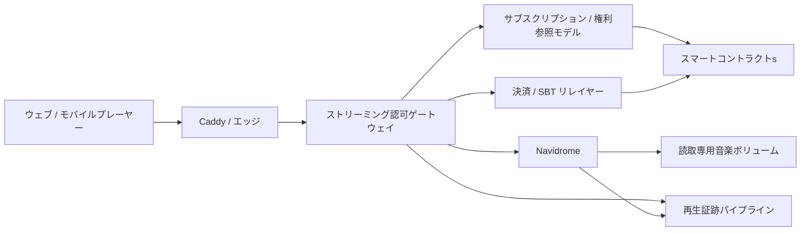
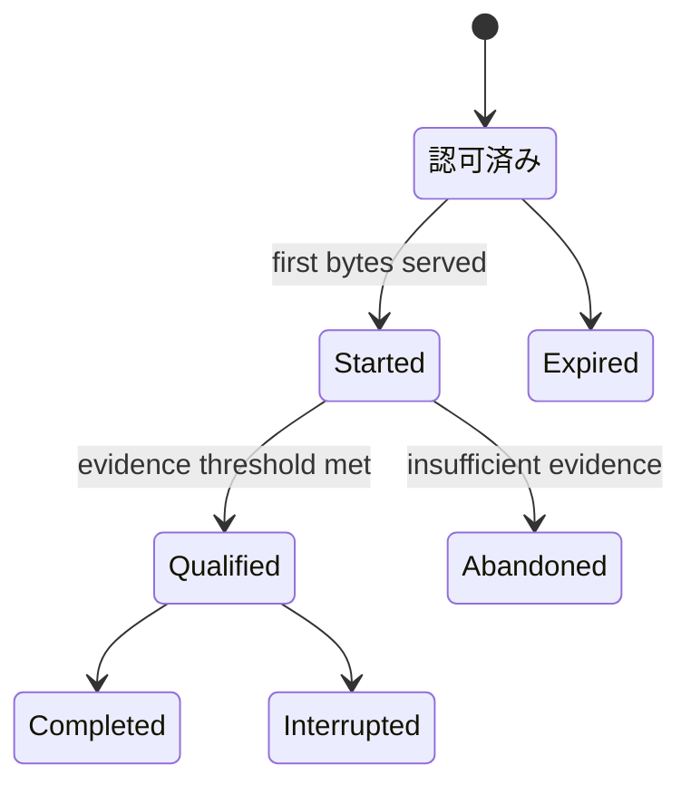

# ADR-0009: Navidrome / ストリーミング認可ゲートウェイ

**状態:** 提案
**日付:** 2026-08-19
**最終更新日:** 2026-09-03

> **実装 note (2026-08-23):** `apps/gateway`にローカルモック最小縦断実装を実装した。固定モックサブスクリプション／権利、5分の単一再生セッション、単一範囲、SQLite 配信証跡、SIWE／EIP-712検証、合成音源ファイルアダプターおよび明示対応付け方式のNavidrome アダプターを含む。現在実装しているアプリケーション APIはカタログ Home、Test-only プロフィール、再生セッション／ストリーム、SIWE、支援意思／モック資格証明状態およびコミュニティ Capabilityの限定Surfaceである。テストネットコントラクトはPolygon Amoyへデプロイしたが、ゲートウェイはまだそのイベントを参照しない。`auth/refresh`、`auth/logout`、クライアント再生イベント、検索・アーティスト・Album詳細、コントラクトインデクサーおよび本番参照モデルは未実装である。これは`MOCK-ASSUMPTION-001`の範囲内であり、提案決定、未解決事項、本番構成または法的権利を確定しない。

> **実装 note (2026-08-29):** Google クラウドの単一VM上で静的な実験画面、同一オリジン`/api`、参加申請ゲートウェー、SQLite、Gmail確認メールおよびNavidromeを起動した。GitHub Pagesは説明・入口でありAPIを提供しない。操作開始リンクは公開ランタイム情報を介してクラウド版へ遷移し、GitHub Pages上で申請APIを直接呼ばない。現在のQuick Tunnel URLは一時的であり、固定ドメインまたは名前付きトンネルの成立を意味しない。

> **実装 note (2026-09-03):** 再起動で変化するQuick Tunnelを廃止し、VMへ割り当て済みの外部IPv6 `/96`を静的アドレスへ昇格した。無償実験では`nip.io`による固定DNS名とCaddyの自動TLSを使用し、同じHTTPSオリジンをSIWE domain、WebAuthn RP ID、公開APIおよび画面へ一貫して適用する。`nip.io`は外部無償DNSへの依存であり、本番用の管理ドメインを代替しない。

## 1. 背景

Creator First Platform は、ステーブルコインサブスクリプション、権利登録台帳、利用実績検証、音楽クリエーター分配を、実際の音楽ストリーミングへ接続する必要がある。

一方、次の処理を一つのサービスへ集中させると、責任境界が不明確になる。

- 音源スキャン、検索、プレイリスト、トランスコード
- アカウント / ウォレット認証
- オンチェーンサブスクリプションの確認
- 楽曲ごとの権利、地域、期間、計画判定
- HTTP 範囲配信
- 再生証跡の生成
- 分配対象となる有効利用実績の確定

Navidromeは音楽ライブラリとストリーミングの実装を早期に検証するために有用だが、サブスクリプション、権利、法的な利用実績または音楽クリエーター分配の正本ではない。

また、音楽再生ごとにブロックチェーン RPCへ同期問い合わせを行うと、再生開始遅延と外部依存障害が重大 Pathへ入る。

## 2. 決定

Creator First Platform は、初期実装において次の構成を採用候補とする。

> **Navidromeは非公開のメディアサーバーとし、音楽クリエーター中心ストリーミング認可ゲートウェイを唯一の公開再生境界とする。**

Navidrome固有の構成、認証、ネットワーク分離、アダプター、配信、証跡、規模拡大 Triggerおよび置換条件は、本ADRと関連プロトコル仕様を技術的な記録先とする。ホワイトペーパーは製品固有の実装詳細を持たず、技術選択を交換可能に保つ。



NavidromeのPortは公開ネットワークへ公開しない。ゲートウェイだけが専用内部ネットワークからNavidromeへ接続できるものとする。

## 3. 責任境界

### Navidrome

Navidromeは次を担当する。

- 音源ファイルのスキャン
- 楽曲、Album、アーティストのメタデータ索引
- 検索およびプレイリスト
- Cover Art
- HTTP 範囲対応
- 直接 PlayおよびFFmpeg トランスコード
- OpenSubsonic互換API

### ストリーミング認可ゲートウェイ

ゲートウェイは次を担当する。

- プラットフォームセッションの検証
- アカウントとウォレットの関連確認
- サブスクリプション参照モデルの参照
- 楽曲、計画、地域、License Window、権利版の判定
- Concurrent ストリームおよび率制限
- 短時間再生セッションの発行
- Navidrome内部IDへの対応付け
- 許可済みリクエストだけのストリーミングプロキシ
- Server-side 再生証跡の生成
- クライアント supplied authentication headerの除去

### スマートコントラクトs

スマートコントラクトは次を担当する。

- サブスクリプションの成立、更新、取消しおよび期限
- JPYC等の承認済み精算資産による決済イベント
- 初期サポーター SBTの発行、失効およびBurn イベント
- 精算資産の許可状態
- Versioned 権利状態のコミットメント
- 利用実績ルートおよび分配ルート
- 音楽クリエーター／権利者による主張

### 運営株式会社

運営株式会社は次を担当する。

- 配信契約と権利審査
- 音源公開・停止の業務判断
- 個人情報と監査証拠の管理
- 返金、税務、会計および法令対応
- セキュリティインシデント対応

## 4. 公開 API 境界

クライアントへNavidromeの内部 APIまたはメディア IDを直接公開しない。

初期ゲートウェイは少なくとも次のAPIを提供する。

```text
POST   /v1/auth/siwe/nonce
POST   /v1/auth/siwe/verify
POST   /v1/auth/refresh
POST   /v1/auth/logout
GET    /v1/catalog/tracks/:trackId
POST   /v1/playback-sessions
GET    /v1/streams/:playbackSessionId
POST   /v1/playback-events
DELETE /v1/playback-sessions/:playbackSessionId
```

上記は採用候補となるTarget Surfaceであり、すべてが現在のモックに実装済みという意味ではない。現行モック固有の`GET /v1/demo/user`と`POST /v1/demo/users`はAliasと通知確認のUI検証だけを行うテスト試験基盤 APIであり、プラットフォームアカウント、認証器、ウォレット連携、サブスクリプションまたは資格証明を作成しない。

任意のNavidrome Pathを転送できる汎用プロキシは提供しない。

## 5. 認証

ウォレットを使用する場合は、nonce、domain、chain ID、有効期限を検証するSIWE等の標準的なオフチェーン署名フローを利用する。

署名検証後は短時間のプラットフォームセッションへ変換し、音楽再生ごとにウォレット署名を要求しない。これはADR-0008のアカウント / ウォレット分離に従う。

Navidrome Externalized 認証を利用する場合、ゲートウェイが生成した仮名 Usernameを`Remote-User`として内部リクエストへ付与する。

次を必須とする。

- クライアントから受信した`Remote-User`を破棄する
- ゲートウェイ以外をNavidromeの信頼されたソースにしない
- Navidromeの公開比率およびダウンロードを無効化する
- Navidrome固有のCookie、Passwordまたは認可をクライアントへ返さない
- 初期管理ユーザを管理された手順で作成する

Navidromeの外部認証は信頼されたプロキシからのHeaderを信頼するため、ネットワーク IsolationとHeader Sanitizationを一つの制御として扱う。

## 6. 再生認可

ゲートウェイは再生セッション発行時に少なくとも次を確認する。

```text
authenticated
AND account_active
AND subscription_active
AND settlement_asset_allowed
AND track_published
AND rights_active
AND plan_allowed
AND territory_allowed
AND within_license_window
AND concurrent_stream_limit_not_exceeded
```

判定結果は`allowed`だけでなく、機械可読なReason コードを持つ。

```text
SUBSCRIPTION_INACTIVE
RIGHTS_SUSPENDED
PLAN_NOT_ALLOWED
TERRITORY_DENIED
OUTSIDE_LICENSE_WINDOW
CONCURRENCY_LIMIT
```

## 7. 再生セッション

ゲートウェイは認可成功時に短時間のOpaque 再生セッションを生成する。

セッションは少なくとも次を結付けする。

- プラットフォームアカウント ID
- 仮名 Navidrome Username
- 音楽クリエーター中心楽曲 ID
- Navidrome メディア ID
- サブスクリプション ID / 計画 ID
- 権利版
- 形式 / Maximum Bitrate
- Issued At / Expires At
- Concurrency Lease

再生 URLだけを取得した第三者が長期間再利用できないよう、セッションには短いTTL、Owner 結付け、失効および率制限を適用する。

## 8. ストリーミングプロキシ

MVPではゲートウェイがNavidromeの音声対応をバッファせず逐次転送する。

ゲートウェイは`Range`、`If-Range`等の許可済みHeaderだけをNavidromeへ渡し、`206 Partial Content`、`Content-Range`、`Accept-Ranges`等の必要な対応 Headerだけをクライアントへ返す。

クライアント切断時はUpstream リクエストと不要なTranscodeを可能な範囲で中断する。

ただし、ゲートウェイ Relayは帯域とConnectionを消費する。負荷試験で定義する規模拡大 Triggerを超えた場合は、事前Transcode、オブジェクトストレージ、CDNおよび短時間署名URLへ音声 Byte 配信を移す。

Navidromeはその移行後もカタログアダプターまたはPoC サーバーとして残せるが、プロトコル上の必須依存にはしない。

## 9. サブスクリプション・権利参照モデル

再生ごとの同期RPC呼出しは行わず、確認済みコントラクトイベントから参照モデルを構築する。


参照モデルはchain ID、block number、block hash、transaction hash、log indexを保持し、Reorganization時に巻き戻せるものとする。

- 新規再生セッションは判定不能時にFail Closedとする
- 開始済みストリームには短いGrace Windowを定義できる
- 権利 Suspensionとアカウント Suspensionはキャッシュを即時失効させる
- Grace Windowの長さは法務・権利・可用性レビュー対象とする

## 10. 楽曲アイデンティティ・カタログ対応付け

音楽クリエーター中心楽曲 IDを正規 Identifierとし、Navidrome IDを交換可能なアダプター Identifierとして扱う。

```text
音楽クリエーター中心楽曲 ID
    -> カタログ対応付け
    -> Navidrome メディア ID
    -> 読取専用音声ファイル
```

対応付けはISRC、MusicBrainz ID、コンテンツハッシュ、権利版、Publication 状態を必要に応じて関連付ける。

Navidrome IDを権利登録台帳、利用実績コミットメントまたは分配ルートの正規鍵にしてはならない。

## 11. 再生証跡

HTTP 範囲リクエスト一回を一回の有効再生として数えない。

ゲートウェイ Byte 配信、プレーヤー Heartbeat、セッション状態、サブスクリプション状態、権利版および不正 Signalを照合し、利用実績検証レイヤーが有効利用実績を決定する。



Navidromeの再生回数またはScrobbleだけを音楽クリエーター分配の根拠にしない。

## 12. デプロイ構成

デプロイは、ローカル単体確認、開発・プレゼン用テスト環境および本番候補環境を分離する。テスト環境の成立は、本番環境のセキュリティ、権利、プライバシー、可用性または法令適合性を証明しない。

### 12.1 ローカル単体検証

Navidrome アダプターを有効化する前の独立したローカル管理・検証に限り、Navidrome `0.63.2`をHost Loopbackの`127.0.0.1:4533`へ公開し、合成試験音でScanと再生を確認する。この例外はLANまたはインターネットへの公開を許可せず、プレーヤーから利用せず、ゲートウェイとNavidromeを同一の非公開メディアネットワークへ接続する時点で削除する。手順は[ローカル音楽ストリーミング](/demo/local-streaming)に記録する。

### 12.2 開発・プレゼンテスト環境

開発およびプレゼンでSubscription-to-Playback 最小縦断実装を実証する環境は、金銭的価値を持たないテスト資産と合成または利用許諾確認済み音源だけを扱い、月額費用を発生させないことを設計目標とする。ただしクラウド事業者の無料枠または第三者サービスの無償提供を保証とみなさず、Billing、Quotaおよび利用条件をデプロイ前に再確認する。

#### 資源・コスト境界

テスト環境は次を満たす。

- Google クラウド無料枠対象地域のコンピュートエンジン `e2-micro`を1台だけ使用する
- Persistent Diskは`pd-standard`とし、Boot、音源、データベースおよびキャッシュの合計を30 GB-month以下にする
- 課金対象となる外部IPv4、負荷分散器、クラウド NAT、クラウド DNSおよび自動スナップショットを使用しない
- VMには外部IPv6だけを割り当て、その`/96`を静的アドレスとして予約する
- InboundはCaddyが使用するTCP 80/443だけを許可し、アプリケーションの8080番PortはHost Loopbackに限定する
- 公開HTTPS入口は固定IPv6を表す`nip.io`ホスト名とCaddyの自動TLSを使用する
- 無償DNSにSLAがないことおよび開発・テスト用途限定であることを表示する
- GitHub Pagesには受付APIを置かず、`demo-runtime.json`で検証済みのクラウド実験オリジンを一元公開し、実際の申請操作を同一オリジンのクラウド画面へ遷移させる
- ランタイム情報から生成する遷移先はHTTPSかつ`/creator-first-platform/demo/`配下に限定し、ホワイトペーパー、管理画面または任意の外部URLへ転送しない
- Google クラウド予算警告を設定する。ただし警告はHard Capではないため、ゲートウェイ自身が配信Byte数を制限する
- ゲートウェイは月間音声配信が700 MiBに達した時点で警告し、800 MiBで新規再生セッションを停止する
- 少なくとも200 MiBをTunnel、RPC、管理およびプロトコル Overheadの予備として残す

#### 実行時境界

e2-micro上の実行時は原則として次だけで構成する。

```text
Caddy / 固定HTTPSホスト名
    -> ストリーミング認可ゲートウェイ
        -> Navidrome
        -> SQLite 参照モデル / 再生証跡
        -> Polygon Amoy RPC
        -> リレイヤー Module
```

- ゲートウェイは単一の軽量手続として実装する
- リレイヤーはゲートウェイ内の限定Moduleとし、別の常駐アプリケーションサーバーを追加しない
- 参照モデル、Nonce、セッション、Allowlist、再生証跡および月間配信Byte数はSQLiteへ保存できる
- PostgreSQL、Redis、イベント一覧、ローカルブロックチェーン Nodeおよび検索Clusterをテスト環境へ配置しない
- Caddyで公開TLSを終端し、証明書状態は永続領域へ保存する
- 音源は96 kbpsまたは128 kbpsへ事前変換し、直接 Playを基本とする
- Navidromeの同時Transcodeは最大1本とし、クライアント切断時のTranscode Cancellationを有効にする
- プレゼン成立条件は同時直接 Play 1〜3本を目標とし、実測値を記録する

#### ゲートウェイ・スマートコントラクト境界

ゲートウェイを唯一の公開アプリケーション境界とし、NavidromeのPort、資格証明、内部 APIおよびメディア IDをクライアントへ公開しない。

- ウォレット認証はnonce、domain、URI、チェーン ID、有効期限を検証するSIWEを使用する
- ユーザが認識するサブスクリプション価格と決済意思は`MockJPYC`建てとし、テスト ETHを支払資産として受け付けない
- ゲートウェイは署名済み決済認可を検証してリレイヤーへ渡せるが、リレイヤー受付またはガス支払だけでサブスクリプションを有効化しない
- `DemoSubscription`は一致する`MockJPYC` 転送がファイナリティ条件を満たした後だけ有効化する
- 明示的なSBT受領同意と資格判定を確認した後だけ、リレイヤーが初期サポーター SBT発行トランザクションを送信できる
- テスト参加者はウォレット Allowlistまたは明示的な招待記録で制限する
- サブスクリプションおよび権利判定はPolygon Amoy（チェーンID `80002`）の検証済みRPCから取得し、15〜30秒の短時間キャッシュへ保存する
- RPC Timeout、率制限、チェーン ID不一致、コントラクトアドレス不一致または判定不能時は新規再生セッションをFail Closedにする
- 認可成功時だけ、アカウント、楽曲、権利版、サブスクリプションおよびTTLを結付けした短時間再生 Ticketを発行する
- ゲートウェイは許可済み`Range` HeaderだけをNavidromeへ渡し、配信Byte数とServer-side 再生証跡をSQLiteへ記録する

Polygon Amoyのテストコントラクトは少なくとも次を分離する。

- `MockJPYC`: 金銭的価値、償還請求権または実在JPYCとの交換可能性を持たないテストトークン
- `DemoSubscription`: ウォレット、計画、開始時刻、有効期限および取消状態
- `DemoRightsRegistry`: 音楽クリエーター中心楽曲 ID、公開状態、権利版および停止状態
- `DemoEarlySupporterSBT`: 譲渡不能、失効可能かつ金銭的権利を持たないテスト資格証明

現在の公開コントラクト利用フローはPolygon AmoyのチェーンID`80002`へデプロイ済みであり、コントラクトアドレス、デプロイトランザクション、ABI、ソースコミットおよび使用RPCをデモ画面へ表示する。新規のゲートウェイ統合テストと本番リハーサルもAmoyを使用するが、環境ごとに鍵、デプロイID、マニフェスト、資産登録台帳、インデクサー開始点および監視を分離する。Amoy POLはガスにだけ使用し、料金表示、決済意思、サブスクリプション収益またはSBT資格額に使用しない。Mainnet資産、本番ウォレット、本番秘密鍵、実在サブスクリプション、実在権利、未公開音源または個人情報をテスト環境へ投入しない。Deployer鍵とリレイヤー鍵はリポジトリへコミットせず、用途と権限を分離し、可能な限りVMへ常置しない。

#### テスト環境受入基準

開発・プレゼン用環境は少なくとも次を再現できなければならない。

1. AllowlistされたウォレットによるSIWE成功と、未許可ウォレットの拒否
2. 有効な`DemoSubscription`と有効権利による試験音再生
3. サブスクリプション期限切れまたは取消し後の新規再生拒否
4. 権利停止または権利版不一致後の新規再生拒否
5. RPC停止、Timeoutまたは誤チェーン接続時のFail Closed
6. 再生 Ticketの期限切れ、Owner不一致およびReplayの拒否
7. HTTP 範囲、Seek、停止、Reconnectおよびクライアント Abort
8. Navidromeへ公開経路から直接到達できないこと
9. 再生証跡、配信Byte数およびDenial Reasonの監査可能な記録
10. 700 MiB警告と800 MiB新規セッション停止の自動テスト
11. e2-microでOOMを発生させず、同時直接 Play 1〜3本と最大1 Transcodeの測定結果を保存すること
12. `MockJPYC`の正しい資産、Amount、チェーンおよび決済意思だけがサブスクリプションを有効化し、テスト ETH、誤資産、未確定または重複決済が有効化しないこと
13. ユーザがテスト ETHを保持しなくてもリレイヤー経由で決済とSBT発行を操作でき、ガス支払がサブスクリプション決済として記録されないこと
14. 明示的同意と資格判定がある場合だけデモ SBTを一回発行し、転送、重複発行、失効後の特権およびSBT単独での通常再生を拒否すること

### 12.3 本番候補構成

本番候補構成は次を想定する。

```text
公開:   Caddy :443
非公開:  ゲートウェイ, PostgreSQL, Redis, イベント一覧
メディア:    ゲートウェイ, Navidrome :4533
ストレージ:  /music read-only, /data persistent, /cache writable
```

CaddyからNavidromeへ直接到達できないネットワークポリシーとする。Navidrome Containerはnon-rootで動作させ、Image 版を固定する。

## 13. 可観測性

少なくとも次を計測する。

- 再生認可 latency / denial reason
- 再生開始 Time p50 / p95 / p99
- 範囲対応 status
- 有効ストリーム / Concurrent Transcode
- Upstream error / client disconnect
- Bytes served
- 再生証跡 loss rate
- サブスクリプションインデクサー lag
- 権利 Suspension propagation time
- CPU、Memory、キャッシュおよびストレージ

個人の再生履歴を指標レーベルへ含めない。

## 14. 検討した代替案

### Navidromeを直接公開へ公開する

サブスクリプションと権利 Enforcementを迂回できる経路が生じるため採用しない。

### Navidromeのユーザ / ライブラリ権限だけで計画を表現する

ライブラリ単位の制御は補助的に利用できるが、楽曲ごとの権利版、地域、License Windowおよびオンチェーンサブスクリプションを十分に表現できないため、唯一のポリシーエンジンにはしない。

### 再生ごとにスマートコントラクトを直接読む

RPC latency、率制限、チェーン障害を再生重大 Pathへ入れるため採用しない。

### 再生ごとにオンチェーントランザクションを送る

コスト、Latency、プライバシーおよびウォレット UXの要件を満たさないため採用しない。

### 最初から独自メディアサーバーを構築する

楽曲範囲、トランスコード、メタデータ Scan等の実装範囲が大きく、Subscription-to-Playback 最小縦断実装の検証を遅らせるため初期段階では採用しない。

## 15. 影響

### 利点

- 既存OSSを使ってストリーミング最小縦断実装を早期に検証できる
- サブスクリプション、権利、メディアサーバーの責務を分離できる
- Navidromeを将来置換できる
- クライアントへNavidrome 資格証明を配布せずに済む
- Server-side 証跡を利用実績検証へ接続できる
- 通常再生からウォレットとブロックチェーン RPCを外せる

### 欠点

- ゲートウェイが帯域とConnectionのボトルネックになり得る
- 範囲、Backpressure、Cancellation、Timeoutの正確な実装が必要になる
- ブロックチェーン参照モデルの整合性とReorg処理が必要になる
- Navidrome IDとのカタログ対応付けを維持する必要がある
- Header-based 認証の設定不備が重大な権限昇格につながる
- 本番規模拡大ではCDN 配信への移行が必要になる可能性が高い

## 16. 検証ゲート

本ADRをAcceptedへ変更する前に、少なくとも次を検証する。

1. ウォレット Loginから30秒以上の権利処理済みテスト音声再生までのエンドツーエンドテスト
2. サブスクリプション取消しおよび権利停止後の新規再生拒否
3. クライアント supplied `Remote-User`の除去
4. Navidrome Portへ公開ネットワークから到達できないこと
5. 範囲、Seek、停止、Reconnectおよびクライアント Abort
6. Duplicate セッションおよびConcurrent ストリーム制限
7. RPC停止、インデクサー遅延、Redis停止およびNavidrome停止
8. 再生証跡の欠損、重複および順序逆転
9. 負荷テストによるゲートウェイ Relayの規模拡大 Trigger
10. NavidromeおよびゲートウェイのOSS License、セキュリティ、プライバシーレビュー
11. 12.2のテスト環境受入基準を再現した検証証拠
12. 外部IPv4、負荷分散器、クラウド NATおよび追加Diskが作成されていないことのBilling Inventory
13. 公開TCP 80/443がCaddyだけへ到達し、ゲートウェイ、Navidromeおよび8080番Portへ直接到達できないこと
14. Polygon AmoyチェーンID`80002`、コントラクトアドレス、ABIおよびソースコミットの一致
15. テスト環境に本番資金、実在権利、未公開音源、個人情報または本番資格証明が存在しないこと

## 17. 未解決事項

- ゲートウェイ実装言語とFrameworkを何にするか
- SIWE、Passkeyおよび組込みウォレットをどう組み合わせるか
- 再生セッション TTLとGrace Windowを何秒にするか
- 地域判定のソースと異議訂正手続をどうするか
- Navidrome Multi-libraryを計画補助制御に利用するか
- 適格再生の最低時間と証跡しきい値をどう定義するか
- オブジェクトストレージ + CDNへ移行する規模拡大 Triggerを何にするか
- Navidromeの改変が必要になった場合のGPL-3.0対応をどう行うか

これらは本ADRだけで確定せず、プロトコル決定と実装作業パッケージで追跡する。

## 18. 他のADRとの関係

- ADR-0003は配信可否を決めるVersioned 権利状態を提供する
- ADR-0005は再生証跡を有効利用実績へ変換する
- ADR-0007はサブスクリプションとコミットメントが利用するブロックチェーン / L2を定義する
- ADR-0008はプラットフォームアカウント、ウォレット、セッションの分離を定義する
- ADR-0009はこれらを実際のメディア配信へ接続するアプリケーション境界を定義する
- ADR-0010は初期サポーター SBTをサブスクリプションと権利を置き換えない限定特権へ接続する
- ADR-0011はゲートウェイ専用PWA、ウォレット操作、サポーター表示およびクライアントストレージの境界を定義する

## 19. 関連文書

- [ホワイトペーパー: プラットフォームアーキテクチャ](/whitepaper/04-platform-architecture)
- [ホワイトペーパー: Technology](/whitepaper/09-technology)
- [ホワイトペーパー: セキュリティ](/whitepaper/10-security)
- [ホワイトペーパー: インフラ・コスト](/whitepaper/12-infrastructure-cost)
- [プロトコル: 最小縦断実装](/protocol/vertical-slice)
- [プロトコル: 実装計画](/protocol/implementation-plan)
- [プロトコル: サブスクリプション精算](/protocol/specs/subscription-settlement)
- [プロトコル: 初期サポーター資格証明](/protocol/specs/early-supporter-credential)
- [プロトコル: 権利登録台帳](/protocol/specs/rights-registry)
- [プロトコル: 再生検証](/protocol/specs/playback-verification)
- [プロトコル: プレーヤークライアント・ゲートウェイ連携](/protocol/specs/player-client)
- [Navidrome Externalized 認証](https://www.navidrome.org/docs/usage/integration/authentication/)
- [Navidrome セキュリティ上の考慮事項](https://www.navidrome.org/docs/usage/admin/security/)
- [Google クラウド無料枠](https://docs.cloud.google.com/free/docs/free-cloud-features)
- [Google クラウド外部 IP 料金](https://cloud.google.com/vpc/network-pricing)
- [Google クラウド: 静的外部IPアドレスの予約](https://docs.cloud.google.com/vpc/docs/reserve-static-external-ip-address)
- [Caddy HTTPS証明書自動管理](https://caddyserver.com/docs/automatic-https)
- [Polygon PoS RPC endpoints](https://docs.polygon.technology/pos/reference/rpc-endpoints)
- [Polygon Faucet](https://faucet.polygon.technology/)

## 20. 後続作業

本ADRの採択候補を検証する最初の最小縦断実装は次とする。

```text
ウォレット / Passkey Login
    -> サブスクリプション参照モデル
    -> 任意初期サポーター特権参照モデル
    -> 楽曲権利決定
    -> 再生セッション
    -> Navidrome 範囲ストリーム
    -> 再生証跡
    -> モック利用実績集約
```

本番資金または未公開音源を扱う前に、脅威モデル、Failure Injection、License レビュー、プライバシーレビューおよび独立セキュリティレビューを完了する。
