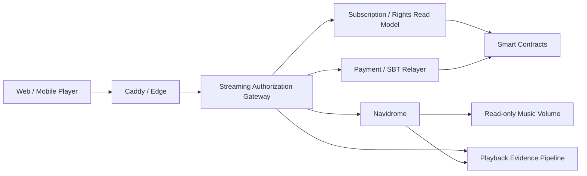
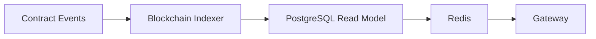
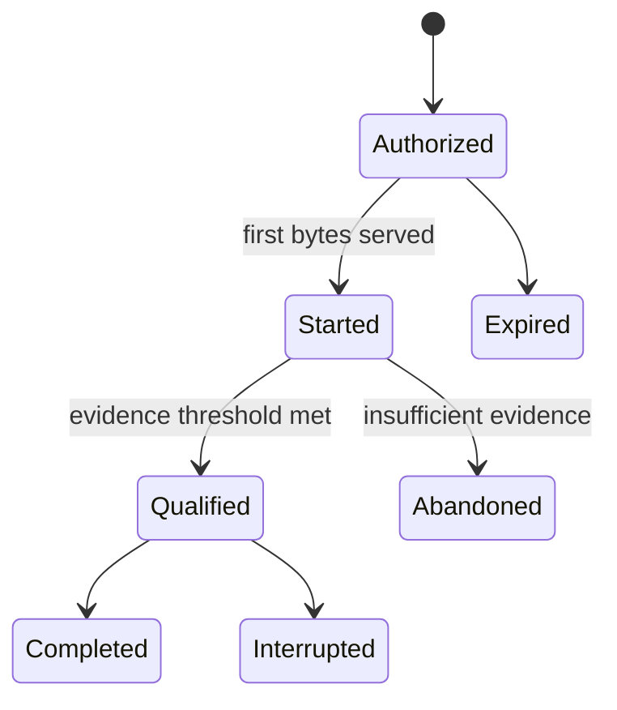

# ADR-0009: Navidrome / Streaming Authorization Gateway

**Status:** Proposed
**Date:** 2026-08-19
**Last Updated:** 2026-08-23

> **Implementation note (2026-08-23):** `apps/gateway`にローカルMock Vertical Sliceを実装した。固定Mock Subscription／Rights、5分の単一Playback Session、単一Range、SQLite Delivery Evidence、SIWE／EIP-712検証、合成音源File Adapterおよび明示Mapping方式のNavidrome Adapterを含む。現在実装しているApplication APIはCatalog Home、Test-only Profile、Playback Session／Stream、SIWE、Support Intent／Mock Credential StatusおよびCommunity Capabilityの限定Surfaceである。Testnet ContractはEthereum Sepoliaへデプロイしたが、GatewayはまだそのEventを参照しない。`auth/refresh`、`auth/logout`、Client Playback Event、検索・Artist・Album詳細、Contract Indexerおよび本番Read Modelは未実装である。これは`MOCK-ASSUMPTION-001`の範囲内であり、Proposed Decision、Open Question、本番Topologyまたは法的Rightsを確定しない。

## 1. Context

Creator First Platform は、Stablecoin Subscription、Rights Registry、Usage Verification、Creator Distributionを、実際の音楽ストリーミングへ接続する必要がある。

一方、次の処理を一つのサービスへ集中させると、責任境界が不明確になる。

- 音源スキャン、検索、プレイリスト、トランスコード
- Account / Wallet認証
- On-chain Subscriptionの確認
- 楽曲ごとの権利、地域、期間、Plan判定
- HTTP Range配信
- Playback Evidenceの生成
- 分配対象となるValid Usageの確定

Navidromeは音楽ライブラリとストリーミングの実装を早期に検証するために有用だが、Subscription、Rights、法的な利用実績またはCreator DistributionのSource of Truthではない。

また、音楽再生ごとにBlockchain RPCへ同期問い合わせを行うと、再生開始遅延と外部依存障害がCritical Pathへ入る。

## 2. Decision

Creator First Platform は、初期実装において次の構成を採用候補とする。

> **Navidromeは非公開のMedia Serverとし、Creator First Streaming Authorization Gatewayを唯一の公開再生境界とする。**



NavidromeのPortはPublic Networkへ公開しない。Gatewayだけが専用内部NetworkからNavidromeへ接続できるものとする。

## 3. Responsibility Boundary

### Navidrome

Navidromeは次を担当する。

- 音源ファイルのスキャン
- 楽曲、Album、ArtistのMetadata Index
- SearchおよびPlaylist
- Cover Art
- HTTP Range Response
- Direct PlayおよびFFmpeg Transcoding
- OpenSubsonic互換API

### Streaming Authorization Gateway

Gatewayは次を担当する。

- Platform Sessionの検証
- AccountとWalletの関連確認
- Subscription Read Modelの参照
- Track、Plan、Territory、License Window、Rights Versionの判定
- Concurrent StreamおよびRate Limit
- 短時間Playback Sessionの発行
- Navidrome内部IDへのMapping
- 許可済みRequestだけのStreaming Proxy
- Server-side Playback Evidenceの生成
- Client supplied authentication headerの除去

### Smart Contracts

Smart Contractは次を担当する。

- Subscriptionの成立、更新、取消しおよび期限
- JPYC等の承認済みSettlement AssetによるPayment Event
- Early Supporter SBTの発行、失効およびBurn Event
- Settlement Assetの許可状態
- Versioned Rights StateのCommitment
- Usage RootおよびDistribution Root
- Creator / Rights HolderによるClaim

### Operating Corporation

運営株式会社は次を担当する。

- 配信契約と権利審査
- 音源公開・停止の業務判断
- 個人情報と監査証拠の管理
- 返金、税務、会計および法令対応
- Security Incident対応

## 4. Public API Boundary

ClientへNavidromeのInternal APIまたはMedia IDを直接公開しない。

初期Gatewayは少なくとも次のAPIを提供する。

```text
POST   /v1/auth/siwe/nonce
POST   /v1/auth/siwe/verify
POST   /v1/auth/refresh
POST   /v1/auth/logout
GET    /v1/catalog/tracks/:trackId
POST   /v1/playback-sessions
GET    /v1/streams/:playbackSessionId
POST   /v1/playback-events
DELETE /v1/playback-sessions/:playbackSessionId
```

上記は採用候補となるTarget Surfaceであり、すべてが現在のMockに実装済みという意味ではない。現行Mock固有の`GET /v1/demo/user`と`POST /v1/demo/users`はAliasとNotice確認のUI検証だけを行うTest Harness APIであり、Platform Account、Authenticator、Wallet Link、SubscriptionまたはCredentialを作成しない。

任意のNavidrome Pathを転送できる汎用Proxyは提供しない。

## 5. Authentication

Walletを使用する場合は、nonce、domain、chain ID、有効期限を検証するSIWE等の標準的なOff-chain Signature Flowを利用する。

署名検証後は短時間のPlatform Sessionへ変換し、音楽再生ごとにWallet Signatureを要求しない。これはADR-0008のAccount / Wallet分離に従う。

Navidrome Externalized Authenticationを利用する場合、Gatewayが生成したPseudonymous Usernameを`Remote-User`として内部Requestへ付与する。

次を必須とする。

- Clientから受信した`Remote-User`を破棄する
- Gateway以外をNavidromeのTrusted Sourceにしない
- NavidromeのPublic ShareおよびDownloadを無効化する
- Navidrome固有のCookie、PasswordまたはAuthorizationをClientへ返さない
- 初期Admin Userを管理された手順で作成する

Navidromeの外部認証はTrusted ProxyからのHeaderを信頼するため、Network IsolationとHeader Sanitizationを一つのControlとして扱う。

## 6. Playback Authorization

GatewayはPlayback Session発行時に少なくとも次を確認する。

```text
authenticated
AND account_active
AND subscription_active
AND settlement_asset_allowed
AND track_published
AND rights_active
AND plan_allowed
AND territory_allowed
AND within_license_window
AND concurrent_stream_limit_not_exceeded
```

判定結果は`allowed`だけでなく、機械可読なReason Codeを持つ。

```text
SUBSCRIPTION_INACTIVE
RIGHTS_SUSPENDED
PLAN_NOT_ALLOWED
TERRITORY_DENIED
OUTSIDE_LICENSE_WINDOW
CONCURRENCY_LIMIT
```

## 7. Playback Session

Gatewayは認可成功時に短時間のOpaque Playback Sessionを生成する。

Sessionは少なくとも次をBindingする。

- Platform Account ID
- Pseudonymous Navidrome Username
- Creator First Track ID
- Navidrome Media ID
- Subscription ID / Plan ID
- Rights Version
- Format / Maximum Bitrate
- Issued At / Expires At
- Concurrency Lease

Playback URLだけを取得した第三者が長期間再利用できないよう、Sessionには短いTTL、Owner Binding、失効およびRate Limitを適用する。

## 8. Streaming Proxy

MVPではGatewayがNavidromeの音声ResponseをBufferせず逐次転送する。

Gatewayは`Range`、`If-Range`等の許可済みHeaderだけをNavidromeへ渡し、`206 Partial Content`、`Content-Range`、`Accept-Ranges`等の必要なResponse HeaderだけをClientへ返す。

Client切断時はUpstream Requestと不要なTranscodeを可能な範囲で中断する。

ただし、Gateway Relayは帯域とConnectionを消費する。負荷試験で定義するScale Triggerを超えた場合は、事前Transcode、Object Storage、CDNおよび短時間署名URLへAudio Byte Deliveryを移す。

Navidromeはその移行後もCatalog AdapterまたはPoC Serverとして残せるが、Protocol上の必須依存にはしない。

## 9. Subscription and Rights Read Model

再生ごとの同期RPC呼出しは行わず、確認済みContract EventからRead Modelを構築する。



Read Modelはchain ID、block number、block hash、transaction hash、log indexを保持し、Reorganization時に巻き戻せるものとする。

- 新規Playback Sessionは判定不能時にFail Closedとする
- 開始済みStreamには短いGrace Windowを定義できる
- Rights SuspensionとAccount SuspensionはCacheを即時失効させる
- Grace Windowの長さは法務・権利・可用性レビュー対象とする

## 10. Track Identity and Catalog Mapping

Creator First Track IDをCanonical Identifierとし、Navidrome IDを交換可能なAdapter Identifierとして扱う。

```text
Creator First Track ID
    -> Catalog Mapping
    -> Navidrome Media ID
    -> Read-only Audio File
```

MappingはISRC、MusicBrainz ID、Content Hash、Rights Version、Publication Stateを必要に応じて関連付ける。

Navidrome IDをRights Registry、Usage CommitmentまたはDistribution RootのCanonical Keyにしてはならない。

## 11. Playback Evidence

HTTP Range Request一回を一回の有効再生として数えない。

Gateway Byte Delivery、Player Heartbeat、Session State、Subscription State、Rights VersionおよびFraud Signalを照合し、Usage Verification LayerがValid Usageを決定する。



NavidromeのPlay CountまたはScrobbleだけをCreator Distributionの根拠にしない。

## 12. Deployment Topology

Deploymentは、ローカル単体確認、開発・プレゼン用Test環境および本番候補環境を分離する。Test環境の成立は、本番環境のSecurity、Rights、Privacy、可用性または法令適合性を証明しない。

### 12.1 Local Standalone Verification

Navidrome Adapterを有効化する前の独立したローカル管理・検証に限り、Navidrome `0.63.2`をHost Loopbackの`127.0.0.1:4533`へ公開し、合成試験音でScanと再生を確認する。この例外はLANまたはInternetへの公開を許可せず、Playerから利用せず、GatewayとNavidromeを同一の非公開Media Networkへ接続する時点で削除する。手順は[ローカル音楽ストリーミング](/demo/local-streaming)に記録する。

### 12.2 Development and Presentation Test Environment

開発およびプレゼンでSubscription-to-Playback Vertical Sliceを実証する環境は、金銭的価値を持たないTest Assetと合成または利用許諾確認済み音源だけを扱い、月額費用を発生させないことを設計目標とする。ただしCloud ProviderのFree Tierまたは第三者Serviceの無償提供を保証とみなさず、Billing、Quotaおよび利用条件をDeploy前に再確認する。

#### Resource and Cost Boundary

Test環境は次を満たす。

- Google Cloud Free Tier対象RegionのCompute Engine `e2-micro`を1台だけ使用する
- Persistent Diskは`pd-standard`とし、Boot、音源、DatabaseおよびCacheの合計を30 GB-month以下にする
- 課金対象となる外部IPv4、Load Balancer、Cloud NAT、Cloud DNSおよび自動Snapshotを使用しない
- VMには外部IPv6だけを割り当て、Inbound PortをInternetへ開放しない
- Public HTTPS入口はCloudflare Quick Tunnelを使用し、`cloudflared`からIPv6のOutbound接続を確立する
- Quick TunnelのURLが再起動時に変わり得ること、SLAがないことおよび開発・Test用途限定であることを表示する
- Google Cloud Budget Alertを設定する。ただしAlertはHard Capではないため、Gateway自身が配信Byte数を制限する
- Gatewayは月間Audio Deliveryが700 MiBに達した時点で警告し、800 MiBで新規Playback Sessionを停止する
- 少なくとも200 MiBをTunnel、RPC、管理およびProtocol Overheadの予備として残す

#### Runtime Boundary

e2-micro上のRuntimeは原則として次だけで構成する。

```text
cloudflared
    -> Streaming Authorization Gateway
        -> Navidrome
        -> SQLite Read Model / Playback Evidence
        -> Base Sepolia RPC
        -> Relayer Module
```

- Gatewayは単一の軽量Processとして実装する
- RelayerはGateway内の限定Moduleとし、別の常駐Application Serverを追加しない
- Read Model、Nonce、Session、Allowlist、Playback Evidenceおよび月間配信Byte数はSQLiteへ保存できる
- PostgreSQL、Redis、Event Queue、Local Blockchain Nodeおよび検索ClusterをTest環境へ配置しない
- Cloudflare側でPublic TLSを終端するため、Quick Tunnel構成ではCaddyを必須としない
- 音源は96 kbpsまたは128 kbpsへ事前変換し、Direct Playを基本とする
- Navidromeの同時Transcodeは最大1本とし、Client切断時のTranscode Cancellationを有効にする
- プレゼン成立条件は同時Direct Play 1〜3本を目標とし、実測値を記録する

#### Gateway and Smart Contract Boundary

Gatewayを唯一のPublic Application Boundaryとし、NavidromeのPort、Credential、Internal APIおよびMedia IDをClientへ公開しない。

- Wallet認証はnonce、domain、URI、Chain ID、有効期限を検証するSIWEを使用する
- 利用者が認識するSubscription PriceとPayment Intentは`MockJPYC`建てとし、Test ETHを支払資産として受け付けない
- Gatewayは署名済みPayment Authorizationを検証してRelayerへ渡せるが、Relayer受付またはGas支払だけでSubscriptionを有効化しない
- `DemoSubscription`は一致する`MockJPYC` TransferがFinality条件を満たした後だけ有効化する
- 明示的なSBT受領同意とQualificationを確認した後だけ、RelayerがEarly Supporter SBT発行Transactionを送信できる
- Test参加者はWallet Allowlistまたは明示的な招待記録で制限する
- SubscriptionおよびRights判定はBase Sepolia Public RPCから取得し、15〜30秒の短時間Cacheへ保存する
- RPC Timeout、Rate Limit、Chain ID不一致、Contract Address不一致または判定不能時は新規Playback SessionをFail Closedにする
- 認可成功時だけ、Account、Track、Rights Version、SubscriptionおよびTTLをBindingした短時間Playback Ticketを発行する
- Gatewayは許可済み`Range` HeaderだけをNavidromeへ渡し、配信Byte数とServer-side Playback EvidenceをSQLiteへ記録する

Base SepoliaのTest Contractは少なくとも次を分離する。

- `MockJPYC`: 金銭的価値、償還請求権または実在JPYCとの交換可能性を持たないTest Token
- `DemoSubscription`: Wallet、Plan、開始時刻、有効期限および取消状態
- `DemoRightsRegistry`: Creator First Track ID、公開状態、Rights Versionおよび停止状態
- `DemoEarlySupporterSBT`: 譲渡不能、失効可能かつ金銭的権利を持たないTest Credential

最初の公開Contract JourneyのChain IDはEthereum Sepoliaの`11155111`とし、Contract Address、Deployment Transaction、ABI、Source Commitおよび使用RPCをデモ画面へ表示する。ADR-0007で将来のPrimary L2を決定した後は、Environmentごとに別ManifestとAsset Registry Entryを使用する。Test ETHはGasにだけ使用し、料金表示、Payment Intent、Subscription RevenueまたはSBT資格額に使用しない。Mainnet Asset、本番Wallet、本番秘密鍵、実在Subscription、実在Rights、未公開音源または個人情報をTest環境へ投入しない。Deployer KeyとRelayer KeyはRepositoryへCommitせず、用途と権限を分離し、可能な限りVMへ常置しない。

#### Test Environment Acceptance Criteria

開発・プレゼン用環境は少なくとも次を再現できなければならない。

1. AllowlistされたWalletによるSIWE成功と、未許可Walletの拒否
2. 有効な`DemoSubscription`とActive Rightsによる試験音再生
3. Subscription期限切れまたは取消し後の新規再生拒否
4. Rights停止またはRights Version不一致後の新規再生拒否
5. RPC停止、Timeoutまたは誤Chain接続時のFail Closed
6. Playback Ticketの期限切れ、Owner不一致およびReplayの拒否
7. HTTP Range、Seek、Pause、ReconnectおよびClient Abort
8. NavidromeへPublic経路から直接到達できないこと
9. Playback Evidence、配信Byte数およびDenial Reasonの監査可能な記録
10. 700 MiB警告と800 MiB新規Session停止の自動Test
11. e2-microでOOMを発生させず、同時Direct Play 1〜3本と最大1 Transcodeの測定結果を保存すること
12. `MockJPYC`の正しいAsset、Amount、ChainおよびPayment IntentだけがSubscriptionを有効化し、Test ETH、誤Asset、未確定または重複Paymentが有効化しないこと
13. 利用者がTest ETHを保持しなくてもRelayer経由でPaymentとSBT発行を操作でき、Gas支払がSubscription Paymentとして記録されないこと
14. 明示的同意とQualificationがある場合だけDemo SBTを一回発行し、Transfer、重複発行、失効後の特権およびSBT単独での通常再生を拒否すること

### 12.3 Production Candidate Topology

本番候補構成は次を想定する。

```text
Public:   Caddy :443
Private:  Gateway, PostgreSQL, Redis, Event Queue
Media:    Gateway, Navidrome :4533
Storage:  /music read-only, /data persistent, /cache writable
```

CaddyからNavidromeへ直接到達できないNetwork Policyとする。Navidrome Containerはnon-rootで動作させ、Image Versionを固定する。

## 13. Observability

少なくとも次を計測する。

- Playback Authorization latency / denial reason
- Playback Start Time p50 / p95 / p99
- Range Response status
- Active Stream / Concurrent Transcode
- Upstream error / client disconnect
- Bytes served
- Playback Evidence loss rate
- Subscription Indexer lag
- Rights Suspension propagation time
- CPU、Memory、CacheおよびStorage

個人の再生履歴をMetrics Labelへ含めない。

## 14. Alternatives Considered

### Navidromeを直接Publicへ公開する

SubscriptionとRights Enforcementを迂回できる経路が生じるため採用しない。

### NavidromeのUser / Library権限だけでPlanを表現する

Library単位の制御は補助的に利用できるが、楽曲ごとのRights Version、Territory、License WindowおよびOn-chain Subscriptionを十分に表現できないため、唯一のPolicy Engineにはしない。

### 再生ごとにSmart Contractを直接読む

RPC latency、Rate Limit、Chain障害をPlayback Critical Pathへ入れるため採用しない。

### 再生ごとにOn-chain Transactionを送る

Cost、Latency、PrivacyおよびWallet UXの要件を満たさないため採用しない。

### 最初から独自Media Serverを構築する

Track Range、Transcoding、Metadata Scan等の実装範囲が大きく、Subscription-to-Playback Vertical Sliceの検証を遅らせるため初期段階では採用しない。

## 15. Consequences

### Positive

- 既存OSSを使ってStreaming Vertical Sliceを早期に検証できる
- Subscription、Rights、Media Serverの責務を分離できる
- Navidromeを将来置換できる
- ClientへNavidrome Credentialを配布せずに済む
- Server-side EvidenceをUsage Verificationへ接続できる
- 通常再生からWalletとBlockchain RPCを外せる

### Negative

- Gatewayが帯域とConnectionのBottleneckになり得る
- Range、Backpressure、Cancellation、Timeoutの正確な実装が必要になる
- Blockchain Read Modelの整合性とReorg処理が必要になる
- Navidrome IDとのCatalog Mappingを維持する必要がある
- Header-based Authenticationの設定不備が重大な権限昇格につながる
- 本番ScaleではCDN Deliveryへの移行が必要になる可能性が高い

## 16. Validation Gates

本ADRをAcceptedへ変更する前に、少なくとも次を検証する。

1. Wallet Loginから30秒以上の権利処理済みTest Audio再生までのEnd-to-End Test
2. Subscription取消しおよびRights停止後の新規再生拒否
3. Client supplied `Remote-User`の除去
4. Navidrome PortへPublic Networkから到達できないこと
5. Range、Seek、Pause、ReconnectおよびClient Abort
6. Duplicate SessionおよびConcurrent Stream Limit
7. RPC停止、Indexer遅延、Redis停止およびNavidrome停止
8. Playback Evidenceの欠損、重複および順序逆転
9. Load TestによるGateway RelayのScale Trigger
10. NavidromeおよびGatewayのOSS License、Security、Privacy Review
11. 12.2のTest環境Acceptance Criteriaを再現した検証証拠
12. 外部IPv4、Load Balancer、Cloud NATおよび追加Diskが作成されていないことのBilling Inventory
13. Quick Tunnel以外からGatewayおよびNavidromeへ到達できないこと
14. Base Sepolia Chain ID、Contract Address、ABIおよびSource Commitの一致
15. Test環境に本番資金、実在Rights、未公開音源、個人情報または本番Credentialが存在しないこと

## 17. Open Questions

- Gateway実装言語とFrameworkを何にするか
- SIWE、PasskeyおよびEmbedded Walletをどう組み合わせるか
- Playback Session TTLとGrace Windowを何秒にするか
- Region判定のSourceと異議訂正手続をどうするか
- Navidrome Multi-libraryをPlan補助制御に利用するか
- Eligible Playbackの最低時間とEvidence Thresholdをどう定義するか
- Object Storage + CDNへ移行するScale Triggerを何にするか
- Navidromeの改変が必要になった場合のGPL-3.0対応をどう行うか

これらは本ADRだけで確定せず、Protocol DecisionとImplementation Work Packageで追跡する。

## 18. Relationship to Other ADRs

- ADR-0003は配信可否を決めるVersioned Rights Stateを提供する
- ADR-0005はPlayback EvidenceをValid Usageへ変換する
- ADR-0007はSubscriptionとCommitmentが利用するBlockchain / L2を定義する
- ADR-0008はPlatform Account、Wallet、Sessionの分離を定義する
- ADR-0009はこれらを実際のMedia Deliveryへ接続するApplication Boundaryを定義する
- ADR-0010はEarly Supporter SBTをSubscriptionとRightsを置き換えない限定Privilegeへ接続する
- ADR-0011はGateway専用PWA、Wallet操作、Supporter表示およびClient Storageの境界を定義する

## 19. Related Documents

- [Whitepaper: Platform Architecture](/whitepaper/04-platform-architecture)
- [Whitepaper: Technology](/whitepaper/09-technology)
- [Whitepaper: Security](/whitepaper/10-security)
- [Whitepaper: Infrastructure and Cost](/whitepaper/12-infrastructure-cost)
- [Protocol: Vertical Slice](/protocol/vertical-slice)
- [Protocol: Implementation Plan](/protocol/implementation-plan)
- [Protocol: Subscription Settlement](/protocol/specs/subscription-settlement)
- [Protocol: Early Supporter Credential](/protocol/specs/early-supporter-credential)
- [Protocol: Rights Registry](/protocol/specs/rights-registry)
- [Protocol: Playback Verification](/protocol/specs/playback-verification)
- [Protocol: Player Client and Gateway Interaction](/protocol/specs/player-client)
- [Navidrome Externalized Authentication](https://www.navidrome.org/docs/usage/integration/authentication/)
- [Navidrome Security Considerations](https://www.navidrome.org/docs/usage/admin/security/)
- [Google Cloud Free Tier](https://docs.cloud.google.com/free/docs/free-cloud-features)
- [Google Cloud External IP Pricing](https://cloud.google.com/vpc/network-pricing)
- [Cloudflare Quick Tunnels](https://developers.cloudflare.com/cloudflare-one/networks/connectors/cloudflare-tunnel/do-more-with-tunnels/trycloudflare/)
- [Cloudflare Tunnel Run Parameters](https://developers.cloudflare.com/tunnel/advanced/run-parameters/)
- [Base Sepolia Connection Information](https://docs.base.org/base-chain/quickstart/connecting-to-base)
- [Base Sepolia Faucets](https://docs.base.org/base-chain/network-information/network-faucets)

## 20. Follow-up Work

本ADRの採択候補を検証する最初のVertical Sliceは次とする。

```text
Wallet / Passkey Login
    -> Subscription Read Model
    -> Optional Early Supporter Privilege Read Model
    -> Track Rights Decision
    -> Playback Session
    -> Navidrome Range Stream
    -> Playback Evidence
    -> Mock Usage Aggregation
```

本番資金または未公開音源を扱う前に、Threat Model、Failure Injection、License Review、Privacy ReviewおよびIndependent Security Reviewを完了する。
