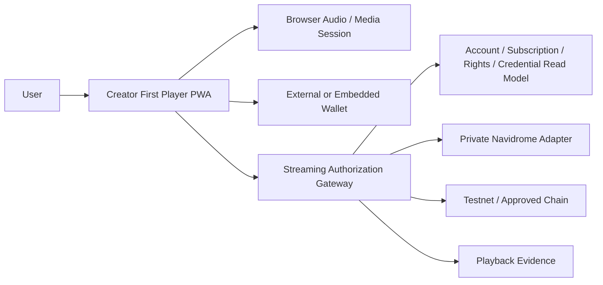

# ADR-0011: Integrated Player Client

**Status:** Proposed
**Date:** 2026-08-21
**Last Updated:** 2026-08-23

> **Implementation note (2026-08-23):** `apps/player`へVue 3／TypeScriptのローカルPWAを、`apps/gateway`へ対応するMock APIを実装した。Catalog Home、単一Audio Element、Play／Pause／Seek／Next／Previous、短命Playback Session、Range、SIWE、EIP-712 Support Intent、Mock Supporter状態、Community CapabilityおよびAlias限定Test-only Profileを検証できる。Test-only ProfileはPlatform AccountやAuthenticatorではなく、登録の有無は認可を変更しない。GitHub PagesにはADR-0014に基づき、Tab-local Profile、明示的EIP-1193 Wallet接続、Sepolia固定、検証済みDeployment Manifest、mockJPYC課金UIおよび合成Playerを一続きにしたPublic Testnet Journeyを実装し、Sepolia Contract Addressを有効化した。公開PlayerのSubscription状態はGateway認可やNavidromeへ接続しない。ローカルPlayer／Gatewayは引き続きMock状態を使用する。Search、Artist／Album詳細、Client Playback Event、Logout／Account Switch、Service Worker、Contract Indexerおよび本番Authenticatorは未実装である。Framework等の未決定事項は`MOCK-ASSUMPTION-001`で限定しており、この実装は本ADRの採用確定またはProtocol適合完了を意味しない。

## 1. Context

Creator First Platformは、Navidromeからの音楽配信に、Platform Account、Wallet、JPYC等によるSubscription、一般Supporter SBT、Early Supporter SBTおよびFan Community参加導線を一つの利用体験として接続する必要がある。

ADR-0009はNavidromeを非公開Media Serverとし、Streaming Authorization Gatewayを唯一の公開再生境界とした。しかし、既存のOpenSubsonic ClientをそのままPublic Playerとして利用すると、Navidrome Server URL、CredentialまたはMedia IDをClientへ渡す構成になりやすく、Subscription、Rights、Credential PrivilegeおよびPlayback Evidenceの境界を迂回する危険がある。

また、音楽再生のたびにWallet接続、署名またはBlockchain Transactionを要求すると、利用者の利便性を損ない、Wallet障害を通常再生のCritical Pathへ持ち込む。

## 2. Decision

Creator First Platformは、公開Playerとして次の構成を採用候補とする。

> **Gateway専用APIだけを利用する軽量なWeb PWAを実装し、Navidrome、Feishin、Supersonic等のOSSはMedia Server、検証Clientまたは設計参考として利用する。Public PlayerからNavidromeへ直接接続しない。**



Playerは音楽体験を中心に構成し、WalletはAccount連携、支払、SBT発行同意、GovernanceおよびRecovery等、暗号学的な承認が必要な操作でだけ表示する。通常の再生、停止、Seek、Queue操作またはTrack遷移ではWallet署名を要求しない。

## 3. Responsibility Boundary

Playerは次を担当する。

- Gateway Catalog APIによるHome、Search、Artist、AlbumおよびTrack表示
- Canonical Track IDだけを用いた再生要求
- Play、Pause、Seek、Next、PreviousおよびQueue
- Browser標準Audio機能とMedia Session連携
- Playback Sessionの取得、期限切れ時の再認可および明示的な終了
- Privacyを限定したClient Playback Eventの送信
- Platform Session、Wallet Linkおよび処理状態の表示
- 一般Supporter登録、Early資格結果およびSBT発行状態の表示
- Fan Community、限定ContentおよびGovernanceへの権限に応じた導線
- Wallet操作前の目的、Chain、Asset、Amount、対象Creatorおよび公開範囲の表示

PlayerはSubscription、Rights、Credential、Early Qualification、Verified UsageまたはCreator DistributionのSource of Truthにならない。

## 4. Gateway API Boundary

Playerが利用できる公開Surfaceは、Gatewayが明示的に許可したApplication APIに限定する。

```text
GET    /v1/catalog/home
GET    /v1/search
GET    /v1/artists/:artistId
GET    /v1/albums/:albumId
GET    /v1/tracks/:trackId
POST   /v1/playback-sessions
GET    /v1/streams/:playbackSessionId
POST   /v1/playback-events
DELETE /v1/playback-sessions/:playbackSessionId
POST   /v1/artists/:artistId/support
DELETE /v1/artists/:artistId/support
GET    /v1/me/supporter-credentials
POST   /v1/auth/siwe/nonce
POST   /v1/auth/siwe/verify
POST   /v1/auth/logout
```

この一覧はTarget Surfaceである。現行Local Mockはこの一部に加えて、`GET /v1/demo/user`と`POST /v1/demo/users`をTest Harness専用に公開する。この二つはAlias表示とNotice確認だけを扱い、Platform Account登録、Authentication、Wallet Link、SubscriptionまたはCredential APIとして扱わない。

実装上のPathは変更できるが、Playerが任意のOpenSubsonic Endpoint、Navidrome URL、内部Media ID、上流HeaderまたはCredentialを指定できる汎用Proxyを提供しない。

音声URLは短時間Playback Sessionを参照する同一Origin URLとし、Gatewayが毎回Owner、Scope、Expiry、RangeおよびDelivery Parameterを検証する。

## 5. Playback Engine

Testnet DemoのPlayerはReactまたはVueとTypeScriptによるPWAとして実装し、音声再生にはBrowser標準の`HTMLAudioElement`を薄く抽象化して利用する。Lock Screen、HeadsetおよびOS ControlにはMedia Session APIを利用できる。

初期実装はNavidromeのDirect Playまたは限定されたTranscode ResponseをGateway経由で受け取り、HTTP Range、`206 Partial Content`、Seek、Reconnect、AbortおよびBackpressureを扱う。HLS、DRM、Offline Downloadおよび保護音源のLocal CacheはMVPに含めない。

Track変更または画面離脱時は不要な上流Requestを中断する。Playback Sessionが失効した場合、Playerは同一URLを無期限にRetryせず、新しいAuthorization Decisionを要求する。

## 6. Account and Wallet Experience

PlayerはPlatform Account Sessionを通常利用の主体とし、Wallet Addressを唯一のUser IDとして扱わない。

Wallet操作は少なくとも次に限定する。

- Wallet LinkまたはLoginのProof of Control
- JPYC等の承認済みSettlement AssetによるPayment Authorization
- 一般SupporterまたはEarly Supporter Credentialの受領同意
- Governance、Credential Burn、Wallet RotationおよびRecovery

署名画面はPurpose、Relying Party Domain、Chain ID、Contract、Asset、Amount、NonceおよびExpiryのうち適用される項目を表示する。Testnet DemoはTest Assetであることを明示し、Test ETHをSubscription PriceまたはSupport Amountとして表示しない。

## 7. Supporter and Community Experience

Artist画面の「サポーターになる」は、単なるLocal Likeではなく、版管理されたSupport IntentとしてGatewayへ送信する。

```text
Support Intent
    -> User consent
    -> Gateway-issued EIP-712 typed data
    -> Purpose-bound Wallet signature
    -> Relayer submission
    -> Contract-side Supporter registration and Early Tier evaluation
    -> Finalized Supporter SBT event
    -> Community capability refresh
```

一つのCreator ScopeとWalletにつき原則一つのSupporter SBTを発行し、その確定済みTierを一般SupporterまたはEarly Supporterとして表示する。Playerは未登録、署名待ち、Relayer受付、Transaction送信、Confirming、一般Supporter Active、Early Supporter Active、Revoked、Burnedおよび失敗を区別する。Early判定結果をTransaction確定前に保証せず、確認済みCredential EventをRead Modelが取り込んだ後だけActiveとして表示する。

SBTを公開Walletへ発行する前に、譲渡不能性、公開Metadata、対象Creator、用途、Burn、失効およびRecoveryを説明し、明示的同意を得る。Community参加資格または限定再生はGatewayの版管理されたPrivilege Policyで判定し、Client表示だけでAccessを許可しない。

標準登録はGasless Relayer Flowとし、JPYC支払を同じ署名へ混在させない。特権はSBT MetadataでなくGatewayの短命Capabilityで行使する。

## 8. Client State and Privacy

| State | Local persistence |
| --- | --- |
| Theme、Volume、明示保存したQueue | IndexedDBまたはLocal Storageへ保存可能 |
| Static Application Asset、公開Cover Art | Service Worker Cacheへ保存可能 |
| Protected Audio、Playback URL、認証Response | Persistent Cacheへ保存しない |
| Private Key、Seed Phrase、Relayer Key | Playerが取得または保存しない |
| 詳細なListening History | 必要最小限とし、公開BlockchainまたはPublic Metricsへ送らない |

Service Worker、Analytics、Error ReportingおよびBrowser LogがAuthorization Header、Wallet Signature、Playback Session、内部Media IDまたは個人の詳細な再生履歴を保存しないよう検査する。

## 9. OSS Reuse

### Navidrome

Navidromeは非公開Media AdapterとしてMetadata、Cover Art、OpenSubsonic API、Range Deliveryおよび限定Transcodeに利用する。Public Playerの認可主体にはしない。

### Feishin

FeishinはNavidrome/OpenSubsonicの接続確認、Queue、Library Navigation、Now Playing等のUX参考またはLocal Prototypeに利用できる。ただし、Navidromeへの直接接続を前提とする構成をPublic Production Playerへそのまま採用しない。

### Supersonic

SupersonicはDesktop OpenSubsonic ClientとしてNavidrome互換性とLibrary動作の確認に利用できるが、Web PWAおよびWallet統合の基盤にはしない。

Navidrome、FeishinおよびSupersonicはいずれもGPL-3.0の適用範囲を確認し、改変、配布、Notice、対応Sourceおよび更新手順をOpen Source Compliance Reviewへ含める。コードを複製する場合は、見た目または動作の参考利用と区別し、依存関係、Licenseおよび変更履歴を記録する。

## 10. Testnet Demo Topology

ADR-0009のe2-micro Test環境では、追加のPlayer ServerまたはFeishin Containerを常駐させず、PWA Build ArtifactをGatewayまたは同一Originの軽量HTTP入口から配信する。

```text
Cloudflare Quick Tunnel
    -> same-origin Player static assets and /v1 Gateway API
        -> private Navidrome
        -> SQLite
        -> Base Sepolia RPC / Relayer module
```

同一OriginはCookie、CORSおよびSIWE Domainを単純化する。GitHub PagesのProject TopからDemo URLへLinkできるが、保護されたAudio Streamおよび認証APIはDemo Gateway Originから提供する。

## 11. Implementation Sequence

1. Navidromeと既存OpenSubsonic Clientで合成試験音の再生互換性を確認する
2. PWA Shell、Catalog、Queue、Play、Pause、SeekおよびMedia Sessionを実装する
3. Gateway Playback Session、Range Stream、Expiry、ReconnectおよびAbortを接続する
4. Platform Session、Wallet LinkおよびSIWEを接続する
5. 一般Supporter登録、SBT同意、発行状態およびEarly資格表示を接続する
6. Community Capability、限定ContentおよびGovernance導線を接続する
7. Testnet DemoのSecurity、Privacy、License、PerformanceおよびCost Gateを通過後に本番候補を設計する

## 12. Alternatives Considered

### Navidrome Web UIをPublic Playerとしてそのまま利用する

Navidrome認証と内部APIへ強く結合し、GatewayのCanonical ID、Subscription、Rights、CredentialおよびEvidence境界へ統合しにくいため採用しない。

### FeishinをForkしてPublic Playerとする

豊富なUXを再利用できる一方、直接OpenSubsonic接続をGateway専用APIへ置き換える改修、Wallet・SBTの追加およびGPL対応が必要になる。Local PrototypeまたはUI調査には利用できるが、初期Public Playerの基盤にはしない。

### Native Mobile Appを先に実装する

Platform別配布、Wallet Deep Link、Reviewおよび更新管理がVertical Sliceを遅らせるため、PWA検証後の候補とする。

### 再生操作ごとにWallet署名する

Latency、離脱、PrivacyおよびWallet依存障害を増やすため採用しない。

## 13. Consequences

### Positive

- Creator First固有のSupport、SBTおよびCommunity UXを音楽体験へ統合できる
- Navidrome Credentialと内部識別子をClientへ渡さずに済む
- Media Serverを将来置換してもPlayerのProtocol境界を維持できる
- 通常再生をWalletおよび同期Blockchain RPCから分離できる
- 静的PWAによりe2-microのMemoryとCPU消費を抑えられる

### Trade-offs

- Catalog、Queue、AccessibilityおよびPlayer Stateを独自に実装する必要がある
- Browser、Codec、RangeおよびMedia Sessionの互換性試験が必要になる
- OSS UIを直接Forkする場合より初期画面実装が増える
- Wallet、CredentialおよびAudio Errorを一貫したUXで扱う設計が必要になる

## 14. Validation Gates

1. BrowserからNavidrome URL、Credential、内部Media IDまたは信頼Headerを取得できない
2. Direct Navidrome AccessがPublic Networkから失敗する
3. Play、Pause、Seek、Next、Reconnect、Session ExpiryおよびAbortがGateway経由で動作する
4. `200`および`206 Partial Content`を正しく扱い、許可範囲を超えるRangeを拒否する
5. 通常のPlayback ControlでWallet署名を要求しない
6. Wallet署名前にPurpose、Chain、Asset、Amount、対象Creatorおよび公開範囲の適用項目を表示する
7. 一般SupporterとEarly Supporterの資格、Credential状態およびCommunity Capabilityを区別する
8. 未確定Transaction、失効CredentialまたはClient表示だけで特権を付与しない
9. Service WorkerおよびClient StorageがProtected Audio、Playback Session、秘密鍵または詳細な再生履歴を永続化しない
10. e2-microでPlayer用Application Serverを追加せず、同一Originの静的PWAとして動作する
11. OSSのLicense、Notice、改変および配布方法が記録される
12. Keyboard、Screen Reader、Reduced Motion、ContrastおよびMobile Viewportの基本Accessibility Testを通過する

## 15. Open Questions

- 初期PWAをReactとVueのどちらで実装するか
- Supported BrowserとCodec Matrixをどこまで保証するか
- External Wallet、Embedded WalletおよびPasskey Smart Accountをどの順序で提供するか
- Queue、PlaylistおよびPreferenceをどこまでAccount間同期するか
- Feishin等からコードを再利用する範囲とGPL Compliance手順をどう確定するか
- Community画面をPlayer内Routeと独立Applicationのどちらにするか

これらはProtocol SpecificationのOpen QuestionとImplementation Work Packageで追跡し、実装が暗黙に決定しない。

## 16. Related Documents

- [ADR-0008 Account / Wallet / Identity Strategy](./ADR-0008-account-wallet-identity-strategy.md)
- [ADR-0009 Navidrome / Streaming Authorization Gateway](./ADR-0009-navidrome-streaming-gateway.md)
- [ADR-0010 Early Supporter SBT Privileges](./ADR-0010-early-supporter-sbt-privileges.md)
- [ADR-0014 Public Testnet User Journey](./ADR-0014-public-testnet-user-journey.md)
- [Whitepaper: Platform Architecture](/whitepaper/04-platform-architecture)
- [Whitepaper: Discovery and Community](/whitepaper/08-discovery-community)
- [Protocol: Playback Authorization](/protocol/specs/playback-authorization)
- [Protocol: Player Client and Gateway Interaction](/protocol/specs/player-client)
- [Navidrome](https://www.navidrome.org/)
- [Navidrome Client Applications](https://www.navidrome.org/apps/)
- [OpenSubsonic Stream API](https://opensubsonic.netlify.app/docs/endpoints/stream/)
- [Feishin](https://github.com/jeffvli/feishin)
- [Supersonic](https://github.com/dweymouth/supersonic)
