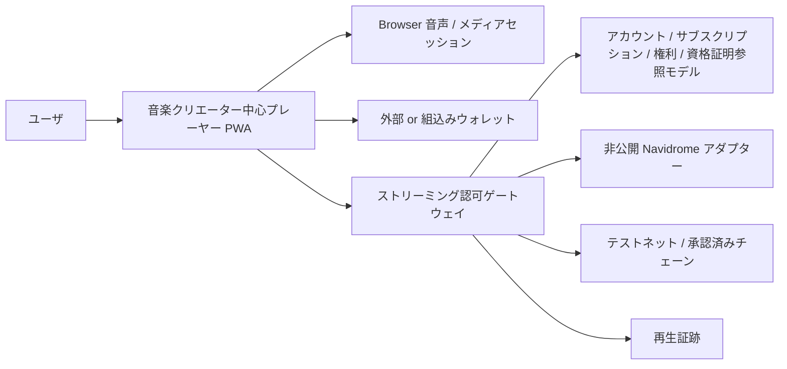

# ADR-0011: 統合プレーヤークライアント

**状態:** 提案
**日付:** 2026-08-21
**最終更新日:** 2026-08-26

> **実装 note (2026-08-23):** `apps/player`へVue 3／TypeScriptのローカルPWAを、`apps/gateway`へ対応するモック APIを実装した。カタログ Home、単一音声 Element、Play／停止／Seek／Next／Previous、短命再生セッション、範囲、SIWE、EIP-712 支援意思、モックサポーター状態、コミュニティ CapabilityおよびAlias限定Test-only プロフィールを検証できる。Test-only プロフィールはプラットフォームアカウントや認証器ではなく、登録の有無は認可を変更しない。GitHub PagesにはADR-0014に基づき、Tab-local プロフィール、明示的EIP-1193 ウォレット接続、Polygon Amoy固定、検証済みデプロイマニフェスト、mockJPYC課金UIおよび合成プレーヤーを一続きにした公開テストネット利用フローを実装し、Polygon Amoy コントラクトアドレスを有効化した。公開プレーヤーのサブスクリプション状態はゲートウェイ認可やNavidromeへ接続しない。ローカルプレーヤー／ゲートウェイは引き続きモック状態を使用する。検索、アーティスト／Album詳細、クライアント再生イベント、Logout／アカウント Switch、サービス Worker、コントラクトインデクサーおよび本番認証器は未実装である。Framework等の未決定事項は`MOCK-ASSUMPTION-001`で限定しており、この実装は本ADRの採用確定またはプロトコル適合完了を意味しない。

## 1. 背景

Creator First Platformは、Navidromeからの音楽配信に、プラットフォームアカウント、ウォレット、JPYC等によるサブスクリプション、一般サポーター SBT、初期サポーター SBTおよびファンコミュニティ参加導線を一つの利用体験として接続する必要がある。

ADR-0009はNavidromeを非公開メディアサーバーとし、ストリーミング認可ゲートウェイを唯一の公開再生境界とした。しかし、既存のOpenSubsonic クライアントをそのまま公開プレーヤーとして利用すると、Navidrome サーバー URL、資格証明またはメディア IDをクライアントへ渡す構成になりやすく、サブスクリプション、権利、資格証明特権および再生証跡の境界を迂回する危険がある。

また、音楽再生のたびにウォレット接続、署名またはブロックチェーントランザクションを要求すると、ユーザの利便性を損ない、ウォレット障害を通常再生の重大 Pathへ持ち込む。

## 2. 決定

Creator First Platformは、公開プレーヤーとして次の構成を採用候補とする。

> **ゲートウェイ専用APIだけを利用する軽量なウェブ PWAを実装し、Navidrome、Feishin、Supersonic等のOSSはメディアサーバー、検証クライアントまたは設計参考として利用する。公開プレーヤーからNavidromeへ直接接続しない。**



プレーヤーは音楽体験を中心に構成し、ウォレットはアカウント連携、支払、SBT発行同意、ガバナンスおよび復旧等、暗号学的な承認が必要な操作でだけ表示する。通常の再生、停止、Seek、一覧操作または楽曲遷移ではウォレット署名を要求しない。

## 3. 責任境界

プレーヤーは次を担当する。

- ゲートウェイカタログ APIによるHome、検索、アーティスト、Albumおよび楽曲表示
- 正規楽曲 IDだけを用いた再生要求
- Play、停止、Seek、Next、Previousおよび一覧
- Browser標準音声機能とメディアセッション連携
- 再生セッションの取得、期限切れ時の再認可および明示的な終了
- プライバシーを限定したクライアント再生イベントの送信
- プラットフォームセッション、ウォレット連携および処理状態の表示
- 一般サポーター登録、初期資格結果およびSBT発行状態の表示
- ファンコミュニティ、限定コンテンツおよびガバナンスへの権限に応じた導線
- ウォレット操作前の目的、チェーン、資産、Amount、対象音楽クリエーターおよび公開範囲の表示

プレーヤーはサブスクリプション、権利、資格証明、初期資格判定、検証済み利用実績または音楽クリエーター分配の正本にならない。

## 4. ゲートウェイ API 境界

プレーヤーが利用できる公開Surfaceは、ゲートウェイが明示的に許可したアプリケーション APIに限定する。

```text
GET    /v1/catalog/home
GET    /v1/search
GET    /v1/artists/:artistId
GET    /v1/albums/:albumId
GET    /v1/tracks/:trackId
POST   /v1/playback-sessions
GET    /v1/streams/:playbackSessionId
POST   /v1/playback-events
DELETE /v1/playback-sessions/:playbackSessionId
POST   /v1/artists/:artistId/support
DELETE /v1/artists/:artistId/support
GET    /v1/me/supporter-credentials
POST   /v1/auth/siwe/nonce
POST   /v1/auth/siwe/verify
POST   /v1/auth/logout
```

この一覧はTarget Surfaceである。現行ローカルモックはこの一部に加えて、`GET /v1/demo/user`と`POST /v1/demo/users`をテスト試験基盤専用に公開する。この二つはAlias表示と通知確認だけを扱い、プラットフォームアカウント登録、認証、ウォレット連携、サブスクリプションまたは資格証明 APIとして扱わない。

実装上のPathは変更できるが、プレーヤーが任意のOpenSubsonic Endpoint、Navidrome URL、内部メディア ID、上流Headerまたは資格証明を指定できる汎用プロキシを提供しない。

音声URLは短時間再生セッションを参照する同一オリジン URLとし、ゲートウェイが毎回Owner、範囲、Expiry、範囲および配信 Parameterを検証する。

## 5. 再生エンジン

テストネットデモのプレーヤーはReactまたはVueとTypeScriptによるPWAとして実装し、音声再生にはBrowser標準の`HTMLAudioElement`を薄く抽象化して利用する。Lock Screen、HeadsetおよびOS 制御にはメディアセッション APIを利用できる。

初期実装はNavidromeの直接 Playまたは限定されたTranscode 対応をゲートウェイ経由で受け取り、HTTP 範囲、`206 Partial Content`、Seek、Reconnect、AbortおよびBackpressureを扱う。HLS、DRM、Offline ダウンロードおよび保護音源のローカルキャッシュはMVPに含めない。

楽曲変更または画面離脱時は不要な上流リクエストを中断する。再生セッションが失効した場合、プレーヤーは同一URLを無期限にRetryせず、新しい認可決定を要求する。

## 6. アカウント・ウォレット体験

プレーヤーはプラットフォームアカウントセッションを通常利用の主体とし、ウォレットアドレスを唯一のユーザIDとして扱わない。

ウォレット操作は少なくとも次に限定する。

- ウォレット連携またはLoginの証明 of 制御
- JPYC等の承認済み精算資産による決済認可
- 一般サポーターまたは初期サポーター資格証明の受領同意
- ガバナンス、資格証明 Burn、ウォレットローテーションおよび復旧

署名画面は目的、Relying Party Domain、チェーン ID、コントラクト、資産、Amount、NonceおよびExpiryのうち適用される項目を表示する。テストネットデモはテスト資産であることを明示し、テスト ETHをサブスクリプション価格または支援 Amountとして表示しない。

## 7. サポーター・コミュニティ体験

アーティスト画面の「サポーターになる」は、単なるローカル Likeではなく、版管理された支援意思としてゲートウェイへ送信する。

```text
支援意思
    -> ユーザ同意
    -> Gateway-issued EIP-712 typed data
    -> Purpose-bound ウォレット signature
    -> リレイヤー submission
    -> Contract-side サポーター registration・初期階層 evaluation
    -> 確定済みサポーター SBT event
    -> コミュニティ capability refresh
```

一つの音楽クリエーター対象範囲とウォレットにつき原則一つのサポーター SBTを発行し、その確定済み階層を一般サポーターまたは初期サポーターとして表示する。プレーヤーは未登録、署名待ち、リレイヤー受付、トランザクション送信、Confirming、一般サポーター有効、初期サポーター有効、Revoked、Burnedおよび失敗を区別する。初期判定結果をトランザクション確定前に保証せず、確認済み資格証明イベントを参照モデルが取り込んだ後だけ有効として表示する。

SBTを公開ウォレットへ発行する前に、譲渡不能性、公開メタデータ、対象音楽クリエーター、用途、Burn、失効および復旧を説明し、明示的同意を得る。コミュニティ参加資格または限定再生はゲートウェイの版管理された特権ポリシーで判定し、クライアント表示だけでアクセスを許可しない。

標準登録はGasless リレイヤーフローとし、JPYC支払を同じ署名へ混在させない。特権はSBT メタデータでなくゲートウェイの短命Capabilityで行使する。

## 8. クライアント状態・プライバシー

| 状態 | ローカル persistence |
| --- | --- |
| Theme、ボリューム、明示保存した一覧 | IndexedDBまたはローカルストレージへ保存可能 |
| Static アプリケーション資産、公開Cover Art | サービス Worker キャッシュへ保存可能 |
| 保護済み音声、再生 URL、認証対応 | Persistent キャッシュへ保存しない |
| 非公開鍵、Seed Phrase、リレイヤー鍵 | プレーヤーが取得または保存しない |
| 詳細な聴取履歴 | 必要最小限とし、公開ブロックチェーンまたは公開指標へ送らない |

サービス Worker、分析、Error 報告およびBrowser Logが認可 Header、ウォレット署名、再生セッション、内部メディア IDまたは個人の詳細な再生履歴を保存しないよう検査する。

## 9. OSS再利用

### Navidrome

Navidromeは非公開メディアアダプターとしてメタデータ、Cover Art、OpenSubsonic API、範囲配信および限定Transcodeに利用する。公開プレーヤーの認可主体にはしない。

### Feishin

FeishinはNavidrome/OpenSubsonicの接続確認、一覧、ライブラリ Navigation、Now Playing等のUX参考またはローカル Prototypeに利用できる。ただし、Navidromeへの直接接続を前提とする構成を公開本番プレーヤーへそのまま採用しない。

### Supersonic

SupersonicはDesktop OpenSubsonic クライアントとしてNavidrome互換性とライブラリ動作の確認に利用できるが、ウェブ PWAおよびウォレット統合の基盤にはしない。

Navidrome、FeishinおよびSupersonicはいずれもGPL-3.0の適用範囲を確認し、改変、配布、通知、対応ソースおよび更新手順をオープンソース法令遵守レビューへ含める。コードを複製する場合は、見た目または動作の参考利用と区別し、依存関係、Licenseおよび変更履歴を記録する。

## 10. テストネットデモ構成

ADR-0009のe2-micro テスト環境では、追加のプレーヤーサーバーまたはFeishin Containerを常駐させず、PWA ビルド成果物をゲートウェイまたは同一オリジンの軽量HTTP入口から配信する。

```text
Cloudflare Quick Tunnel
    -> same-origin プレーヤー static assets・/v1 ゲートウェイ API
        -> private Navidrome
        -> SQLite
        -> Polygon Amoy RPC / リレイヤー module
```

同一オリジンはCookie、CORSおよびSIWE Domainを単純化する。GitHub Pagesのプロジェクト Topからデモ URLへ連携できるが、保護された音声ストリームおよび認証APIはデモゲートウェイオリジンから提供する。

## 11. 実装順序

1. Navidromeと既存OpenSubsonic クライアントで合成試験音の再生互換性を確認する
2. PWA Shell、カタログ、一覧、Play、停止、Seekおよびメディアセッションを実装する
3. ゲートウェイ再生セッション、範囲ストリーム、Expiry、ReconnectおよびAbortを接続する
4. プラットフォームセッション、ウォレット連携およびSIWEを接続する
5. 一般サポーター登録、SBT同意、発行状態および初期資格表示を接続する
6. コミュニティ Capability、限定コンテンツおよびガバナンス導線を接続する
7. テストネットデモのセキュリティ、プライバシー、License、実演およびコストゲートを通過後に本番候補を設計する

## 12. 検討した代替案

### Navidrome ウェブ UIを公開プレーヤーとしてそのまま利用する

Navidrome認証と内部APIへ強く結合し、ゲートウェイの正規 ID、サブスクリプション、権利、資格証明および証跡境界へ統合しにくいため採用しない。

### Feishinをフォークして公開プレーヤーとする

豊富なUXを再利用できる一方、直接OpenSubsonic接続をゲートウェイ専用APIへ置き換える改修、ウォレット・SBTの追加およびGPL対応が必要になる。ローカル PrototypeまたはUI調査には利用できるが、初期公開プレーヤーの基盤にはしない。

### ネイティブモバイルアプリを先に実装する

プラットフォーム別配布、ウォレット Deep 連携、レビューおよび更新管理が最小縦断実装を遅らせるため、PWA検証後の候補とする。

### 再生操作ごとにウォレット署名する

Latency、離脱、プライバシーおよびウォレット依存障害を増やすため採用しない。

## 13. 影響

### 利点

- 音楽クリエーター中心固有の支援、SBTおよびコミュニティ UXを音楽体験へ統合できる
- Navidrome 資格証明と内部識別子をクライアントへ渡さずに済む
- メディアサーバーを将来置換してもプレーヤーのプロトコル境界を維持できる
- 通常再生をウォレットおよび同期ブロックチェーン RPCから分離できる
- 静的PWAによりe2-microのMemoryとCPU消費を抑えられる

### トレードオフ

- カタログ、一覧、Accessibilityおよびプレーヤー状態を独自に実装する必要がある
- Browser、Codec、範囲およびメディアセッションの互換性試験が必要になる
- OSS UIを直接フォークする場合より初期画面実装が増える
- ウォレット、資格証明および音声 Errorを一貫したUXで扱う設計が必要になる

## 14. 検証ゲート

1. BrowserからNavidrome URL、資格証明、内部メディア IDまたは信頼Headerを取得できない
2. 直接 Navidrome アクセスが公開ネットワークから失敗する
3. Play、停止、Seek、Next、Reconnect、セッション ExpiryおよびAbortがゲートウェイ経由で動作する
4. `200`および`206 Partial Content`を正しく扱い、許可範囲を超える範囲を拒否する
5. 通常の再生制御でウォレット署名を要求しない
6. ウォレット署名前に目的、チェーン、資産、Amount、対象音楽クリエーターおよび公開範囲の適用項目を表示する
7. 一般サポーターと初期サポーターの資格、資格証明状態およびコミュニティ Capabilityを区別する
8. 未確定トランザクション、失効資格証明またはクライアント表示だけで特権を付与しない
9. サービス Workerおよびクライアントストレージが保護済み音声、再生セッション、秘密鍵または詳細な再生履歴を永続化しない
10. e2-microでプレーヤー用アプリケーションサーバーを追加せず、同一オリジンの静的PWAとして動作する
11. OSSのLicense、通知、改変および配布方法が記録される
12. Keyboard、Screen Reader、Reduced Motion、Contrastおよびモバイル Viewportの基本Accessibility テストを通過する

## 15. 未解決事項

- 初期PWAをReactとVueのどちらで実装するか
- Supported BrowserとCodec Matrixをどこまで保証するか
- 外部ウォレット、組込みウォレットおよびPasskey スマートアカウントをどの順序で提供するか
- 一覧、プレイリストおよび選好をどこまでアカウント間同期するか
- Feishin等からコードを再利用する範囲とGPL 法令遵守手順をどう確定するか
- コミュニティ画面をプレーヤー内Routeと独立アプリケーションのどちらにするか

これらはプロトコル仕様の未解決事項と実装作業パッケージで追跡し、実装が暗黙に決定しない。

## 16. 関連文書

- [ADR-0008 アカウント / ウォレット / アイデンティティ戦略](./ADR-0008-account-wallet-identity-strategy.md)
- [ADR-0009 Navidrome / ストリーミング認可ゲートウェイ](./ADR-0009-navidrome-streaming-gateway.md)
- [ADR-0010 初期サポーター SBT 特権](./ADR-0010-early-supporter-sbt-privileges.md)
- [ADR-0014 公開テストネットユーザ利用フロー](./ADR-0014-public-testnet-user-journey.md)
- [ホワイトペーパー: プラットフォームアーキテクチャ](/whitepaper/04-platform-architecture)
- [ホワイトペーパー: 発見・コミュニティ](/whitepaper/08-discovery-community)
- [プロトコル: 再生認可](/protocol/specs/playback-authorization)
- [プロトコル: プレーヤークライアント・ゲートウェイ連携](/protocol/specs/player-client)
- [Navidrome](https://www.navidrome.org/)
- [Navidrome クライアントアプリケーション](https://www.navidrome.org/apps/)
- [OpenSubsonic ストリーム API](https://opensubsonic.netlify.app/docs/endpoints/stream/)
- [Feishin](https://github.com/jeffvli/feishin)
- [Supersonic](https://github.com/dweymouth/supersonic)
