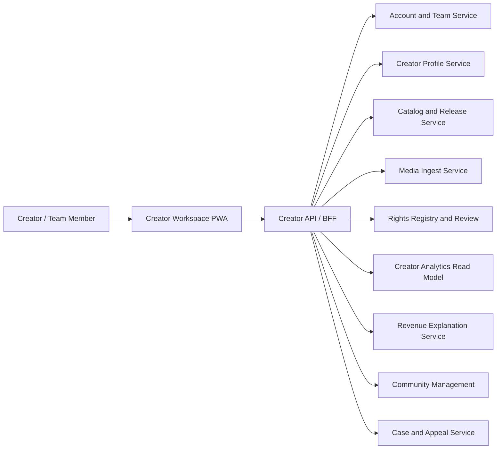
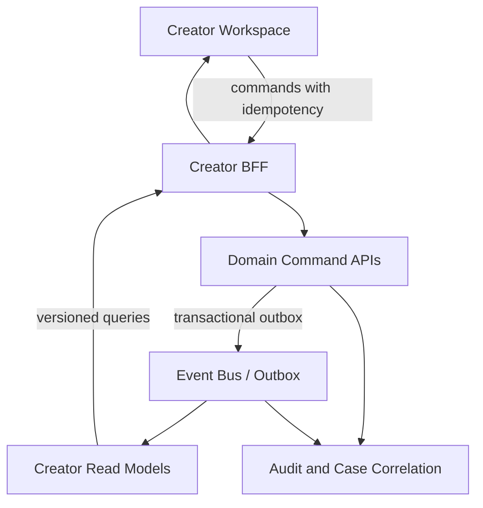
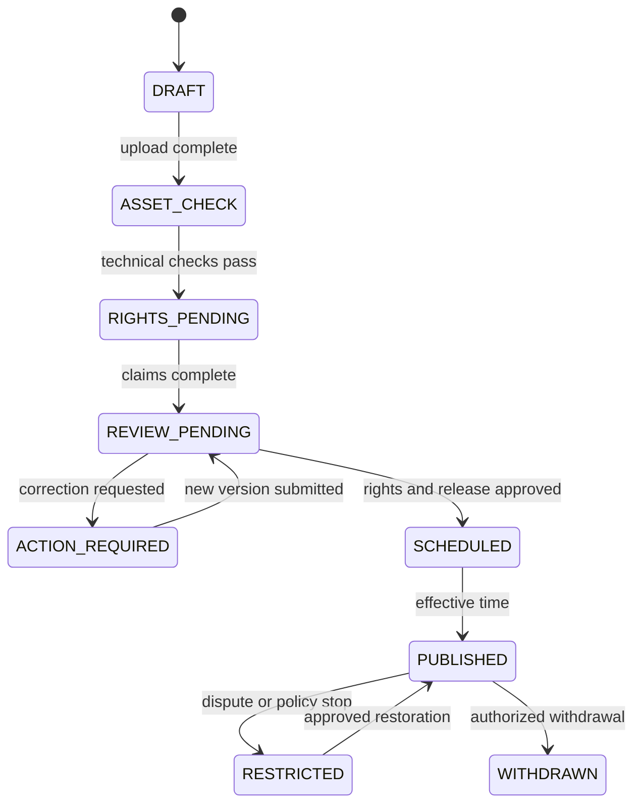

# ADR-0012: Creator Workspace and Service Boundaries

**Status:** Proposed
**Date:** 2026-08-22
**Last Updated:** 2026-08-22

## 1. Context

Creator First Platformには、Creator登録、作品・音源管理、Rights Claim、配信審査、利用実績、Creator Distribution、Supporter CommunityおよびGovernanceを接続する利用者向けPlayerとは別の操作面が必要である。

既存WhitepaperとProtocolは各Domainの規則を定義しているが、Creatorが日々利用する機能、共同制作者との関係、画面から各Source of Truthへ到達する境界および段階的実装順序は一つの構成として整理されていない。

Creator PortalがRights、RevenueまたはWalletを直接書き換える巨大な管理画面になると、次の問題が生じる。

- Uploadした人物をRights Holderと誤認する
- Creator Account、Artist Profile、Legal Identity、Rights Holder、PayeeおよびWalletを同一視する
- 未確認のRights Splitや速報値を確定情報として表示する
- 音源の差し替えが過去のRights、UsageまたはDistributionを破壊する
- 法人審査、共同制作者の確認、異議申立ておよび監査を迂回する
- Dashboard障害が配信、決済または分配のSource of Truthへ波及する

## 2. Decision

Creator向け機能は、独立した`Creator Workspace PWA`と`Creator API / BFF`として実装候補とする。WorkspaceはCreator Journeyを統合して表示するが、Account、Catalog、Media、Rights、Usage、Distribution、SettlementおよびCommunityの権限や確定状態を所有しない。



画面は一つでも、Commandは各Authoritative Serviceへ送信し、Queryは目的別Read Modelから取得する。BFFは認証Context、Creator Membership、権限、入力Schema、Idempotency、Rate LimitおよびResponse Redactionを強制する。

## 3. Creator Functions

### 3.1 Account, Creator Entity and Team

- Platform AccountからCreator申請を開始する
- 個人、Band、Unit、法人、Label等のCreator Entityを登録する
- Artist Profileと非公開の本人・法人情報を分離する
- Owner、Manager、Release Editor、Rights Editor、Finance Viewer、Community Moderator等のTeam Roleを付与する
- 招待、受諾、期限、Role変更、離脱および緊急失効を管理する
- 高リスク操作へStep-up Authenticationと複数承認を適用する

Creator Entityへの所属はRights Ownership、Payee資格またはCreator House参加資格を自動的に証明しない。

### 3.2 Public Profile and Discovery

- Artist名、Biography、Genre、画像、Linkおよび公開Localeを編集する
- 公開Previewと変更履歴を確認する
- New Voices等のDiscovery対象条件と現在状態を表示する
- 複数Artist AliasまたはProjectを一つのAccountへ安全に関連付ける
- 公開情報と本人確認、契約、税務、支払情報を分離する

### 3.3 Work, Recording and Release

- Work、Recording、Releaseを別のCanonical Objectとして作成する
- Title、Contributor、Identifier、Version、Territory、Release Windowを管理する
- 音源、Artwork、Lyricsその他AssetをVersion付きでUploadする
- Audio技術検査、Malware検査、Loudness、CodecおよびMetadata結果を確認する
- Draft、Review、Scheduled、Published、Restricted、Withdrawnを区別する
- 公開前Previewと差し替えの影響範囲を確認する

UploadされたMaster AssetはObject StorageのQuarantineへ入り、審査後に配信用Derivativeを生成する。Navidromeは承認済みDerivativeのMedia Adapter候補であり、Original Master、Rights EvidenceまたはCatalogのSource of Truthにしない。

### 3.4 Rights and Collaboration

- 作詞、作曲、実演、原盤、出版、管理委託等をガイド型UIで申告する
- Rights Type、Territory、Use、期間および整数比率を入力する
- 共同制作者へConfirmation Requestを送り、同意、修正要求または拒否を記録する
- EvidenceをRestricted Evidence Storeへ提出する
- Review状態、追加資料要求、制限、紛争および異議申立てを確認する
- 現在と過去のRights Snapshotを人間可読に説明する

WorkspaceはRights Claimを提出できるが、Creator自身の入力だけで`VERIFIED`へ変更できない。

### 3.5 Release Operations

- Metadata、Asset、Rights、契約、地域、日付およびPolicyのReadiness Checkを表示する
- Release Requestを冪等に提出する
- 法人のRights／Content Review結果と理由Codeを受け取る
- 公開日時、Territoryおよび許可Planを確認する
- 緊急停止、通常取下げ、訂正および再公開を区別する
- 公開済みVersionを上書きせず、新VersionとEffective Boundaryを作成する

### 3.6 Analytics and Explanation

- Privacyを保護した再生、Listener、地域、発見経路、SupporterおよびCommunity集計を表示する
- `速報`、`検証中`、`確定`、`訂正済み`を明示する
- Client Playback、Delivery Evidence、Verified Usageおよび支払対象Usageを区別する
- 個人の詳細Listening HistoryをCreatorへ公開しない
- Data Freshness、対象期間、Timezone、集計Policy Versionを表示する

### 3.7 Revenue, Allocation and Settlement

- Revenue Snapshot、控除、Pool、Usage、Rights Split、Hold、Carry、Residualを順に説明する
- 「なぜこの金額になったか」をDistribution Resultまで追跡可能にする
- 未確定見込額、確定Allocation、Settlement Instructionおよび着金確認を分離する
- Asset、Chain、最小単位、対象期間およびExchange Rateの有無を明示する
- Rights紛争、Minimum Payout、税務・本人確認または支払先不備によるHold理由を表示する
- 支払先変更をRights変更と分離し、Step-upと遅延、通知、監査を適用する

Workspaceは分配額を計算せず、確定Allocationを支払済みに変更しない。

### 3.8 Supporter Community and Governance

- Supporter数、一般／Early TierおよびPolicy Version別集計を表示する
- CreatorとRights Holderが許諾できる先行試聴、限定Content、Event等を申請する
- Privilege Policyの対象Content、地域、期間および停止条件を確認する
- Community告知とModeration Queueを管理する
- Creator Houseの適格性、Proposal、熟議および投票導線を表示する

CreatorがSBTを任意発行したり、Client画面だけでPrivilegeを有効化したりしない。Issuer、Qualification、Rights許諾、Contract EventおよびGateway Capabilityの境界を維持する。

### 3.9 Notifications, Cases and Support

- Review、共同制作者確認、公開、Rights変更、Usage確定、Distribution、支払およびSecurity EventをInboxへ集約する
- 期限、必要Action、理由Code、担当DomainおよびCase IDを表示する
- 異議申立て、訂正、資料追加およびSupport連絡をCaseとして追跡する
- 自動判定だけで不可逆な削除、権利剥奪または報酬没収を確定しない

## 4. Identity and Authorization Model

次の識別子と関係を分離する。

| Record | Purpose | Must not imply |
| --- | --- | --- |
| `account_id` | Application authentication主体 | Creator、Rights Holder、PayeeまたはPersonの同一性 |
| `creator_entity_id` | Artist／Band／Label等の管理単位 | Legal IdentityまたはRights Ownership |
| `creator_membership_id` | AccountとCreator EntityのRole関係 | Wallet controlまたは作品権利 |
| `artist_profile_id` | 公開表示 | 非公開本人情報または契約主体 |
| `party_id` | Rights、契約、支払で参照する当事者 | Accountや公開Profileとの自動一致 |
| `wallet_link_id` | 目的限定Wallet Control | 本人性、Rightsまたは支払完了 |
| `payee_profile_id` | Settlement受取先と審査状態 | Rights Holderそのもの |

Authorizationは`Account Session + Creator Membership + operation-specific Role + Step-up + current resource state`で評価する。Rights検証、公開承認、支払先変更、Team Owner変更およびGovernance権限には独立したRuleを適用する。

## 5. Authoritative Data Boundaries

| Domain | Source of Truth | Creator Workspace role |
| --- | --- | --- |
| Account／Session | Account Service | 状態表示、認証・Step-up導線 |
| Creator Team | Creator Membership Service | 招待とRole Command、現在状態Query |
| Public Profile | Creator Profile Service | Draft編集、Preview、公開申請 |
| Work／Recording／Release | Catalog Service | Version付きDraftとRelease操作 |
| Original／Derivative Asset | Media Ingest／Object Storage | Upload Sessionと検査結果表示 |
| Legal／Contract Evidence | Restricted Evidence Store | 期限付き提出とAccess制限 |
| Rights State | Rights Registry／Rights Authority | Claim提出、ReviewとSnapshot説明 |
| Availability | Release／Rights Policy | 公開申請と現在のDecision表示 |
| Usage | Usage Verification Layer | 集計Read Model表示のみ |
| Allocation | Distribution Engine | Explanation表示、異議Case作成 |
| Settlement | Settlement Service／法人会計 | Instruction／支払状態表示 |
| Supporter Credential | Contract Event／Credential Read Model | 集計とPolicy申請、直接Mint不可 |

## 6. Command and Query Architecture



Command成功は、後続のRights審査、公開、Usage確定、分配または支払完了を意味しない。UIは`REQUESTED`、`PROCESSING`、`ACTION_REQUIRED`、`APPROVED`、`REJECTED`、`SUPERSEDED`等のDomain状態を区別する。

Cross-domain Sagaは一つのDatabase Transactionとして偽装せず、Correlation ID、Idempotency Key、State VersionおよびCompensating Actionを記録する。Outbox／Inboxまたは同等機構でEventの欠落と重複に備える。

## 7. Candidate Creator API Surface

```text
GET    /v1/creator-context
GET    /v1/creator-entities/:creatorId/workspace
POST   /v1/creator-entities
POST   /v1/creator-entities/:creatorId/invitations
PATCH  /v1/creator-memberships/:membershipId
GET    /v1/creator-entities/:creatorId/profile
PATCH  /v1/creator-entities/:creatorId/profile-draft
POST   /v1/recordings
POST   /v1/recordings/:recordingId/upload-sessions
POST   /v1/releases
POST   /v1/releases/:releaseId/review-requests
POST   /v1/rights-claims
POST   /v1/rights-claims/:claimId/evidence-submissions
GET    /v1/creator-entities/:creatorId/analytics
GET    /v1/distribution-results/:resultId/explanation
GET    /v1/creator-entities/:creatorId/settlements
POST   /v1/cases
```

Pathは実装時に変更できるが、任意Object Storage key、内部Rights Evidence URL、Navidrome ID、他CreatorのAccount IDまたは管理者用CommandをClientに指定させない。Uploadは短命でContent Type、Size、Checksumおよび対象Asset VersionへBoundしたSessionを利用する。

## 8. Release State and Minimum Flow



各遷移はRelease Version、Rights Snapshot、Asset Version、Policy Version、Actor、Reasonおよび時刻を記録する。`PUBLISHED`だけが配信候補であり、GatewayはさらにSubscription、Territory、License Window等を評価する。

## 9. Security and Privacy

- WorkspaceとPlayerは同じAccount Sessionを利用できるが、Creator管理権限をPlayer routeやWallet接続から推測しない
- Original Master、契約、本人確認、税務および支払情報をPublic Blockchainや公開Object URLへ置かない
- UploadをMalware、Archive bomb、Content Type spoofing、過大Fileおよび不正Mediaから隔離する
- Presigned Upload／Downloadは短命、単一Purpose、単一Object Version、最小権限とする
- Team招待、Role変更、公開、Rights、支払先およびOwner変更を監査する
- Finance ViewerへRights Evidenceや本人確認資料を自動公開しない
- Creator Analyticsから個人Listener、Wallet affinityおよび詳細履歴を再識別できないようThreshold、集計およびAccess Controlを適用する
- CSV Formula Injection、Spreadsheet Export、Artwork／Metadata HTML、WebhookおよびExternal LinkをUntrusted Inputとして扱う
- Support OperatorがCreatorになりすまして権利、支払先または公開状態を変更できる万能機能を設けない

## 10. Deployment Topology

初期Testnet Demoでは、Playerと同様にWorkspaceを静的PWAとして配信し、同一OriginのGateway／BFFへ接続できる。e2-micro上へDomain Serviceをすべて常駐させず、最初は合成Fixtureと一つのModular Monolith Processで境界を検証する。

```text
Static Creator Workspace
    -> same-origin Creator BFF
        -> Account / Membership module
        -> Catalog / Release module
        -> Rights workflow stub
        -> Analytics / Revenue fixture read models
        -> SQLite or PostgreSQL test store
        -> private object storage emulator or bounded test volume
```

本番候補では、Master Asset、Restricted Evidence、Identity、Rights ReviewおよびSettlementを別のAccess Boundaryへ分離する。Modular Monolithから開始しても、Canonical ID、Event Contract、Authority、Database ownershipおよびAuditをModule間で明確にする。

## 11. Implementation Sequence

1. 合成Creator Entity、Team RoleおよびProfile Draft
2. Work／Recording／Release Draftと合成音源Upload Session
3. Technical Check、Rights Claim、共同制作者確認およびReview Queue
4. Release Readiness、Schedule、Publish／Restrict／Withdraw fixture
5. Privacy-safe Analyticsと速報／確定表示
6. Distribution ExplanationとSettlement Status fixture
7. Supporter集計、Privilege申請、Community Moderation
8. Appeal／Case、通知、ExportおよびAccessibility
9. Account、Rights、Usage、DistributionのTestnet Vertical Sliceへ接続
10. 法務、Rights、Privacy、Security、会計および運用Review後に本番候補を設計

最初のCreator Demoは実在する音源、契約、本人確認資料、税務情報、銀行口座、本番Walletまたは価値のあるTokenを扱わない。

## 12. Alternatives Considered

### One database and CRUD admin for every creator function

実装は早いが、Authority、監査、Version、権限および失敗境界を混同するため採用しない。

### Use Navidrome as creator catalog and upload backend

再生用Media AdapterとOriginal Master、Rights、Release workflowを混同するため採用しない。

### Put all creator metadata and splits on-chain

Privacy、訂正、紛争、契約、費用および法的判断へ適合しないため採用しない。

### Let each creator mint SBT and configure streaming gates directly

Issuer、Rights Permission、Qualification、SubscriptionおよびGateway Policyを迂回するため採用しない。

### Build microservices before the Creator Journey is validated

小規模Demoの運用負荷を増やし、未決定DomainをNetwork境界として固定するため採用しない。

## 13. Consequences

### Positive

- Creatorが作品、権利、利用、分配および支払を一つのJourneyで理解できる
- Dashboardの利便性と各DomainのSource of Truthを両立できる
- 共同制作、Team運営、異議申立ておよび説明可能性を初期構造へ含められる
- Master Asset、Private Evidenceおよび公開配信用Derivativeを分離できる
- Modular Monolithから段階的に分離してもProtocol IDとEvent境界を維持できる

### Trade-offs

- BFF、Read Model、通知およびCase管理が必要になる
- Cross-domain状態を一つの単純な進捗率として表示できない
- Team Role、共同制作者確認、支払先変更等のSecurity UXが増える
- 速報Analyticsと確定Distributionの違いを継続的に説明する必要がある

## 14. Testnet Acceptance Criteria

1. Creator Account、Creator Entity、Artist Profile、Rights Holder、PayeeおよびWalletが別IDである
2. Team RoleのないAccountがCreator Resourceを閲覧・変更できない
3. Profile編集だけではRights、公開、支払またはGovernance権限を得ない
4. Original MasterがPublic URL、Player Bundle、Navidrome IDまたは公開Logへ漏れない
5. Work、Recording、ReleaseおよびAsset Versionが分離される
6. Upload者の申告だけでRightsが`VERIFIED`またはReleaseが`PUBLISHED`にならない
7. 共同制作者の未確認、Rights不整合または契約不足が明示状態でFail Closedになる
8. 再送、並行編集およびEvent重複が二重Releaseや二重Rights Claimを作らない
9. 公開後の変更が旧Versionと過去Snapshotを上書きしない
10. Analyticsが速報、検証中、確定、訂正済みを区別し、個人Listenerを開示しない
11. Distribution ExplanationがRevenue、Usage、Rights、Policy、HoldおよびSettlement Statusへ追跡できる
12. 見込額、Allocation、Settlement Instructionおよび着金を同一状態として表示しない
13. CreatorがSBT、Early TierまたはGateway PrivilegeをClientだけで付与できない
14. Role変更、Rights、公開、支払先、ExportおよびAppealが監査とCorrelation IDを持つ
15. Keyboard、Screen Reader、Focus、Contrast、Mobile Viewportおよび大容量Upload失敗の基本Accessibility／Recovery Testを通過する
16. 実在音源、個人情報、契約、税務資料、本番Walletおよび価値あるTokenをTest Fixtureに含めない

## 15. Open Questions

- Creator Entityの初期対象を個人、Band、法人、Labelのどこまでとするか
- 最初のTeam Roleと、二人承認を要求する操作をどう定義するか
- Master Uploadの上限、Codec、Loudness、ChecksumおよびRetentionをどう設定するか
- 共同制作者確認をPlatform Account、Email招待または外部署名のどれで開始するか
- Creator Analyticsの最小集計単位、Privacy Thresholdおよび更新頻度をどう定義するか
- Revenue速報を提供する場合、会計確定前の誤認をどう防止するか
- Settlement Statusと法人会計・税務システムをどの境界で接続するか
- CreatorによるCommunity Moderation権限とPlatformの安全責任をどう分けるか

これらはMock Assumptionまたは専用Protocol Specification／CFPで追跡し、UI実装だけで暗黙に確定しない。

## 16. Related Documents

- [Whitepaper: Creator Onboarding](/whitepaper/05-creator-onboarding)
- [Whitepaper: Platform Architecture](/whitepaper/04-platform-architecture)
- [Whitepaper: Discovery and Community](/whitepaper/08-discovery-community)
- [ADR-0003 Rights Registry](./ADR-0003-rights-registry.md)
- [ADR-0004 Creator Distribution](./ADR-0004-creator-distribution-model.md)
- [ADR-0008 Account / Wallet / Identity](./ADR-0008-account-wallet-identity-strategy.md)
- [ADR-0009 Navidrome / Streaming Gateway](./ADR-0009-navidrome-streaming-gateway.md)
- [ADR-0010 Supporter SBT and Privileges](./ADR-0010-early-supporter-sbt-privileges.md)
- [SPEC-RIGHTS-001 Rights Registry](/protocol/specs/rights-registry)
- [SPEC-USAGE-001 Playback Verification](/protocol/specs/playback-verification)
- [SPEC-DISTRIBUTION-001 Creator Distribution](/protocol/specs/creator-distribution)
