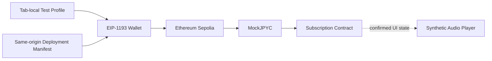

# ADR-0014: 公開テストネットユーザ利用フロー

**Status:** Proposed

**Date:** 2026-08-23

**Last Updated:** 2026-08-23

## Context

テストユーザ登録デモは、当初AliasとNoticeを現在のTabのSession Storageへ保存するだけのBrowser Fixtureだった。この構成はPrivacy境界の確認には適するが、ユーザがCreator First Platformの中心的な流れであるWallet接続、Stablecoin建てSubscriptionおよび音楽Player操作を連続して検証できない。

一方、GitHub Pagesは静的Hostingであり、秘密鍵、Relayer Credential、Server Sessionまたは保護音源を保持できない。設計時点ではSepolia Contractが未デプロイであり、任意Contract Addressをユーザが入力できるUIや、未検証AddressへTransactionを送るUIを公開すると、誤Chain、偽Token、Phishingおよび本番資産の誤使用につながる。

また、テストユーザプロフィール、Wallet Address、Subscription、Streaming Authorizationは異なる責任を持つ。UI上で一続きに見せても、Alias登録だけをAccount、本人確認または再生権限として扱ってはならない。

## Decision

GitHub Pages上のテストユーザデモを、次の4段階からなる **公開テストネットユーザ利用フロー** として実装する。

### 1. Test ProfileはWalletおよびIdentityから分離する

- AliasとランダムなテストユーザIDだけを現在のTabのSession Storageへ保存する。
- 実名、Email、電話番号、Password、秘密鍵、Seed PhraseまたはWallet Addressの入力欄を設けない。
- Profile登録はPlatform Account、Authentication、Wallet Link、本人確認、Subscription、SBTまたはStreaming Authorizationを成立させない。
- Profile削除はTab-local Dataだけを削除し、Wallet接続履歴やBlockchain Transactionが削除されるとは表示しない。

### 2. Wallet接続は明示操作とし、Sepoliaへ固定する

- BrowserのEIP-1193 Providerを、ユーザが「Walletを接続」を押した場合だけ呼び出す。
- Chain IDはEthereum Sepoliaの`11155111`だけを受け入れる。
- Network切替には`wallet_switchEthereumChain`を使い、任意RPC URLまたは未知のChainを追加しない。
- AccountまたはChain変更Eventを監視し、Address変更時は状態を再取得し、Sepolia以外へ移動した時は残高、Allowance、PlanおよびSubscription状態を消去して書込みと限定Trackを停止する。
- Wallet Addressは公開Chain上の識別子として表示し、Test Profileと永続的または法的に結合しない。

### 3. Contract Addressはsame-origin Manifestだけを信頼する

公開Clientは`/testnet/deployment.json`を`no-store`で取得し、次を満たす場合だけContract操作を有効にする。

- `schemaVersion`がClientの対応Versionと一致する
- `chainId`が`11155111`である
- `status`が`active`である
- MockJPYC、Subscription、Treasury、Supporter SBTの全Addressが有効な非Zero Addressである
- `sourceCommit`が完全な40桁Commit Hashである

`not-deployed`、取得失敗、不明Schema、誤Chain、不正Addressまたは不正Commitではfail closedとする。ユーザがContract Addressを手入力してこの制御を迂回する機能は設けない。

Manifestを`active`へ変更する前に、対象CommitからのDeployment、Contract Verification、Role、Plan、Test Asset NoticeおよびAddress対応をReviewする。Manifestは発見のための公開情報であり、それ自体をOn-chain状態の正本にはしない。

### 4. MockJPYC課金はTestnet専用の限定Flowとする

- `MockJPYC`は無価値、償還不可、実在JPYCと交換不可であることを画面とContractで表示する。
- 各AddressはPublic `claim()`から一回だけ`2,000 tJPYC`を取得できる。既存のRole限定`faucet()`は管理・Fixture用途として分離する。
- Public FaucetはTestnet専用であり、Sybil-resistantな配布、本人単位の上限または経済価値の配布を目的としない。
- Clientは現在のPlan価格とVersionをContractから読み、Subscription ContractへPlan価格と同額だけApproveする。無制限Approveを要求しない。
- SubscriptionごとにテストユーザIDと時刻から一意なPayment Referenceを生成し、Walletへ署名対象Transactionを個別表示する。
- Subscription価格は`tJPYC`で表示する。Sepolia ETHはNetwork Gasだけであり、料金、売上、寄附またはJPYC相当額として扱わない。
- Transaction Hashの生成だけでは成功とせず、Receiptが`success`になった後に残高、Allowance、Planおよび`isActive`を再取得する。

現行JourneyはユーザWalletから直接Transactionを送るため、Sepolia ETHをGasとして必要とする。これはADR-0008およびProtocolが目標とするRelayer／PaymasterによるGas Sponsored Flowの完成形ではない。Gas Sponsorshipが実装されるまで、公開Demoはこの制約を明示する。

### 5. Playerは合成PreviewとUI Gateに限定する

- 公開ページ内で短いmono PCM WAVを生成し、実在楽曲、Upload、外部Audio URLまたは著作権処理済み音源を必要としない。
- Preview TrackはSubscriptionなしでPlay、Pause、SeekおよびVolumeを試せる。
- Subscriber TrackはSepolia上の確定済み`isActive`状態を取得できた場合だけUI上で再生可能にする。
- このUI GateはGatewayのStreaming Authorization、Rights確認、Playback Session、Delivery EvidenceまたはVerified Usageではない。
- Navidromeと保護音源へ直接接続せず、本番StreamingはADR-0009のGatewayを唯一の公開境界とする。

## Security and Privacy Boundary

- Mainnet、実在JPYC、本番Wallet、本番資金および秘密情報の利用を求めない。
- Walletを自動接続せず、秘密鍵またはSeed Phraseを受信・保存しない。
- Contract書込みは検証済みManifest、Sepolia、明示Wallet操作がすべて成立した場合だけ許可する。
- `approve`、`claim`、`subscribe`を一つの不透明な操作にまとめず、ユーザがWalletで個別確認できるようにする。
- AliasはOff-chainのTab-local Data、Wallet AddressとTransactionはPublic Chain Dataとして別のPrivacy Noticeを表示する。
- Client表示、Session Storage、Transaction HashまたはPending ReceiptをGateway認可に利用しない。

## Consequences

### Positive

- 公開静的サイトだけで登録、Wallet、Test Asset、Subscription、Playerの順序と安全表示を検証できる。
- Backend Secretや任意Address入力を持たず、未デプロイ中もPreview体験を維持しながらChain書込みを停止できる。
- exact-amount Approveと一操作一Transactionにより、Wallet確認内容を理解しやすい。
- 合成音源によりRights、Privacyおよび外向き通信量を増やさずPlayer操作を確認できる。
- Contract DeploymentとUI公開をManifestで分離し、Source Commitを追跡できる。

### Trade-offs

- GitHub PagesだけではRelayer、Rate Limit、Abuse Control、Authenticator、Gateway Cookie Sessionまたは保護Streamingを提供できない。
- 一Address一回のFaucetはSybil対策ではなく、Testnet Tokenの供給制限として弱い。
- Direct Wallet TransactionはユーザにSepolia ETHと複数回のWallet確認を要求する。
- On-chain RPC障害、Wallet実装差およびTestnet CongestionがDemo体験へ影響する。
- Subscriber TrackのUI Gateは本番認可の証拠にならず、別途Gateway／Indexer統合が必要になる。

## Alternatives Considered

### Browser-only Alias登録を維持する

Privacy Noticeの確認には十分だが、決済とPlayerを含むVertical SliceのUXを検証できないため、登録前の一部機能としてのみ残す。

### Contract Addressをユーザに入力させる

Phishing、誤Chainおよび偽TokenへのTransactionを公式UIから誘導し得るため採用しない。

### GitHub PagesへRPC KeyまたはRelayer Keyを埋め込む

静的Assetから秘密情報を回収でき、権限分離とRotationを成立させられないため禁止する。

### MockJPYCを初回表示時に自動ApproveしてSubscriptionを開始する

Wallet Consent、Asset、Amountおよび各Transactionの状態が不透明になるため採用しない。

### 実在楽曲または公開Navidromeを直接再生する

Rights、Credential、Media IDおよびStreaming Authorization境界を迂回するため、公開Journeyでは採用しない。

## Acceptance Criteria

1. Profile登録前にWallet操作が有効にならず、Profile登録だけでは課金または限定Trackが有効にならない。
2. Sepolia以外、無効Manifest、未デプロイ、不正Addressまたは不正Source Commitでは全Contract書込みが無効になる。
3. WalletのAccount／Chain変更で古い残高、Allowance、Subscriptionおよび限定Track資格を使用しない。
4. Public `claim()`は各Addressで一回だけ成功し、固定`2,000 tJPYC`以外をユーザが指定できない。
5. Approve額が現在のPlan価格と一致し、無制限Approveを要求しない。
6. Receipt成功後だけSubscription状態を再取得し、PendingまたはFailed Transactionを有効と表示しない。
7. PreviewはContract未デプロイでも操作でき、Subscriber Trackは確定済みActive Subscriptionなしでは再生できない。
8. Public Clientから秘密鍵、Seed Phrase、Relayer Credential、Navidrome Credentialまたは保護Audio URLを取得できない。
9. DesktopとMobile Viewportで操作でき、非同期状態を`aria-live`等で通知する。
10. Contract Test、Manifest Negative Test、合成WAV Test、VitePress Buildおよび生成Site検査が自動化される。

## Implementation Status

2026-08-23時点で、Journey UI、Manifest検証、合成Player、一回限りのMockJPYC `claim()`、Contract Testおよび公開Site TestをRepositoryへ実装済みである。公開構成Source Commit `9e46420ebf68a0dbe4175b43e6501a5ee0ca34a7`をEthereum Sepoliaへデプロイし、Manifestを`active`へ更新した。公開RPCでBytecode、MockJPYC Notice／Claim額、SubscriptionのAsset／Treasury／Plan、ERC-1967 Implementation Slotおよび音楽クリエーター登録台帳 Noticeを検証済みである。Etherscan Source Verification、Bootstrap Role分離、Relayer／Paymaster、Gateway／Indexer連携および本番Streaming Authorizationは未実装である。この部分実装は本ADRの採用確定、Security Auditまたは本番利用承認を意味しない。

## Related Documents

- [ADR-0007 Blockchain / L2 Strategy](./ADR-0007-blockchain-l2-strategy.md)
- [ADR-0008 Account / Wallet / Identity Strategy](./ADR-0008-account-wallet-identity-strategy.md)
- [ADR-0009 Navidrome / Streaming Authorization Gateway](./ADR-0009-navidrome-streaming-gateway.md)
- [ADR-0011 Integrated Player Client](./ADR-0011-integrated-player-client.md)
- [テストユーザ利用フローデモ](/demo/test-user-registration)
- [Sepolia スマートコントラクト](/demo/testnet-contracts)
- [Subscription Settlement仕様](/protocol/specs/subscription-settlement)
- [Player Client仕様](/protocol/specs/player-client)
