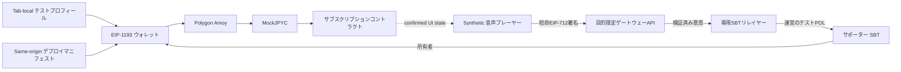

# ADR-0014: 公開テストネットユーザ利用フロー

**状態:** 提案

**日付:** 2026-08-23

**最終更新日:** 2026-08-27

## 背景

テストユーザ登録デモは、当初Aliasと通知を現在のTabのセッションストレージへ保存するだけのブラウザ用フィクスチャだった。この構成はプライバシー境界の確認には適するが、ユーザがCreator First Platformの中心的な流れであるウォレット接続、ステーブルコイン建てサブスクリプションおよび音楽プレーヤー操作を連続して検証できない。

一方、GitHub Pagesは静的Hostingであり、秘密鍵、リレイヤー資格証明、サーバーセッションまたは保護音源を保持できない。設計時点ではPolygon Amoy コントラクトが未デプロイであり、任意コントラクトアドレスをユーザが入力できるUIや、未検証アドレスへトランザクションを送るUIを公開すると、誤チェーン、偽トークン、Phishingおよび本番資産の誤使用につながる。

また、テストユーザプロフィール、ウォレットアドレス、サブスクリプション、ストリーミング認可は異なる責任を持つ。UI上で一続きに見せても、Alias登録だけをアカウント、本人確認または再生権限として扱ってはならない。

## 決定

GitHub Pages上のテストユーザデモを、次の5段階からなる **公開テストネットユーザ利用フロー** として実装する。

### 1. テストプロフィールはウォレットおよびアイデンティティから分離する

- AliasとランダムなテストユーザIDだけを現在のTabのセッションストレージへ保存する。
- 実名、Email、電話番号、Password、秘密鍵、Seed Phraseまたはウォレットアドレスの入力欄を設けない。
- プロフィール登録はプラットフォームアカウント、認証、ウォレット連携、本人確認、サブスクリプション、SBTまたはストリーミング認可を成立させない。
- プロフィール削除はTab-local データだけを削除し、ウォレット接続履歴やブロックチェーントランザクションが削除されるとは表示しない。

### 2. ウォレット接続は明示操作とし、Polygon Amoyへ固定する

- BrowserのEIP-1193 事業者を、ユーザが「ウォレットを接続」を押した場合だけ呼び出す。
- チェーン IDはPolygon Amoyの`80002`だけを受け入れる。
- ネットワーク切替には`wallet_switchEthereumChain`を使い、任意RPC URLまたは未知のチェーンを追加しない。
- アカウントまたはチェーン変更イベントを監視し、アドレス変更時は状態を再取得し、Polygon Amoy以外へ移動した時は残高、Allowance、計画およびサブスクリプション状態を消去して書込みと限定楽曲を停止する。
- ウォレットアドレスは公開チェーン上の識別子として表示し、テストプロフィールと永続的または法的に結合しない。

### 3. コントラクトアドレスはsame-origin マニフェストだけを信頼する

公開クライアントは`/testnet/deployment.json`を`no-store`で取得し、次を満たす場合だけコントラクト操作を有効にする。

- `schemaVersion`がクライアントの対応版と一致する
- `chainId`が`80002`である
- `status`が`active`である
- MockJPYC、サブスクリプション、資金庫、サポーター SBTの全アドレスが有効な非Zero アドレスである
- `sourceCommit`が完全な40桁コミットハッシュである

`not-deployed`、取得失敗、不明Schema、誤チェーン、不正アドレスまたは不正コミットではfail closedとする。ユーザがコントラクトアドレスを手入力してこの制御を迂回する機能は設けない。

マニフェストを`active`へ変更する前に、対象コミットからのデプロイ、コントラクト検証、役割、計画、テスト資産通知およびアドレス対応をレビューする。マニフェストは発見のための公開情報であり、それ自体をオンチェーン状態の正本にはしない。

### 4. MockJPYC課金はテストネット専用の限定フローとする

- `MockJPYC`は無価値、償還不可、実在JPYCと交換不可であることを画面とコントラクトで表示する。
- 各アドレスは公開 `claim()`から一回だけ`2,000 tJPYC`を取得できる。既存の役割限定`faucet()`は管理・Fixture用途として分離する。
- 公開 Faucetはテストネット専用であり、Sybil-resistantな配布、本人単位の上限または経済価値の配布を目的としない。
- クライアントは現在の計画価格と版をコントラクトから読み、サブスクリプションコントラクトへ計画価格と同額だけApproveする。無制限Approveを要求しない。
- サブスクリプションごとにテストユーザIDと時刻から一意な決済参照を生成し、ウォレットへ署名対象トランザクションを個別表示する。
- サブスクリプション価格は`tJPYC`で表示する。Amoy POLはネットワークガスだけであり、料金、売上、寄附またはJPYC相当額として扱わない。
- トランザクションハッシュの生成だけでは成功とせず、Receiptが`success`になった後に残高、Allowance、計画および`isActive`を再取得する。

MockJPYC取得、Approval、サブスクリプション開始および本人役割登録は、現行利用フローではユーザウォレットから直接トランザクションを送るためAmoy POLを必要とする。サポーターSBT発行だけは、ユーザがEIP-712意思へ署名し、専用リレイヤーがPOLを負担してSBT本体へ送信する方式へ移行する。これは一つの操作に限定した部分的なガス代支援であり、ADR-0008およびプロトコルが目標とする全操作のリレイヤー／ペイマスター対応完了を意味しない。

### 5. プレーヤーは合成プレビューとUI ゲートに限定する

- 公開ページ内で短いmono PCM WAVを生成し、実在楽曲、アップロード、外部音声 URLまたは著作権処理済み音源を必要としない。
- プレビュー楽曲はサブスクリプションなしでPlay、停止、Seekおよびボリュームを試せる。
- Subscriber 楽曲はPolygon Amoy上の確定済み`isActive`状態を取得できた場合だけUI上で再生可能にする。
- このUI ゲートはゲートウェイのストリーミング認可、権利確認、再生セッション、配信証跡または検証済み利用実績ではない。
- Navidromeと保護音源へ直接接続せず、本番ストリーミングはADR-0009のゲートウェイを唯一の公開境界とする。

### 6. プレーヤーからのサポータ登録は目的限定リレイヤーを使用する

- 対象音楽クリエーター、SBTデプロイ、Holder、コントラクトNonce、10分のDeadline、同意版をEIP-712意思表示へ拘束する。
- ユーザはオンチェーントランザクションではなく短時間のEIP-712意思へ署名し、ゲートウェーの専用リレイヤーがSBT本体の`registerSupporterWithSignature`を呼び出してテストPOLを負担する。SBT所有者は署名したHolderのままとする。
- 専用リレイヤーにはSBTの`RELAYER_ROLE`だけを付与し、参加者承認、ポリシー、失効、メタデータ、アップグレードまたは管理権限を付与しない。Deployer鍵、参加者登録運営鍵およびリレイヤー鍵を分離する。
- ゲートウェーはオンチェーンの音楽リスナー登録、現在Nonce、署名者、15分以内のDeadline、固定SBTおよび音楽クリエーター許可一覧を検証し、事前シミュレーション成功後だけ送信する。同じ意思の再送は冪等に扱う。
- UIは初期階層を選ばず、SBTコントラクトの確定結果から一般サポータ／初期サポータ、トークン ID、メタデータを再取得する。
- SBT意思表示と発行トランザクションはmockJPYC移転、トークン Approval、サブスクリプション購入から分離する。
- リレイヤー秘密鍵は静的サイト、環境ファイル、Git、ログまたはソースアーカイブへ置かず、クラウド実行時に読み取り専用秘密ファイルとしてマウントする。
- ゲートウェーのリレイヤー設定が有効で、same-origin health APIが`enabled`を返すまでSBT発行ボタンを無効にする。

## セキュリティ・プライバシー境界

- Mainnet、実在JPYC、本番ウォレット、本番資金および秘密情報の利用を求めない。
- ウォレットを自動接続せず、秘密鍵またはSeed Phraseを受信・保存しない。
- コントラクト書込みは検証済みマニフェスト、Polygon Amoy、明示ウォレット操作がすべて成立した場合だけ許可する。
- `approve`、`claim`、`subscribe`を一つの不透明な操作にまとめず、ユーザがウォレットで個別確認できるようにする。
- AliasはオフチェーンのTab-local データ、ウォレットアドレスとトランザクションは公開チェーンデータとして別のプライバシー通知を表示する。
- クライアント表示、セッションストレージ、トランザクションハッシュまたはPending Receiptをゲートウェイ認可に利用しない。

## 影響

### 利点

- 公開UIと同一オリジンゲートウェーで登録、ウォレット、テスト資産、サブスクリプション、プレーヤー、サポータSBTの順序と安全表示を検証できる。
- ブラウザへBackend Secretや任意アドレス入力を持たせず、未デプロイ中もプレビュー体験を維持しながらチェーン書込みを停止できる。
- exact-amount Approveと一操作一トランザクションにより、ウォレット確認内容を理解しやすい。
- 合成音源により権利、プライバシーおよび外向き通信量を増やさずプレーヤー操作を確認できる。
- コントラクトデプロイとUI公開をマニフェストで分離し、ソースコミットを追跡できる。

### トレードオフ

- GitHub Pagesだけではリレイヤー、率制限、不正利用制御、認証器、ゲートウェイCookieセッションまたは保護ストリーミングを提供できず、同一オリジンのクラウドゲートウェーが必要になる。
- 一アドレス一回のFaucetはシビル対策ではなく、テストネットトークンの供給制限として弱い。
- SBT以外の直接ウォレットトランザクションは、引き続きユーザにAmoy POLと複数回のウォレット確認を要求する。
- オンチェーン RPC障害、ウォレット実装差およびテストネット Congestionがデモ体験へ影響する。
- Subscriber 楽曲のUI ゲートは本番認可の証拠にならず、別途ゲートウェイ／インデクサー統合が必要になる。

## 検討した代替案

### Browser-only Alias登録を維持する

プライバシー通知の確認には十分だが、決済とプレーヤーを含む最小縦断実装のUXを検証できないため、登録前の一部機能としてのみ残す。

### コントラクトアドレスをユーザに入力させる

Phishing、誤チェーンおよび偽トークンへのトランザクションを公式UIから誘導し得るため採用しない。

### GitHub PagesへRPC 鍵またはリレイヤー鍵を埋め込む

静的資産から秘密情報を回収でき、権限分離とローテーションを成立させられないため禁止する。

### MockJPYCを初回表示時に自動Approveしてサブスクリプションを開始する

ウォレット同意、資産、Amountおよび各トランザクションの状態が不透明になるため採用しない。

### 実在楽曲または公開Navidromeを直接再生する

権利、資格証明、メディア IDおよびストリーミング認可境界を迂回するため、公開利用フローでは採用しない。

## 受入基準

1. プロフィール登録前にウォレット操作が有効にならず、プロフィール登録だけでは課金または限定楽曲が有効にならない。
2. Polygon Amoy以外、無効マニフェスト、未デプロイ、不正アドレスまたは不正ソースコミットでは全コントラクト書込みが無効になる。
3. ウォレットのアカウント／チェーン変更で古い残高、Allowance、サブスクリプションおよび限定楽曲資格を使用しない。
4. 公開 `claim()`は各アドレスで一回だけ成功し、固定`2,000 tJPYC`以外をユーザが指定できない。
5. Approve額が現在の計画価格と一致し、無制限Approveを要求しない。
6. Receipt成功後だけサブスクリプション状態を再取得し、PendingまたはFailed トランザクションを有効と表示しない。
7. プレビューはコントラクト未デプロイでも操作でき、Subscriber 楽曲は確定済み有効サブスクリプションなしでは再生できない。
8. 公開クライアントから秘密鍵、Seed Phrase、リレイヤー資格証明、Navidrome 資格証明または保護音声 URLを取得できない。
9. Desktopとモバイル Viewportで操作でき、非同期状態を`aria-live`等で通知する。
10. コントラクトテスト、マニフェスト欠点テスト、合成WAV テスト、VitePress ビルドおよび生成Site検査が自動化される。
11. SBT意思表示はHolder、対象音楽クリエーター、SBT、Nonce、Deadline、同意版を拘束し、専用リレイヤーから署名者以外へ発行できない。
12. Receipt成功後にオンチェーン状態を再取得するまでSBT取得済みと表示せず、階層はコントラクト結果だけを表示する。
13. サポータ登録の署名またはトランザクションにmockJPYC移転、Approvalまたはサブスクリプション操作を混在させない。

## 実装状態

2026-09-01時点で、利用フローUI、マニフェスト検証、合成プレーヤー、一回限りのMockJPYC `claim()`、EIP-712署名、SBT本体の発行・確定後表示、目的限定ゲートウェーリレイヤー、コントラクト／ゲートウェー／公開Siteテストをリポジトリへ実装済みである。従来の自己登録アダプターはPolygon Amoyへデプロイ済みだが、標準UIはユーザ負担のアダプター呼出しを行わない。初期サポータポリシー設定、専用リレイヤーへの役割付与とクラウド配備、公開ウォレットE2E、Polygonscanソース検証、Bootstrap役割分離、全操作対応の本番リレイヤー／ペイマスター、インデクサーおよび本番ストリーミング認可は未完了である。この部分実装は本ADRの採用確定、セキュリティ監査または本番利用承認を意味しない。

## 関連文書

- [ADR-0007 ブロックチェーン / L2 戦略](./ADR-0007-blockchain-l2-strategy.md)
- [ADR-0008 アカウント / ウォレット / アイデンティティ戦略](./ADR-0008-account-wallet-identity-strategy.md)
- [ADR-0009 Navidrome / ストリーミング認可ゲートウェイ](./ADR-0009-navidrome-streaming-gateway.md)
- [ADR-0011 統合プレーヤークライアント](./ADR-0011-integrated-player-client.md)
- [テストユーザ利用フローデモ](/demo/test-user-registration)
- [Polygon Amoy スマートコントラクト](/demo/testnet-contracts)
- [サブスクリプション精算仕様](/protocol/specs/subscription-settlement)
- [プレーヤークライアント仕様](/protocol/specs/player-client)
