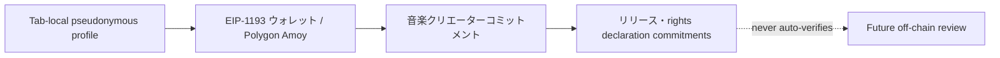

# ADR-0015: 公開テストネット音楽クリエーター利用フロー

**状態:** 提案

**日付:** 2026-08-23

**最終更新日:** 2026-09-04

## 背景

既存の音楽クリエーターデモは、仮名プロフィールと作品草案を現在のTabのセッションストレージへ保存するブラウザ用フィクスチャであり、ウォレット、公開テストネットまたはスマートコントラクトを利用していなかった。音楽クリエーター向けの最小フローを検証するには、ウォレット制御、音楽クリエーター識別子、作品申告、取消しおよび公開監査証跡を一続きで試せる必要がある。

一方、音楽クリエーター登録、アーティストダイレクト適格性、法務アイデンティティ、権利者、受取人、作品メタデータ、音源、契約および税務情報は同一ではない。公開ブロックチェーンへ実名、作品名、音源、契約書または権利資料を保存すると、訂正・削除・機密保持が困難になり、ハッシュだけを置いても低entropy情報の推測やウォレットとの関連付けが起こり得る。自己申告トランザクションをアーティストダイレクト適格性、権利検証または配信許諾として扱うこともできない。

## 決定

公開テストネット音楽クリエーター利用フローを次の4段階で実装する。

### 1. プロフィールと公開チェーンデータを分離する

- アーティスト名、活動形態、ジャンル、ランダムsaltは現在のTabだけに保存する。
- チェーンにはdomain separator、saltおよび入力から生成した`bytes32` プロフィールコミットメントだけを送る。
- ウォレットアドレス、コミットメント、音楽クリエーターID、リリース ID、状態、イベントおよびトランザクションは公開情報であると表示する。
- 実在人物・団体、実在作品、未公開情報、連絡先、本人確認、契約、権利資料、税務情報、秘密鍵またはSeed Phraseを入力させない。

### 2. ウォレットとコントラクトを固定する

- ウォレットは明示操作でのみ接続し、チェーン ID `80002`のPolygon Amoyへ固定する。
- 音楽クリエーター登録台帳アドレスはsame-originの`/testnet/deployment.json`からだけ取得し、ユーザによる手入力を許可しない。
- マニフェストに検証済み音楽クリエーター登録台帳がない場合、ユーザ利用フローを停止せず音楽クリエーター書込みだけをfail closedにする。
- アカウントまたはチェーン変更時は音楽クリエーターID、状態、分配候補およびリリース数を破棄して再取得する。

### 3. テストネット音楽クリエーター登録台帳を自己申告台帳に限定する

`CreatorFirstCreatorRegistry`は次だけを保持する。

- 一ウォレット一音楽クリエーターID
- 一意なプロフィールコミットメント
- 音楽クリエーター自身が指定する分配候補アドレス
- 有効／Inactive状態
- リリースメタデータコミットメント
- 権利申告コミットメント
- `DECLARED_UNVERIFIED`／`WITHDRAWN`状態

登録、更新および作品申告は音楽クリエーターウォレット自身が署名する。停止だけを運用役割へ付与する。ネイティブ資産を受け取らず、料金、サブスクリプション、SBT、配当、報酬計算または送金を行わない。

### 4. 権利と支払を自動承認しない

- リリース登録は`SELF_DECLARED_UNVERIFIED`として扱い、権利登録台帳の`VERIFIED`または`ACTIVE`へ遷移させない。
- プロフィールコミットメントは法務アイデンティティ、音楽クリエーター資格証明または権利者証明に使用しない。
- プロフィールの活動形態または自己申告だけで、メジャーレーベルとの関係や制作・流通・マーケティングの実質的決定権を確認済みと扱わない。
- TuneCore等の外部サービス利用はオンチェーンへ公開せず、本番候補では契約範囲を権利審査用の制限情報として扱う。
- 分配候補アドレスは受取人審査、ウォレット連携、税務・制裁確認または支払承認に使用しない。
- 既存資金庫は権限付き支出境界のままとし、音楽クリエーター登録台帳登録だけで`disburse`を呼び出せない。
- 有効な自己申告登録はリスナー画面の支援対象候補になるが、表示名は登録番号と短縮ウォレットに限定し、Tab内の仮名プロフィールを第三者へ公開しない。候補化は本人、権利、受取人、配信または報酬の承認を意味しない。
- 実音源アップロード、Navidrome公開、配信開始、利用集計、分配計算および本番支払は本利用フローの範囲外とする。

### 5. 音楽クリエーターのガス代支援範囲を明示する

- 音楽クリエータ院議会の議員として行うCFP承認投票は、本人のEIP-712署名を専用ガバナンスリレイヤーが送信し、運営のテストPOLを負担する。投票者と投票クレジットは署名した音楽クリエーター議員へ帰属する。
- 音楽クリエーター登録、プロフィール更新、作品申告および作品取消しは、現時点では本人ウォレットが直接送信し、Amoy POLを必要とする。議会投票のリレイヤーをこれらの操作へ流用しない。
- 将来これらをガス代支援の対象にする場合は、操作・対象・Nonce・期限・同意版を結合する専用署名型関数または検証アダプターと、操作別リレイヤー権限を追加する。運営鍵が音楽クリエーター本人として既存関数を呼び出す方式は採用しない。
- 費用負担、予算上限、補充、監査記録およびサービス料金との分離はADR-0021に従う。

## セキュリティ・プライバシー境界

- コミットメント生成へランダムsaltとdomain separatorを含めるが、ハッシュを匿名化と表現しない。
- 一ウォレット一登録と一コミットメント一登録をコントラクトで強制し、重複音楽クリエーターIDを防ぐ。
- リリース取消しは当該音楽クリエーターウォレットだけが実行でき、過去イベントを消去しない。
- 停止時は新規登録、更新、申告および取消しを停止する。
- 本デモではプロフィールとウォレットをプラットフォームアカウントとして永続連携せず、ウォレット喪失復旧も提供しない。

## 影響

### 利点

- GitHub Pagesだけで音楽クリエーターのウォレットトランザクション UXと公開監査証跡を検証できる。
- 個人情報、作品名、音源、契約または権利資料を直接オンチェーンへ保存しない。
- 音楽クリエーター登録、権利検証、受取人審査、配信公開および資金庫支出を構造的に分離できる。

### トレードオフ

- ウォレットアドレスとトランザクションは公開され、コミットメントも削除できない。
- 直接トランザクションにはAmoy POLが必要で、リレイヤー／ペイマスターや復旧は未実装である。
- 一ウォレット一音楽クリエーターはテストネットの単純化であり、本番の組織、複数Member、役割委任またはウォレットローテーションを表現しない。
- オフチェーン証跡保存、審査Workflow、インデクサーおよび音楽クリエーターBFFがないため、権利を有効化できない。

## 検討した代替案

### 音楽クリエータープロフィールと作品名を直接オンチェーンへ保存する

公開・永続・検索可能な個人情報や機密情報になり得るため採用しない。

### ブラウザ用フィクスチャだけを維持する

プライバシー表示には使えるが、ウォレット署名、コントラクトイベント、重複拒否および公開照会を検証できないため、プロフィール入力段階だけに残す。

### 音楽クリエーター登録と同時に権利と受取人を承認する

異なる証拠、責任主体、取消し、法務・税務判断を一つのウォレットトランザクションへ誤って統合するため禁止する。

## 受入基準

1. 音楽クリエータープロフィールがない状態ではウォレット接続とチェーン書込みを開始できない。
2. Polygon Amoy以外、無効マニフェストまたは音楽クリエーター登録台帳未公開では音楽クリエーター書込みが無効になる。
3. 一ウォレット一音楽クリエーター、一プロフィールコミットメント一音楽クリエーターをコントラクトが強制する。
4. 作品申告は登録済み有効音楽クリエーターだけが実行でき、初期状態は常に`DECLARED_UNVERIFIED`になる。
5. 作品取消しは当該音楽クリエーターだけが実行でき、過去イベントとコミットメントを削除しない。
6. 分配候補アドレスだけでは資金庫支出、サブスクリプション、SBT、権利または配信権限を得られない。
7. 公開クライアントへ秘密鍵、Seed Phrase、実在音源、権利資料または管理資格証明を含めない。
8. コントラクトテスト、マニフェストテスト、VitePress ビルド、Site検査および公開RPC検証が成功する。

## 実装状態

2026-08-23時点でコントラクト、コントラクトテスト、公開音楽クリエーター利用フロー UIおよび設計・プロトコル境界を実装し、ソースコミット `16b33334e6457337054c66824620d64cbed4f473`の音楽クリエーター登録台帳をPolygon Amoyの`0x7823e12075Ab59DE11eaa1044345906C062bF63c`へデプロイした。マニフェスト公開と、公開RPCによるBytecode、テストネット通知、初期音楽クリエーター数およびリリース IDの検証を完了した。Polygonscan ソース検証、役割分離、音楽クリエーターBFF、インデクサー、権利レビュー、ウォレット復旧および資金庫連携は未完了である。

## 関連文書

- [ADR-0003 権利登録台帳](./ADR-0003-rights-registry.md)
- [ADR-0008 アカウント / ウォレット / アイデンティティ戦略](./ADR-0008-account-wallet-identity-strategy.md)
- [ADR-0013 資金庫フロー透明性](./ADR-0013-treasury-flow-transparency.md)
- [ADR-0014 公開テストネットユーザ利用フロー](./ADR-0014-public-testnet-user-journey.md)
- [ADR-0021 リレイヤーによるガス代負担](./ADR-0021-relayer-gas-sponsorship.md)
- [音楽クリエーター登録](/whitepaper/05-creator-onboarding)
- [権利登録台帳仕様](/protocol/specs/rights-registry)
- [テスト音楽クリエーター利用フロー](/demo/creator-workspace)
