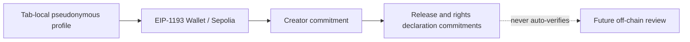

# ADR-0015: Public Testnet Creator Journey

**Status:** Proposed

**Date:** 2026-08-23

**Last Updated:** 2026-08-23

## Context

既存のCreator Demoは、仮名Profileと作品Draftを現在のTabのSession Storageへ保存するBrowser Fixtureであり、Wallet、公開TestnetまたはSmart Contractを利用していなかった。Creator向けの最小Flowを検証するには、Wallet Control、Creator識別子、作品申告、取消しおよび公開監査証跡を一続きで試せる必要がある。

一方、Creator登録、Legal Identity、Rights Holder、Payee、作品メタデータ、音源、契約および税務情報は同一ではない。公開Blockchainへ実名、作品名、音源、契約書または権利資料を保存すると、訂正・削除・機密保持が困難になり、Hashだけを置いても低entropy情報の推測やWalletとの関連付けが起こり得る。自己申告TransactionをRights Verificationまたは配信許諾として扱うこともできない。

## Decision

Public Testnet Creator Journeyを次の4段階で実装する。

### 1. Profileと公開Chain Dataを分離する

- Artist名、活動形態、Genre、ランダムsaltは現在のTabだけに保存する。
- Chainにはdomain separator、saltおよび入力から生成した`bytes32` Profile Commitmentだけを送る。
- Wallet Address、Commitment、Creator ID、Release ID、状態、EventおよびTransactionは公開情報であると表示する。
- 実在人物・団体、実在作品、未公開情報、連絡先、本人確認、契約、権利資料、税務情報、秘密鍵またはSeed Phraseを入力させない。

### 2. WalletとContractを固定する

- Walletは明示操作でのみ接続し、Chain ID `11155111`のEthereum Sepoliaへ固定する。
- Creator Registry Addressはsame-originの`/testnet/deployment.json`からだけ取得し、利用者による手入力を許可しない。
- Manifestに検証済みCreator Registryがない場合、User Journeyを停止せずCreator書込みだけをfail closedにする。
- AccountまたはChain変更時はCreator ID、状態、Payout候補およびRelease数を破棄して再取得する。

### 3. Testnet Creator Registryを自己申告台帳に限定する

`CreatorFirstCreatorRegistry`は次だけを保持する。

- 一Wallet一Creator ID
- 一意なProfile Commitment
- Creator自身が指定するPayout候補Address
- Active／Inactive状態
- Release Metadata Commitment
- Rights Declaration Commitment
- `DECLARED_UNVERIFIED`／`WITHDRAWN`状態

登録、更新および作品申告はCreator Wallet自身が署名する。Pauseだけを運用Roleへ付与する。Native Assetを受け取らず、料金、Subscription、SBT、配当、報酬計算または送金を行わない。

### 4. Rightsと支払を自動承認しない

- Release登録は`SELF_DECLARED_UNVERIFIED`として扱い、Rights Registryの`VERIFIED`または`ACTIVE`へ遷移させない。
- Profile CommitmentはLegal Identity、Creator CredentialまたはRights Holder証明に使用しない。
- Payout候補AddressはPayee審査、Wallet Link、税務・制裁確認または支払承認に使用しない。
- 既存Treasuryは権限付き支出境界のままとし、Creator Registry登録だけで`disburse`を呼び出せない。
- 実音源Upload、Navidrome公開、配信開始、利用集計、分配計算および本番支払は本Journeyの範囲外とする。

## Security and Privacy Boundary

- Commitment生成へランダムsaltとdomain separatorを含めるが、Hashを匿名化と表現しない。
- 一Wallet一登録と一Commitment一登録をContractで強制し、重複Creator IDを防ぐ。
- Release取消しは当該Creator Walletだけが実行でき、過去Eventを消去しない。
- Pause時は新規登録、更新、申告および取消しを停止する。
- 本DemoではProfileとWalletをPlatform Accountとして永続Linkせず、Wallet喪失Recoveryも提供しない。

## Consequences

### Positive

- GitHub PagesだけでCreatorのWallet Transaction UXと公開監査証跡を検証できる。
- 個人情報、作品名、音源、契約または権利資料を直接On-chainへ保存しない。
- Creator登録、Rights Verification、Payee審査、配信公開およびTreasury支出を構造的に分離できる。

### Trade-offs

- Wallet AddressとTransactionは公開され、Commitmentも削除できない。
- Direct TransactionにはSepolia ETHが必要で、Relayer／PaymasterやRecoveryは未実装である。
- 一Wallet一CreatorはTestnetの単純化であり、本番のOrganization、複数Member、Role DelegationまたはWallet Rotationを表現しない。
- Off-chain Evidence Store、審査Workflow、IndexerおよびCreator BFFがないため、Rightsを有効化できない。

## Alternatives Considered

### Creator Profileと作品名を直接On-chainへ保存する

公開・永続・検索可能な個人情報や機密情報になり得るため採用しない。

### Browser Fixtureだけを維持する

Privacy表示には使えるが、Wallet署名、Contract Event、重複拒否および公開照会を検証できないため、Profile入力段階だけに残す。

### Creator登録と同時にRightsとPayeeを承認する

異なる証拠、責任主体、取消し、法務・税務判断を一つのWallet Transactionへ誤って統合するため禁止する。

## Acceptance Criteria

1. Creator Profileがない状態ではWallet接続とChain書込みを開始できない。
2. Sepolia以外、無効ManifestまたはCreator Registry未公開ではCreator書込みが無効になる。
3. 一Wallet一Creator、一Profile Commitment一CreatorをContractが強制する。
4. 作品申告は登録済みActive Creatorだけが実行でき、初期状態は常に`DECLARED_UNVERIFIED`になる。
5. 作品取消しは当該Creatorだけが実行でき、過去EventとCommitmentを削除しない。
6. Payout候補AddressだけではTreasury支出、Subscription、SBT、Rightsまたは配信権限を得られない。
7. Public Clientへ秘密鍵、Seed Phrase、実在音源、権利資料または管理Credentialを含めない。
8. Contract Test、Manifest Test、VitePress Build、Site検査および公開RPC検証が成功する。

## Implementation Status

2026-08-23時点でContract、Contract Test、公開Creator Journey UIおよび設計・Protocol境界を実装し、Source Commit `9e46420ebf68a0dbe4175b43e6501a5ee0ca34a7`のCreator RegistryをEthereum Sepoliaの`0x5676d34d7C41849311b99932d8272af58b63e6E9`へデプロイした。Manifest公開と、公開RPCによるBytecode、Testnet Notice、初期Creator数およびRelease IDの検証を完了した。Etherscan Source Verification、Role分離、Creator BFF、Indexer、Rights Review、Wallet RecoveryおよびTreasury連携は未完了である。

## Related Documents

- [ADR-0003 Rights Registry](./ADR-0003-rights-registry.md)
- [ADR-0008 Account / Wallet / Identity Strategy](./ADR-0008-account-wallet-identity-strategy.md)
- [ADR-0013 Treasury Flow Transparency](./ADR-0013-treasury-flow-transparency.md)
- [ADR-0014 Public Testnet User Journey](./ADR-0014-public-testnet-user-journey.md)
- [Creator Onboarding](/whitepaper/05-creator-onboarding)
- [Rights Registry仕様](/protocol/specs/rights-registry)
- [Test Creator Journey](/demo/creator-workspace)
