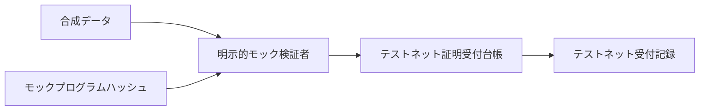
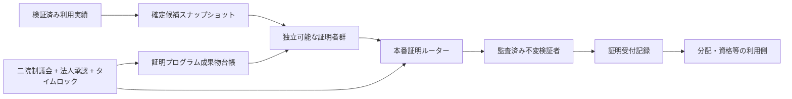

# ADR-0017: 透明型ゼロ知識証明のテストネット／本番境界

**状態:** 提案  
**日付:** 2026-08-24  
**最終更新日:** 2026-08-24

## 1. 背景

Creator First Platformは、詳細な再生履歴を公開せず、利用実績・分配・適格性等の計算を第三者が検証できる透明型ゼロ知識証明を検討している。一方、証明プログラム、公開入力、検証者、暗号仮定または版のどれかが曖昧であれば、暗号学的に妥当な証明でも意図した業務ルールを証明しない。

テストネットでは、まず証明エンベロープ、検証者の差し替え、版管理、再実行防止、停止および証跡を検証する必要がある。ただし、単純なモックを暗号学的なゼロ知識証明として表示してはならない。本番mainnetでは実在する利用実績、権利、分配または資格を扱うため、テストネットの鍵、検証者、証明受付記録および承認を流用できない。

## 2. 決定

透明型ゼロ知識証明を、次の二つの明確に分離したプロファイルで導入する。

1. **テストネット統合プロファイル:** 明示的なモック検証者を使い、証明方式ではなくインターフェース、公開入力拘束、プロファイルライフサイクル、再実行防止、停止および監査イベントを検証する。
2. **本番mainnetプロファイル:** 独立監査済みの透明型証明方式と検証者だけを、二院制ガバナンス、株式会社の法務・セキュリティ承認、タイムロックおよび公開マニフェストを経て有効化する。

テストネットのモック検証成功は、ゼロ知識性、健全性、利用実績の真正性、権利、分配、本番適合性または監査完了を意味しない。

## 3. テストネット実装

初期実装は次の3コントラクトで構成する。

- `ITransparentZKVerifier`: 証明プログラムハッシュ、公開入力ハッシュ、証明データを受ける交換可能な検証インターフェース
- `CreatorFirstTransparentZKMockVerifier`: 暗号学的ZKではないことを定数とAPIで明示するテストダブル
- `CreatorFirstTransparentZKRegistry`: 検証者プロファイル、停止状態および検証受付記録を管理するテストネット専用台帳

受付IDは少なくとも、チェーンID、受付コントラクト、検証者プロファイル、外部ステートメントIDおよび公開入力ハッシュを拘束する。同一受付IDの再利用を拒否し、プロファイルは登録後に内容を書き換えず、廃止と新規登録で更新する。

この構成はIgnitionの`CreatorFirstTestnet`モジュールへ追加するが、公開Sepoliaデプロイマニフェストへアドレスが記録されるまでは「公開デプロイ済み」と表示しない。

## 4. 本番mainnet構成

本番系は、証明生成とオンチェーン検証を次の責務へ分離する。

- **証明プログラム成果物台帳:** ソースコミット、再現可能ビルド、プログラムハッシュ、公開入力スキーマ、暗号仮定、監査報告を記録する。
- **証明者群:** 同一入力から証明を生成でき、単一事業者を正本にしない。秘密Witnessを扱う運用境界はオンチェーン検証者と分離する。
- **本番証明ルーター:** ドメイン、chain ID、コントラクト、プロファイル版、プログラムハッシュ、公開入力、対象スナップショットおよび期限を拘束する。
- **監査済み検証者:** 原則として不変コントラクトとして版ごとに新規デプロイし、既存受付記録の意味を書き換えない。
- **利用側コントラクト:** 証明成功だけで支払、権利または資格を確定せず、対象ドメインの確定状態、異議申立て期間および追加承認を確認する。

## 5. ガバナンスと法人責任

新しい証明プロファイルの有効化、プログラム変更、公開入力スキーマ変更、検証者変更または暗号仮定変更は、実行マニフェストへ正確なコードハッシュとアドレスを含める。プロトコル上必要な変更は音楽クリエータ院議会とユーザ院議会の対象区分に従って承認する。

株式会社と役員は、議決があっても法令、契約、会計、個人情報保護、セキュリティまたは善管注意義務に反する本番有効化を実行しない。議会は技術監査結果を代替せず、法人は議会の議決だけを専門的安全性の証明として扱わない。

## 6. 更新・停止・移行

- プロファイルは`PROPOSED → TESTED → APPROVED → ACTIVE → DEPRECATED`で管理する。
- 緊急権限は新規受付を停止できるが、別検証者への置換、過去受付の改変または資金移動を実行できない。
- 変更は新しいプロファイルIDと検証者を追加し、タイムロック後に有効化する。過去受付は元の版で検証可能に保つ。
- mainnetの移行は新規デプロイ、鍵生成、権限付与、監査および公開マニフェストを別に行い、Sepoliaのアドレス、受付、管理鍵またはモック証明を移植しない。

## 7. 本番移行ゲート

次がすべて成立するまでmainnetで証明を権利、分配、資格または資金移動の入力にしない。

1. 証明する自然言語要件、形式制約、参照実装およびテストベクトルが相互追跡可能
2. 証明方式、暗号仮定、セキュリティ水準、セットアップモデルおよび依存ライブラリが確定
3. 証明プログラム、検証者、ルーターおよび統合先が独立監査済み
4. 再現可能ビルドと本番バイトコード検証が完了
5. 誤った入力、証明者停止、検証者不具合、チェーン再編、DoSおよび鍵侵害の失敗試験が完了
6. 異議申立て、停止、訂正、廃止、移行およびユーザへの説明手順が承認済み
7. 二院制ガバナンスと株式会社の本番実行責任が分離され、タイムロックと複数承認が有効

## 8. 却下した方式

### テストネットモックをそのままmainnetへ移す

暗号学的安全性を持たず、明確に禁止する。

### 一つのアップグレード可能検証者へ全用途を集約する

変更が過去受付の意味まで変え、障害範囲も拡大するため採用しない。

### 証明成功だけで直ちに分配する

入力の真正性、権利状態、異議申立ておよび会計確定を置き換えられないため採用しない。

## 9. 影響

版・ドメインごとの検証者と受付記録により運用は複雑になるが、証明方式の交換可能性、過去結果の監査可能性、テストネット／mainnet分離および緊急時の限定停止を維持できる。

## 10. 関連文書

- [ADR-0005 利用実績オラクル](./ADR-0005-usage-oracle.md)
- [ADR-0006 ゼロ知識証明戦略](./ADR-0006-zero-knowledge-proof-strategy.md)
- [ADR-0016 二院制二次ガバナンス](./ADR-0016-bicameral-quadratic-governance.md)
- [SPEC-ZK-001 透明型ゼロ知識証明検証](../protocol/specs/transparent-zk-verification.md)
