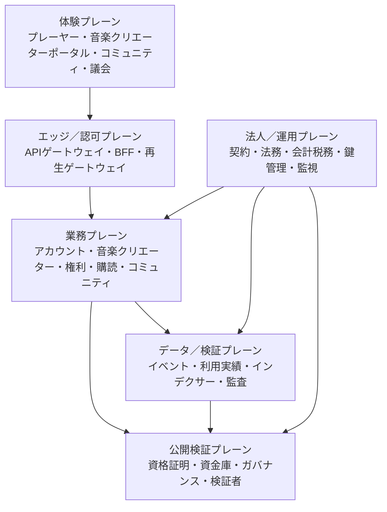

# ADR-0018: 本番サービス全体アーキテクチャ

**状態:** 提案  
**日付:** 2026-08-24  
**最終更新日:** 2026-08-27

## 1. 背景

テストネットでは、ユーザ向け利用フロー、音楽クリエーター自己申告台帳、MockJPYC、サポーター SBT、資金庫、二院制ガバナンスおよび透明型ゼロ知識証明の境界を個別に検証している。しかし本番サービスには、本人性、契約、権利、決済、配信、利用実績、コミュニティ、ガバナンス、会計および法令対応を、異なる責任主体と正本を保ったまま一つの利用体験へ接続する設計が必要である。

テストネットの自己申告やモック状態を本番へ移すと、音楽クリエーター登録を権利保有の証明と誤認し、ウォレットを人の識別子として扱い、公開チェーンへ個人情報を残し、決済・再生・分配を不正確に接続する危険がある。

## 2. 決定

本番系を、テストネットからデータ、鍵、権限、コントラクト、ネットワークおよび運用を分離した**六つの責任プレーン**として新規構築する。

### 2.1 正本を機能ごとに分離する

| 対象 | 本番の正本 | 公開チェーンの役割 |
| --- | --- | --- |
| ユーザアカウント、認証、復旧、同意 | アカウントサービス | 秘密情報を保存しない |
| 法務アイデンティティ、契約、税務資料 | 株式会社の制限領域 | 原文や個人情報を保存しない |
| 音楽クリエーター資格 | 音楽クリエーター審査サービス | 必要な場合だけ失効可能な資格参照 |
| 作品、原盤、権利、許諾地域・期間 | 版管理された権利登録台帳 | 監査用コミットメントまたは確定版参照 |
| サブスクリプションと返金 | 決済・購読サービスと法人会計 | 承認資産による精算証跡 |
| 再生認可 | ストリーミングゲートウェイ | 資格証明等を認可入力として参照 |
| 利用実績 | 検証済み利用実績スナップショット | 確定版コミットメントと検証受付記録 |
| コミュニティ会員資格・制裁 | コミュニティサービス | SBT等は同意された限定資格証明 |
| 議員資格・投票・実行 | 適格者台帳、二院制ガバナー、タイムロック | 監査可能な投票・実行境界 |
| 分配債務・支払・税務 | 分配台帳と法人会計 | 承認済み配分・資金移動の検証可能な証跡 |

一つのデータベース、ウォレット、SBT、ブロックチェーンイベントまたは管理者権限を全領域の正本にしない。

### 2.2 本番利用経路

1. **ユーザ登録:** アカウントを作成し、認証器、規約・プライバシー通知、復旧手段を確立する。ウォレット連携は任意の別工程とする。
2. **音楽クリエーター登録:** 有効なアカウントから申請し、アーティストダイレクト適格性、法務アイデンティティ、契約、受取人および税務情報を制限領域で審査する。登録だけでは配信権を与えない。
3. **作品登録と公開:** 作品・原盤・参加者・許諾を別々に審査し、権利スナップショットが有効な版だけをカタログ、メディア処理、CDNへ公開する。
4. **購読と再生:** 承認済みJPYC等の決済確定後に購読を有効化する。プレーヤーは短命認可をゲートウェイから取得し、Navidrome等のメディアサーバへ直接接続しない。
5. **支援とコミュニティ:** 明示的な支援意思と説明・同意に基づき一般／初期サポーター資格証明を発行する。コミュニティサービスは資格、対象範囲、失効、制裁およびポリシー版から能力を判定する。
6. **利用実績と分配:** 配信証跡とクライアントイベントを検証・重複排除し、異議申立て期間を経た利用実績スナップショット、権利スナップショットおよび会計確定収益から分配債務を作る。
7. **ガバナンス:** 適格コミュニティから検証可能に議員を抽選し、ガバナーの会期別議員登録を権限の正本、院別議員資格SBTを任期・所属院・状態の公開表示とする。SBTの保有、画像またはメタデータだけでは投票を許可しない。両院承認、実装照合、法人法務確認、タイムロックを満たす完全一致マニフェストだけを実行する。

### 2.3 コミュニティを独立した業務領域にする

コミュニティはSNS画面の付加機能ではなく、コミュニティ対象範囲、会員資格、役割、投稿、モデレーション、異議申立て、イベントおよびガバナンス適格性への入力を扱う独立サービスとする。サポーター SBTは能力判定の一入力であり、投稿権、限定再生、議決権または経済的権利を自動的にすべて付与しない。

### 2.4 本番コントラクトとオフチェーン処理

本番の主実行チェーンはPolygon PoS mainnet（チェーンID `137`）、本番リハーサルと新規統合テストはPolygon Amoy（チェーンID `80002`）とする。Polygon PoS mainnetではPOLをガスにだけ使用し、JPYC発行者が公式に公表し資産登録台帳の審査を通過した資金移動業型JPYCをサブスクリプションと分配の精算候補とする。Amoyでは無価値・償還不可の`MockJPYC`とテストPOLだけを使用する。CFPのテストネット運用はAmoyから開始し、Amoy以外の実験的状態をテストネット資格や本番移行元として扱わない。Amoyの状態・鍵・権限・アドレスも本番へ移行しない。

Polygon PoS mainnetへ置くのは、公開検証または改ざん耐性が必要で、公開しても個人情報・営業秘密・権利資料を漏らさない最小限の状態に限定する。本番候補は、承認済み精算資産台帳、資格証明、ポリシー参照、利用実績・権利スナップショットのコミットメント、分配承認、資金庫、二院制ガバナー、タイムロックおよび透明型証明検証者である。

アカウント、認証器、実名、契約書、税務資料、詳細な聴取履歴、コミュニティ投稿およびモデレーション証拠はオンチェーンへ保存しない。

### 2.5 運用と障害分離

- 認証、権利、決済、配信、コミュニティ、ガバナンス、会計を別サービス・別権限として分離する。
- すべての業務命令へ冪等キー、正本版、相関IDおよび監査イベントを付ける。
- 非同期イベントはOutbox等で確実に発行し、少なくとも一回配信を前提に消費側で重複排除する。
- 公開APIはWAF、レート制限、短命トークン、最小権限および段階的な高保証認証を使う。
- 鍵は用途別にHSMまたは同等の管理境界へ分離し、単独管理者が資金移動とコントラクト変更を完結できないようにする。
- 障害時は既存再生の安全な猶予と、新規決済・権利公開・分配・ガバナンス実行のfail closedを区別する。

### 2.6 本番移行ゲート

本番提供は、少なくとも次を満たすまで開始しない。

1. 対象法域、利用規約、音楽クリエーター契約、権利・税務・決済処理の専門家承認
2. 本番データ分類、保存期間、削除、法的保全、越境移転および委託先管理の承認
3. 各分野別プロトコルと横断仕様`SPEC-PLATFORM-001`の未解決事項解消
4. Polygon PoS mainnet、公式JPYC商品・コントラクト、POLガス支援、カストディ境界および障害時手順の最終確認
5. 独立した本番鍵、アカウント、ネットワーク、コントラクト、インデクサーおよび監視の構築
6. コントラクト・ウェブ・クラウド・権限・プライバシーの独立監査と是正
7. バックアップ復元、リージョン障害、鍵漏えい、誤配信、誤分配、権利紛争、アカウント乗っ取りの演習
8. 段階公開、利用上限、停止条件、ロールバック／前方修復、ユーザ通知および証拠保全の承認

Polygon AmoyまたはAmoyのアカウント、プロフィール、MockJPYC残高、SBT、議員、投票、証明受付記録、鍵またはコントラクトアドレスはPolygon PoS mainnetへ移行しない。

## 3. 結果

### 利点

- ユーザと音楽クリエーターには一続きの体験を提供しつつ、法的・技術的な正本を混同しない。
- 一領域の障害や侵害が、権利、資金、ガバナンス全体へ直接波及しにくい。
- テストネット実証を本番成立と誤認せず、移行条件を証拠で判定できる。
- コミュニティの参加資格とガバナンス権限を、経済力やSBT保有だけから分離できる。

### 費用と制約

- 分散トランザクション、整合性監視、再処理、照合および運用手順が必要になる。
- 本番開始前の法務、セキュリティ、プライバシーおよび監査コストが増える。
- 単純なオンチェーン完結型よりも、法人会計と公開検証記録の照合が複雑になる。

## 4. 採用しない案

### テストネットをそのままPolygon PoS mainnetへ切り替える

モック、単純化された役割、公開デモデータおよび未監査コントラクトを本番へ持ち込むため採用しない。

### ウォレットを唯一のアカウントにする

復旧、本人性、契約、プライバシー、複数端末およびアクセシビリティ要件を満たせないため採用しない。

### SBTだけでコミュニティと議決権を判定する

失効、異議申立て、本人単位の重複防止、任期、制裁およびポリシー版を表現できないため採用しない。

### 全業務を一つのアップグレード可能コントラクトへ置く

障害範囲、アップグレード権限、個人情報、ガス費および法的訂正可能性の問題が大きいため採用しない。

## 5. 関連資料

- [ホワイトペーパー: プラットフォーム構成](/whitepaper/04-platform-architecture)
- [ホワイトペーパー: 音楽クリエーター登録](/whitepaper/05-creator-onboarding)
- [ホワイトペーパー: ガバナンス](/whitepaper/07-governance)
- [ホワイトペーパー: 発見とコミュニティ](/whitepaper/08-discovery-community)
- [ホワイトペーパー: ロードマップ](/whitepaper/13-roadmap)
- [ADR-0007: ブロックチェーン / L2 戦略](./ADR-0007-blockchain-l2-strategy.md)
- [ADR-0017: 透明型ゼロ知識証明のテストネット／本番境界](./ADR-0017-transparent-zk-testnet-mainnet-boundary.md)
- [SPEC-PLATFORM-001: 本番サービスライフサイクル](/protocol/specs/production-service-lifecycle)
