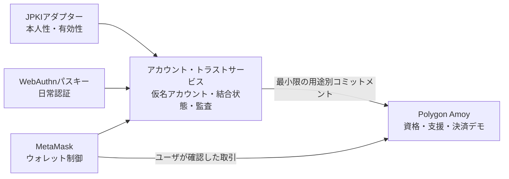
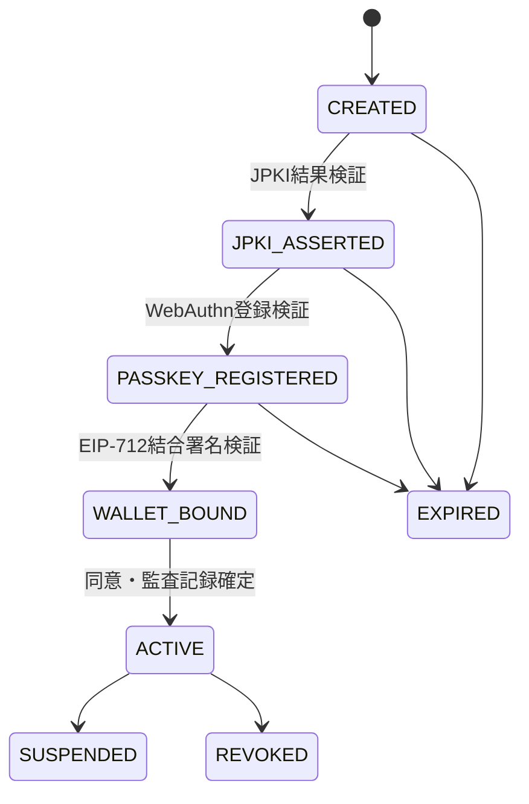

# ADR-0019: JPKI・パスキー・ウォレット結合テストネット

**状態:** 提案

**日付:** 2026-08-26

**最終更新日:** 2026-08-26

## 1. 背景

公開テストネット利用フローは、タブ内の仮名プロフィール、MetaMask等のEIP-1193ウォレット、Polygon Amoy、MockJPYC、サブスクリプションおよびサポーター SBTを接続している。しかし、現在のプロフィールはプラットフォームアカウントではなく、本人性、認証器、復旧手段およびウォレットとの永続的な結合を持たない。

本番候補では、通常利用のたびにウォレット署名やマイナンバーカード操作を要求せず、次を別々に成立させる必要がある。

- 公的個人認証サービス（JPKI）による高保証の本人確認
- FIDO2／WebAuthnパスキーによるフィッシング耐性のある日常認証
- MetaMaskウォレットによるオンチェーン操作と資産制御の意思表示
- ウォレット紛失または変更後も継続できるプラットフォームアカウント
- 氏名、住所、マイナンバー、電子証明書および認証器情報を公開チェーンへ置かないプライバシー境界

JPKIの秘密鍵、パスキーの秘密鍵およびウォレット秘密鍵は、それぞれ異なる認証器と責任境界に属する。これらを一つの鍵へ変換または統合することはできず、行うべきでもない。したがって、アカウントサービスが各証明を同じ短時間の結合手続として検証し、用途別の関係を記録する必要がある。

## 2. 決定

Creator First Platformは、JPKI、FIDO2パスキーおよびMetaMaskウォレットを、**アカウント・トラストサービス**で分離して結合する。JPKIを本人性、パスキーを日常認証、ウォレットをオンチェーン操作の制御証明として扱い、いずれも単独では完全なアカウント、音楽クリエーター資格、権利またはガバナンス資格を作らない。



### 2.1 保証レベル

| レベル | 成立条件 | 許可するデモ操作 |
| --- | --- | --- |
| `GUEST` | 認証なし | 公開文書・試聴用合成音源 |
| `PASSKEY_ACCOUNT` | WebAuthn登録・認証済み | 仮名プロフィール、通常セッション |
| `JPKI_VERIFIED` | JPKIアダプターの有効な本人確認結果 | 一人性を必要とする実験への申請 |
| `WALLET_BOUND` | パスキーセッション内でEIP-712ウォレット結合署名を検証 | Amoy上のMockJPYC、SBT、ガバナンス操作 |
| `STEP_UP_VERIFIED` | 操作直前のJPKI再認証とパスキー認証 | 復旧、主要ウォレット変更等の高リスク実験 |

本人確認済みであることは、音楽クリエーター適格性、著作権・原盤権、受取人適格性、税務確認、議員適格性またはSTO投資家確認を単独で成立させない。

### 2.2 公開デモと管理されたJPKI実証を分離する

テストネットでは二つのモードを明示的に分離する。

1. **公開モックモード:** 誰でも利用できる公開デモでは、実在するマイナンバーカード、電子証明書または個人情報を取得せず、署名済みのモックJPKI結果と明確な`TEST ONLY`表示だけを使用する。
2. **管理された試験環境モード:** 実カードを使用する場合は、招待制パイロット、明示同意、専用バックエンド、認定プラットフォーム事業者の試験環境および個人情報保護レビューを成立条件とする。

モックJPKI結果は本番本人確認、実在人物の証明、議員適格性、音楽クリエーター適格性、支払適格性または本番移行資格として扱わない。

### 2.3 WebAuthnのRP境界

WebAuthn公開鍵資格情報はRP IDとオリジンへスコープされる。`shigeichiroyamasaki.github.io`はCFP専用のセキュリティ境界ではなく、パス配下の`/creator-first-platform/`をRP IDにすることもできない。そのため、GitHub Pagesは文書とデモ入口に限定し、パスキー登録・認証画面とアカウントAPIはCFPが管理する専用HTTPSドメインへ配置する。

- パイロット用RP IDと本番用RP IDを混同しない。
- 採用する正規ドメイン、許可オリジンおよびサブドメイン境界をデプロイ前に固定する。
- パイロットの資格情報を本番へコピーせず、本番で改めて登録する。
- `userVerification`を`required`、discoverable credentialを基本候補、attestationを原則`none`とする。
- 生体情報は認証器内で処理し、CFPは生体サンプルまたはテンプレートを取得しない。

### 2.4 結合手続

初回結合を次の一つの有限状態機械として扱う。



各遷移はサーバ発行の一回限りchallenge、nonce、結合トランザクションID、有効期限、正規オリジンおよび直前状態を検証する。途中失敗した結合を`ACTIVE`として扱わず、同じchallengeまたは署名を再利用できないようにする。

結合手順は次とする。

1. アカウント・トラストサービスが短命な結合トランザクションを作る。
2. JPKIアダプターが、対象トランザクションへ結び付いた有効性確認結果を返す。
3. 同じ結合トランザクション内でWebAuthn登録challengeを発行する。
4. サーバがchallenge、type、origin、RP ID、署名、ユーザ検証、資格情報IDおよびバックアップ状態を検証する。
5. パスキー認証済みセッションでMetaMaskを明示接続する。
6. ウォレットが`WalletBindingIntent`へEIP-712署名する。
7. サーバが署名者、chain ID、nonce、期限、アカウント文脈およびポリシー版を検証し、監査記録を確定する。

`WalletBindingIntent`には少なくとも次を含める。

```text
accountSubjectCommitment
walletAddress
chainId
bindingNonce
issuedAt
deadline
purpose
policyVersion
```

公開テストネットでは`chainId = 80002`だけを受理する。ウォレットアドレスを入力しただけ、JPKI結果をクライアントが自己申告しただけ、またはMetaMaskを接続しただけでは結合を成立させない。

### 2.5 通常認証とステップアップ

- 通常ログイン、プロフィール、再生セッションはパスキー認証済みプラットフォームセッションを主体とする。
- 通常再生、停止、Seekまたは楽曲移動のたびにJPKI操作やウォレット署名を要求しない。
- MockJPYC、SBT、投票等のオンチェーン操作では、パスキーセッションに結び付いたウォレットをユーザが確認し、必要な取引だけウォレットで承認する。
- 主要ウォレット変更、アカウント復旧または一人性資格の再発行では、JPKI再認証、パスキー認証、通知および待機期間を要求する。

### 2.6 復旧

JPKIはプラットフォームアカウントの高保証な復旧根拠として使用できるが、旧ウォレットのSelf-custody資産を復旧または移転する権限をCFPへ与えない。

復旧手続は次を含む。

- JPKIの再検証と証明書有効性確認
- 新しいパスキーの登録
- 既存認証器および連携ウォレットへの通知
- 旧パスキーの失効または段階的無効化
- ウォレット変更の待機期間
- SBT、議員資格、分配先等の用途別再審査
- すべての遷移を結び付ける監査相関ID

同期型パスキーと端末固定型パスキーの双方を想定し、一つの認証器紛失が即時の永久ロックまたは即時の資金送付先変更にならないようにする。

### 2.7 プライバシーと保存境界

公開チェーン、SBTメタデータ、ブラウザストレージ、ログおよび分析基盤へ次を保存しない。

- マイナンバー
- JPKI暗証番号
- 電子証明書の秘密鍵またはICチップ生データ
- 氏名、住所、生年月日、性別
- 電子証明書原文または発行番号
- WebAuthn秘密鍵または生体情報
- JPKI事業者の生レスポンス

制限領域には、ランダムな内部主体ID、検証事業者、保証レベル、検証時刻、失効確認時刻、再確認期限、WebAuthn資格情報ID・公開鍵・バックアップ状態、ウォレット結合履歴、同意版および監査参照だけを目的・保存期間に応じて保持する。用途間で同一人物を追跡できる公開識別子を作らず、ガバナンス等では会期・議院別のコミットメントまたはnullifierを使用する。

### 2.8 JPKI接続方式と責任主体

初期実装では、CFP株式会社または運用実証主体が、自らJ-LIS検証基盤を構築するのではなく、主務大臣認定を受けたプラットフォーム事業者へ電子証明書の有効性確認を委託するサービスプロバイダ方式を採用候補とする。プロバイダ固有APIをJPKIアダプターで隔離し、モック、試験環境および将来の本番接続を交換可能にする。

PKI普及を目的とするNPO法人は、ユーザ教育、同意、相互運用性、プライバシー影響および実証評価を担当できる。ただし、株式会社との契約、利益相反、個人情報の管理主体および委託範囲を明確にし、NPO法人が商用アカウントの本人確認情報を目的外利用しない。

### 2.9 オンチェーン境界

JPKI証明書またはWebAuthn資格情報をスマートコントラクトへ直接検証させない。必要な場合は、アカウント・トラストサービスが作成した用途別コミットメント、ポリシー版、失効可能な資格参照および監査証跡ハッシュだけをPolygon Amoyへ登録する。

JPKI、パスキーまたはウォレット結合だけでは、次を自動的に付与しない。

- 音楽クリエーターまたは権利者資格
- サポータまたは初期サポータ資格
- サブスクリプション
- 音楽クリエータ院議会／ユーザ院議会の議員資格
- 分配請求権、収益権、株主権またはSTO上の権利

## 3. テストネット実装順序

1. CFP管理のパイロット用HTTPSドメインとRP IDを決定する。
2. アカウント・トラストサービス、セッション、CSRF防御および監査ログを構築する。
3. WebAuthn登録・認証・複数資格情報・失効・復旧APIを実装する。
4. 明確にモックと表示するJPKIアダプターを実装する。
5. MetaMaskのEIP-712ウォレット結合とPolygon Amoy固定を実装する。
6. 結合状態、認証器、ウォレットおよび失効状態をデモUIへ表示する。
7. challenge再利用、セッション差替え、誤origin、誤RP ID、誤chain、別ウォレット署名、期限切れおよび復旧乗っ取りを自動試験する。
8. 独立レビュー後、認定事業者のJPKI試験環境を招待制パイロットへ接続する。

## 4. 受入条件

- WebAuthn登録・認証がchallenge、type、origin、RP ID、署名およびユーザ検証をサーバ側で検証する。
- JPKI、パスキー、ウォレットの各証明が同じ未使用の結合トランザクションへ結び付く。
- Polygon Amoy以外のchain IDまたは接続アカウントと異なる署名者を拒否する。
- 部分成功、Retryまたは並行要求から複数の`ACTIVE`結合を作らない。
- アカウントまたはウォレット変更時に以前の参照状態を破棄して再取得する。
- JPKIモックと実在本人確認を画面、API、監査記録で混同しない。
- 個人情報、電子証明書、WebAuthn秘密鍵または恒久追跡子を公開チェーンへ保存しない。
- 復旧が旧ウォレット資産の移転または権利・議員・分配資格の自動再発行を意味しない。
- 本番用RP、鍵、JPKI接続、データおよびウォレット結合をテストネットから独立構築する。

## 5. 脅威と制御

| 脅威 | 主な制御 |
| --- | --- |
| JPKI結果と別ユーザセッションの差替え | state、nonce、短命結合ID、サーバ間応答検証 |
| WebAuthnフィッシング／誤origin | 専用RP ID、HTTPS、正規origin照合、`userVerification: required` |
| challengeまたはウォレット署名Replay | 一回限りnonce、deadline、消費済み記録 |
| 別ウォレットの結合 | EIP-712署名者と要求アドレスの完全一致 |
| 誤チェーン操作 | chain ID `80002`固定、マニフェスト検証 |
| 復旧による乗っ取り | JPKI再認証、通知、待機期間、用途別再審査 |
| パスキー同期先の侵害 | 高リスク操作のJPKIステップアップ、複数認証器、失効 |
| 個人の公開追跡 | 用途別コミットメント、秘密値付き導出、原文非公開 |
| 本人確認と権利確認の混同 | 別状態、別審査、別正本、明示的なUI表示 |

## 6. 帰結

### 利点

- MetaMaskを通常ログインの唯一の入口にせず、日常利用をパスキーで簡潔にできる。
- JPKIによる本人性とウォレット制御を分離したまま高保証で結合できる。
- ウォレット変更・紛失後もプラットフォームアカウントを継続できる。
- 一人性を必要とするガバナンス実験へ、個人情報を公開しない入力を提供できる。
- モックから認定事業者の試験環境、本番接続へアダプター境界を維持できる。

### コストと制約

- 静的GitHub Pagesだけでは成立せず、専用ドメイン、状態を持つバックエンド、データ保護および監視が必要になる。
- JPKI未保有ユーザ、国外ユーザ、対応端末を持たないユーザの代替本人確認経路が必要になる。
- 証明書更新・失効、パスキー同期、端末変更、ウォレット紛失を別々に処理する必要がある。
- JPKIは本人性を強化するが、権利、音楽クリエーター適格性またはガバナンス適格性を自動的に証明しない。

## 7. 却下した代替案

### MetaMaskだけをアカウントにする

本人性、一人性、復旧および複数ウォレットを安全に扱えないため採用しない。

### JPKIを毎回のログインと再生で要求する

通常利用の負担が大きく、JPKIと日常認証の責任を混同するため採用しない。

### JPKI秘密鍵をパスキーまたはウォレット鍵として使う

鍵の用途、認証器、失効および標準境界が異なり、秘密鍵を輸出できないため採用しない。

### `github.io`を恒久WebAuthn RPにする

CFP専用のドメイン境界ではなく、パス配下をRP IDにできないため採用しない。

### 電子証明書またはWebAuthn公開鍵をオンチェーンへ保存する

不要な相関、失効・更新の困難、個人情報漏えいおよび永続化リスクを生むため採用しない。

### 初期段階から自らJPKIプラットフォーム事業者認定を取得する

設備、運用および認定の負担が大きい。まず認定事業者へ検証を委託し、利用規模とNPO法人の公共的役割を確認した後に再評価する。

## 8. 関連文書

- [ADR-0008 アカウント / ウォレット / アイデンティティ戦略](./ADR-0008-account-wallet-identity-strategy.md)
- [ADR-0014 公開テストネットユーザ利用フロー](./ADR-0014-public-testnet-user-journey.md)
- [ADR-0015 公開テストネット音楽クリエーター利用フロー](./ADR-0015-public-testnet-creator-journey.md)
- [ADR-0018 本番サービス全体アーキテクチャ](./ADR-0018-production-service-architecture.md)
- [アカウントライフサイクル仕様](/protocol/specs/account-lifecycle)
- [W3C WebAuthn レベル3仕様](https://www.w3.org/TR/webauthn-3/)
- [デジタル庁 公的個人認証サービス（JPKI）](https://www.digital.go.jp/policies/mynumber/private-business/jpki-introduction)
