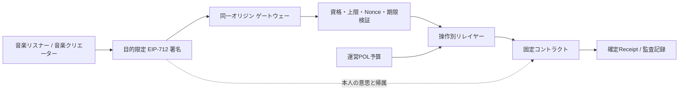

# ADR-0021: リレイヤーによるユーザ・音楽クリエーターのガス代負担

**状態:** 提案

**日付:** 2026-09-01

**最終更新日:** 2026-09-01

## 背景

Polygon AmoyとPolygon PoSでは、コントラクト書込みの送信者がPOLでネットワーク手数料を支払う。一般の音楽リスナーや音楽クリエーターへPOLの取得、残高監視、追加購入およびガス価格調整を要求すると、音楽サービスとしての利用を妨げる。一方、運営が保持する汎用鍵で任意の操作を代行すると、本人の意思、権限分離、予算統制および監査可能性を失う。

公開実験では、サポーターSBT発行と二院制ガバナンス投票について、本人がEIP-712の目的限定メッセージへ署名し、別々の専用リレイヤーがAmoy POLを負担する経路を実装した。参加者承認ワーカー、SBTリレイヤー、ガバナンスリレイヤーは異なる鍵と役割を使用する。ただし、MockJPYC取得・承認、サブスクリプション開始、本人による参加資格登録、音楽クリエーター登録および作品申告は、現時点では本人ウォレットから直接送信する。

## 決定

プラットフォームがガス代を支援する標準方式を、**本人署名・目的限定リレイヤー・運営POL予算**の三つに分離する。

### 1. 本人の意思とトランザクション送信者を分離する

- ユーザまたは音楽クリエーターは、許可する操作、本人ウォレット、対象コントラクト、チェーンID、対象ID、Nonce、短い期限および同意版を含むEIP-712メッセージへ署名する。
- リレイヤーEOAはオンチェーントランザクションの送信者としてPOLを支払うが、SBTの所有者、サポーター、議員、投票者または音楽クリエーターをリレイヤー自身へ置き換えない。
- コントラクトは署名、Nonce、期限、資格および対象を再検証する。ゲートウェーだけの判定を認可の正本にしない。
- リレイヤーは本人の代わりに署名せず、署名内容を補完・変更せず、別の操作へ転用しない。

### 2. リレイヤーを操作と権限ごとに分離する

| 経路 | 本人 | リレイヤーの権限 | ガス負担 | 現在の状態 |
| --- | --- | --- | --- | --- |
| サポーターSBT発行 | 登録済み音楽リスナー | SBTの`RELAYER_ROLE`だけ | 専用SBTリレイヤーのテストPOL | Amoyへ配備・資金補充済み、公開ウォレットE2Eは未完了 |
| CFP承認投票 | 会期別のユーザ院議会／音楽クリエータ院議会議員 | ガバナーの`RELAYER_ROLE`だけ | 専用ガバナンスリレイヤーのテストPOL | Amoyへ配備・資金補充済み、公開ウォレットE2Eは未完了 |
| 実験参加承認・初回POL配布 | 運営が承認した実験参加者 | 参加者登録の承認権限 | 参加者登録運営鍵のテストPOL | 運営ワーカーとして実装済み。本人署名リレイヤーとは別経路 |
| MockJPYC・月額利用・本人役割登録 | ユーザ本人 | なし | 本人ウォレット | 現在は直接送信 |
| 音楽クリエーター登録・作品申告 | 音楽クリエーター本人 | なし | 本人ウォレット | 現在は直接送信 |

SBT、ガバナンス、参加者承認、デプロイ、アップグレード、審査、失効および緊急停止の鍵を兼用しない。各リレイヤーには呼出し先と関数を限定した最小権限だけを付与する。汎用的な任意トランザクション送信APIは設けない。

### 3. 運営POLを予算として管理する

- テストネットではAmoy POL、本番候補ではPolygon PoSのPOLを、株式会社が管理する運営用ガス予算からリレイヤーへ補充する。
- リレイヤー残高は少額に制限し、補充元の資金庫または運営口座と分離する。秘密鍵に大きな残高を保持しない。
- 操作種別、参加者、時間帯および一日当たりの回数・推定ガス上限を設定し、事前シミュレーションと料金上限を満たす場合だけ送信する。
- 残高警告しきい値、補充上限および停止しきい値を設ける。無制限の自動補充は行わず、上限変更は承認と監査記録を必要とする。
- 公開実験の初期リレイヤー残高は各0.05テストPOLとし、実利用データを得るまで恒久的な適正額とは扱わない。

### 4. ガス代とサービス料金を会計上分離する

- リレイヤーが支払うPOLはネットワーク手数料であり、JPYC等による月額料金、寄附、音楽クリエーターへの分配、SBT価格または投票対価ではない。
- ガス代支援だけをサブスクリプション成立、支払完了、寄附または音楽クリエーター収益として記録しない。
- 株式会社は、トランザクションハッシュ、操作種別、リレイヤー、署名者ウォレット、実使用ガス、POL額、成功・失敗、再試行関係および対象ポリシー版を運営費台帳へ記録する。メールアドレス、実名、秘密鍵または署名対象外の個人情報を公開チェーン記録へ追加しない。
- 本番でガス費用を月額料金の原価へ含める場合は、ユーザへ「ネットワーク手数料相当額」を個別売買・立替精算する表示を避け、事前に明示したサービス価格と株式会社の運営費として扱う。価格表示、税務、資金決済、暗号資産交換・媒介該当性および会計処理は本番導入前に専門家確認を行う。

### 5. 不正利用と障害を閉じた状態で扱う

- 事前登録済みの対象役割、署名者、固定チェーン、固定コントラクト、許可関数、Nonce、Deadline、同意版、対象ID、冪等キー、回数制限および事前シミュレーションを検証する。
- 署名検証失敗、期限切れ、Nonce不一致、対象外操作、予算超過、料金上限超過、RPC不一致またはリレイヤー残高不足では送信しない。
- 受付、トランザクションハッシュ生成またはガス支払だけを成功とせず、必要Confirmationsを満たすReceiptとオンチェーン状態を再取得して完了とする。
- 再試行は同じ本人意思と冪等キーへ結合し、二重発行・二重投票・二重費用を防ぐ。失敗した操作のガスをユーザや音楽クリエーターへ事後請求しない。
- リレイヤー停止時に運営者が本人の意思を作成する代替経路は設けない。直接送信を残す場合は、本人がPOLを負担する別操作であることを明示し、自動的に切り替えない。

### 6. 本番への拡張

本番では、操作数とユーザ数に応じてERC-4337等のスマートアカウント／ペイマスターを比較できる。ただし、方式を変更しても、本人の目的限定同意、固定呼出し先、オンチェーン再検証、操作別予算、鍵・権限分離、監査記録、料金との分離および停止可能性を維持する。

音楽クリエーター登録、作品申告、月額利用および分配請求を将来ガス代支援の対象にする場合は、各操作に専用の署名型関数または検証アダプターを設ける。既存の本人直接送信関数を、運営鍵が本人になりすまして呼び出す方式は採用しない。

## 影響

### 利点

- ユーザと音楽クリエーターはPOL残高を意識せず、署名内容を確認して対象操作を実行できる。
- オンチェーン上の所有者・投票者・音楽クリエーターの帰属を本人ウォレットへ維持できる。
- リレイヤー侵害時の影響を、限定権限、限定残高、対象関数および予算上限へ抑えられる。
- ガス代、サービス料金、音楽クリエーター分配を監査上分離できる。

### トレードオフ

- ゲートウェー、秘密管理、残高監視、補充、率制限、監査台帳および障害対応が必要になる。
- リレイヤー停止やPOL不足では対象操作が遅延する。
- 署名内容を一般ユーザが理解できるUIと、ウォレット実装差への対応が必要になる。
- 現在は一部操作だけが対象であり、ユーザと音楽クリエーターの全操作がガス代不要になったわけではない。

## 検討した代替案

### 参加者へ一律に大量のPOLを配布する

簡単だが、未使用残高、不正取得、追加配布管理および初心者の残高管理を増やす。直接送信が必要な現行操作の最小POL配布は残すが、目的限定操作の標準方式にはしない。

### 運営が本人の代わりに操作内容を作成する

本人の意思とオンチェーン帰属を証明できず、運営鍵侵害時に任意操作が可能になるため採用しない。

### 一つのリレイヤー鍵で全操作を送信する

権限、予算、失効、監査および事故範囲を分離できないため採用しない。

### ガス代を都度JPYCでユーザから回収する

少額決済のUXと会計を複雑化し、サービス料金・暗号資産・立替金の表示を混同し得るため初期方式には採用しない。

## 受入基準

1. リレイヤー送信後もSBT所有者、サポーター、議員、投票者または音楽クリエーターの帰属が署名者ウォレットになる。
2. EIP-712署名がチェーン、コントラクト、操作、本人、対象、Nonce、Deadlineおよび同意版へ結合される。
3. 各リレイヤー鍵が操作別に分離され、管理・アップグレード・審査・失効権限を持たない。
4. 参加資格、許可対象、回数、ガス上限、料金上限、残高および事前シミュレーションを満たさない操作を送信しない。
5. Receiptとオンチェーン状態の確認前に成功表示しない。
6. ガス費用を月額料金、寄附、分配、SBT価格または投票対価として記録しない。
7. 操作と費用の監査記録を残し、秘密鍵や不要な個人情報をログ・公開チェーン・Gitへ残さない。
8. リレイヤー残高不足、RPC障害、期限切れおよび重複送信を安全に停止・再試行できる。
9. 直接送信のままの操作とリレイヤー対象操作をUIおよび運用文書で区別する。

## 実装状態

2026-09-01時点で、Polygon AmoyのサポーターSBT用リレイヤーとガバナンス投票用リレイヤーを別々のEOA・`RELAYER_ROLE`・0.05テストPOL残高で配備し、Google クラウド上の同一オリジンゲートウェーへ読み取り専用秘密ファイルとして設定した。公開health API、役割、残高およびコントラクトアドレスは検証済みである。実験参加者ウォレットによる公開SBT発行・公開議会投票E2E、本番の予算台帳、自動補充ワーカー、全操作対応、固定HTTPS名、独立セキュリティ監査および法務・税務確認は未完了である。

## 関連文書

- [ADR-0007 ブロックチェーン / L2 戦略](./ADR-0007-blockchain-l2-strategy.md)
- [ADR-0010 サポーターSBT・特権](./ADR-0010-early-supporter-sbt-privileges.md)
- [ADR-0014 公開テストネットユーザ利用フロー](./ADR-0014-public-testnet-user-journey.md)
- [ADR-0015 公開テストネット音楽クリエーター利用フロー](./ADR-0015-public-testnet-creator-journey.md)
- [ADR-0016 コントラクト変更の二院制・二次投票ガバナンス](./ADR-0016-bicameral-quadratic-governance.md)
- [ADR-0020 ウォレット未確定型の事前登録と本人登録](./ADR-0020-wallet-agnostic-participant-invitations.md)
- [サブスクリプション精算仕様](/protocol/specs/subscription-settlement)
- [コントラクト変更ガバナンス仕様](/protocol/specs/governance-change)
