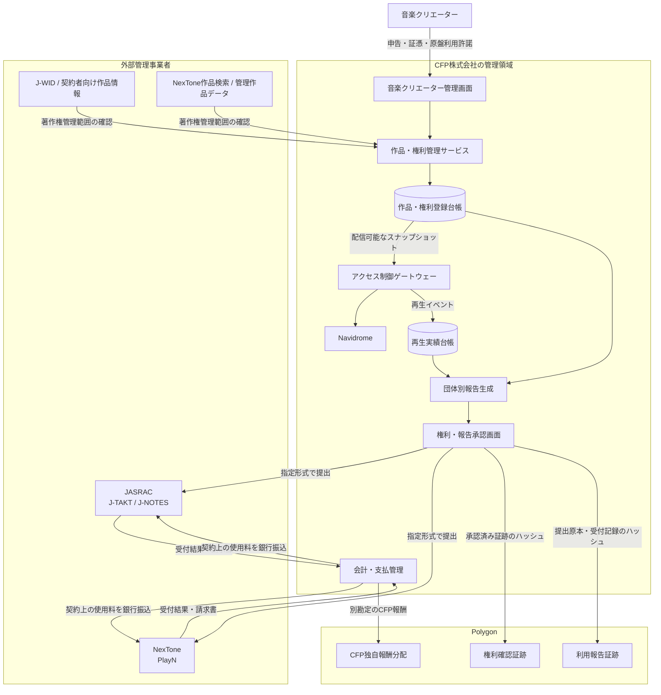

# ADR-0022: JASRAC・NexTone権利処理連携

**状態:** 提案
**日付:** 2026-09-02
**最終更新日:** 2026-09-02

## 1. 背景

Creator First Platform（CFP）が日本国内で音楽を主とする商用ストリーミングを提供するには、作品に適用される著作権管理範囲を確認し、必要な利用許諾を取得し、利用実績を報告して使用料を支払う必要がある。

JASRACはJ-TAKTをインタラクティブ配信の申込窓口とし、J-NOTESで利用曲目報告を受け付ける。NexToneはPlayNで利用申請、利用実績報告および請求書取得を扱う。一方、両者への手続は主として管理楽曲の著作権に関するものであり、原盤権、実演家の権利、ジャケットその他の権利を一括して許諾するものではない。

CFPは、権利登録台帳、アクセス制御ゲートウェー、Navidrome、利用実績オラクル、音楽クリエーター分配および資金庫透明性モデルを既に別の責任境界として設計している。外部管理事業者との連携でも、法的手続、業務データ、公開証跡およびCFP独自報酬を混同しない一貫した境界が必要である。

## 2. 決定

運営株式会社をJASRAC・NexToneとの契約、申請、報告および支払の責任主体とし、次の半自動連携を採用する。



### 2.1 初期連携は公式システムへの人による提出とする

- CFPは共通の再生実績台帳からJ-NOTES用、PlayN用および自己管理作品用の報告ファイルを生成する。
- 報告作成担当者と承認担当者を分け、承認後のファイルを法人担当者が公式システムへアップロードする。
- 受付結果、エラー、請求書および支払証憑を報告版へ関連付ける。
- J-TAKT、J-NOTES、PlayNその他の画面を無断でスクレイピングしない。共有ID・パスワードをサービスコードへ保存しない。
- 正式なAPI、一括データ連携または機械提出の契約を締結できた場合だけ、同じアダプター境界の送信部分を置き換える。

### 2.2 著作物と録音物を分離する

作品・権利登録台帳は少なくとも次を別のレコードとして扱う。

```text
楽曲作品
- cfp_composition_id
- iswc
- title
- writers
- publishers

録音物
- cfp_recording_id
- isrc
- title
- master_owner
- performer_rights_status
- artwork_rights_status
- recording_of_composition_ids

RightsSlice
- composition_id
- society: JASRAC | NEXTONE | SELF_MANAGED
- society_work_code
- rights_type
- territory
- use_scope
- share_numerator / share_denominator
- valid_from / valid_until
- evidence_reference / evidence_hash
- source_retrieved_at
- review_status / reviewed_by / reviewed_at
```

同じ作品について、複数の権利者、管理主体、持分、地域、利用形態および有効期間を表現できなければならない。JASRAC、NexTone、TuneCore等の事業者名、作品コード、ISRC、ISWC、検索結果または音楽クリエーターの申告だけを、作品全体の権利保有またはCFPへの配信許諾の証明として扱わない。

### 2.3 配信可否を権利状態へ結合する

権利状態は次のライフサイクルを持つ。

```text
DRAFT
  → EVIDENCE_REQUIRED
  → UNDER_REVIEW
  → RIGHTS_VERIFIED
  → LICENSED
  → PUBLISHABLE

PUBLISHABLE → SUSPENDED | REVOKED | SUPERSEDED
```

ゲートウェーは対象地域、利用形態および再生時刻に対して`PUBLISHABLE`である正確な権利スナップショットを解決できる場合だけ、新しい再生認可を発行する。権利状態が欠落、不完全、期限切れ、競合、紛争中または検証不能の場合は閉じた状態で拒否する。過去に確定した利用は、後の版によって意味を変更しない。

### 2.4 共通再生実績から団体別報告を生成する

再生実績台帳は少なくとも次を保持する。

```text
play_event_id
cfp_recording_id
cfp_composition_ids
played_at
duration_seconds
reportable_request_count
service_plan / subscription_category
territory
rights_snapshot_version
fraud_review_status
source_event_hash
```

契約上の再生・リクエストの数え方、収入項目、報告期間および提出期限は、管理事業者と締結した最新契約・書式の版として構成する。CFP独自の再生完了基準を管理事業者向けの報告数量へ無断で読み替えない。

報告生成は次のアダプター境界を持つ。

```text
UsageReportCore
├── JasracReportAdapter  → J-NOTES提出形式
├── NexToneReportAdapter → PlayN提出形式
└── SelfManagedAdapter   → 権利者別利用・精算明細
```

生成物には`report_id`、対象期間、管理主体、入力スナップショット、書式版、行数、集計値、生成者、生成時刻および原本ハッシュを付す。修正は上書きではなく新版とし、差分と理由を保持する。

### 2.5 二者承認と職務分離を要求する

| 権限 | 責任 |
| --- | --- |
| `CREATOR_SUBMITTER` | 作品、権利主張および証憑の提出 |
| `RIGHTS_REVIEWER` | 外部情報・契約範囲の確認 |
| `RIGHTS_APPROVER` | 配信可能な権利状態の法人承認 |
| `REPORT_PREPARER` | 団体別報告の生成・訂正 |
| `REPORT_APPROVER` | 凍結済み報告版の独立承認 |
| `TREASURY_EXECUTOR` | 請求書に基づく支払実行 |
| `AUDITOR` | 原本、提出、受付、請求および支払の照合 |
| `EMERGENCY_SUSPENDER` | 権利侵害等に対する対象限定の緊急停止 |

本番では、同じ人物またはサービスアカウントが報告生成、最終承認および支払実行を単独で完結できないようにする。緊急停止は理由と期限を記録し、追認または解除のレビューを要求する。

### 2.6 API境界

実装は少なくとも次と同等の操作を提供する。

```text
POST /v1/creator/works
POST /v1/creator/works/{work_id}/evidence
GET  /v1/admin/works/{work_id}/rights
POST /v1/admin/works/{work_id}/verify
POST /v1/admin/works/{work_id}/suspend

POST /internal/play-events
POST /v1/admin/rights-reports/generate
GET  /v1/admin/rights-reports/{report_id}
POST /v1/admin/rights-reports/{report_id}/approve
POST /v1/admin/rights-reports/{report_id}/record-submission
POST /v1/admin/rights-reports/{report_id}/record-payment
```

各変更操作は、認証済み主体、役割、冪等キー、対象版、理由、証拠参照および相関IDを要求する。ブラウザから報告提出や支払を直接実行させず、法人承認済みのバックオフィス処理へ分離する。

### 2.7 オンチェーン証跡の範囲

Polygon上には二つの目的限定コントラクトまたは同等のモジュールを置くことができる。

```solidity
interface IRightsEvidenceRegistry {
    function proposeSnapshot(
        bytes32 workIdHash,
        uint32 version,
        bytes32 evidenceHash,
        bytes32 termsHash,
        uint64 validFrom,
        uint64 validUntil
    ) external;

    function approveSnapshot(bytes32 workIdHash, uint32 version) external;

    function suspendSnapshot(
        bytes32 workIdHash,
        uint32 version,
        bytes32 reasonHash
    ) external;
}

interface IUsageReportRegistry {
    enum Society { JASRAC, NEXTONE, SELF_MANAGED }

    function proposeReport(
        Society society,
        uint32 period,
        bytes32 reportHash,
        bytes32 rightsSnapshotRoot
    ) external returns (uint256 reportId);

    function approveReport(uint256 reportId) external;
    function recordSubmission(uint256 reportId, bytes32 receiptHash) external;
    function recordPayment(uint256 reportId, bytes32 paymentEvidenceHash) external;
}
```

これらのコントラクトは、著作権その他の権利を創設、移転または確定せず、外部管理事業者への申請・提出・支払を代替せず、再生実績の真実性を自ら判定しない。契約書全文、氏名、住所、税務情報、請求書原本、作品別の非公開収益明細その他の機密情報を公開チェーンへ保存しない。

オンチェーン状態はオフチェーン正本の監査補助である。最終的な利用許諾、報告および支払の正本は、それぞれの契約、法人の権利台帳、公式システムの受付記録、請求書、銀行記録および法定会計にある。

### 2.8 支払フローを分離する

次の資金フローを別の根拠、台帳、勘定および公開表示として扱う。

1. JASRAC・NexTone等への著作権使用料
2. 原盤権者・実演家等への契約上の支払
3. TuneCore等を通じた外部配信・著作権管理収益
4. CFP月額料金からの音楽クリエーター報酬
5. リスナー指定型配分および成長支援

管理事業者への支払を特定の音楽クリエーターへ直接支払済みとは表示しない。JPYC等によるCFP独自報酬と、管理事業者へ法定通貨で支払う契約上の使用料を同一のオンチェーン分配として処理しない。

### 2.9 ガバナンスとの境界

両議会とCFP手続は、権利登録項目、透明性基準、異常再生対策およびCFP独自報酬ポリシーを提案・審議できる。ただし、多数決で個別作品の権利者を確定せず、運営株式会社が負う許諾取得、正確な報告、期限内支払、権利侵害対応、配信停止、会計および税務上の義務を変更、免除または遅延しない。

## 3. 実装状態と段階導入

2026年9月2日時点で、本ADRは設計判断であり、JASRAC・NexToneとの利用許諾契約、権利照合サービス、団体別報告生成、提出・請求突合および証跡コントラクトは未実装・未契約である。既存のPolygon Amoy音楽クリエーター登録・作品申告は自己申告コミットメントのテストであり、権利確認、配信許諾または管理事業者への報告を完了したことを意味しない。

段階導入は次の順序とする。

1. CFPが権利を確保したテスト音源で、作品・権利台帳と報告生成をローカル検証する。
2. Amoyでは架空の管理事業者データを使い、ハッシュ証跡と二者承認を検証する。
3. 運営株式会社がサービス概要、料金、配信方法および報告能力を整理する。
4. JASRAC・NexToneへ正式に相談し、契約、料金、報告定義、期限および書式を確定する。
5. 取得した条件でアダプターと受入試験を更新する。
6. 許諾済み作品だけを本番で有効化する。
7. 規模拡大後、正式なAPIまたは一括連携を協議する。

## 4. 影響

### 利点

- 権利の法的正本とオンチェーン証跡を混同せずに透明性を高められる。
- 共通再生実績から管理事業者ごとの書式変更へ対応できる。
- 著作権使用料、原盤報酬、外部配信収益およびCFP独自報酬を説明可能に分離できる。
- 誤った管理先、重複報告、二重支払および未許諾配信を発見しやすくなる。
- 将来の正式API連携でも権利台帳・報告台帳・承認境界を維持できる。

### トレードオフ

- 作品・持分・地域・利用形態・期間を扱う複雑な権利モデルが必要になる。
- 法人担当者による照合、提出、エラー修正、請求突合および支払が残る。
- 外部管理データと契約条件の変更を継続的に追跡する必要がある。
- 即時のオンチェーン分配と、管理事業者による請求・分配の時間軸は一致しない。
- 権利処理、会計、個人情報、セキュリティおよび監査の専門体制が必要になる。

## 5. 検討した代替案

### 管理事業者と連携せず、音楽クリエーターへ直接支払う

管理委託済みの楽曲、共同著作者、出版社、地域・利用形態別の管理範囲を処理できず、未許諾利用や誤分配を招くため採用しない。

### TuneCore等への登録だけで権利確認済みとする

配信代行、著作権管理、原盤権、実演家の権利およびCFPへの利用許諾は別の関係であり、アカウントや配信実績だけでは証明できないため採用しない。

### 公式システムを画面スクレイピングで完全自動化する

利用条件、認証情報、画面変更、誤提出および責任分界のリスクが高いため採用しない。正式な機械連携契約が得られた場合に限り再評価する。

### 契約・作品別明細をすべて公開チェーンへ保存する

個人情報、営業秘密、訂正、費用、公開範囲および法的正本の観点から採用しない。

### 利用報告と支払をガバナンス投票で承認する

契約上の期限と法人の法的義務を、多数決または投票不成立によって遅延させるため採用しない。ガバナンスはCFP独自ポリシーを扱い、必須の法務・会計業務は法人統制で執行する。

## 6. 受入基準

1. 著作物、録音物、原盤権・実演家等の権利および管理事業者の著作権管理範囲が別レコードになる。
2. 同一作品の複数管理主体、持分、地域、利用形態および有効期間を表現できる。
3. 配信認可が正確な`PUBLISHABLE`権利スナップショットへ結合され、欠落・紛争・期限切れでは閉じた状態になる。
4. 同じ再生実績からJ-NOTES、PlayNおよび自己管理用の版付き報告を再現できる。
5. 報告生成者と承認者が分離され、提出、受付、請求、支払の証跡が突合できる。
6. 修正報告が原本を上書きせず、差分、理由および承認を保持する。
7. オンチェーン証跡から個人情報、契約本文、請求書原本および非公開収益明細を復元できない。
8. コントラクトが権利の創設・移転・法的確定または公式提出・支払の代替であると表示されない。
9. JASRAC・NexTone使用料、原盤等の契約支払、TuneCore等の外部収益およびCFP独自報酬を別勘定で照合できる。
10. 本番有効化前に、最新の契約、料金、報告定義、提出期限および書式を法人と専門家が再確認する。

## 7. 関連文書

- [ホワイトペーパー 第3章 権利と資金](/whitepaper/03-rights-and-money)
- [ADR-0003 権利登録台帳](./ADR-0003-rights-registry.md)
- [ADR-0004 音楽クリエーター分配モデル](./ADR-0004-creator-distribution-model.md)
- [ADR-0005 利用実績オラクル](./ADR-0005-usage-oracle.md)
- [ADR-0009 Navidrome・ストリーミングゲートウェイ](./ADR-0009-navidrome-streaming-gateway.md)
- [ADR-0013 資金庫フロー透明性参照モデル](./ADR-0013-treasury-flow-transparency.md)
- [権利登録台帳仕様](/protocol/specs/rights-registry)
- [再生検証仕様](/protocol/specs/playback-verification)
- [音楽クリエーター分配仕様](/protocol/specs/creator-distribution)
- [JASRAC 商用配信の手続](https://www.jasrac.or.jp/users/internet/procedure-business/)
- [NexTone インターネット上での音楽利用](https://www.nex-tone.co.jp/copyright/users/int.html)
