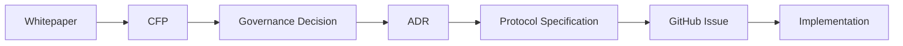

# Architecture Decision Records

Architecture Decision Record（ADR）は、
Creator First Platform における重要な設計判断と、
その判断に至った理由を記録する文書です。

## ADRの役割

Creator First Platformでは、次の流れで
理念から実装までを追跡可能にします。

| ADR                                                  | Design Decision               | Status   |
| :--------------------------------------------------- | :---------------------------- | :------- |
| [ADR-0001](./ADR-0001-governance-model.md)           | Governance Model              | Proposed |
| [ADR-0002](./ADR-0002-verifiable-sortition.md)       | Verifiable Sortition          | Proposed |
| [ADR-0003](./ADR-0003-rights-registry.md)            | Rights Registry               | Proposed |
| [ADR-0004](./ADR-0004-creator-distribution-model.md) | Creator Distribution Model    | Proposed |
| [ADR-0005](./ADR-0005-usage-oracle.md)               | Usage Oracle                  | Proposed |
| ADR-0006                                             | Zero-Knowledge Proof Strategy | Proposed |
| ADR-0007                                             | Blockchain / L2 Strategy      | Proposed |
| ADR-0008                                             | Protocol Upgrade Governance   | Proposed |

