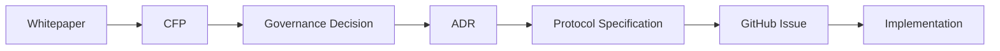

# Architecture Decision Records

Architecture Decision Record（ADR）は、
Creator First Platform における重要な設計判断と、
その判断に至った理由を記録する文書です。

## ADRの役割

Creator First Platformでは、次の流れで
理念から実装までを追跡可能にします。

| ADR                                                        | Design Decision                      | Status   | Date       | Last Updated |
| :--------------------------------------------------------- | :----------------------------------- | :------- | :--------- | :----------- |
| [ADR-0001](./ADR-0001-governance-model.md)                 | Governance Model                     | Proposed | 2026-07-27 | 2026-08-20   |
| [ADR-0002](./ADR-0002-verifiable-sortition.md)             | Verifiable Sortition                 | Proposed | 2026-07-29 | 2026-08-20   |
| [ADR-0003](./ADR-0003-rights-registry.md)                  | Rights Registry                      | Proposed | 2026-07-29 | 2026-08-20   |
| [ADR-0004](./ADR-0004-creator-distribution-model.md)       | Creator Distribution Model           | Proposed | 2026-07-29 | 2026-08-20   |
| [ADR-0005](./ADR-0005-usage-oracle.md)                     | Usage Oracle                         | Proposed | 2026-07-29 | 2026-08-20   |
| [ADR-0006](./ADR-0006-zero-knowledge-proof-strategy.md)    | Zero-Knowledge Proof Strategy        | Proposed | 2026-07-29 | 2026-08-20   |
| [ADR-0007](./ADR-0007-blockchain-l2-strategy.md)           | Blockchain / L2 Strategy             | Proposed | 2026-07-29 | 2026-08-20   |
| [ADR-0008](./ADR-0008-account-wallet-identity-strategy.md) | Account / Wallet / Identity Strategy | Proposed | 2026-07-29 | 2026-08-20   |
| [ADR-0009](./ADR-0009-navidrome-streaming-gateway.md)      | Navidrome / Streaming Gateway        | Proposed | 2026-08-19 | 2026-08-20   |

各ADRは初回作成日の`Date`と、内容またはメタデータを最後に変更した`Last Updated`を分けて記録します。
