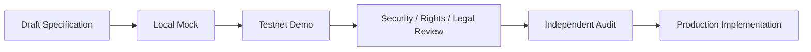

# Testnet Demo

Creator First Platformは、まずTestnet上のデモシステムでProtocol、Streaming Gateway、Smart Contract連携、失敗時の挙動を検証し、その証拠をレビューした後に本番系を実装します。

::: warning 公開Testnetは実験環境です
Ethereum SepoliaのContract AddressとSource Commitを公開しましたが、Gateway、Navidrome、Indexer、本番Accountおよび本番決済とは未接続です。本ページ以外が提示する送金先、TokenまたはWallet接続を公式Demoとして扱わず、本番資産や実在JPYCを使用しないでください。
:::

## 実装順序

1. 合成Account、Mock Rights、Mock音源、金銭的価値を持たないTestnet AssetでVertical Sliceを実装する。
2. 正常系だけでなく、replay、duplicate、delay、outage、取消し、権利停止、緊急停止を検証する。
3. 使用Network、Contract Address、Source Commit、既知の制約、データ取扱いを公開する。
4. 法務・Rights・Privacy・SecurityレビューとSmart Contract監査を終える。
5. Testnet成果物をそのまま本番へ流用せず、本番用の鍵、権限、インフラ、契約、監視、復旧手順を別Gateで実装する。

## サービスを選ぶ

利用者向けと音楽クリエータ向けの入口を分離しました。Test User登録は、公開ページ上でProfile、Sepolia Wallet、mockJPYC Subscription、合成音源Playerを順に試すJourneyへ拡張しています。

<DemoServiceChoices kind="entry" />

Test UserのAliasとIDは現在のタブのSession Storageだけに保存されます。Walletを明示接続した後のAddressとTransactionはSepoliaの公開情報になりますが、ProfileとWallet AddressをPlatform Accountとして結合しません。Test Creatorの登録もPlatform Account、本人確認、Rights、配信公開または報酬受取資格を作成しません。

Alias Profileの登録だけを、Playback、Wallet Link、SubscriptionまたはSBT資格の認可条件にも使用しません。公開Journeyの限定合成Trackは、Contract公開後にSepolia上の確定済みSubscription状態だけを参照するUI Gateであり、GatewayのStreaming Authorizationを成立させるものではありません。

## 音楽クリエータ向け機能デモ

音楽クリエータは、実名や実在作品を使わずに仮名のCreator Profileを登録し、Test Creator JourneyでSepolia Wallet、Creator Commitmentと作品の権利自己申告Commitmentを試せます。最初に登録画面を試す場合と、登録済みProfileからTestnet機能を利用する場合の入口を分けています。

<DemoServiceChoices kind="creator" />

「登録する」は[Test Creator登録デモ](/demo/creator-registration)、「利用する」は[Test Creator Journey](/demo/creator-workspace)へ移動します。Profile入力は現在のTabだけ、Wallet AddressとCommitment TransactionはSepoliaへ記録されるが、本人確認、権利確認、音源Upload、配信公開、報酬計算または支払処理を行いません。

Gateway APIとCookie Sessionを含む開発者向け検証は、[ローカルStreaming Gateway](/demo/local-gateway)を起動してPlayerを利用します。

## 現在の状態

| 項目 | 状態 |
| --- | --- |
| 公開デモURL | [Test User Journey](/demo/test-user-registration) |
| 対象Testnet | Ethereum Sepolia（Chain ID `11155111`） |
| Demo Contract Address | [公開Deployment一覧](/demo/testnet-contracts#公開deployment) |
| Streaming Gateway | [ローカルMock実装済み](/demo/local-gateway)、公開環境未デプロイ |
| Navidrome Media Adapter | Adapter実装済み、専用User・非公開Network・Canonical Mapping未設定 |
| Player PWA | ローカルGateway接続済み、公開環境未デプロイ |
| Test Userサービス | GitHub PagesにProfile／Sepolia Wallet／mockJPYC課金／合成Player Journeyを実装・公開。Gateway認可・本番Authenticator未実装 |
| Test Creatorサービス | [仮名Profile、Sepolia Wallet、Creator／Release Commitment Journey](/demo/creator-workspace)とCreator Registryを公開。本人／権利／公開／支払処理は未実装 |
| Testnet Smart Contract | [Ethereum Sepoliaへデプロイ・公開検証済み](/demo/testnet-contracts)、Gateway／Indexer未接続 |
| Testnet決済 | 一回限りのMockJPYC Test Faucet、exact-amount Approve、Subscriptionを公開。無価値・償還不可、本番決済ではない |
| Rights / Usage / Distribution | Draft仕様、未実装 |

進捗と成立条件は[現在の状況](/status)、[Vertical Slice Implementation Plan](/protocol/implementation-plan)、[Decision Baseline](/protocol/decision-baseline)で確認できます。

公開Testnetの前段階として、[ローカル音楽ストリーミング](/demo/local-streaming)と[ローカルStreaming Gateway](/demo/local-gateway)で合成試験音を検証できます。

## 本番移行の禁止条件

次の条件が一つでも残る間は、本番資金、実在Rights、未公開音源、個人情報または本番Walletを扱いません。

- Blocking Open Questionまたは未失効のMock Assumptionが残る
- Chain、Asset、Contract、Rights、Usage、Distributionの照合が再現できない
- Threat Model、独立Security Review、Smart Contract監査が完了していない
- 法務・Rights・税務・Privacy・OSS Licenseの承認記録がない
- Incident response、停止、復旧、鍵Rotation、Rollbackが訓練されていない

デモが公開された時点で、このページの「公開デモURL」「対象Testnet」「Contract Address」「Source Commit」を更新します。
