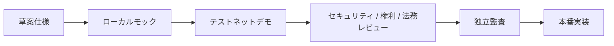

# テストネットデモ

Creator First Platformは、まずテストネット上のデモシステムでプロトコル、ストリーミングゲートウェイ、スマートコントラクト連携、失敗時の挙動を検証し、その証拠をレビューした後に本番系を実装します。

::: warning 公開テストネットは実験環境です
Ethereum Sepoliaのコントラクトアドレスとソースコミットを公開しましたが、ゲートウェイ、Navidrome、インデクサー、本番アカウントおよび本番決済とは未接続です。本ページ以外が提示する送金先、トークンまたはウォレット接続を公式デモとして扱わず、本番資産や実在JPYCを使用しないでください。
:::

## 実装順序

1. 合成アカウント、モック権利、モック音源、金銭的価値を持たないテストネット資産で最小縦断実装を実装する。
2. 正常系だけでなく、replay、duplicate、delay、outage、取消し、権利停止、緊急停止を検証する。
3. 使用ネットワーク、コントラクトアドレス、ソースコミット、既知の制約、データ取扱いを公開する。
4. 法務・権利・プライバシー・セキュリティレビューとスマートコントラクト監査を終える。
5. テストネット成果物をそのまま本番へ流用せず、本番用の鍵、権限、インフラ、契約、監視、復旧手順を別ゲートで実装する。

## サービスを選ぶ

ユーザ向けと音楽クリエータ向けの入口を分離しました。テストユーザ登録は、公開ページ上でプロフィール、Sepolia ウォレット、mockJPYC サブスクリプション、合成音源プレーヤーを順に試す利用フローへ拡張しています。

<DemoServiceChoices kind="entry" />

二院制議会と二次投票は、[音楽クリエータ院議会](/demo/creator-house)と[ユーザ院議会](/demo/user-house)の各入口、または[両院の統合画面](/demo/governance)で提案状態、両院別集計、議員の投票クレジットを確認できます。接続ウォレットが該当する院の議員資格を持たない場合、各院ページの書込み操作を停止します。

テストユーザのAliasとIDは現在のタブのセッションストレージだけに保存されます。ウォレットを明示接続した後のアドレスとトランザクションはSepoliaの公開情報になりますが、プロフィールとウォレットアドレスをプラットフォームアカウントとして結合しません。テスト音楽クリエーターの登録もプラットフォームアカウント、本人確認、権利、配信公開または報酬受取資格を作成しません。

Alias プロフィールの登録だけを、再生、ウォレット連携、サブスクリプションまたはSBT資格の認可条件にも使用しません。公開利用フローの限定合成楽曲は、コントラクト公開後にSepolia上の確定済みサブスクリプション状態だけを参照するUI ゲートであり、ゲートウェイのストリーミング認可を成立させるものではありません。

## 音楽クリエータ向け機能デモ

音楽クリエータは、実名や実在作品を使わずに仮名の音楽クリエータープロフィールを登録し、テスト音楽クリエーター利用フローでSepolia ウォレット、音楽クリエーターコミットメントと作品の権利自己申告コミットメントを試せます。最初に登録画面を試す場合と、登録済みプロフィールからテストネット機能を利用する場合の入口を分けています。

<DemoServiceChoices kind="creator" />

「登録する」は[テスト音楽クリエーター登録デモ](/demo/creator-registration)、「利用する」は[テスト音楽クリエーター利用フロー](/demo/creator-workspace)へ移動します。プロフィール入力は現在のTabだけ、ウォレットアドレスとコミットメントトランザクションはSepoliaへ記録されるが、本人確認、権利確認、音源アップロード、配信公開、報酬計算または支払処理を行いません。

ゲートウェイ APIとCookie セッションを含む開発者向け検証は、[ローカルストリーミングゲートウェイ](/demo/local-gateway)を起動してプレーヤーを利用します。

## 現在の状態

| 項目 | 状態 |
| --- | --- |
| 公開デモURL | [テストユーザ利用フロー](/demo/test-user-registration) |
| 対象テストネット | Ethereum Sepolia（チェーン ID `11155111`） |
| デモコントラクトアドレス | [公開デプロイ一覧](/demo/testnet-contracts#public-deployment) |
| ストリーミングゲートウェイ | [ローカルモック実装済み](/demo/local-gateway)、公開環境未デプロイ |
| Navidrome メディアアダプター | アダプター実装済み、専用ユーザ・非公開ネットワーク・正規対応付け未設定 |
| プレーヤー PWA | ローカルゲートウェイ接続済み、公開環境未デプロイ |
| テストユーザサービス | GitHub Pagesにプロフィール／Sepolia ウォレット／mockJPYC課金／合成プレーヤー利用フローを実装・公開。ゲートウェイ認可・本番認証器未実装 |
| テスト音楽クリエーターサービス | [仮名プロフィール、Sepolia ウォレット、音楽クリエーター／リリースコミットメント利用フロー](/demo/creator-workspace)と音楽クリエーター登録台帳を公開。本人／権利／公開／支払処理は未実装 |
| テストネットガバナンス | [二院制・二次投票・タイムロック画面](/demo/governance)とコントラクトを実装しSepoliaへデプロイ済み。会期・議員・提案の公開運用、抽選・秘密投票・異議申立ては未完了 |
| 透明型ゼロ知識証明境界 | 交換可能な検証インターフェース、非暗号学的モック検証者、チェーン拘束受付台帳をローカル実装。Sepolia公開デプロイ、実際の透明型証明方式、利用実績接続は未完了 |
| テストネットスマートコントラクト | [既存コントラクトはEthereum Sepoliaへデプロイ・公開検証済み](/demo/testnet-contracts)。透明型ZK境界、ゲートウェイ／インデクサーは未デプロイまたは未接続 |
| テストネット決済 | 一回限りのMockJPYC テスト Faucet、exact-amount Approve、サブスクリプションを公開。無価値・償還不可、本番決済ではない |
| 権利 / 利用実績 / 分配 | 草案仕様、未実装 |

進捗と成立条件は[現在の状況](/status)、[最小縦断実装実装計画](/protocol/implementation-plan)、[決定基準](/protocol/decision-baseline)で確認できます。

公開テストネットの前段階として、[ローカル音楽ストリーミング](/demo/local-streaming)と[ローカルストリーミングゲートウェイ](/demo/local-gateway)で合成試験音を検証できます。

## 本番移行の禁止条件

次の条件が一つでも残る間は、本番資金、実在権利、未公開音源、個人情報または本番ウォレットを扱いません。

- Blocking 未解決事項または未失効のモック仮定が残る
- チェーン、資産、コントラクト、権利、利用実績、分配の照合が再現できない
- 脅威モデル、独立セキュリティレビュー、スマートコントラクト監査が完了していない
- 法務・権利・税務・プライバシー・OSS Licenseの承認記録がない
- インシデント response、停止、復旧、鍵ローテーション、Rollbackが訓練されていない

デモが公開された時点で、このページの「公開デモURL」「対象テストネット」「コントラクトアドレス」「ソースコミット」を更新します。
