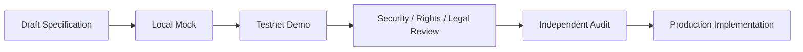

# Testnet Demo

Creator First Platformは、まずTestnet上のデモシステムでProtocol、Streaming Gateway、Smart Contract連携、失敗時の挙動を検証し、その証拠をレビューした後に本番系を実装します。

::: warning 公開デモは現在準備中です
ローカルPlayer MVPは合成試験音とMock資格だけで利用できますが、公開Testnetサービスではありません。公開URL、Network、Contract Address、検証済みCommitが確定するまで、外部サイトが提示する送金先・Token・Wallet接続を公式デモとして扱わないでください。
:::

## 実装順序

1. 合成Account、Mock Rights、Mock音源、金銭的価値を持たないTestnet AssetでVertical Sliceを実装する。
2. 正常系だけでなく、replay、duplicate、delay、outage、取消し、権利停止、緊急停止を検証する。
3. 使用Network、Contract Address、Source Commit、既知の制約、データ取扱いを公開する。
4. 法務・Rights・Privacy・SecurityレビューとSmart Contract監査を終える。
5. Testnet成果物をそのまま本番へ流用せず、本番用の鍵、権限、インフラ、契約、監視、復旧手順を別Gateで実装する。

## ローカルTest User登録

GatewayとPlayerを起動した後、[テストユーザー登録画面を開く](http://127.0.0.1:5173/#/register)ことができます。登録するのは公開用AliasとDemo利用条件・Privacy Noticeの確認だけです。実名、メール、電話番号、Passwordまたは本番Walletを入力しないでください。この登録は本番Account、本人確認、Subscription契約または資産口座ではありません。

## 現在の状態

| 項目 | 状態 |
| --- | --- |
| 公開デモURL | 準備中 |
| 対象Testnet | 未決定 |
| Demo Contract Address | 未デプロイ |
| Streaming Gateway | [ローカルMock実装済み](/demo/local-gateway)、公開環境未デプロイ |
| Navidrome Media Adapter | Adapter実装済み、専用User・非公開Network・Canonical Mapping未設定 |
| Player PWA | ローカルGateway接続済み、公開環境未デプロイ |
| Test User登録 | AliasだけのローカルTest-only Profile実装済み、本番Authenticator未実装 |
| Testnet決済 | 未実装 |
| Rights / Usage / Distribution | Draft仕様、未実装 |

進捗と成立条件は[現在の状況](/status)、[Vertical Slice Implementation Plan](/protocol/implementation-plan)、[Decision Baseline](/protocol/decision-baseline)で確認できます。

公開Testnetの前段階として、[ローカル音楽ストリーミング](/demo/local-streaming)と[ローカルStreaming Gateway](/demo/local-gateway)で合成試験音を検証できます。

## 本番移行の禁止条件

次の条件が一つでも残る間は、本番資金、実在Rights、未公開音源、個人情報または本番Walletを扱いません。

- Blocking Open Questionまたは未失効のMock Assumptionが残る
- Chain、Asset、Contract、Rights、Usage、Distributionの照合が再現できない
- Threat Model、独立Security Review、Smart Contract監査が完了していない
- 法務・Rights・税務・Privacy・OSS Licenseの承認記録がない
- Incident response、停止、復旧、鍵Rotation、Rollbackが訓練されていない

デモが公開された時点で、このページの「公開デモURL」「対象Testnet」「Contract Address」「Source Commit」を更新します。
