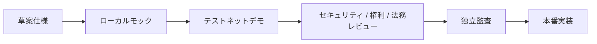

# テストネットデモ

[English version](/en/demo/)

[最初に読む：MetaMaskのインストールとPolygon Amoy接続手順](/demo/metamask-amoy-setup)

Creator First Platformは、まずテストネット上のデモシステムでプロトコル、ストリーミングゲートウェイ、スマートコントラクト連携、失敗時の挙動を検証し、その証拠をレビューした後に本番系を実装します。

::: warning 公開テストネットは実験環境です
Polygon Amoyのコントラクトアドレスとソースコミットを公開しましたが、ゲートウェイ、Navidrome、インデクサー、本番アカウントおよび本番決済とは未接続です。本ページ以外が提示する送金先、トークンまたはウォレット接続を公式デモとして扱わず、本番資産や実在JPYCを使用しないでください。
:::

## 実験参加者へのテストPOL段階補充

公開実験は事前登録・参加承認制とし、無差別に利用できるFaucetにはしません。承認済み参加者が結合済みウォレットでデモ操作を行うために、最初から0.5 POLを全額配布せず、必要最小限を初回配布し、承認済み操作に必要な場合だけ小口補充します。

| 制御 | テスト系の仕様 |
| --- | --- |
| 初回目標残高 | 初期利用経路の推定ガス費用の2倍を基準とし、暫定的に`0.02～0.05 テストPOL`の範囲で設定する |
| 補充契機 | 次の承認済み操作2回分の推定ガスをウォレット残高が下回った場合 |
| 補充後目標 | 次の承認済み操作5回分の推定ガスに安全係数`1.5`を掛けた額。ただし1回の補充は最大`0.05 テストPOL` |
| 累計上限 | CFPからの配布をユーザ／音楽クリエーター両役割で合算し、1人あたり最大`0.5 テストPOL` |
| ガス見積り | Polygon Amoyガスステーション等の現在値と対象コントラクトのガス見積りから算出する |
| 濫用防止 | 事前承認、ウォレット署名、期限付きnonce、冪等キー、クールダウン、日次・全体予算、異常な外部送金の審査 |
| 運用安全 | 配布鍵をGitHub Pagesへ置かず、監査ログ、残高警告、役割分離、緊急停止を備える |

補充額は概念的に、`min(補充後目標 − 現在残高, 0.05 POL, 0.5 POL − CFP累計配布額)`とします。残高が少ないという理由だけでは送金せず、mockJPYC Approve、サブスクリプション、SBT発行、議員登録等の承認された次操作へ結び付けます。参加者がPOLを別アドレスへ移動して補充を繰り返すことを防ぐため、上限は現在残高ではなくCFPからの累計配布額で判定します。

段階補充コントラクトはローカル実装と単体テストを完了しています。事前承認で発行する個人情報を含まない参加者IDとウォレットを1対1で登録し、初回目標`0.02 テストPOL`、補充後目標上限`0.05 テストPOL`、累計`0.5 テストPOL`、10分クールダウン、日次全体`1 テストPOL`、操作IDの再利用拒否、停止中だけの緊急回収をオンチェーンで強制します。参加者IDと操作IDには氏名、メールアドレス等を直接ハッシュせず、ランダム値または十分にsaltされた値だけを使用します。

配布コントラクトはPolygon Amoyの[`0x8a0B…12BE`](https://amoy.polygonscan.com/address/0x8a0B3F08EC1Bd4231be92320381a1bAc56D112BE)へデプロイし、初期資金`0.02 テストPOL`、Bytecode、上限値と停止状態を公開RPCで検証しました。英語の[AmoyテストPOL資金申請資料](/en/demo/amoy-pol-funding-request)には、このコントラクトを参加者配布枠の段階的な補充先として、運用EOAを登録・配布・管理トランザクション用ガスの別管理先として記載しています。

ただし、自動補充の判断とトランザクション送信には秘密鍵を持つオフチェーン運用サービスが必要です。現在はこの運用サービス、本人単位の重複登録審査、実測ガスによる目標残高の校正、失敗時の再送、Reorganization、同時要求、予算枯渇および停止時の表示は未実装です。テストPOLには金銭的価値、返金、報酬または本番移行時の権利がありません。

## 実装順序

1. 合成アカウント、モック権利、モック音源、金銭的価値を持たないテストネット資産で最小縦断実装を実装する。
2. 正常系だけでなく、replay、duplicate、delay、outage、取消し、権利停止、緊急停止を検証する。
3. 使用ネットワーク、コントラクトアドレス、ソースコミット、既知の制約、データ取扱いを公開する。
4. 法務・権利・プライバシー・セキュリティレビューとスマートコントラクト監査を終える。
5. テストネット成果物をそのまま本番へ流用せず、本番用の鍵、権限、インフラ、契約、監視、復旧手順を別ゲートで実装する。

## サービスを選ぶ

ユーザ向けと音楽クリエータ向けの入口を分離しました。テストユーザ登録は、公開ページ上でプロフィール、Polygon Amoy ウォレット、mockJPYC サブスクリプション、合成音源プレーヤーを順に試す利用フローへ拡張しています。

<DemoServiceChoices kind="entry" />

二院制議会と二次投票は、[音楽クリエータ院議会](/demo/creator-house)と[ユーザ院議会](/demo/user-house)の各入口、または[両院の統合画面](/demo/governance)で提案状態、両院別集計、議員の投票クレジットを確認できます。接続ウォレットが該当する院の議員資格を持たない場合、各院ページの書込み操作を停止します。

公開GitHub Pages上のテストユーザAliasとIDは現在のタブのセッションストレージだけに保存されます。ウォレットを明示接続した後のアドレスとトランザクションはPolygon Amoyの公開情報になります。ローカル同一オリジン構成では、別のアカウント・トラスト実証として、モックJPKI、WebAuthnパスキーおよびMetaMaskを短命結合処理へ関連付けられます。この結合は本番プラットフォームアカウント、実在本人確認または権利・議員資格を作りません。テスト音楽クリエーターの登録も本人確認、権利、配信公開または報酬受取資格を作成しません。

Alias プロフィールの登録だけを、再生、ウォレット連携、サブスクリプションまたはSBT資格の認可条件にも使用しません。公開利用フローの限定合成楽曲は、コントラクト公開後にPolygon Amoy上の確定済みサブスクリプション状態だけを参照するUI ゲートであり、ゲートウェイのストリーミング認可を成立させるものではありません。

## 音楽クリエータ向け機能デモ

音楽クリエータは、実名や実在作品を使わずに仮名の音楽クリエータープロフィールを登録し、テスト音楽クリエーター利用フローでPolygon Amoy ウォレット、音楽クリエーターコミットメントと作品の権利自己申告コミットメントを試せます。最初に登録画面を試す場合と、登録済みプロフィールからテストネット機能を利用する場合の入口を分けています。

<DemoServiceChoices kind="creator" />

「登録する」は[テスト音楽クリエーター登録デモ](/demo/creator-registration)、「利用する」は[テスト音楽クリエーター利用フロー](/demo/creator-workspace)へ移動します。プロフィール入力は現在のTabだけ、ウォレットアドレスとコミットメントトランザクションはPolygon Amoyへ記録されるが、本人確認、権利確認、音源アップロード、配信公開、報酬計算または支払処理を行いません。

ゲートウェイ APIとCookie セッションを含む開発者向け検証は、[ローカルストリーミングゲートウェイ](/demo/local-gateway)を起動してプレーヤーを利用します。

## 現在の状態

| 項目 | 状態 |
| --- | --- |
| 公開デモURL | [テストユーザ利用フロー](/demo/test-user-registration) |
| 対象テストネット | Polygon Amoy（チェーン ID `80002`） |
| デモコントラクトアドレス | [公開デプロイ一覧](/demo/testnet-contracts#public-deployment) |
| ストリーミングゲートウェイ | [ローカルモック実装済み](/demo/local-gateway)、公開環境未デプロイ |
| Navidrome メディアアダプター | アダプター実装済み、専用ユーザ・非公開ネットワーク・正規対応付け未設定 |
| プレーヤー PWA | ローカルゲートウェイ接続済み、公開環境未デプロイ |
| テストユーザサービス | GitHub Pagesにプロフィール／Polygon Amoy ウォレット／mockJPYC課金／合成プレーヤー利用フローを実装・公開。ローカル同一オリジン構成にモックJPKI／WebAuthnパスキー／EIP-712ウォレット結合を実装。公開アカウントAPI、本番JPKI・認証器・復旧は未実装 |
| テスト音楽クリエーターサービス | [仮名プロフィール、Polygon Amoy ウォレット、音楽クリエーター／リリースコミットメント利用フロー](/demo/creator-workspace)と音楽クリエーター登録台帳を公開。本人／権利／公開／支払処理は未実装 |
| テストネットガバナンス | [二院制・二次投票・タイムロック画面](/demo/governance)、ガバナー、簡略資格の議員自己登録アダプター、公開デモ会期1をPolygon Amoyへ公開済み。本番向け検証可能抽選候補はローカル実装・未デプロイ。本人性、秘密投票、異議申立て、監査は未完了 |
| 透明型ゼロ知識証明境界 | 交換可能な検証インターフェース、非暗号学的モック検証者、チェーン拘束受付台帳をローカル実装。Polygon Amoy公開デプロイ、実際の透明型証明方式、利用実績接続は未完了 |
| テストネットスマートコントラクト | [統合コントラクト群をPolygon Amoyへデプロイ・公開検証済み](/demo/testnet-contracts)。透明型ZKモック境界もデプロイ済み。ゲートウェイ／インデクサーは未接続 |
| テストネット決済 | 一回限りのMockJPYC テスト Faucet、exact-amount Approve、サブスクリプションを公開。無価値・償還不可、本番決済ではない |
| テストPOL段階補充 | [配布コントラクトをPolygon Amoyへデプロイ済み](https://amoy.polygonscan.com/address/0x8a0B3F08EC1Bd4231be92320381a1bAc56D112BE)。オフチェーン運用サービスと事前承認台帳との接続は作業中 |
| 権利 / 利用実績 / 分配 | 草案仕様、未実装 |

進捗と成立条件は[現在の状況](/status)、[最小縦断実装実装計画](/protocol/implementation-plan)、[決定基準](/protocol/decision-baseline)で確認できます。

公開テストネットの前段階として、[ローカル音楽ストリーミング](/demo/local-streaming)と[ローカルストリーミングゲートウェイ](/demo/local-gateway)で合成試験音を検証できます。

## 本番移行の禁止条件

次の条件が一つでも残る間は、本番資金、実在権利、未公開音源、個人情報または本番ウォレットを扱いません。

- Blocking 未解決事項または未失効のモック仮定が残る
- チェーン、資産、コントラクト、権利、利用実績、分配の照合が再現できない
- 脅威モデル、独立セキュリティレビュー、スマートコントラクト監査が完了していない
- 法務・権利・税務・プライバシー・OSS Licenseの承認記録がない
- インシデント response、停止、復旧、鍵ローテーション、Rollbackが訓練されていない

デモが公開された時点で、このページの「公開デモURL」「対象テストネット」「コントラクトアドレス」「ソースコミット」を更新します。
