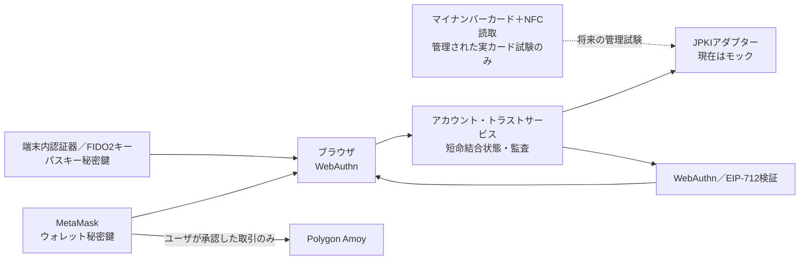

# テストユーザ利用フローデモ

このページはGitHub Pages上で利用でき、テストユーザ登録、EIP-1193 ウォレット接続、Polygon Amoy上のmockJPYC取得・利用承認・サブスクリプション、合成音源プレーヤー操作、サポータ登録とSBT確認を一続きで検証する入口です。

事前登録制の公開実験では、運営がEOAを事前収集するのではなく、一回限りの招待URIをメールで送付します。参加者は[招待登録ページ](./participant-registration)で利用するMetaMaskウォレットを自ら選び、署名で操作能力を証明します。招待URIを持たない通常のデモ閲覧とは別のフローです。

::: warning テストネット専用です
Polygon Amoyのコントラクトアドレスとソースコミットを公開し、mockJPYCの取得・Approve・サブスクリプションを有効化しました。tJPYCは無価値・償還不可で実在JPYCではなく、Amoy POLはガスにだけ使用します。ゲートウェイ、Navidrome、本番アカウントまたは本番決済とは未接続です。
:::

## この画面の進め方

画面内の番号に沿って、上から順番に操作してください。前の操作が完了していない場合や、接続先がPolygon Amoyでない場合は、次のボタンが無効になります。

| 段階 | 操作 | 確認すること |
| --- | --- | --- |
| 1. テストユーザ | 個人情報を含まないAliasを入力し、注意事項へ同意して登録 | Aliasは現在のブラウザタブだけで使う仮名で、本番アカウントではない |
| 2. ウォレット | MetaMaskを接続してPolygon Amoyへ切り替える | チェーン IDが`80002`で、表示されたアドレスがテスト用ウォレットである |
| 3. 招待・本人登録 | 招待された参加者だけが、運営承認後にオンチェーン本人登録を行う | 参加者登録コントラクトが未デプロイの間は表示だけで、一般デモは次へ進める |
| 4. mockJPYC課金 | `tJPYC`を取得し、表示された料金分だけ利用承認してサブスクリプションを開始 | `tJPYC`は無価値・償還不可で、実在JPYCではない |
| 5. プレーヤー | プレビューとサブスクリプション限定の合成音源を再生 | 実在楽曲や公開Navidrome配信ではない |
| 6. サポータSBT | 希望する音楽クリエーターへの支援意思へ署名してSBTを発行 | 支払や継続課金を含まず、SBTは譲渡できない |

MetaMaskに「資金を追加」と表示されても、本デモのために本番POLや暗号資産を購入する必要はありません。ガスが必要な操作ではAmoyテストPOLだけを使います。署名前には、ネットワーク、接続先、操作内容を確認してください。

::: info 一般デモと招待参加者の違い
一般デモでは、Alias登録後にウォレット、mockJPYC、プレーヤー、SBTを試せます。招待メールを受け取った公開実験参加者は、別の招待登録画面でウォレット署名を済ませ、運営承認とテストPOL配布後にこの画面へ戻ります。招待管理ゲートウェーと参加者登録コントラクトは現在未デプロイです。
:::

<ClientOnly>
  <TestnetUserJourneyDemo />
</ClientOnly>

## JPKI・パスキー・MetaMask結合

次のデモは、上で登録した仮名テストユーザに、モックJPKI結果、FIDO2／WebAuthnパスキー、Polygon AmoyのMetaMaskウォレットを順番に結び付けます。公開GitHub Pagesでは安全なRP境界と状態を持つAPIがないため操作を無効にし、ローカル同一オリジン構成またはCFP専用HTTPSドメインでだけ有効にします。

現在必要なハードウェアは、WebAuthn対応ブラウザ、端末内認証器またはFIDO2セキュリティキー、MetaMaskを利用できる端末です。マイナンバーカードとNFC対応スマートフォン／ICカードリーダーは、認定事業者の試験接続を行う段階でだけ必要になります。

<ClientOnly>
  <AccountTrustDemo />
</ClientOnly>

## データと資産の境界

| 項目 | この公開利用フロー | ローカルゲートウェイ連携版 |
| --- | --- | --- |
| プロフィール | AliasとテストユーザIDを現在のタブだけに保存 | ゲートウェイのデモ PrincipalとCookie セッション |
| ウォレット | ユーザが明示接続。アドレスとトランザクションは公開チェーンに記録 | SIWE／EIP-712署名境界をローカル検証 |
| 支払資産 | 無価値・償還不可の`tJPYC`だけ。Amoy POLはガスのみ | 固定モックサブスクリプション |
| プレーヤー | ページ内で生成する短い合成WAV。プレビューとサブスクリプション限定楽曲 | ゲートウェイ経由の合成音源、範囲、短命再生セッション |
| サポータ登録 | EIP-712意思表示に署名し、デモ専用アダプターから公開・譲渡不能なSBTを発行 | EIP-712署名を検証し、リレイヤー・インデクサー経由で確定状態を反映 |
| ストリーミング認可 | Polygon Amoy サブスクリプションによるUI解放だけ | ゲートウェイ Capabilityと配信証跡 |
| Navidrome | 未接続 | 明示対応付け型アダプターを選択可能 |

公開利用フローのサブスクリプション状態は、まだゲートウェイの再生認可やNavidromeへ接続されません。API、Cookie、範囲、Concurrency、監査境界を含む検証は[ローカルストリーミングゲートウェイ](/demo/local-gateway)を参照してください。

## 操作順序

1. 公開実験参加者は運営から受け取った一回限りの招待URIを開く。一般閲覧者は個人情報を含まないAliasでテストユーザプロフィールだけを登録できる。
2. 本人がウォレットを明示的に接続し、署名検証後に招待をそのEOAへ結び付ける。チェーン IDは`80002`のPolygon Amoyに限定する。
3. 公開済みマニフェストが`active`の場合だけ、一回限りの`2,000 tJPYC`を取得する。
4. 計画価格だけをサブスクリプションコントラクトへApproveし、サブスクリプションを開始する。
5. プレビュー楽曲を操作し、有効なサブスクリプションでは限定合成楽曲が解放されることを確認する。
6. プレーヤーの「サポータになってSBTを得る」から短期EIP-712意思表示に署名し、Polygon AmoyでSBT発行トランザクションを確定する。
7. トークン ID、一般／初期サポータ区分、メタデータとPolygonscan上のトランザクションを確認する。

サポータ登録は支援意思の公開記録であり、mockJPYCの移転、トークン Approvalまたは継続課金を含みません。デモ専用登録アダプターが未デプロイ、または公開マニフェストで検証できない間は、書込みボタンを無効にします。

Seed Phraseや秘密鍵は入力しません。本番ウォレット、本番資金、Mainnet 資産、実在JPYC、実在楽曲または個人情報を使わないでください。
