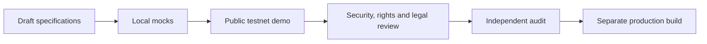

# Testnet Demo

[日本語版](/demo/)

Creator First Platform first validates protocol boundaries, streaming-gateway behaviour, smart-contract integration and failure handling with synthetic data and assets that have no intended monetary value. Production is built separately only after the resulting evidence has been reviewed.

::: warning Public testnet experiment
The published contracts run on Polygon Amoy, chain ID `80002`. They are not connected to a production account system, production payments, a public Navidrome deployment, a production indexer or legally cleared music distribution. Do not use production assets, real JPYC or a wallet containing assets you cannot risk.
:::

## Start here

- [MetaMask installation and Polygon Amoy setup](/demo/metamask-amoy-setup) — illustrated Japanese guide
- [User services](/demo/user-services) — Japanese interactive interface
- [Music creator services](/demo/creator-services) — Japanese interactive interface
- [Bicameral governance](/demo/governance) — Japanese interactive interface
- [Published Polygon Amoy contracts](/demo/testnet-contracts)

The English page explains the experiment and controls. Interactive service screens remain primarily in Japanese.

## Incremental Test POL allocation

The public experiment requires advance participant registration and approval. It is not an anonymous public faucet. An approved participant receives only the minimum Test POL needed to begin. The service may then replenish the bound wallet only when an approved CFP operation needs gas.

| Control | Testnet policy |
| --- | --- |
| Initial target | Twice the estimated gas cost of the initial journey, provisionally bounded between `0.02` and `0.05 Test POL` |
| Replenishment trigger | Wallet balance is below the estimated cost of the next two approved operations |
| Replenishment target | Estimated cost of the next five approved operations multiplied by a `1.5` safety factor |
| Per-replenishment cap | Maximum `0.05 Test POL` |
| Cumulative cap | Maximum `0.5 Test POL` distributed by CFP per person across both user and creator roles |
| Fee source | Current Polygon Amoy Gas Station values and operation-specific gas estimates |
| Abuse controls | Participant approval, wallet signature, expiring nonce, idempotency key, cooldown, daily and global budgets, and review of suspicious outbound transfers |
| Operational controls | No distributor key in GitHub Pages, auditable decisions and transactions, low-balance alerts, separated roles and emergency stop |

The conceptual replenishment amount is:

```text
min(
  replenishment target - current wallet balance,
  0.05 POL,
  0.5 POL - cumulative CFP distribution to the participant
)
```

A low wallet balance alone never authorises a transfer. Replenishment must be bound to an approved next operation, such as MockJPYC approval, subscription activation, supporter-credential issuance or legislator registration. The cumulative CFP distribution—not the current wallet balance—is used for the cap so that moving POL to another address cannot reset the allowance.

The distributor contract and its unit tests are implemented locally. It binds one opaque pre-approved participant ID to one wallet and enforces an initial `0.02 Test POL` target, a `0.05 Test POL` target and transfer ceiling, a cumulative `0.5 Test POL` allowance, a ten-minute cooldown, a `1 Test POL` global daily budget, operation-ID replay rejection, pause control and withdrawal only while paused. Participant and operation identifiers must be random or strongly salted; they must not be direct hashes of names, email addresses or other personal data.

The contract is deployed on Polygon Amoy at [`0x8a0B3F08EC1Bd4231be92320381a1bAc56D112BE`](https://amoy.polygonscan.com/address/0x8a0B3F08EC1Bd4231be92320381a1bAc56D112BE). Its initial `0.02 Test POL` funding, bytecode, limits and unpaused state were independently re-read through a public RPC. The [Amoy Test POL funding request evidence](/en/demo/amoy-pol-funding-request) names this contract as the transparent funding destination.

Automatic decisions and transaction submission still require a separately secured off-chain operator. Person-level duplicate review, measured-gas calibration, retry, reorganisation, concurrency, budget-exhaustion and user-facing stop handling are not yet connected. Test POL creates no refund, reward, production entitlement or claim against CFP.

## Implementation order



1. Implement the minimum end-to-end journey with synthetic accounts, mock rights, synthetic audio and valueless testnet assets.
2. Test replay, duplication, delay, outage, cancellation, rights suspension and emergency stop—not only the successful path.
3. Publish the chain, contract addresses, source commit, known limitations and data handling.
4. Complete legal, rights, privacy and security review and smart-contract audit.
5. Build production keys, roles, infrastructure, contracts, monitoring and recovery behind separate gates; do not promote testnet in place.

## User and creator journeys

The user journey demonstrates a session-only alias, Polygon Amoy wallet connection, MockJPYC approval and subscription activation, a synthetic player and supporter credentials. An alias alone never authorises playback, payment, wallet linking or SBT privileges.

The creator journey demonstrates a pseudonymous profile, wallet connection, creator commitment and release-rights self-declaration commitment. It does not verify identity or rights, upload production audio, publish a release or create a payment entitlement.

Wallet addresses and transactions are public on Polygon Amoy. Session-only profile data is kept in the current browser tab. The local account-trust pilot combines Mock JPKI, WebAuthn passkeys and an EIP-712 wallet signature, but it is not official JPKI verification and does not create a production account or legislator entitlement.

## Current implementation status

| Area | Status |
| --- | --- |
| Network | Polygon Amoy, chain ID `80002` |
| Contracts | [Integrated testnet contracts published and verified](/demo/testnet-contracts) |
| Payments | One-time MockJPYC test claim, exact approval and simulated subscription; no value or redemption |
| User service | Public profile, wallet, MockJPYC, synthetic player and supporter flow; production account and recovery are absent |
| Creator service | Public pseudonymous profile and commitment flow; identity, rights and payment review are absent |
| Governance | Bicameral governors and simplified test qualification published; production identity, secret ballots, appeals and audit are incomplete |
| Streaming gateway | Local mock implemented; not deployed publicly |
| Navidrome | Local adapter implemented; production private network and canonical mapping are absent |
| Incremental Test POL distributor | [Contract deployed on Amoy](https://amoy.polygonscan.com/address/0x8a0B3F08EC1Bd4231be92320381a1bAc56D112BE); off-chain operator and participant-review connection remain in progress |
| Rights, usage and distribution | Draft specifications; not implemented as a production service |

## Production blockers

Production funds, real rights, unreleased media, personal information and production wallets must not be handled while any of the following remains:

- blocking open questions or active mock assumptions;
- unreproducible reconciliation across chain, asset, contract, rights, usage and allocation records;
- incomplete threat model, independent security review or contract audit;
- missing legal, rights, tax, privacy or open-source licence approval evidence; or
- untested incident response, pause, recovery, key rotation or rollback.

See the [English whitepaper](/en/whitepaper/), [English protocol index](/en/protocol/) and [Japanese project status](/status) for the wider design and remaining gates.
