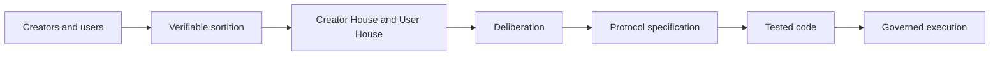

# 1. Vision

## Creator-first purpose

Creator First Platform is a proposed music distribution platform whose primary purpose is sustainable creator activity and user convenience, not maximisation of corporate profit. Its initial focus is independent, artist-direct music creators who control material choices concerning production, distribution and marketing, even when they use specialist services such as TuneCore.

Users are not passive customers. They receive usable music services, meaningful discovery choices, privacy protections, transparent charging and a defined role in protocol governance.

## Sovereignty, representation and deliberation

The community remains the source of protocol legitimacy. Eligible creators and users may be selected through verifiable sortition to serve limited terms in separate chambers. Representatives deliberate, review evidence and vote; they do not own community sovereignty. Constitution-level questions may require a broader direct vote.

The intended path is:

## Normative hierarchy

Applicable law and binding contracts come first. The proposed internal hierarchy is then: three charters; the whitepaper; accepted CFPs and governance records; ADRs; protocol specifications; and implementation code. “Code is law” means predictable execution only within this hierarchy. It does not erase copyright, consumer, company, tax, employment or regulatory obligations.

## Corporate role

A Japanese corporation is intended to contract with rights holders and vendors, employ people, account for revenue and expenditure, pay taxes, manage disputes and carry statutory responsibility. Its directors must not execute an unlawful or impossible resolution merely because a protocol vote passed. Any refusal or modification must be reasoned, recorded and reviewable.

## Social contract

The platform commits to creator control, user agency, transparent and contestable rules, privacy-preserving verification, recoverability and staged deployment. These are design goals, not claims that the current demonstration already satisfies production requirements.
