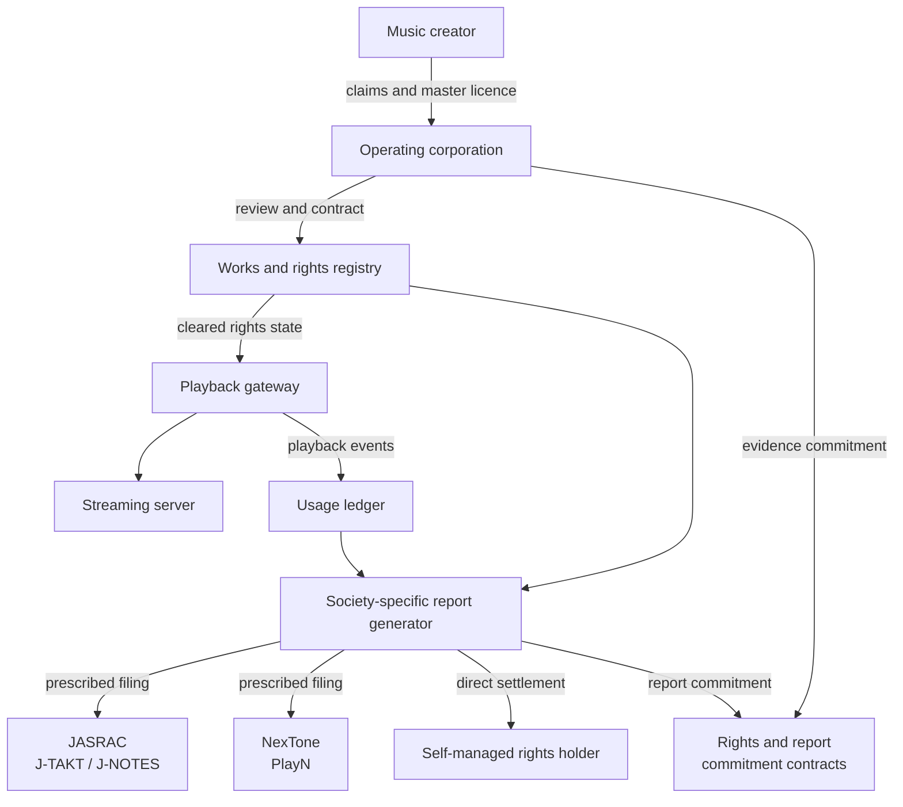

# 3. Rights and Money

## Rights exist outside the chain

A musical work may involve copyright in composition and lyrics, neighbouring rights in the master recording, performer interests, contractual licences and collection arrangements. Recording a claim on-chain does not create or conclusively determine those legal rights.

The rights registry is therefore an evidence and workflow layer. It records claims, evidence references, versions, review state, splits, disputes and effective periods. Payments must stop or be held when the relevant rights state is disputed or incomplete.

## Connection to existing services

An artist may use TuneCore or another distributor or rights-management service. CFP must determine the scope, territory, term and exclusivity of each mandate and avoid double licensing or double payment. Artist-direct status concerns decision control; it does not mean that the artist performs every operational task personally.

### JASRAC and NexTone clearance and reporting

For commercial streaming in Japan, the operating corporation acts as the service operator and remains responsible for confirming the applicable repertoire, obtaining licences, reporting usage and paying the resulting invoices. The initial operational routes are J-TAKT/J-NOTES for JASRAC-managed works and PlayN for NexTone-managed works.

The registry versions ISRC, ISWC, society work codes, rights type, share, territory, use, effective period and evidence. A work may contain multiple rights slices and administrators; a provider name alone never classifies the entire work. Composition and lyric clearances remain distinct from master-recording, performer, artwork and other neighbouring or contractual rights.

The gateway records tamper-evident playback events bound to the exact rights-state version. Report adapters generate J-NOTES, PlayN and self-managed-rights outputs from the common usage ledger. Initially, authorized corporate staff review and upload those files through the official systems; CFP does not standardize screen scraping or shared-password automation.

Public contracts anchor hashes of approved rights snapshots, submitted reports, receipts and payment evidence. They do not create copyright, prove legal ownership, replace the official filing, or receive private contracts and personal or confidential revenue data. Copyright royalties, master and performer payments, external distribution revenue, CFP creator remuneration and listener-directed allocations remain separate legal and accounting flows.

Governance may propose transparency standards and CFP remuneration policy, but it cannot suspend or override the corporation's licensing, reporting, payment, takedown or other legal duties. The implementation decision is recorded in [ADR-0022](/adr/ADR-0022-collective-rights-integration). The procedures were checked against the official [JASRAC commercial streaming process](https://www.jasrac.or.jp/users/internet/procedure-business/) and [NexTone internet-use process](https://www.nex-tone.co.jp/copyright/users/int.html) on 2 September 2026 and must be revalidated before production use.

## Payment and allocation

Subscription revenue is received and accounted for by the operating corporation or an appropriately regulated provider. Approved settlement assets must be listed in a versioned registry only after product, issuer, contract, network, redemption and regulatory checks. MockJPYC on Amoy is a test token and is not approved production JPYC.

The conceptual flow is:

1. recognise gross receipts and liabilities;
2. separate taxes, refunds, regulated-provider fees and documented operating costs;
3. calculate the distributable amount under an approved rule version;
4. allocate creator, growth and operation pools;
5. apply rights splits and holds; and
6. publish auditable aggregate records without disclosing unnecessary personal data.

Smart contracts can enforce approved calculations and payment conditions. They cannot replace contracts, accounting judgments, tax filings, rights investigation or dispute resolution.

## Fan registration and listener-directed allocation

A listener may register support for a creator and direct a bounded part of that listener's monthly distributable allocation among registered creators. Fan registration represents an ongoing community relationship; the allocation instruction represents a revocable monthly preference. A supporter SBT is a non-transferable credential, not a claim to creator revenue, redemption, dividends or investment return.

The listener must not be able to send an arbitrary amount, withdraw an allocation balance or transfer it to another user. The subscription is received as consideration for the corporation's service, and the corporation pays verified creators under its creator agreements and an approved allocation rule. This intended structure does not itself settle payment-services classification; custody, control, refunds, intermediation and the actual flow require professional review.

The initial production candidate excludes open tipping and user-to-user transfers. It uses allocation caps, verified creator payout destinations, monthly settlement, related-party detection, transaction monitoring, human review and documented holds. These controls reduce the risk that coordinated listener accounts could disguise criminal proceeds as creator remuneration.
