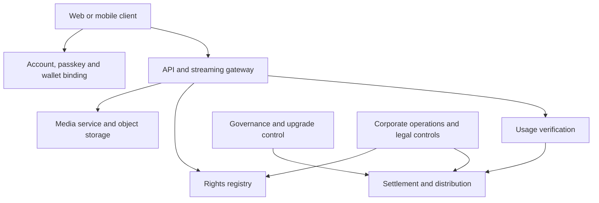

# 4. Platform Architecture

## Responsibility planes

The production design separates six responsibility planes: experience, trust, media, settlement, governance and operations. A web or mobile client integrates player and wallet interactions, but must not hold server signing keys or bypass the gateway.

## Media and gateway

Audio is not stored on-chain. Navidrome is used as an initial media server behind a gateway that authenticates the service session, checks subscription and SBT-based entitlements, confirms rights state, creates a short-lived playback session and records privacy-minimised usage evidence. Direct public access to the media server is not the production trust boundary.

## Identity and wallets

Account authentication, wallet ownership and legal identity are distinct. Passkeys can authenticate accounts; an EIP-712 challenge can bind a MetaMask wallet; qualified identity verification may later add a separate attestation. The public demo may mock JPKI-related steps and must not claim official JPKI identity assurance.

## Chain and deployment boundary

Polygon Amoy, chain ID 80002, is the only public CFP testnet authority. Its contracts, MockJPYC, Test POL, SBTs and votes confer no production rights. Production is built independently with approved assets, security review, legal gates, operational controls and a fresh deployment manifest; a testnet deployment is never promoted in place.

## Availability

Listening should degrade safely when chain or RPC services fail. Cached, short-lived authorisations may be permitted under governed rules, but no component may silently invent payment finality, rights validity or governance approval.
