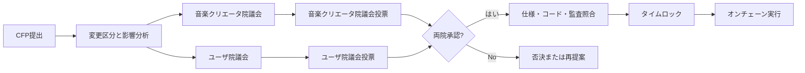
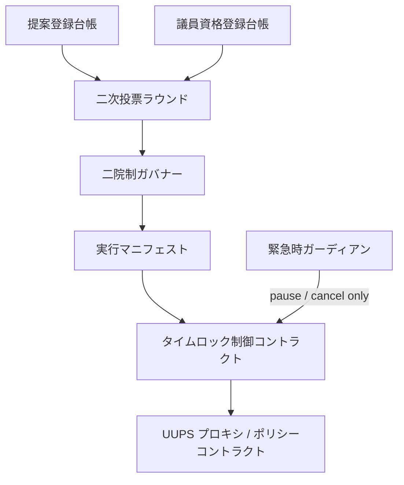

# 二院制議会・ガバナンス

Creator First Platformでは、音楽クリエーターとユーザがスマートコントラクトの仕様変更を共同で統治します。株式、STO、JPYC残高、サポーター SBTの保有数を投票力に変換せず、抽選された代表へ各会期で同量の投票クレジットを付与します。

> **CFP → 影響分析 → 両院審議 → 各院の二次投票 → 実装照合 → タイムロック → オンチェーン実行**

::: warning 現在の状態
テストネット専用の公開投票・二院制集計・タイムロックコントラクトとウォレット画面を実装しましたが、Sepoliaへの公開デプロイと会期設定は未完了です。議員登録はテスト運営者が行い、本人性、検証可能な抽選、秘密投票、異議申立て、本番権限移管または法的承認を実装したものではありません。
:::

[テストネット版ガバナンスデモを開く](/demo/governance)

## 議会の構成

| 議院 | 代表するコミュニティ | 主な審議観点 | 議員の形成 |
| --- | --- | --- | --- |
| 音楽クリエータ院議会 | 検証済み音楽クリエーター | 権利、分配、制作活動、音楽クリエーター経済 | 適格音楽クリエーターから検証可能な抽選 |
| ユーザ院議会 | ガバナンス適格ユーザ | 利便性、価格、プライバシー、発見、コミュニティ | 適格ユーザから検証可能な抽選 |

両院は別々の母集団、議員名簿、定足数、投票結果を持ちます。重要なプロトコル変更は、一方の院の得票を他方へ合算せず、両院がそれぞれ成立要件を満たした場合だけ承認されます。



## 議会ページの画面構成

### 1. 議会ダッシュボード

公開画面では次を確認できるようにします。

- 現在の会期、両院の議席数、充足状況、任期
- 審議中・投票中・タイムロック中・実行済みのCFP
- 各提案の変更区分、対象コントラクト、プロトコル版、リスクレベル
- 音楽クリエータ院議会とユーザ院議会の定足数・賛成・反対を分離した結果
- 法務・セキュリティレビュー、監査、ソースコミット、実行予定時刻
- 利益相反による除外、棄権、欠員、少数意見書

### 2. 提案詳細

提案詳細は説明文だけでなく、実際に変更される対象を固定して表示します。

| 表示項目 | 内容 |
| --- | --- |
| CFP | ID、版、提案者、審議期間、変更理由 |
| 現行仕様と変更案 | 仕様の差分、ユーザ向け要約 |
| 実行マニフェスト | チェーン ID、プロキシ、現在/新実装、calldata hash、コード hash |
| 影響 | 音楽クリエーター、ユーザ、権利、経済、プライバシー、法務、セキュリティ |
| 安全策 | テスト、監査、Migration、Rollback、緊急停止 |
| 根拠 | ADR、プロトコル仕様、ソースコミット、成果物、監査報告 |

UIは「説明として承認した内容」と「実際にタイムロックが実行するトランザクション」が一致するかを機械検証し、不一致なら投票開始または実行を停止します。

### 3. 投票パネル

議員には、その会期で利用できる投票クレジット残高と、投票強度ごとの費用を表示します。

| 投票強度 $v$ | 意味 | 消費Credit $v^2$ |
| ---: | --- | ---: |
| -3 | 強く反対 | 9 |
| -2 | 反対 | 4 |
| -1 | やや反対 | 1 |
| 0 | 棄権 | 0 |
| +1 | やや賛成 | 1 |
| +2 | 賛成 | 4 |
| +3 | 強く賛成 | 9 |

各議員が複数提案へ配分する場合、会期内の制約は次の通りです。

$$
\sum_{p \in P} v_{m,p}^{2} \le B_m
$$

$B_m$は議員$m$へ等しく付与される会期投票クレジットです。Creditは購入、譲渡、借入、次期繰越ができません。

### 4. 結果と実行追跡

投票終了後は、各院について次を別々に公開します。

- 適格 seat snapshotと投票参加人数
- 定足数達成状況
- 賛成強度合計、反対強度合計、純額スコア
- 無効票、コミット未Reveal、利益相反による除外
- 投票 rule versionと集計再現用commitment
- 両院承認後のレビュー、タイムロック、実行トランザクション、最終コード hash

個々の投票内容を公開するか、Commit-Revealまたはゼロ知識証明で秘密投票にするかは、プロトコルの未決事項として扱います。ただし集計と資格重複防止は第三者が検証できなければなりません。

## クアドラティック投票の位置付け

二次投票は、投票クレジットを資金で購入する仕組みではありません。抽選された各議員へ同量を付与し、複数提案に対する意思の強さを有限の予算内で表現するために使います。

各院$h$の提案$p$に対する純額スコアは、概念的に次で求めます。

$$
S_{h,p}=\sum_{m \in M_h} v_{m,p}
$$

成立には純額スコアだけでなく、独立したUnique-member 定足数、Approval しきい値、利益相反要件を満たす必要があります。具体的な議席数、Credit量、定足数、閾値はガバナンス決定で決定し、版管理します。

### 採用する安全策

- ウォレットではなくガバナンスアイデンティティを一人一資格として扱う
- House membership snapshotとCredit budgetを投票開始前に確定する
- 各院のCreditを混合せず、同一人物の重複議席を禁止する
- Creditの売買、譲渡、委任、追加購入を禁止する
- SBT、JPYC、株式、STO、再生数、収益額を投票権力にしない
- Bribery、Collusion、シビル、強要、投票買収を監視する
- 投票ルールを提案開始後に変更しない
- 集計の再現性と異議申立て期間を設ける

ホワイトペーパーで将来候補としているコミュニティ全体投票の委任とは分離し、抽選議員のQV 投票クレジットは本人だけが行使します。

## コントラクト仕様変更の分類

| Class | 例 | 必要な承認 |
| --- | --- | --- |
| P0 プロダクト configuration | UI表示、オンチェーン権限に影響しない設定 | 法人の運用手続。ガバナンス対象外を明示 |
| P1 限定 parameter | 既承認範囲内の手数料・上限・期間 | 両院通常承認、レビュー、短いタイムロック |
| P2 コントラクト upgrade | 実装、検証者、資産 allowlist、権限変更 | 両院承認、独立監査、長いタイムロック |
| P3 憲章適合 | 憲章、基本権、ガバナンス構造の変更 | 両院特別多数と音楽クリエーター／ユーザコミュニティ直接投票 |
| 緊急 | 攻撃停止、鍵無効化 | 限定停止のみ。期限内の両院追認がなければ失効 |

株式会社は適法性、契約、税務、会計、雇用、規制対応を担います。執行不能な提案は理由と根拠を付して差し戻せますが、別トランザクションへ黙って置換したり、単独でプロトコル変更を成立させたりできません。

## 提案から実行までの状態

```text
DRAFT → REVIEW_READY → DELIBERATION → VOTING
      → JOINT_APPROVED → IMPLEMENTATION_VERIFIED
      → TIMELOCKED → EXECUTED

VOTING → REJECTED
JOINT_APPROVED → REASONED_RETURN → DELIBERATION
TIMELOCKED → SECURITY_CANCELLED → REMEDIATION
```

各状態遷移は、Actor、時刻、ルール版、根拠hash、前状態をイベントとして記録します。投票後にTarget、calldata、仕様、コード hashが変わった場合は同じ提案として実行せず、再審議します。

## スマートコントラクトの責任分割



- **提案登録台帳:** CFP、仕様 hash、変更区分、実行マニフェストを固定する。
- **議員資格登録台帳:** 会期ごとの両院Member rootと一人一議席のnullifierを管理する。
- **二次投票ラウンド:** 投票クレジット、コミット/Reveal、各院集計を検証する。
- **二院制ガバナー:** 両院の独立承認と提案状態遷移を確定する。
- **実行マニフェスト:** Target、Value、calldata、implementation code hash、chainを拘束する。
- **タイムロック制御コントラクト:** 監視・異議申立て期間後だけマニフェストどおりに実行する。
- **緊急時ガーディアン:** 限定的な停止または未実行トランザクションのcancelだけを行い、アップグレード権限は持たない。

UUPS プロキシの`UPGRADER_ROLE`、ポリシー activation、資金庫実行権限は、個人ウォレットではなく承認済みタイムロックへ移管します。

## 実装順序

1. テストネット専用コントラクトと両院画面で提案・公開二次投票・タイムロックを検証する（実装済み、Sepoliaデプロイ待ち）
2. Sepoliaでテスト運営者による議員資格登録、両院集計、レビュー証拠、デモポリシー実行を接続する
3. 検証可能な抽選、監査用実行マニフェスト、異議申立てとアップグレード予行演習を追加する
4. シビル耐性、秘密投票、異議申立てを検証する
5. 独立監査と法務確認後に本番権限を段階移行する

## 関連文書

- [ホワイトペーパー 7. ガバナンス](../whitepaper/07-governance.md)
- [CFP制度](../proposals/index.md)
- [ADR-0001 ガバナンスモデル](../adr/ADR-0001-governance-model.md)
- [ADR-0002 検証可能抽選](../adr/ADR-0002-verifiable-sortition.md)
- [ADR-0016 Bicameral 二次ガバナンス](../adr/ADR-0016-bicameral-quadratic-governance.md)
- [ガバナンス変更プロトコル仕様](../protocol/specs/governance-change.md)
