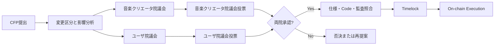
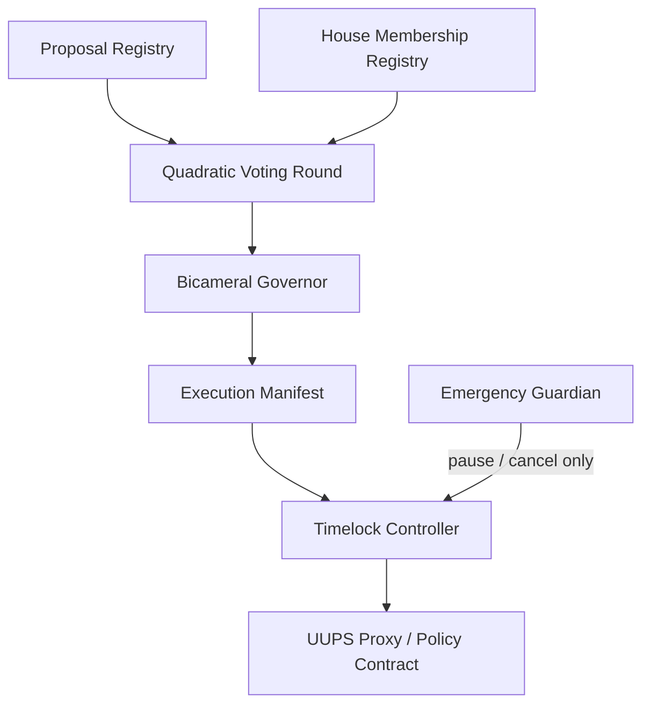

# 二院制議会・Governance

Creator First Platformでは、音楽クリエーターとユーザがスマートコントラクトの仕様変更を共同で統治します。株式、STO、JPYC残高、Supporter SBTの保有数を投票力に変換せず、抽選された代表へ各会期で同量のVoice Creditを付与します。

> **CFP → 影響分析 → 両院審議 → 各院のQuadratic Vote → 実装照合 → Timelock → On-chain実行**

::: warning 現在の状態
このページは制度とユーザインターフェースの設計です。公開Testnetの投票・Timelockコントラクトは未実装であり、表示例を実際の投票として扱うことはできません。
:::

## 議会の構成

| 議院 | 代表するCommunity | 主な審議観点 | 議員の形成 |
| --- | --- | --- | --- |
| 音楽クリエータ院議会 | 検証済み音楽クリエーター | 権利、分配、制作活動、音楽クリエーター経済 | 適格音楽クリエーターから検証可能な抽選 |
| ユーザ院議会 | ガバナンス適格ユーザ | 利便性、価格、Privacy、Discovery、Community | 適格ユーザから検証可能な抽選 |

両院は別々の母集団、議員名簿、Quorum、投票結果を持ちます。重要なProtocol変更は、一方の院の得票を他方へ合算せず、両院がそれぞれ成立要件を満たした場合だけ承認されます。



## 議会ページの画面構成

### 1. 議会ダッシュボード

公開画面では次を確認できるようにします。

- 現在の会期、両院の議席数、充足状況、任期
- 審議中・投票中・Timelock中・実行済みのCFP
- 各提案の変更区分、対象Contract、Protocol Version、Risk Level
- 音楽クリエータ院議会とユーザ院議会のQuorum・賛成・反対を分離した結果
- 法務・Security Review、Audit、Source Commit、実行予定時刻
- 利益相反による除外、棄権、欠員、少数意見書

### 2. 提案詳細

提案詳細は説明文だけでなく、実際に変更される対象を固定して表示します。

| 表示項目 | 内容 |
| --- | --- |
| CFP | ID、Version、提案者、審議期間、変更理由 |
| 現行仕様と変更案 | Specificationの差分、ユーザ向け要約 |
| 実行Manifest | Chain ID、Proxy、現在/新Implementation、calldata hash、Code hash |
| 影響 | 音楽クリエーター、ユーザ、権利、経済、Privacy、法務、Security |
| 安全策 | Test、Audit、Migration、Rollback、Emergency Pause |
| 根拠 | ADR、プロトコル仕様、Source Commit、Artifact、Audit Report |

UIは「説明として承認した内容」と「実際にTimelockが実行するTransaction」が一致するかを機械検証し、不一致なら投票開始または実行を停止します。

### 3. 投票パネル

議員には、その会期で利用できるVoice Credit残高と、投票強度ごとの費用を表示します。

| 投票強度 $v$ | 意味 | 消費Credit $v^2$ |
| ---: | --- | ---: |
| -3 | 強く反対 | 9 |
| -2 | 反対 | 4 |
| -1 | やや反対 | 1 |
| 0 | 棄権 | 0 |
| +1 | やや賛成 | 1 |
| +2 | 賛成 | 4 |
| +3 | 強く賛成 | 9 |

各議員が複数提案へ配分する場合、会期内の制約は次の通りです。

$$
\sum_{p \in P} v_{m,p}^{2} \le B_m
$$

$B_m$は議員$m$へ等しく付与される会期Voice Creditです。Creditは購入、譲渡、借入、次期繰越ができません。

### 4. 結果と実行追跡

投票終了後は、各院について次を別々に公開します。

- Eligible seat snapshotと投票参加人数
- Quorum達成状況
- 賛成強度合計、反対強度合計、Net Score
- 無効票、Commit未Reveal、利益相反による除外
- Vote rule versionと集計再現用commitment
- 両院承認後のReview、Timelock、実行Transaction、最終Code hash

個々の投票内容を公開するか、Commit-RevealまたはZero-Knowledge Proofで秘密投票にするかは、Protocolの未決事項として扱います。ただし集計と資格重複防止は第三者が検証できなければなりません。

## クアドラティック投票の位置付け

Quadratic Votingは、Voice Creditを資金で購入する仕組みではありません。抽選された各議員へ同量を付与し、複数提案に対する意思の強さを有限の予算内で表現するために使います。

各院$h$の提案$p$に対するNet Scoreは、概念的に次で求めます。

$$
S_{h,p}=\sum_{m \in M_h} v_{m,p}
$$

成立にはNet Scoreだけでなく、独立したUnique-member Quorum、Approval Threshold、利益相反要件を満たす必要があります。具体的な議席数、Credit量、Quorum、閾値はガバナンス決定で決定し、Version管理します。

### 採用する安全策

- WalletではなくGovernance Identityを一人一資格として扱う
- House membership snapshotとCredit budgetを投票開始前に確定する
- 各院のCreditを混合せず、同一人物の重複議席を禁止する
- Creditの売買、譲渡、委任、追加購入を禁止する
- SBT、JPYC、株式、STO、再生数、収益額をVoting Powerにしない
- Bribery、Collusion、Sybil、強要、投票買収を監視する
- 投票Ruleを提案開始後に変更しない
- 集計の再現性と異議申立て期間を設ける

Whitepaperで将来候補としているCommunity ReferendumのDelegationとは分離し、抽選議員のQV Voice Creditは本人だけが行使します。

## コントラクト仕様変更の分類

| Class | 例 | 必要な承認 |
| --- | --- | --- |
| P0 Product configuration | UI表示、On-chain権限に影響しない設定 | 法人の運用手続。Governance対象外を明示 |
| P1 Bounded parameter | 既承認範囲内の手数料・上限・期間 | 両院通常承認、Review、短いTimelock |
| P2 Contract upgrade | Implementation、Verifier、Asset allowlist、権限変更 | 両院承認、独立監査、長いTimelock |
| P3 Constitutional | 憲章、基本権、Governance構造の変更 | 両院特別多数と音楽クリエーター／ユーザコミュニティ直接投票 |
| Emergency | 攻撃停止、鍵無効化 | 限定Pauseのみ。期限内の両院追認がなければ失効 |

株式会社は適法性、契約、税務、会計、雇用、規制対応を担います。執行不能な提案は理由と根拠を付して差し戻せますが、別Transactionへ黙って置換したり、単独でProtocol変更を成立させたりできません。

## 提案から実行までの状態

```text
DRAFT → REVIEW_READY → DELIBERATION → VOTING
      → JOINT_APPROVED → IMPLEMENTATION_VERIFIED
      → TIMELOCKED → EXECUTED

VOTING → REJECTED
JOINT_APPROVED → REASONED_RETURN → DELIBERATION
TIMELOCKED → SECURITY_CANCELLED → REMEDIATION
```

各状態遷移は、Actor、時刻、Rule Version、根拠hash、前状態をEventとして記録します。投票後にTarget、calldata、Specification、Code hashが変わった場合は同じ提案として実行せず、再審議します。

## スマートコントラクトの責任分割



- **Proposal Registry:** CFP、Specification hash、変更区分、実行Manifestを固定する。
- **House Membership Registry:** 会期ごとの両院Member rootと一人一議席のnullifierを管理する。
- **Quadratic Voting Round:** Voice Credit、Commit/Reveal、各院集計を検証する。
- **Bicameral Governor:** 両院の独立承認と提案状態遷移を確定する。
- **Execution Manifest:** Target、Value、calldata、implementation code hash、chainを拘束する。
- **Timelock Controller:** 監視・異議申立て期間後だけManifestどおりに実行する。
- **Emergency Guardian:** 限定的なPauseまたは未実行Transactionのcancelだけを行い、Upgrade権限は持たない。

UUPS Proxyの`UPGRADER_ROLE`、Policy activation、Treasury実行権限は、個人Walletではなく承認済みTimelockへ移管します。

## 実装順序

1. Off-chain CFPと両院画面で提案・審議・模擬QVを検証する
2. SepoliaでMembership snapshot、QV集計、Bicameral approval、Timelockを接続する
3. 監査用Execution ManifestとUpgrade dry-runを追加する
4. Sybil耐性、秘密投票、異議申立てを検証する
5. 独立監査と法務確認後に本番権限を段階移行する

## 関連文書

- [ホワイトペーパー 7. Governance](../whitepaper/07-governance.md)
- [CFP制度](../proposals/index.md)
- [ADR-0001 Governance Model](../adr/ADR-0001-governance-model.md)
- [ADR-0002 Verifiable Sortition](../adr/ADR-0002-verifiable-sortition.md)
- [ADR-0016 Bicameral Quadratic Governance](../adr/ADR-0016-bicameral-quadratic-governance.md)
- [Governance Change プロトコル仕様](../protocol/specs/governance-change.md)
