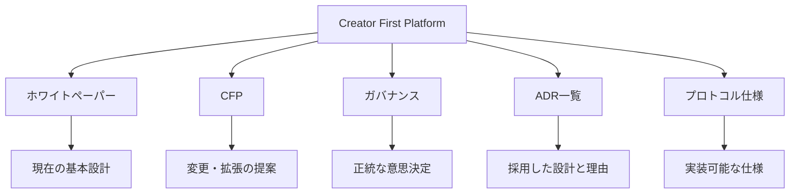

  

ホワイトペーパー v1.0

  Publication 日付
  2026-07-27

  Revision 日付
  2026-08-25

  Author
  山崎重一郎 (Shigeichiro Yamasaki)

::: warning 現在は設計・公開テストネット検証段階です
本サイトは、稼働中の本番音楽配信サービス、決済サービス、DAOまたはSTOの案内ではありません。プロトコル仕様は草案であり、公開テストネットデモは部分稼働中ですが、本番サービスではありません。法務・金融・税務上の記述は個別案件への専門的助言ではありません。詳しくは[現在の状況](/status)と[テストネットデモ](/demo/)を確認してください。
:::

## Creator First Platform

Creator First Platform は、音楽を中心とするデジタルコンテンツの流通において、
**音楽クリエーターの権利と持続可能な活動、ユーザの自由で豊かな利用体験、公正で検証可能なエコシステム**を中心に据えるプラットフォームです。

ここでいう音楽クリエーターは、メジャーレーベルに属さず、制作・流通・マーケティング等の重要判断を自ら行う**アーティストダイレクト型の独立系アーティスト**です。TuneCore等の専門サービスを利用していても、委託先と契約範囲をアーティスト側が統制していれば対象になり得ます。

---

## 音楽クリエーター／ユーザがプロトコルを統治する

Creator First Platform のガバナンスは、単純なトークン投票ではありません。

> **音楽クリエーター／ユーザ → 抽選議会 → 熟議 → プロトコル仕様 → スマートコントラクト → 自動執行**

---

## ホワイトペーパー

ホワイトペーパーは、Creator First Platform の現時点における基本設計をまとめた文書です。

[ホワイトペーパーを読む →](/whitepaper/01-vision)

---

## CFP文書

**CFP**は、Creator First Platform の制度、経済モデル、技術、ガバナンス、プロトコルなどについて、変更や新しい仕組みを提案するための公開文書制度です。

ホワイトペーパーが、

> **現時点で合意されているプラットフォームの基本設計**

を表すのに対して、CFP は、

> **その設計を変更・拡張するための提案**

を表します。

[CFP 一覧を見る →](/proposals/)

---

## ADR一覧 — アーキテクチャ意思決定記録

ADR（アーキテクチャ決定記録）は、Creator First Platform における重要な技術・制度設計について、

- どの設計を採用したか
- なぜその設計を選んだか
- どの代替案を検討したか
- どのような影響や制約があるか

を記録するための文書です。

ADR は、ホワイトペーパーや CFP と実装コードの間をつなぐ **設計判断の履歴**として機能します。

[ADR一覧を見る →](/adr/)

---

## プロトコル仕様

プロトコル仕様は、ADRで採用された設計を、**Codexや開発者がそのまま実装作業へつなげられる仕様**へ変換する文書です。

プロトコルでは、例えば次の内容を定義します。

- Actors
- Inputs / Outputs
- 状態
- MUST / MUST NOT / SHOULD
- 不変条件
- 状態 Transitions
- Interfaces
- Error Conditions
- セキュリティ要件
- プライバシー要件
- テスト要件
- 受入基準

プロトコル仕様を、人間とAIエージェントの間の **実装契約**として利用します。

[プロトコル仕様を見る →](/protocol/)

---

## プラットフォームの5つの入口

### ホワイトペーパー

**何を目指すか、プラットフォームをどのような原則で設計するか**を説明します。

### CFP

**何を変更・拡張したいか**を提案します。

### ガバナンス

**どの提案を採用するか**を音楽クリエーター／ユーザの正統なプロセスで決定します。

### ADR一覧

**なぜその設計を採用したのか**を記録します。

### プロトコル仕様

**何を、どの条件で実装するか**を定義し、GitHub課題と Codex に接続します。

---

## ホワイトペーパーから Codex 実装まで

この構造によって、人間とガバナンスが、

- 何を目指すか
- 何を変更するか
- どの設計を採用するか

を決め、Codex が、

- 仕様に沿った実装
- テスト
- CI対応
- ドキュメント同期
- プルリクエスト作成

を支援できるようにします。

---

## 目指すもの

音楽クリエーターとユーザがプラットフォームの構成主体となり、

- 価値を創る
- 音楽を利用する
- 新しい音楽クリエーターを発見する
- 音楽クリエーターを支援する
- プラットフォームのルール形成に参加する

ことができる環境を作ります。

**Creator First Platform は、音楽を出発点として、企業・音楽クリエーター・ユーザ・コードの関係を再設計するプロジェクトです。**

  © 2026 Creator First Platform

