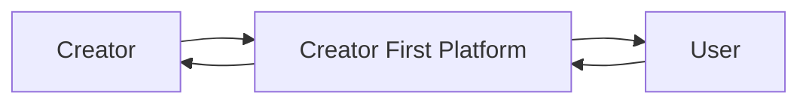
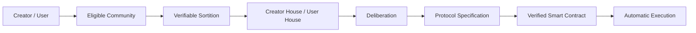
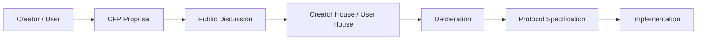
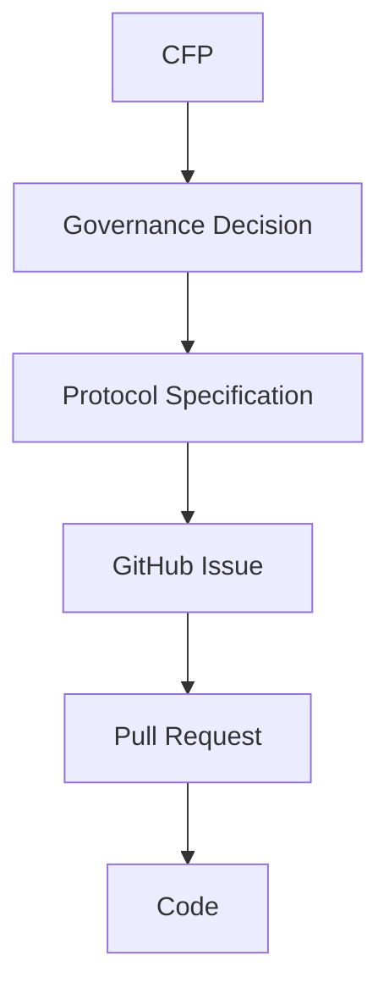
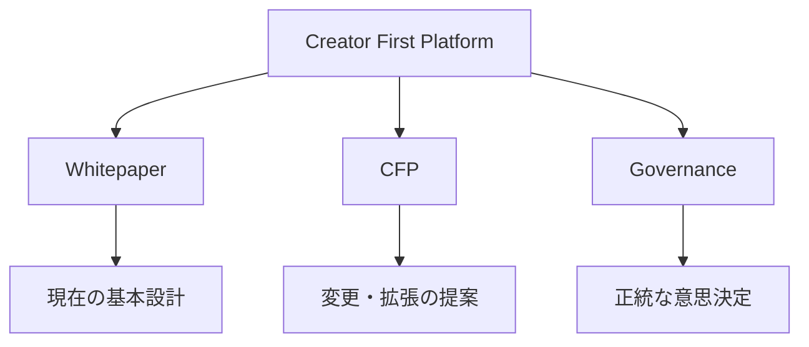
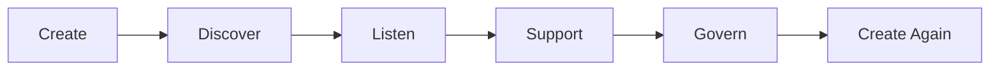

# Creator First Platform

Creator First Platform は、音楽を中心とするデジタルコンテンツの流通において、  
**Creator の権利と持続可能な活動、User の自由で豊かな利用体験、公正で検証可能なエコシステム**を中心に据えるプラットフォームです。

従来のプラットフォームでは、推薦、収益分配、利用条件、データ利用などの重要なルールを運営企業が内部で決定することが一般的です。

Creator First Platform は、この関係を再設計します。

Platform は Creator と User の上位に立つ主体ではなく、  
**両者が価値を創り、利用し、ルール形成に参加するための制度・技術基盤**として位置付けます。

---

## Creator / User が Protocol を統治する

Creator First Platform の Governance は、単純な Token Voting ではありません。

基本構造は、

> **Creator/User → 抽選議会 → 熟議 → Protocol Specification → Smart Contract → 自動執行**

です。

Creator House と User House は、Creator / User Community から抽選された一時的な代表によって構成されます。

議会は主権者そのものではなく、Creator / User から一定期間だけ統治機能を委ねられた **熟議機関**です。

3つの憲章の変更など、Platform の根本原則に関わる重大事項では、Creator / User Community 全体による Referendum を想定します。

---

## Whitepaper

Whitepaper は、Creator First Platform の現時点における基本設計をまとめた文書です。

主なテーマは、

- Vision
- 市場と課題
- 権利と資金
- Platform Architecture
- Creator Onboarding
- Economic Model
- Governance
- Discovery & Community
- Technology
- Security
- Legal / STO / Tax
- Infrastructure & Cost
- Roadmap

です。

[Whitepaper を読む →](/whitepaper/01-vision)

---

# Creator First Proposals

**Creator First Proposal（CFP）** は、Creator First Platform の制度、経済モデル、技術、Governance、Protocol などについて、変更や新しい仕組みを提案するための公開提案制度です。

Whitepaper が、

> **現時点で合意されている Platform の基本設計**

を表すのに対して、CFP は、

> **その設計を変更・拡張するための提案**

を表します。

---

## CFP で提案できること

CFP の対象には、例えば次のようなものがあります。

- Creator への分配ルール
- Creator House / User House の制度
- 抽選代表の選出方法
- Discovery の基本原則
- Growth Pool
- Rights Registry
- Privacy
- Usage Oracle
- Protocol Parameters
- Smart Contract 仕様
- Treasury
- Governance 制度
- 3つの憲章に関係する提案

CFP は単なる開発 Issue ではありません。

---

## CFP と開発 Issue の違い

CFP は、

> **Platform のルールをどうするか**

を議論する文書です。

GitHub Issue は、

> **承認された仕様を実装するために、何を作業するか**

を管理するためのものです。

---

## CFP のライフサイクル

想定する Status は、

- Draft
- Discussion
- Deliberation
- Accepted
- Rejected
- Implemented
- Withdrawn

です。

---

## CFP 一覧

現在の CFP は、CFP 一覧ページから確認できます。

[CFP 一覧を見る →](/proposals/)

将来的には、各 CFP について、

- Proposal
- Discussion
- Deliberation
- Decision
- Protocol Specification
- GitHub Issue
- Pull Request
- Release

までを追跡できるようにします。

---

## Platform の3つの入口

### Whitepaper

現在の Platform がどのような理念・制度・技術で設計されているかを説明します。

### CFP

Platform をどう変更・発展させるかを提案します。

### Governance

Creator / User が、抽選代表と熟議を通じて CFP を Protocol Rule へ変換します。

---

## 目指すもの

Creator First Platform が目指すのは、

> Creator が Platform に従属する世界でも、User が単なる利用データとして扱われる世界でもありません。

Creator と User が Platform の構成主体となり、

- 価値を創る
- 音楽を利用する
- 新しい Creator を発見する
- Creator を支援する
- Platform のルール形成に参加する

ことができる環境を作ります。

株式会社は現実社会で法的責任を負い、  
Creator / User は Protocol Governance の正統性を生み、  
Smart Contract は承認されたルールを透明かつ検証可能に執行します。

**Creator First Platform は、音楽を出発点として、企業・Creator・User・Code の関係を再設計するプロジェクトです。**
