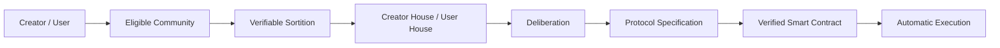
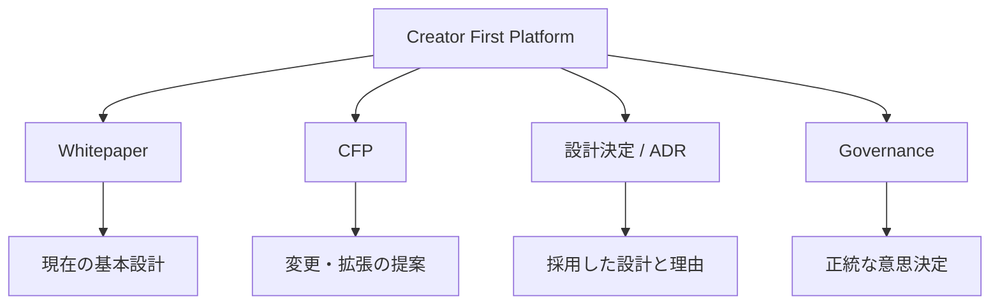
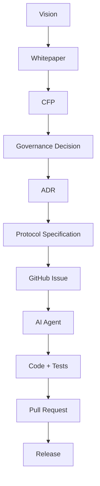

  

Whitepaper v1.0

  Publication Date
  2026-07-27

  Author
  山崎重一郎 (Shigeichiro Yamasaki)

# Creator First Platform

Creator First Platform は、音楽を中心とするデジタルコンテンツの流通において、  
**Creator の権利と持続可能な活動、User の自由で豊かな利用体験、公正で検証可能なエコシステム**を中心に据えるプラットフォームです。

---

## Creator / User が Protocol を統治する

Creator First Platform の Governance は、単純な Token Voting ではありません。

> **Creator/User → 抽選議会 → 熟議 → Protocol Specification → Smart Contract → 自動執行**

---

## Whitepaper

Whitepaper は、Creator First Platform の現時点における基本設計をまとめた文書です。

[Whitepaper を読む →](/whitepaper/01-vision)

---

# Creator First Proposals

**Creator First Proposal（CFP）** は、Creator First Platform の制度、経済モデル、技術、Governance、Protocol などについて、変更や新しい仕組みを提案するための公開提案制度です。

[CFP 一覧を見る →](/proposals/)

---

# 設計決定 — Architecture Decision Records

ADR（Architecture Decision Record）は、Creator First Platform における重要な技術・制度設計について、

- どの設計を採用したか
- なぜその設計を選んだか
- どの代替案を検討したか
- どのような影響や制約があるか

を記録するための文書です。

[設計決定を見る →](/adr/)

---

## Platform の4つの入口

### Whitepaper

**何を目指すか、Platform はどのような原則で設計されるか**を説明します。

### CFP

**何を変更・拡張したいか**を提案します。

### Governance

**どの提案を採用するか**を Creator / User の正統なプロセスで決定します。

### ADR

**なぜその設計を採用したのか**を記録し、Protocol Specification と実装へ接続します。

---

## Whitepaper から実装まで

---

## 目指すもの

Creator と User が Platform の構成主体となり、

- 価値を創る
- 音楽を利用する
- 新しい Creator を発見する
- Creator を支援する
- Platform のルール形成に参加する

ことができる環境を作ります。

**Creator First Platform は、音楽を出発点として、企業・Creator・User・Code の関係を再設計するプロジェクトです。**

  © 2026 Creator First Platform

