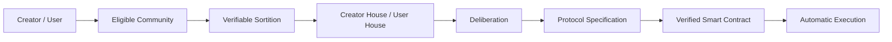
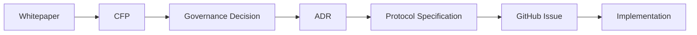
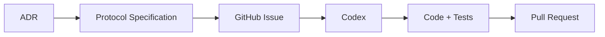
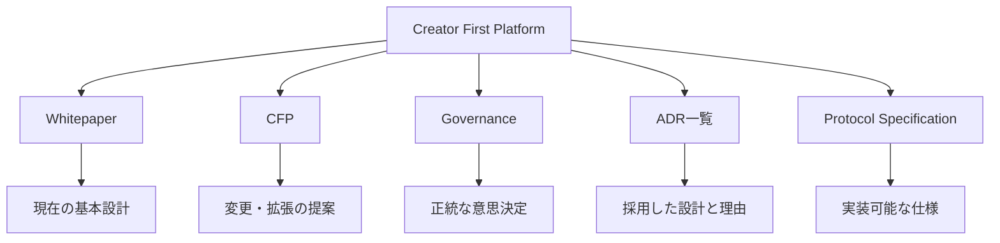

  

Whitepaper v1.0

  Publication Date
  2026-07-27

  Author
  山崎重一郎 (Shigeichiro Yamasaki)

::: warning 現在は設計・文書化段階です
本サイトは、稼働中の本番音楽配信サービス、決済サービス、DAOまたはSTOの案内ではありません。Protocol SpecificationはDraftであり、Testnetデモも現在準備中です。法務・金融・税務上の記述は個別案件への専門的助言ではありません。詳しくは[現在の状況](/status)と[Testnetデモ](/demo/)を確認してください。
:::

## Creator First Platform

Creator First Platform は、音楽を中心とするデジタルコンテンツの流通において、  
**Creator の権利と持続可能な活動、User の自由で豊かな利用体験、公正で検証可能なエコシステム**を中心に据えるプラットフォームです。

---

## Creator / User が Protocol を統治する

Creator First Platform の Governance は、単純な Token Voting ではありません。

> **Creator/User → 抽選議会 → 熟議 → Protocol Specification → Smart Contract → 自動執行**

---

## Whitepaper

Whitepaper は、Creator First Platform の現時点における基本設計をまとめた文書です。

[Whitepaper を読む →](/whitepaper/01-vision)

---

## Creator First Proposals

**Creator First Proposal（CFP）** は、Creator First Platform の制度、経済モデル、技術、Governance、Protocol などについて、変更や新しい仕組みを提案するための公開提案制度です。

Whitepaper が、

> **現時点で合意されている Platform の基本設計**

を表すのに対して、CFP は、

> **その設計を変更・拡張するための提案**

を表します。

[CFP 一覧を見る →](/proposals/)

---

## ADR一覧 — Architecture Decision Records

ADR（Architecture Decision Record）は、Creator First Platform における重要な技術・制度設計について、

- どの設計を採用したか
- なぜその設計を選んだか
- どの代替案を検討したか
- どのような影響や制約があるか

を記録するための文書です。

ADR は、Whitepaper や CFP と実装コードの間をつなぐ **設計判断の履歴**として機能します。

[ADR一覧を見る →](/adr/)

---

## Protocol Specification

Protocol Specification は、ADRで採用された設計を、**Codexや開発者がそのまま実装作業へつなげられる仕様**へ変換する文書です。

Protocol では、例えば次の内容を定義します。

- Actors
- Inputs / Outputs
- State
- MUST / MUST NOT / SHOULD
- Invariants
- State Transitions
- Interfaces
- Error Conditions
- Security Requirements
- Privacy Requirements
- Test Requirements
- Acceptance Criteria

Protocol Specification を、人間とAIエージェントの間の **実装契約**として利用します。

[Protocol Specification を見る →](/protocol/)

---

## Platform の5つの入口

### Whitepaper

**何を目指すか、Platform をどのような原則で設計するか**を説明します。

### CFP

**何を変更・拡張したいか**を提案します。

### Governance

**どの提案を採用するか**を Creator / User の正統なプロセスで決定します。

### ADR一覧

**なぜその設計を採用したのか**を記録します。

### Protocol Specification

**何を、どの条件で実装するか**を定義し、GitHub Issue と Codex に接続します。

---

## Whitepaper から Codex 実装まで

```mermaid
flowchart LR
    VISION[Vision]
    WP[Whitepaper]
    CFP[CFP]
    GOV[Governance]
    ADR[ADR]
    SPEC[Protocol Specification]
    ISSUE[GitHub Issue]
    AI[Codex]
    CODE[Code + Tests]
    PR[Pull Request]
    REVIEW[Review]
    RELEASE[Release]

    VISION --> WP --> CFP --> GOV --> ADR --> SPEC --> ISSUE --> AI --> CODE --> PR --> REVIEW --> RELEASE
```

この構造によって、人間と Governance が、

- 何を目指すか
- 何を変更するか
- どの設計を採用するか

を決め、Codex が、

- 仕様に沿った実装
- テスト
- CI対応
- ドキュメント同期
- Pull Request作成

を支援できるようにします。

---

## 目指すもの

Creator と User が Platform の構成主体となり、

- 価値を創る
- 音楽を利用する
- 新しい Creator を発見する
- Creator を支援する
- Platform のルール形成に参加する

ことができる環境を作ります。

**Creator First Platform は、音楽を出発点として、企業・Creator・User・Code の関係を再設計するプロジェクトです。**

  © 2026 Creator First Platform

