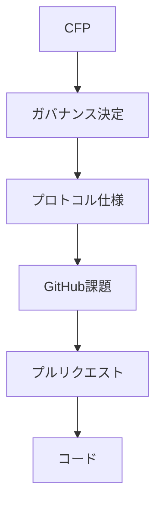

# 音楽クリエーター中心提案s

音楽クリエーター中心提案（CFP）は、Creator First Platform の制度、経済モデル、技術、ガバナンス、プロトコルなどについて、変更や新しい仕組みを提案するための公開提案制度です。

ホワイトペーパーが、

> **現時点で合意されているプラットフォームの基本設計**

を表すのに対し、CFP は、

> **その設計を変更・拡張するための提案**

を表します。

## CFP 手続

CFPは単なる開発課題ではありません。

CFPは「プラットフォームのルールをどうするか」を議論し、GitHub課題は「承認された仕様をどう実装するか」を管理します。

## 状態

CFPでは、次の状態を使用します。

| 状態 | 意味 |
| --- | --- |
| 草案 | 提案作成中 |
| 議論 | 公開議論中 |
| 熟議 | ガバナンスによる熟議中 |
| Accepted | 採択 |
| Rejected | 否決 |
| Implemented | 実装済み |
| Withdrawn | 提案者による撤回 |

## CFP一覧

現時点ではCFP制度そのものを整備している段階です。

| CFP | Title | 状態 |
| --- | --- | --- |
| CFP-0001 | 音楽クリエーター中心提案手続 | 草案 |

今後、抽選議会、音楽クリエータ院議会 / ユーザ院議会、経済モデル、権利登録台帳、利用実績オラクルなどの変更提案をCFPとして記録します。

## CFPの基本原則

CFPは次の原則に従います。

- 音楽クリエーターとユーザが提案できる開かれた制度であること
- 提案、議論、決定理由を追跡できること
- 3つの憲章と整合すること
- 重要な変更は音楽クリエータ院議会 / ユーザ院議会による熟議を経ること
- 採択された内容をプロトコル仕様へ変換すること
- 仕様と実装コードを追跡可能にすること

## ホワイトペーパーとの関係

ホワイトペーパーは現在の設計を記述し、CFPはその設計を変更する提案を記録します。

採択されたCFPによってホワイトペーパーやプロトコル仕様が更新される場合、その変更履歴を版管理します。

## ガバナンスとの関係

将来的には、

> **音楽クリエーター／ユーザ → CFP → 抽選議会 → 熟議 → プロトコル仕様 → スマートコントラクト → 自動執行**

という流れを形成します。

重大な憲章変更などについては、抽選議会の承認だけでなく、音楽クリエーター／ユーザコミュニティ全体による全体投票を必要とする制度を想定しています。
