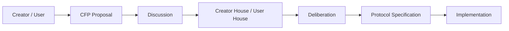
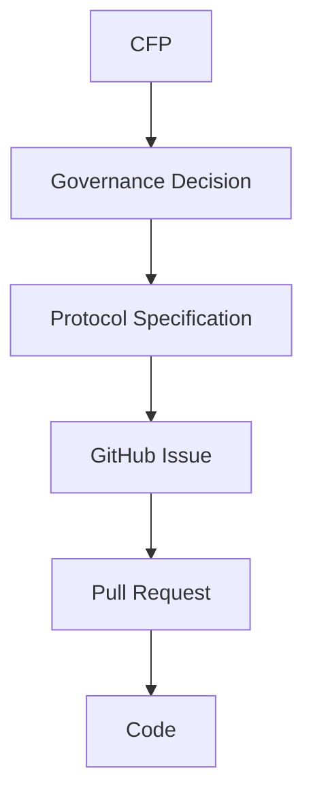

# Creator First Proposals

Creator First Proposal（CFP）は、Creator First Platform の制度、経済モデル、技術、Governance、Protocol などについて、変更や新しい仕組みを提案するための公開提案制度です。

Whitepaper が、

> **現時点で合意されている Platform の基本設計**

を表すのに対し、CFP は、

> **その設計を変更・拡張するための提案**

を表します。

## CFP Process

CFPは単なる開発Issueではありません。

CFPは「Platformのルールをどうするか」を議論し、GitHub Issueは「承認された仕様をどう実装するか」を管理します。

## Status

CFPでは、次のStatusを使用します。

| Status | 意味 |
| --- | --- |
| Draft | 提案作成中 |
| Discussion | 公開議論中 |
| Deliberation | Governanceによる熟議中 |
| Accepted | 採択 |
| Rejected | 否決 |
| Implemented | 実装済み |
| Withdrawn | 提案者による撤回 |

## CFP一覧

現時点ではCFP制度そのものを整備している段階です。

| CFP | Title | Status |
| --- | --- | --- |
| CFP-0001 | Creator First Proposal Process | Draft |

今後、抽選議会、Creator House / User House、Economic Model、Rights Registry、Usage Oracleなどの変更提案をCFPとして記録します。

## CFPの基本原則

CFPは次の原則に従います。

- CreatorとUserが提案できる開かれた制度であること
- 提案、議論、決定理由を追跡できること
- 3つの憲章と整合すること
- 重要な変更はCreator House / User Houseによる熟議を経ること
- 採択された内容をProtocol Specificationへ変換すること
- Specificationと実装Codeを追跡可能にすること

## Whitepaperとの関係

Whitepaperは現在の設計を記述し、CFPはその設計を変更する提案を記録します。

採択されたCFPによってWhitepaperやProtocol Specificationが更新される場合、その変更履歴をVersion管理します。

## Governanceとの関係

将来的には、

> **Creator/User → CFP → 抽選議会 → 熟議 → Protocol Specification → Smart Contract → 自動執行**

という流れを形成します。

重大な憲章変更などについては、抽選議会の承認だけでなく、Creator/User Community全体によるReferendumを必要とする制度を想定しています。
