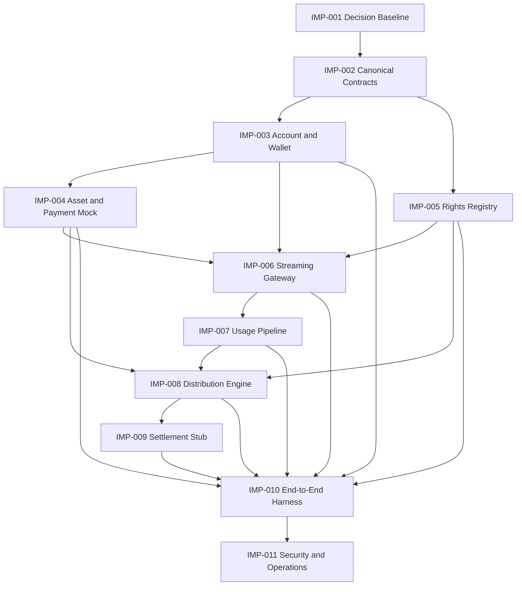

# Vertical Slice Implementation Plan

[End-to-End Vertical Slice](/protocol/vertical-slice)を、レビュー可能でテスト可能なWork Packageへ分解します。この計画は、技術スタック、Blockchain、Settlement Asset、法的構成または本番運用を採用決定するものではありません。

各Work Packageを開始する場合は、[`Implementation Work Package` Issue Form](https://github.com/ShigeichiroYamasaki/creator-first-platform/issues/new?template=implementation-work-package.yml)を使用し、仕様・判断・成果物・障害試験・終了証拠をIssue作成時に固定します。

::: warning Mock／Testnet限定の計画です
本計画の完了だけでは、本番資金、実在するRights証憑、個人情報、税務資料またはCreatorへの実送金を扱えません。Testnet Tokenは金銭的価値や本番適格性を示さず、外部専門家レビューやSmart Contract監査を代替しません。
:::

## 実装原則

- 仕様のOpen Questionを実装で暗黙に決定しない。
- 各ArtifactにSpecification、Schema、Policy、SnapshotのVersionを残す。
- 金額は資産の最小単位を整数で扱い、浮動小数点を使用しない。
- 外部依存、Queue、Callback、RPCは重複・遅延・順不同・停止を前提とする。
- 実在する個人情報、契約書、税務情報、秘密鍵をFixtureへ入れない。
- Smart Contractを法的判断、Rights判断、Usage判断、税務判断の主体にしない。
- 正常系だけでなく、fail closed、回復、監査、訂正、切り戻しを成果物に含める。

## 依存関係

## Work Packages

### IMP-001 Decision Baseline

**目的:** 実装開始に必要なOpen Questionと権限を、仮定と承認済み判断に分離する。

**現在の基盤:** [Decision Baseline](/protocol/decision-baseline)は、10仕様をSourceとして全Open Questionへ安全な既定状態を適用し、個別DecisionとMock Assumptionの完全性をCIで検証する。追跡Work Packageは[GitHub Issue #9](https://github.com/ShigeichiroYamasaki/creator-first-platform/issues/9)。

**成果物:**

- MVPを停止している`OQ-...` IDの一覧と依存Work Package
- 各Decision ownerとなる実在の担当者または機関
- Mock専用の仮定と、本番前に再決定が必要な項目のRegister
- 採用された判断へのCFP、Governance DecisionまたはADR参照
- 法務・Rights・税務・プライバシー・セキュリティのレビュー条件

**終了証拠:** 各Work Packageが、未決定事項をコード定数へ埋め込まず、参照するDecision IDまたはMock Assumption IDを持つ。

### IMP-002 Canonical Contracts

**目的:** 10仕様間で受け渡すArtifactを、実装言語やTransportから独立した契約として固定する。

**成果物:**

- Account、Wallet Link、Asset Entry、Payment Intent、Rights Snapshot、Usage Snapshot、Revenue Snapshot、Distribution Result、Settlement InstructionのSchema
- ID、時刻、期間、整数金額、資産単位、Version、Reason Codeの共通規則
- Canonical serializationとcommitment fixture
- Schema compatibility、unknown field、migration、redactionの規則
- 正常・境界・不正なGolden Fixture

**終了証拠:** 二つの独立したReaderが同じFixtureを解釈し、同じcanonical bytesとdigestを生成する。

### IMP-003 Account and Wallet Mock

**目的:** Account SessionとWallet authorizationを分離したローカル認可経路を作る。

**対象仕様:** [SPEC-ACCOUNT-003](/protocol/specs/account-lifecycle)、[SPEC-ACCOUNT-002](/protocol/specs/wallet-linking)

**成果物:**

- Account state machineとSession expiry／rotation
- 期限・domain・chain・purposeを固定したWallet Challenge
- EOA positive／negative verifier fixtureと、Contract Wallet用のMock interface
- Challengeのatomic one-time consumption
- Link、restrict、unlink、revokeの監査イベント

**終了証拠:** replay、別domain、別Account、期限切れ、並行consume、Account takeover fixtureがWallet Linkを作れない。

### IMP-004 Asset and Payment Mock

**目的:** 金銭的価値を持たないMock Assetと決定論的Finality Adapterで、Subscription Activationを検証する。

**対象仕様:** [SPEC-BLOCKCHAIN-001](/protocol/specs/settlement-asset-registry)、[SPEC-ACCOUNT-001](/protocol/specs/subscription-settlement)

**成果物:**

- 正確なNetwork・contract identityを持つMock Asset Entry
- 金銭的価値、償還請求権または実在JPYCとの交換可能性を持たない`MockJPYC`
- activate、suspend、revoke、cache expiryのRegistry fixture
- Payment Intent、Matching Transfer、Finality、Subscription state machine
- Payment IntentへBoundしたRelayer submissionとFaucet由来GasのSponsorship fixture
- duplicate callback、wrong asset、wrong amount、late payment、reorganizationのSimulation
- Native Gas支払だけではSubscriptionを有効化しないNegative fixture
- Payment ReferenceからMock Revenue entryへの一回限りの連携

**終了証拠:** `ACTIVE`でないAssetや`FINALIZED`でないPaymentからSubscriptionが有効にならず、同じPaymentが二重有効化されない。利用者がTest ETHを持たなくてもRelayer経由でMockJPYC Paymentを完了できる一方、Relayer受付またはGas支払だけでは有効化されない。

### IMP-005 Rights Registry Mock

**目的:** WorkとRecordingを分離し、Rights Claimからversioned Rights SnapshotまでをMock証憑で再現する。

**対象仕様:** [SPEC-RIGHTS-001](/protocol/specs/rights-registry)

**成果物:**

- Work／Recording identityと関係
- Claim、review、activate、dispute、suspend、supersedeのstate machine
- Rights Type、territory、use、effective interval、integer share
- Restricted Evidence Storeのinterfaceと公開commitment
- incomplete、overlapping、disputed shareのfixture

**終了証拠:** Creator登録、Uploader、WalletまたはfingerprintだけではRightsが有効にならず、過去のRights Snapshotを再現できる。

### IMP-006 Streaming Gateway Mock

**目的:** Active Subscription、任意のEarly Supporter Credential特権とRights Snapshotから短時間Playback Sessionを作成し、非公開Media Adapter経由のRange配信とDelivery EvidenceをMockで検証する。

**対象仕様:** [SPEC-ACCOUNT-004](/protocol/specs/early-supporter-credential)、[SPEC-STREAMING-001](/protocol/specs/playback-authorization)

**成果物:**

- Authorization Decision、reason code、Playback Session、Concurrency Lease
- Account、Subscription、Rights、Plan、地域、期間を固定したPolicy evaluator
- 同意済みDemo SBTの発行、Transfer拒否、Revocation、Wallet回復およびreorganization-aware Credential Read Model
- Consent、Qualification、Credential Deployment、Mint、NonceおよびExpiryへBoundしたSBT Relayer fixture
- 任意の確定済みMockJPYC Payment Qualificationと、誤Asset・誤Chain・未確定・重複PaymentのNegative fixture
- Creator Scope、Credential Status、Privilege Policy Versionを固定し、SubscriptionとRightsを置き換えないPolicy evaluator
- Canonical Track IDとMock Navidrome Media IDのversioned mapping
- `Remote-User`等のClient supplied trusted header除去
- Range、Seek、Reconnect、Cancellation、BackpressureのStreaming Adapter
- idempotentなDelivery EvidenceとUsage handoff
- Subscription取消し、Credential失効、Wallet Link制限、Privilege停止、Rights停止、stale Read Model、adapter outageのfailure fixture

**終了証拠:** Public routeまたは偽造headerからMedia Adapterを迂回できず、SBT単独でSubscriptionまたはRightsを代替できず、Playback Sessionが別Account・Credential・Privilege・Track・Rights・Planへ拡張されず、Adapter交換後もCanonical IDとEvidence semanticsが同一である。利用者はTest ETHなしでSBTを受領できるが、Gas SponsorshipだけではQualificationまたはCredentialを作れない。

### IMP-007 Usage Pipeline Mock

**目的:** Playback Eventを重複なく検証し、privacy-safeなUsage Snapshotを確定する。

**対象仕様:** [SPEC-USAGE-001](/protocol/specs/playback-verification)

**成果物:**

- Playback Event ingestionとidempotency
- Session、Content、Server／delivery evidenceのMock verifier
- duplicate relation、reason code、dispute、late-arrival処理
- Period close、reconciliation、challenge、finalize、correct
- deterministic aggregateとevent-set commitment

**終了証拠:** 同一logical playbackの複数Source・Retryが一度だけ算入され、公開ArtifactからUserの詳細履歴を復元できない。

### IMP-008 Distribution Engine

**目的:** 確定したRevenue・Usage・Rights・Policyから、整数単位で完全に照合できるDistribution Resultを生成する。

**対象仕様:** [SPEC-DISTRIBUTION-001](/protocol/specs/creator-distribution)

**成果物:**

- Mock Revenue Snapshotとdeduction／pool reconciliation
- User-Centric Content Allocation
- Rights-aware Recipient Allocation
- Held、Carry、Residual、minimum-payout処理
- canonical result、commitment、Creator explanation
- independent reference calculatorまたはGolden Fixture evaluator

**終了証拠:** 入力順序を変えても同じ結果となり、Revenueの全単位がDeduction、Pool、Recipient、Hold、CarryまたはResidualへ一致する。

### IMP-009 Settlement Stub

**目的:** Allocation finalityと支払finalityを混同せず、送金を行わないInstruction lifecycleを検証する。

**成果物:**

- Recipient payment profileのpseudonymous Mock
- allocation、asset、amount、profile Versionを固定したInstruction
- create、submit、fail、retry、cancel、finalizeのstate machine
- exactly-once effectを検査する冪等性記録
- AllocationとInstruction／Settlement Statusの照合

**終了証拠:** timeoutやduplicate responseが二重Settlement effectを作らず、失敗してもRecipient Allocationが消滅しない。

::: info Settlement Execution仕様は別途必要です
このStubは実送金、custody、KYC、税務、制裁、Wallet変更、鍵管理またはSmart Contractを承認するものではありません。本番へ進む前に専用Specificationと専門家レビューが必要です。
:::

### IMP-010 End-to-End Harness

**目的:** すべてのMockを一つのPeriodと相関IDで接続し、正常系と障害系を自動再現する。

**成果物:**

- Seed固定の完全合成Fixture
- AccountからSettlement Stubまでのone-command scenario
- Artifact lineage manifest
- retry、duplicate、delay、reorder、outage、dispute、correctionのfault injection
- 各Global／Specification Invariantの検査結果

**終了証拠:** clean environmentで同一commitから同じArtifactとcommitmentを再生成し、失敗を注入したScenarioが期待したfail-closed状態になる。

### IMP-011 Security, Privacy and Operations

**目的:** 機能テストだけでなく、脅威、データフロー、権限、監視、回復をVertical Slice全体で検証する。

**成果物:**

- Trust BoundaryとData Flow Diagram
- role／permission matrixとseparation-of-duties test
- threat model、abuse case、privacy review
- log redaction、retention、backup／restore、key placeholder方針
- incident、rollback、evidence outage、Rights dispute、settlement failureのrunbook
- 未解決リスクと本番禁止条件

**終了証拠:** 独立レビューが、既知の重大リスク、未検証仮定、本番禁止条件、次のMitigation ownerを追跡できる。

## Stage Gates

| Gate | 必須Work Package | 通過証拠 | 通過しても許可されないこと |
| --- | --- | --- | --- |
| G0 Decision Ready | IMP-001 | Blocking OQ、owner、Mock assumption、review条件 | 本番判断済みと表示すること |
| G1 Contract Ready | IMP-002 | Schema、canonical fixture、compatibility test | API／DB／Chainを固定すること |
| G2 Payment Slice | IMP-003–004 | Account・Wallet・Mock Paymentの障害試験 | 実Tokenや利用者資金を受けること |
| G3 Playback Slice | IMP-005–007 | Rights・Playback Authorization・Usage Evidenceの迂回防止と照合 | 実在Rightsや一般公開配信を扱うこと |
| G4 Creator Slice | IMP-008–010 | Distribution・Settlement Stub・一括Scenarioの完全照合 | 実在Creator報酬や本番Settlementを扱うこと |
| G5 Review Ready | IMP-011 | threat／privacy／operations evidence | 監査済み・適法・本番Readyと主張すること |

## Testnetデモから本番系への移行

IMP-001–011は、[Testnetデモ](/demo/)を成立させるMock／Testnet Work Packageです。G5を通過しても本番実装の開始を自動承認しません。

本番系は、TestnetデモのNetwork、Contract Address、Source Commit、Artifact lineage、失敗試験を公開し、Blocking Decisionの解決、専門家レビュー、独立Security Review、Smart Contract監査、本番用の鍵・権限・インフラ・契約・監視・復旧設計を別Gateで承認した後に実装します。Testnet用の鍵、Token、Contract、Rights Fixtureまたは管理権限を本番へ流用してはなりません。

## End-to-End Test Matrix

| Scenario | 注入条件 | 期待結果 |
| --- | --- | --- |
| Happy path | すべてのMock evidenceが有効 | 一つのFinalized Resultと一つのInstruction effect |
| Payment replay | 同じTransfer／Callbackを複数回送信 | Subscription有効化は一度だけ |
| Usage duplication | 同一Playbackを複数Sourceから送信 | Usage算入は一度だけ |
| Adapter bypass | Navidrome直通、偽造`Remote-User`、任意upstream URL | Gateway外の配信を拒否し、Credentialを漏らさない |
| Playback scope replay | Sessionを別Account・Track・Rights Versionで再利用 | 拒否し、元Sessionのscopeを変更しない |
| Read Model stale | SubscriptionまたはRights Cacheを期限超過にする | 新規Playback Sessionをfail closedで拒否 |
| Asset suspension | Intent作成前／Finality前にAsset停止 | 新規Intent拒否または明示的例外状態 |
| Rights dispute | 一部shareをPeriod中にDispute | 対象額だけHeld、他の照合は維持 |
| Oracle outage | Period close時にEvidence欠落 | SnapshotとDistributionを未確定で保持 |
| Arithmetic boundary | 最大値、1 unit、割り切れないshare | overflowなし、Residualを完全記録 |
| Settlement timeout | submit後に応答喪失 | retryしてもeffectは一度、Allocation維持 |
| Correction | Finalization後に承認済み訂正 | 旧Version不変、新Versionとdeltaを記録 |
| Privacy probe | 公開ArtifactとCreator viewを結合 | User-level履歴・Identityを復元できない |

## 実装開始前に必要な選択

次はコードで勝手に固定せず、Issue FormとDecision Recordから参照します。

- 最初の実装言語、runtime、package構成、DatabaseとQueue
- Canonical serialization、hash、ID、時刻Source
- Mock Chain／finality profileとContract Wallet test方法
- 最小Event Schema、Verification Policy、Distribution Policy
- Rights evidence、dispute、holdのMock境界
- Golden Fixtureとreference implementationの独立性
- CI実行時間、artifact retention、秘密情報とTest key管理

## 計画の更新ルール

- Work Packageの開始時に、対象Specification VersionとDecision IDを固定する。
- Scope変更は該当`IMP-...`と上位Decision／Specificationを同時に更新する。
- 完了はPull Request、テスト結果、生成Artifact、review recordへのリンクで証明する。
- 一部のMockが動くだけで、Statusを「サービス稼働」「決済提供」「分配実施」へ変更しない。
- 本番前には、専門家レビュー、独立Security Review、Smart Contract監査、運用訓練、公開後検証を別Gateとして追加する。
