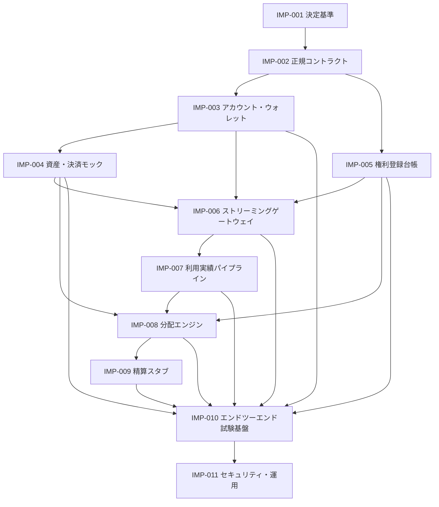

# 最小縦断実装実装計画

[エンドツーエンド最小縦断実装](/protocol/vertical-slice)を、レビュー可能でテスト可能な作業パッケージへ分解します。この計画は、技術スタック、ブロックチェーン、精算資産、法的構成または本番運用を採用決定するものではありません。

各作業パッケージを開始する場合は、[`Implementation Work Package` 課題フォーム](https://github.com/ShigeichiroYamasaki/creator-first-platform/issues/new?template=implementation-work-package.yml)を使用し、仕様・判断・成果物・障害試験・終了証拠を課題作成時に固定します。

::: warning モック／テストネット限定の計画です
本計画の完了だけでは、本番資金、実在する権利証憑、個人情報、税務資料または音楽クリエーターへの実送金を扱えません。テストネットトークンは金銭的価値や本番適格性を示さず、外部専門家レビューやスマートコントラクト監査を代替しません。
:::

本番系は本計画の環境を昇格させず、[ADR-0018](/adr/ADR-0018-production-service-architecture)と[SPEC-PLATFORM-001](/protocol/specs/production-service-lifecycle)に基づく独立した作業計画、鍵、データ、コントラクトおよび承認ゲートで構築する。

## 実装原則

- 仕様の未解決事項を実装で暗黙に決定しない。
- 各成果物に仕様、Schema、ポリシー、スナップショットの版を残す。
- 金額は資産の最小単位を整数で扱い、浮動小数点を使用しない。
- 外部依存、一覧、Callback、RPCは重複・遅延・順不同・停止を前提とする。
- 実在する個人情報、契約書、税務情報、秘密鍵をFixtureへ入れない。
- スマートコントラクトを法的判断、権利判断、利用実績判断、税務判断の主体にしない。
- 正常系だけでなく、fail closed、回復、監査、訂正、切り戻しを成果物に含める。

## 依存関係

## 作業パッケージ

### IMP-001 決定基準

**目的:** 実装開始に必要な未解決事項と権限を、仮定と承認済み判断に分離する。

**現在の基盤:** [決定基準](/protocol/decision-baseline)は、10仕様をソースとして全未解決事項へ安全な既定状態を適用し、個別決定とモック仮定の完全性をCIで検証する。追跡作業パッケージは[GitHub課題 #9](https://github.com/ShigeichiroYamasaki/creator-first-platform/issues/9)。

**成果物:**

- MVPを停止している`OQ-...` IDの一覧と依存作業パッケージ
- 各決定責任者となる実在の担当者または機関
- モック専用の仮定と、本番前に再決定が必要な項目の登録簿
- 採用された判断へのCFP、ガバナンス決定またはADR参照
- 法務・権利・税務・プライバシー・セキュリティのレビュー条件

**終了証拠:** 各作業パッケージが、未決定事項をコード定数へ埋め込まず、参照する決定 IDまたはモック仮定 IDを持つ。

### IMP-002 正規コントラクト

**目的:** 10仕様間で受け渡す成果物を、実装言語やTransportから独立した契約として固定する。

**成果物:**

- アカウント、ウォレット連携、資産登録項目、決済意思、権利スナップショット、利用実績スナップショット、収益スナップショット、分配結果、精算指示のSchema
- ID、時刻、期間、整数金額、資産単位、版、Reason コードの共通規則
- 正規 serializationとcommitment fixture
- Schema compatibility、unknown field、migration、redactionの規則
- 正常・境界・不正なGolden Fixture

**終了証拠:** 二つの独立したReaderが同じFixtureを解釈し、同じcanonical bytesとdigestを生成する。

### IMP-003 アカウント・ウォレットモック

**目的:** アカウントセッションとウォレット authorizationを分離したローカル認可経路を作る。

**対象仕様:** [SPEC-ACCOUNT-003](/protocol/specs/account-lifecycle)、[SPEC-ACCOUNT-002](/protocol/specs/wallet-linking)

**現在の部分実装:** ゲートウェイは合成デモ Principal、1時間のHttpOnly Cookie、SIWE 異議申立てと署名復元、およびAlias限定Test-only プロフィールを持つ。ただしTest-only プロフィールはアカウント登録ではなく、認証器、アカウント state machine、セッション rotation／logout、復旧、ウォレット連携 recordおよびコントラクトウォレット検証は未実装である。したがってIMP-003の終了条件は未達である。

**成果物:**

- アカウント state machineとセッション expiry／rotation
- 期限・domain・chain・purposeを固定したウォレット異議申立て
- EOA positive／negative verifier fixtureと、コントラクトウォレット用のモック interface
- 異議申立てのatomic one-time consumption
- 連携、restrict、unlink、revokeの監査イベント

**終了証拠:** replay、別domain、別アカウント、期限切れ、並行consume、アカウント takeover fixtureがウォレット連携を作れない。

### IMP-004 資産・決済モック

**目的:** 金銭的価値を持たないモック資産と決定論的ファイナリティアダプターで、サブスクリプション有効化を検証する。

**対象仕様:** [SPEC-BLOCKCHAIN-001](/protocol/specs/settlement-asset-registry)、[SPEC-ACCOUNT-001](/protocol/specs/subscription-settlement)

**成果物:**

- 正確なネットワーク・contract identityを持つモック資産登録項目
- 金銭的価値、償還請求権または実在JPYCとの交換可能性を持たない`MockJPYC`
- activate、suspend、revoke、cache expiryの登録台帳 fixture
- 決済意思、Matching 転送、ファイナリティ、サブスクリプション state machine
- 決済意思へBoundしたリレイヤー submissionとFaucet由来ガスのSponsorship fixture
- duplicate callback、wrong asset、wrong amount、late payment、reorganizationのシミュレーション
- ネイティブガス支払だけではサブスクリプションを有効化しない欠点 fixture
- 決済参照からモック収益 entryへの一回限りの連携

**終了証拠:** `ACTIVE`でない資産や`FINALIZED`でない決済からサブスクリプションが有効にならず、同じ決済が二重有効化されない。ユーザがテスト ETHを持たなくてもリレイヤー経由でMockJPYC 決済を完了できる一方、リレイヤー受付またはガス支払だけでは有効化されない。

### IMP-005 権利登録台帳モック

**目的:** 作業と原盤を分離し、権利主張からversioned 権利スナップショットまでをモック証憑で再現する。

**対象仕様:** [SPEC-RIGHTS-001](/protocol/specs/rights-registry)

**成果物:**

- 作業／原盤 identityと関係
- 主張、review、activate、dispute、suspend、supersedeのstate machine
- 権利 Type、territory、use、effective interval、integer share
- Restricted 証跡保存のinterfaceと公開commitment
- incomplete、overlapping、disputed shareのfixture

**終了証拠:** 音楽クリエーター登録、Uploader、ウォレットまたはfingerprintだけでは権利が有効にならず、過去の権利スナップショットを再現できる。

### IMP-006 ストリーミングゲートウェイモック

**目的:** 有効サブスクリプション、任意の初期サポーター資格証明特権と権利スナップショットから短時間再生セッションを作成し、非公開メディアアダプター経由の範囲配信と配信証跡をモックで検証する。

**対象仕様:** [SPEC-ACCOUNT-004](/protocol/specs/early-supporter-credential)、[SPEC-STREAMING-001](/protocol/specs/playback-authorization)

**現在の部分実装:** 固定モックサブスクリプション／権利、短命再生セッション、Owner 結付け、単一範囲、Concurrency Lease、SQLite 配信証跡、月間Byte 予算、ファイルアダプター、明示対応付け型Navidrome アダプター、EIP-712 支援意思、モック資格証明状態およびコミュニティ Capabilityを実装済みである。別レイヤーでは、Hardhat 3による一回限りの公開テスト Faucet付きMockJPYC、サブスクリプション、資金庫、一般／初期サポーター SBT、UUPS プロキシおよび自己申告コミットメント限定の音楽クリエーター登録台帳をPolygon Amoyへデプロイした。GitHub Pagesのテストユーザ利用フローはmockJPYC サブスクリプションと合成プレーヤー、テスト音楽クリエーター利用フローはPolygon Amoy ウォレットと音楽クリエーター／リリースコミットメントを統合する。ただしリレイヤー、コントラクトインデクサー、ゲートウェイ接続、音楽クリエーターBFF、復旧、権利レビュー、Reorganization-aware 参照モデル、クライアント再生イベント、再生検証 handoff、非公開クラウドネットワークおよび障害Fixture一式は未実装であり、IMP-006の終了条件は未達である。

**成果物:**

- 認可決定、reason code、再生セッション、Concurrency Lease
- アカウント、サブスクリプション、権利、計画、地域、期間を固定したポリシー evaluator
- 同意済みデモ SBTの発行、転送拒否、失効、ウォレット回復およびreorganization-aware 資格証明参照モデル
- 同意、資格判定、資格証明デプロイ、Mint、NonceおよびExpiryへBoundしたSBT リレイヤー fixture
- 任意の確定済みMockJPYC 決済資格判定と、誤資産・誤チェーン・未確定・重複決済の欠点 fixture
- 音楽クリエーター対象範囲、資格証明状態、特権ポリシー版を固定し、サブスクリプションと権利を置き換えないポリシー evaluator
- 正規楽曲 IDとモック Navidrome メディア IDのversioned mapping
- `Remote-User`等のクライアント supplied trusted header除去
- 範囲、Seek、Reconnect、Cancellation、Backpressureのストリーミングアダプター
- idempotentな配信証跡と利用実績 handoff
- サブスクリプション取消し、資格証明失効、ウォレット連携制限、特権停止、権利停止、stale 参照モデル、adapter outageのfailure fixture

**終了証拠:** 公開 routeまたは偽造headerからメディアアダプターを迂回できず、SBT単独でサブスクリプションまたは権利を代替できず、再生セッションが別アカウント・資格証明・特権・楽曲・権利・計画へ拡張されず、アダプター交換後も正規 IDと証跡 semanticsが同一である。ユーザはテスト ETHなしでSBTを受領できるが、ガス代支援だけでは資格判定または資格証明を作れない。

### IMP-007 利用実績パイプラインモック

**目的:** 再生イベントを重複なく検証し、privacy-safeな利用実績スナップショットを確定する。

**対象仕様:** [SPEC-USAGE-001](/protocol/specs/playback-verification)、[SPEC-ZK-001](/protocol/specs/transparent-zk-verification)

**成果物:**

- 再生イベント ingestionとidempotency
- セッション、コンテンツ、サーバー／delivery evidenceのモック verifier
- duplicate relation、reason code、dispute、late-arrival処理
- 期間 close、reconciliation、challenge、finalize、correct
- deterministic aggregateとevent-set commitment
- 透明型ZKの検証者プロファイル、公開入力拘束、受付ID、再実行防止、停止の統合モック

**終了証拠:** 同一logical playbackの複数ソース・Retryが一度だけ算入され、公開成果物からユーザの詳細履歴を復元できない。

**現在の部分実装:** `CreatorFirstTransparentZKRegistry`、交換可能な検証インターフェースおよび暗号学的ZKではないことを明示したモック検証者で、プロファイル登録、チェーン拘束受付ID、無効証明、再実行、廃止、停止をローカル検証する。利用実績パイプラインと実際の透明型証明方式は未接続であり、Polygon Amoy公開マニフェストにも未掲載であるため、終了条件は未達である。

### IMP-008 分配エンジン

**目的:** 確定した収益・利用実績・権利・ポリシーから、整数単位で完全に照合できる分配結果を生成する。

**対象仕様:** [SPEC-DISTRIBUTION-001](/protocol/specs/creator-distribution)

**成果物:**

- モック収益スナップショットとdeduction／pool reconciliation
- ユーザ中心コンテンツ配分
- Rights-aware Recipient 配分
- Held、Carry、Residual、minimum-payout処理
- canonical result、commitment、音楽クリエーター向け説明
- independent reference calculatorまたはGolden Fixture evaluator

**終了証拠:** 入力順序を変えても同じ結果となり、収益の全単位がDeduction、プール、Recipient、保留、CarryまたはResidualへ一致する。

### IMP-009 精算スタブ

**目的:** 配分 finalityと支払finalityを混同せず、送金を行わない指示 lifecycleを検証する。

**成果物:**

- Recipient payment profileのpseudonymous モック
- allocation、asset、amount、profile 版を固定した指示
- create、submit、fail、retry、cancel、finalizeのstate machine
- exactly-once effectを検査する冪等性記録
- 配分と指示／精算状態の照合

**終了証拠:** timeoutやduplicate responseが二重精算 effectを作らず、失敗してもRecipient 配分が消滅しない。

::: info 精算実行仕様は別途必要です
このスタブは実送金、custody、KYC、税務、制裁、ウォレット変更、鍵管理またはスマートコントラクトを承認するものではありません。本番へ進む前に専用仕様と専門家レビューが必要です。
:::

### IMP-010 エンドツーエンド試験基盤

**目的:** すべてのモックを一つの期間と相関IDで接続し、正常系と障害系を自動再現する。

**成果物:**

- Seed固定の完全合成Fixture
- アカウントから精算スタブまでのone-command scenario
- 成果物 lineage manifest
- retry、duplicate、delay、reorder、outage、dispute、correctionのfault injection
- 各国際／仕様不変条件の検査結果

**終了証拠:** clean environmentで同一commitから同じ成果物とcommitmentを再生成し、失敗を注入したScenarioが期待したfail-closed状態になる。

### IMP-011 セキュリティ, プライバシー・運用

**目的:** 機能テストだけでなく、脅威、データフロー、権限、監視、回復を最小縦断実装全体で検証する。

**成果物:**

- 信頼境界とデータフロー Diagram
- role／permission matrixとseparation-of-duties test
- threat model、abuse case、privacy review
- log redaction、retention、backup／restore、key placeholder方針
- incident、rollback、evidence outage、権利 dispute、settlement failureのrunbook
- 未解決リスクと本番禁止条件

**終了証拠:** 独立レビューが、既知の重大リスク、未検証仮定、本番禁止条件、次のMitigation ownerを追跡できる。

## 段階ゲート

| ゲート | 必須作業パッケージ | 通過証拠 | 通過しても許可されないこと |
| --- | --- | --- | --- |
| G0 決定 Ready | IMP-001 | Blocking OQ、owner、モック assumption、review条件 | 本番判断済みと表示すること |
| G1 コントラクト Ready | IMP-002 | Schema、canonical fixture、compatibility test | API／DB／チェーンを固定すること |
| G2 決済部分実装 | IMP-003–004 | アカウント・ウォレット・モック決済の障害試験 | 実トークンやユーザ資金を受けること |
| G3 再生部分実装 | IMP-005–007 | 権利・再生認可・利用実績証跡の迂回防止と照合 | 実在権利や一般公開配信を扱うこと |
| G4 音楽クリエーター部分実装 | IMP-008–010 | 分配・精算スタブ・一括Scenarioの完全照合 | 実在音楽クリエーター報酬や本番精算を扱うこと |
| G5 レビュー Ready | IMP-011 | threat／privacy／operations evidence | 監査済み・適法・本番Readyと主張すること |

## テストネットデモから本番系への移行

IMP-001–011は、[テストネットデモ](/demo/)を成立させるモック／テストネット作業パッケージです。G5を通過しても本番実装の開始を自動承認しません。

本番系は、テストネットデモのネットワーク、コントラクトアドレス、ソースコミット、成果物 lineage、失敗試験を公開し、Blocking 決定の解決、専門家レビュー、独立セキュリティレビュー、スマートコントラクト監査、本番用の鍵・権限・インフラ・契約・監視・復旧設計を別ゲートで承認した後に実装します。テストネット用の鍵、トークン、コントラクト、権利 Fixtureまたは管理権限を本番へ流用してはなりません。

## エンドツーエンドテスト一覧

| Scenario | 注入条件 | 期待結果 |
| --- | --- | --- |
| Happy path | すべてのモック evidenceが有効 | 一つの確定済み結果と一つの指示 effect |
| 決済 replay | 同じ転送／Callbackを複数回送信 | サブスクリプション有効化は一度だけ |
| 利用実績 duplication | 同一再生を複数ソースから送信 | 利用実績算入は一度だけ |
| アダプター bypass | Navidrome直通、偽造`Remote-User`、任意upstream URL | ゲートウェイ外の配信を拒否し、資格証明を漏らさない |
| 再生 scope replay | セッションを別アカウント・楽曲・権利版で再利用 | 拒否し、元セッションのscopeを変更しない |
| 参照モデル stale | サブスクリプションまたは権利キャッシュを期限超過にする | 新規再生セッションをfail closedで拒否 |
| 資産 suspension | 意思作成前／ファイナリティ前に資産停止 | 新規意思拒否または明示的例外状態 |
| 権利 dispute | 一部shareを期間中に紛争 | 対象額だけHeld、他の照合は維持 |
| オラクル outage | 期間 close時に証跡欠落 | スナップショットと分配を未確定で保持 |
| Arithmetic boundary | 最大値、1 unit、割り切れないshare | overflowなし、Residualを完全記録 |
| 精算 timeout | submit後に応答喪失 | retryしてもeffectは一度、配分維持 |
| Correction | 確定後に承認済み訂正 | 旧版不変、新版とdeltaを記録 |
| プライバシー probe | 公開成果物と音楽クリエーター向け表示を結合 | ユーザ-level履歴・アイデンティティを復元できない |

## 実装開始前に必要な選択

次はコードで勝手に固定せず、課題フォームと決定記録から参照します。

- 最初の実装言語、runtime、package構成、データベースと一覧
- 正規 serialization、hash、ID、時刻ソース
- モックチェーン／finality profileとコントラクトウォレット test方法
- 最小イベント Schema、検証ポリシー、分配ポリシー
- 権利 evidence、dispute、holdのモック境界
- Golden Fixtureとreference implementationの独立性
- CI実行時間、artifact retention、秘密情報とテスト key管理

## 計画の更新ルール

- 作業パッケージの開始時に、対象仕様版と決定 IDを固定する。
- 範囲変更は該当`IMP-...`と上位決定／仕様を同時に更新する。
- 完了はプルリクエスト、テスト結果、生成成果物、review recordへのリンクで証明する。
- 一部のモックが動くだけで、状態を「サービス稼働」「決済提供」「分配実施」へ変更しない。
- 本番前には、専門家レビュー、独立セキュリティレビュー、スマートコントラクト監査、運用訓練、公開後検証を別ゲートとして追加する。
