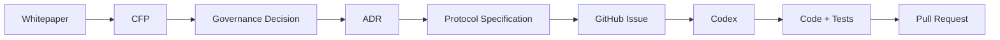
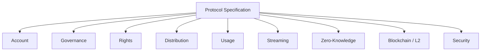
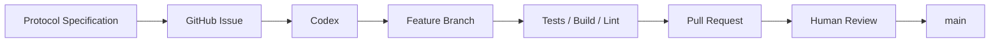
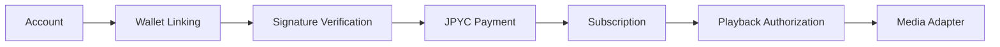

# Protocol Specification

Creator First Platform の Protocol Specification は、Whitepaper・CFP・Governance Decision・ADR で確定した設計を、**Codexや開発者が実装可能な要件へ変換するための文書群**です。

Protocol Specification は、人間向けの説明書であると同時に、AIエージェントが実装・テスト・レビューを行うための **実装契約**として利用します。

9仕様をAccount・Payment・Credential・Rights・Streaming・Usage・Distributionの一つの経路として読む場合は、[End-to-End Vertical Slice](/protocol/vertical-slice)を参照してください。Mock／Testnetでの作業分解とStage Gateは[Vertical Slice Implementation Plan](/protocol/implementation-plan)にまとめています。

::: warning 現在のStatus: Draft
公開中のProtocol Specificationは設計・レビュー段階です。本番サービスや資金を扱う承認済み仕様ではありません。実装開始前にOpen Questionsを解決し、法務・セキュリティ・ガバナンスの承認とVersion更新が必要です。
:::

## 現在のDraft

| Specification | Domain | Version | 主な役割 |
| --- | --- | --- | --- |
| [SPEC-ACCOUNT-003 Account Lifecycle](/protocol/specs/account-lifecycle) | Account / Identity | 0.1.0 | 登録、認証、Session、Recovery、閉鎖 |
| [SPEC-ACCOUNT-002 Wallet Linking](/protocol/specs/wallet-linking) | Account / Identity | 0.1.0 | Wallet関連付け、署名、解除、権限分離 |
| [SPEC-ACCOUNT-004 Early Supporter Credential](/protocol/specs/early-supporter-credential) | Account / Credential | 0.1.0 | SBT同意、発行、失効、Wallet回復、限定特権 |
| [SPEC-BLOCKCHAIN-001 Settlement Asset Registry](/protocol/specs/settlement-asset-registry) | Blockchain / Payment | 0.1.0 | JPYC等の審査、承認、停止、履歴管理 |
| [SPEC-ACCOUNT-001 Subscription Settlement](/protocol/specs/subscription-settlement) | Account / Payment | 0.1.0 | Payment Intent、Finality、Subscription有効化 |
| [SPEC-RIGHTS-001 Rights Registry](/protocol/specs/rights-registry) | Rights / Content | 0.1.0 | Work・Recording、権利主張、審査、紛争、Rights Snapshot |
| [SPEC-STREAMING-001 Playback Authorization](/protocol/specs/playback-authorization) | Streaming / Authorization | 0.1.0 | Subscription・Credential特権・Rights認可、Playback Session、Media Adapter、Delivery Evidence |
| [SPEC-USAGE-001 Playback Verification](/protocol/specs/playback-verification) | Usage / Privacy | 0.1.0 | Playback Event、重複防止、検証、Usage Snapshot、Challenge |
| [SPEC-DISTRIBUTION-001 Creator Distribution](/protocol/specs/creator-distribution) | Distribution / Accounting | 0.1.0 | Revenue、User-Centric計算、Rights分割、保留、端数、Allocation |

すべてのDraftは、リポジトリ内の自動検証によって要件IDとInvariant IDの一意性、Global Invariant参照、Related Documentsの存在、MUST / MUST NOTとTest Requirementsの双方向対応、およびOpen Questionの安定ID・Decision owner・停止中ゲートを検査します。未決定事項は[Protocol Decision Queue](/protocol/open-questions)から確認できます。

---

## Protocol の位置づけ



各文書の役割は次のとおりです。

| Layer | Role |
| --- | --- |
| Whitepaper | 何を目指すか、Platformの基本原則 |
| CFP | 何を変更・拡張したいか |
| Governance Decision | 何を採用するか |
| ADR | なぜその設計を採用したか |
| Protocol Specification | 何を、どの条件で実装するか |
| GitHub Issue | 今回実装する具体的作業 |
| Code / Tests | 仕様を満たす実装 |

---

## Source of Truth

実装時には、原則として次の順序で上位文書を参照します。

```text
Three Charters
      ↓
Whitepaper
      ↓
Accepted CFP / Governance Decision
      ↓
ADR
      ↓
Protocol Specification
      ↓
Implementation
```

実装コードと承認済みProtocol Specificationが矛盾する場合、原則としてSpecificationを正とします。

---

## 共通 Protocol 文書

Protocol全体で共通して参照する文書です。

### [README](/protocol/foundation/overview)

Protocol Specification全体の目的、文書階層、AIエージェント向けルールを定義します。

文書階層、開発フロー、仕様一覧、AIエージェント向けルールを公開しています。

### [Conventions](/protocol/foundation/conventions)

MUST / MUST NOT / SHOULD / MAY、Identifier、Timestamp、Token Amount、Error Code、Version等の共通記法を定義します。

規範キーワード、識別子、時刻、金額、エラー、Versionの共通規則を公開しています。

### [Glossary](/protocol/foundation/glossary)

User、Creator、Rights Holder、Wallet、Governance Member、Usage Event等の用語を統一します。

Participant、Account、Wallet、Rights、Payment等の共通語彙を公開しています。

### [Global Invariants](/protocol/foundation/invariants)

Platform全体で破ってはいけない不変条件を定義します。

下位仕様や実装が上書きしてはならないPlatform全体の不変条件を公開しています。

---

## Protocol Domains

Protocol Specificationはドメイン単位に整理します。



---

## Account / Wallet / Identity

ADR-0008を実装可能な仕様へ落とし込みます。

主な仕様:

```text
protocol/account/
├── account-lifecycle-spec.md         # Draft v0.1.0
├── wallet-linking-spec.md            # Draft v0.1.0
├── early-supporter-credential-spec.md # Draft v0.1.0
└── subscription-settlement-spec.md   # Draft v0.1.0
```

現在のDraftとして、[SPEC-ACCOUNT-001 Subscription Settlement and Activation](/protocol/specs/subscription-settlement) を定義しています。これは、承認済み決済資産、Payment Intent、Finality、二重有効化防止、Subscription State、監査要件を実装可能な要件へ変換したものです。

AccountとWalletの関連付け・解除・回復時の安全要件は、[SPEC-ACCOUNT-002 Wallet Linking and Unlinking](/protocol/specs/wallet-linking) が定義します。

Early Supporter SBTの同意、発行、失効、Wallet回復と、Subscription・Rightsを置き換えない限定特権は、[SPEC-ACCOUNT-004 Early Supporter Credential and Privilege](/protocol/specs/early-supporter-credential) が定義します。

Account登録、認証、Session、Recovery、停止・閉鎖の基盤は、[SPEC-ACCOUNT-003 Account Lifecycle, Authentication and Recovery](/protocol/specs/account-lifecycle) が定義します。

決済資産の承認・停止・監視・履歴管理は、[SPEC-BLOCKCHAIN-001 Approved Settlement Asset Registry](/protocol/specs/settlement-asset-registry) が定義します。

最初のVertical Sliceは、

```text
Account Registration
      ↓
Wallet Linking
      ↓
JPYC Payment Authorization
      ↓
Subscription Settlement
      ↓
Subscription Activation
```

です。

### 関連ADR

- ADR-0008 Account / Wallet / Identity Strategy
- ADR-0007 Blockchain / L2 Strategy

---

## Governance

Creator / Userから抽選議会を形成し、熟議からProtocol Decisionへつなげる仕様です。

予定仕様:

```text
protocol/governance/
├── governance-spec.md
├── eligibility-spec.md
├── sortition-spec.md
├── deliberation-spec.md
├── referendum-spec.md
└── emergency-governance-spec.md
```

### 関連ADR

- ADR-0001 Governance Model
- ADR-0002 Verifiable Sortition
- ADR-0006 Zero-Knowledge Proof Strategy
- ADR-0008 Account / Wallet / Identity Strategy

---

## Rights

作品、Creator、Rights Holder、Rights Claim、Verified Rights、紛争状態を扱います。

予定仕様:

```text
protocol/rights/
├── rights-registry-spec.md
├── rights-verification-spec.md
├── rights-dispute-spec.md
└── rights-versioning-spec.md
```

### 関連ADR

- ADR-0003 Rights Registry
- ADR-0006 Zero-Knowledge Proof Strategy

---

## Distribution

Subscription RevenueをVerified UsageとRights Stateに基づいてCreator / Rights Holderへ分配する仕様です。

予定仕様:

```text
protocol/distribution/
├── revenue-allocation-spec.md
├── distribution-spec.md
├── settlement-spec.md
└── payout-spec.md
```

### 関連ADR

- ADR-0003 Rights Registry
- ADR-0004 Creator Distribution Model
- ADR-0005 Usage Oracle
- ADR-0007 Blockchain / L2 Strategy

---

## Usage

Playback EventをVerified Usageへ変換し、Distributionへ渡すための仕様です。

予定仕様:

```text
protocol/usage/
├── usage-event-spec.md
├── usage-verification-spec.md
├── usage-aggregation-spec.md
└── fraud-detection-spec.md
```

### 関連ADR

- ADR-0005 Usage Oracle
- ADR-0006 Zero-Knowledge Proof Strategy
- ADR-0009 Navidrome / Streaming Authorization Gateway

---

## Streaming Authorization

Account Session、Subscription、Rights Stateを、短時間で失効可能なPlayback Sessionへ変換し、Media Adapterへの唯一の公開認可境界を定義します。

現在のDraft:

- [SPEC-STREAMING-001 Streaming Authorization and Playback Session](/protocol/specs/playback-authorization)

```text
protocol/streaming/
└── playback-authorization-spec.md   # Draft v0.1.0
```

Navidromeは適合可能なMedia Adapter例ですが、Canonical Track ID、Subscription、Rights、Verified UsageまたはDistributionのSource of Truthにはしません。

### 関連ADR

- ADR-0009 Navidrome / Streaming Authorization Gateway
- ADR-0008 Account / Wallet / Identity Strategy
- ADR-0005 Usage Oracle

---

## Zero-Knowledge Proof

Privacyを維持しながらProtocol計算を検証可能にするProof Layerを定義します。

予定仕様:

```text
protocol/zk/
├── zk-proof-interface-spec.md
├── usage-proof-spec.md
├── distribution-proof-spec.md
├── rights-proof-spec.md
└── eligibility-proof-spec.md
```

### 関連ADR

- ADR-0002 Verifiable Sortition
- ADR-0003 Rights Registry
- ADR-0004 Creator Distribution Model
- ADR-0005 Usage Oracle
- ADR-0006 Zero-Knowledge Proof Strategy

---

## Blockchain / L2

現在のDraft:

- [SPEC-BLOCKCHAIN-001 Approved Settlement Asset Registry](/protocol/specs/settlement-asset-registry)

Smart Contract、Stablecoin Settlement、L2 Integration、Upgrade、Chain State等を定義します。

予定仕様:

```text
protocol/blockchain/
├── blockchain-interface-spec.md
├── asset-registry-spec.md
├── settlement-contract-spec.md
├── contract-upgrade-spec.md
├── chain-state-spec.md
└── gas-sponsorship-spec.md
```

### 関連ADR

- ADR-0004 Creator Distribution Model
- ADR-0006 Zero-Knowledge Proof Strategy
- ADR-0007 Blockchain / L2 Strategy
- ADR-0008 Account / Wallet / Identity Strategy

---

## Security

Protocol全体のTrust Boundary、Key Management、Incident Response等を定義します。

予定仕様:

```text
protocol/security/
├── threat-model.md
├── trust-boundaries.md
├── key-management-spec.md
└── incident-response-spec.md
```

各ドメイン仕様はこのSecurity Layerを参照します。

---

## Specification Format

各Protocol Specificationは共通テンプレートに従います。

```text
protocol/templates/protocol-spec-template.md
```

基本構造:

```text
Goal
Scope
Out of Scope
Actors
Inputs
Outputs
State
Requirements
Invariants
State Transitions
Interfaces
Error Conditions
Security Requirements
Privacy Requirements
Failure Handling
Audit Requirements
Test Requirements
Acceptance Criteria
Open Questions
```

特にCodexへ実装を依頼する際には、

- MUST
- MUST NOT
- Invariants
- Error Conditions
- Test Requirements
- Acceptance Criteria

を明確にします。

---

## AI / Codex Development Flow

Protocol Specificationから直接mainブランチへ実装を反映しません。



Codexには、まず関連する

1. `AGENTS.md`
2. ADR
3. Protocol Specification
4. Existing Code
5. Existing Tests

を読むよう指示します。

---

## GitHub Issue の単位

1つのSpecificationを1つの巨大Issueとして実装するのではなく、小さなAcceptance Criteria単位に分けます。

例えば `wallet-linking-spec.md` から、

```text
Issue: Generate wallet linking challenge
Issue: Verify wallet signature
Issue: Reject replayed nonce
Issue: Add wallet linking API
Issue: Add wallet unlinking flow
```

のように分割します。

---

## 最初に実装する Protocol

最初のCodex実装では、ADR-0008とADR-0009を基礎にAccount / Wallet / Subscription / PlaybackのVertical Sliceを作ります。



最初に作成する仕様:

1. `account/account-lifecycle-spec.md` — Draft v0.1.0
2. `account/wallet-linking-spec.md` — Draft v0.1.0
3. `account/subscription-settlement-spec.md` — Draft v0.1.0
4. `streaming/playback-authorization-spec.md` — Draft v0.1.0

---

## Protocol と ADR の関係

```mermaid
flowchart TD
    ADR1[ADR-0001 Governance]
    ADR2[ADR-0002 Sortition]
    ADR3[ADR-0003 Rights]
    ADR4[ADR-0004 Distribution]
    ADR5[ADR-0005 Usage Oracle]
    ADR6[ADR-0006 ZKP]
    ADR7[ADR-0007 Blockchain / L2]
    ADR8[ADR-0008 Account / Wallet / Identity]
    ADR9[ADR-0009 Navidrome / Streaming Gateway]

    ADR1 --> GOV[Governance Specs]
    ADR2 --> GOV
    ADR3 --> RIGHTS[Rights Specs]
    ADR4 --> DIST[Distribution Specs]
    ADR5 --> USAGE[Usage Specs]
    ADR6 --> ZK[ZK Specs]
    ADR7 --> CHAIN[Blockchain Specs]
    ADR8 --> ACCOUNT[Account Specs]
    ADR9 --> STREAM[Streaming Specs]

    ADR3 --> DIST
    ADR5 --> DIST
    ADR6 --> GOV
    ADR6 --> RIGHTS
    ADR6 --> USAGE
    ADR7 --> DIST
    ADR7 --> ACCOUNT
    ADR8 --> STREAM
    ADR5 --> STREAM
```



---

## 実装原則

Protocol Specificationは単なる参考文書ではありません。

実装では、

> **Specification → Tests → Code**

の順序を意識します。

```text
Protocol Requirement
      ↓
Acceptance Criteria
      ↓
Automated Test
      ↓
Implementation
```

これにより、Codexが生成したCodeが仕様を満たしているかを人間とCIの両方で確認できるようにします。

---

## 現在のVertical Slice

最初の実装仕様は次の順序で接続します。

```text
Account Lifecycle
↓
Wallet Linking
↓
Approved Settlement Asset
↓
Subscription Settlement
```

これにより、

```text
Account
↓
Wallet Linking
↓
JPYC Subscription
```

のEnd-to-End実装へ進むためのDraft要件が揃います。
