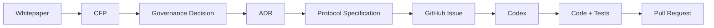
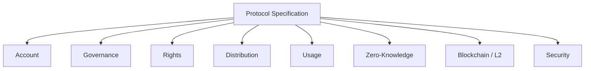
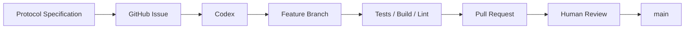
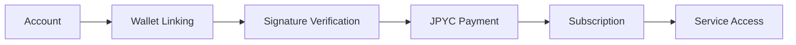
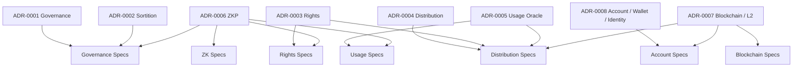

# Protocol Specification

Creator First Platform の Protocol Specification は、Whitepaper・CFP・Governance Decision・ADR で確定した設計を、**Codexや開発者が実装可能な要件へ変換するための文書群**です。

Protocol Specification は、人間向けの説明書であると同時に、AIエージェントが実装・テスト・レビューを行うための **実装契約**として利用します。

---

## Protocol の位置づけ



各文書の役割は次のとおりです。

| Layer | Role |
| --- | --- |
| Whitepaper | 何を目指すか、Platformの基本原則 |
| CFP | 何を変更・拡張したいか |
| Governance Decision | 何を採用するか |
| ADR | なぜその設計を採用したか |
| Protocol Specification | 何を、どの条件で実装するか |
| GitHub Issue | 今回実装する具体的作業 |
| Code / Tests | 仕様を満たす実装 |

---

## Source of Truth

実装時には、原則として次の順序で上位文書を参照します。

```text
Three Charters
      ↓
Whitepaper
      ↓
Accepted CFP / Governance Decision
      ↓
ADR
      ↓
Protocol Specification
      ↓
Implementation
```

実装コードと承認済みProtocol Specificationが矛盾する場合、原則としてSpecificationを正とします。

---

## 共通 Protocol 文書

Protocol全体で共通して参照する文書です。

### README

Protocol Specification全体の目的、文書階層、AIエージェント向けルールを定義します。

予定ファイル:

```text
protocol/README.md
```

### Conventions

MUST / MUST NOT / SHOULD / MAY、Identifier、Timestamp、Token Amount、Error Code、Version等の共通記法を定義します。

予定ファイル:

```text
protocol/conventions.md
```

### Glossary

User、Creator、Rights Holder、Wallet、Governance Member、Usage Event等の用語を統一します。

予定ファイル:

```text
protocol/glossary.md
```

### Global Invariants

Platform全体で破ってはいけない不変条件を定義します。

予定ファイル:

```text
protocol/invariants.md
```

---

# Protocol Domains

Protocol Specificationはドメイン単位に整理します。



---

## Account / Wallet / Identity

ADR-0008を実装可能な仕様へ落とし込みます。

主な予定仕様:

```text
protocol/account/
├── account-spec.md
├── wallet-linking-spec.md
├── authentication-spec.md
├── credential-spec.md
├── account-recovery-spec.md
└── subscription-spec.md
```

最初のVertical Sliceは、

```text
Account Registration
      ↓
Wallet Linking
      ↓
JPYC Payment Authorization
      ↓
Subscription Settlement
      ↓
Subscription Activation
```

です。

### 関連ADR

- ADR-0008 Account / Wallet / Identity Strategy
- ADR-0007 Blockchain / L2 Strategy

---

## Governance

Creator / Userから抽選議会を形成し、熟議からProtocol Decisionへつなげる仕様です。

予定仕様:

```text
protocol/governance/
├── governance-spec.md
├── eligibility-spec.md
├── sortition-spec.md
├── deliberation-spec.md
├── referendum-spec.md
└── emergency-governance-spec.md
```

### 関連ADR

- ADR-0001 Governance Model
- ADR-0002 Verifiable Sortition
- ADR-0006 Zero-Knowledge Proof Strategy
- ADR-0008 Account / Wallet / Identity Strategy

---

## Rights

作品、Creator、Rights Holder、Rights Claim、Verified Rights、紛争状態を扱います。

予定仕様:

```text
protocol/rights/
├── rights-registry-spec.md
├── rights-verification-spec.md
├── rights-dispute-spec.md
└── rights-versioning-spec.md
```

### 関連ADR

- ADR-0003 Rights Registry
- ADR-0006 Zero-Knowledge Proof Strategy

---

## Distribution

Subscription RevenueをVerified UsageとRights Stateに基づいてCreator / Rights Holderへ分配する仕様です。

予定仕様:

```text
protocol/distribution/
├── revenue-allocation-spec.md
├── distribution-spec.md
├── settlement-spec.md
└── payout-spec.md
```

### 関連ADR

- ADR-0003 Rights Registry
- ADR-0004 Creator Distribution Model
- ADR-0005 Usage Oracle
- ADR-0007 Blockchain / L2 Strategy

---

## Usage

Playback EventをVerified Usageへ変換し、Distributionへ渡すための仕様です。

予定仕様:

```text
protocol/usage/
├── usage-event-spec.md
├── usage-verification-spec.md
├── usage-aggregation-spec.md
└── fraud-detection-spec.md
```

### 関連ADR

- ADR-0005 Usage Oracle
- ADR-0006 Zero-Knowledge Proof Strategy

---

## Zero-Knowledge Proof

Privacyを維持しながらProtocol計算を検証可能にするProof Layerを定義します。

予定仕様:

```text
protocol/zk/
├── zk-proof-interface-spec.md
├── usage-proof-spec.md
├── distribution-proof-spec.md
├── rights-proof-spec.md
└── eligibility-proof-spec.md
```

### 関連ADR

- ADR-0002 Verifiable Sortition
- ADR-0003 Rights Registry
- ADR-0004 Creator Distribution Model
- ADR-0005 Usage Oracle
- ADR-0006 Zero-Knowledge Proof Strategy

---

## Blockchain / L2

Smart Contract、Stablecoin Settlement、L2 Integration、Upgrade、Chain State等を定義します。

予定仕様:

```text
protocol/blockchain/
├── blockchain-interface-spec.md
├── asset-registry-spec.md
├── settlement-contract-spec.md
├── contract-upgrade-spec.md
├── chain-state-spec.md
└── gas-sponsorship-spec.md
```

### 関連ADR

- ADR-0004 Creator Distribution Model
- ADR-0006 Zero-Knowledge Proof Strategy
- ADR-0007 Blockchain / L2 Strategy
- ADR-0008 Account / Wallet / Identity Strategy

---

## Security

Protocol全体のTrust Boundary、Key Management、Incident Response等を定義します。

予定仕様:

```text
protocol/security/
├── threat-model.md
├── trust-boundaries.md
├── key-management-spec.md
└── incident-response-spec.md
```

各ドメイン仕様はこのSecurity Layerを参照します。

---

# Specification Format

各Protocol Specificationは共通テンプレートに従います。

```text
protocol/templates/protocol-spec-template.md
```

基本構造:

```text
Goal
Scope
Out of Scope
Actors
Inputs
Outputs
State
Requirements
Invariants
State Transitions
Interfaces
Error Conditions
Security Requirements
Privacy Requirements
Failure Handling
Audit Requirements
Test Requirements
Acceptance Criteria
Open Questions
```

特にCodexへ実装を依頼する際には、

- MUST
- MUST NOT
- Invariants
- Error Conditions
- Test Requirements
- Acceptance Criteria

を明確にします。

---

# AI / Codex Development Flow

Protocol Specificationから直接mainブランチへ実装を反映しません。



Codexには、まず関連する

1. `AGENTS.md`
2. ADR
3. Protocol Specification
4. Existing Code
5. Existing Tests

を読むよう指示します。

---

## GitHub Issue の単位

1つのSpecificationを1つの巨大Issueとして実装するのではなく、小さなAcceptance Criteria単位に分けます。

例えば `wallet-linking-spec.md` から、

```text
Issue: Generate wallet linking challenge
Issue: Verify wallet signature
Issue: Reject replayed nonce
Issue: Add wallet linking API
Issue: Add wallet unlinking flow
```

のように分割します。

---

# 最初に実装する Protocol

最初のCodex実装では、ADR-0008を基礎にAccount / Wallet / SubscriptionのVertical Sliceを作ります。



最初に作成する仕様候補:

1. `account/account-spec.md`
2. `account/wallet-linking-spec.md`
3. `account/subscription-spec.md`

---

# Protocol と ADR の関係



---

# 実装原則

Protocol Specificationは単なる参考文書ではありません。

実装では、

> **Specification → Tests → Code**

の順序を意識します。

```text
Protocol Requirement
      ↓
Acceptance Criteria
      ↓
Automated Test
      ↓
Implementation
```

これにより、Codexが生成したCodeが仕様を満たしているかを人間とCIの両方で確認できるようにします。

---

## 次の作業

Protocolの共通文書を整備した後、最初の実装仕様として、

```text
protocol/account/account-spec.md
```

を作成します。

そこから、

```text
Account
↓
Wallet Linking
↓
JPYC Subscription
```

の順に、Creator First Platform最初のEnd-to-End実装へ進みます。
